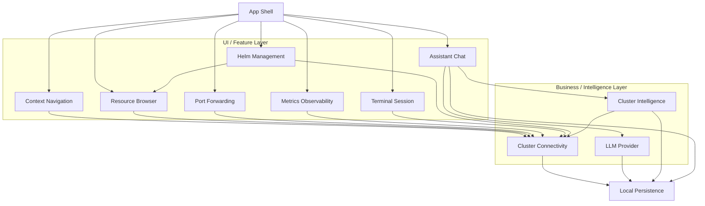

# K8sManager

**macOS-native Kubernetes manager** with a built-in LLM assistant
(Anthropic, OpenAI, OpenAI-compatible) and an in-process Model Context
Protocol (MCP) server that exposes read-only Kubernetes tools to the
assistant.

> Project status — **architecture and specification phase**. No
> application code is committed yet. The repository currently holds the
> spec-as-source-of-truth under [`docs/arch/`](docs/arch/) — Architecture
> Decision Records (MADR 4.0), CUE schemas, Gherkin features, Rego
> policies, DBML database schemas, and a Structurizr C4 workspace.
> Implementation begins after the specification stabilises.

## Why a new manager?

Existing tools (Lens, OpenLens, Headlamp) target cross-platform
Electron. K8sManager is built for operators who live on macOS and want:

- Native window chrome, menu bar, keyboard handling, drag and drop,
  dark mode, Spotlight integration.
- Sub-second cold start, idle memory under 100 MB, single binary.
- A built-in assistant that talks to **your** chosen LLM provider
  (cloud or local via Ollama / LM Studio / vLLM / OpenRouter) and
  reasons over your cluster through a strict, auditable, **read-only**
  Kubernetes tool surface — no surprises.
- 100% native REST API — no `kubectl`, `helm`, `aws`, `gcloud`, or
  `kubelogin` subprocess (except as a documented fallback for
  unrecognised exec plugins).

## Scope (MVP++)

Twelve bounded contexts, each owning its own ubiquitous language:

- `cluster_connectivity` — parse kubeconfig, probe cluster health,
  own `KubernetesApiPort` and `ExecCredentialPort`.
- `context_navigation` — active context, recents, pinned.
- `app_shell` — window lifecycle (NavigationSplitView 3-column +
  inspector + status bar), sidebar, settings surface, chat surface,
  terminal surface, metrics surface, design tokens (color, material,
  spacing, radius), typography preferences, theme preference, and a
  rich menu bar tray with live cluster metrics, sparklines, recent
  mutations, and quick-action shortcuts.
- `llm_provider` — Anthropic, OpenAI, OpenAI-compatible behind one
  port.
- `assistant_chat` — sessions, messages, streaming, tool-use loop.
- `cluster_intelligence` — in-process MCP server with read-only K8s
  tools (`kube_list_pods`, `kube_describe`, `kube_get_yaml`,
  `kube_events`, `kube_logs`, `kube_top_pods`, `kube_cluster_info`).
- `local_persistence` — SQLite (WAL) for non-secret state; macOS
  Keychain for LLM API keys.
- `resource_browser` — **full CRUD** with confirmation, double-confirm
  delete, server-side apply, YAML diff preview, dynamic CRD discovery.
- `port_forwarding` — local TCP listener tunnels via WebSocket
  `portforward.k8s.io` subprotocol.
- `helm_management` — native Helm release list / inspect / history /
  rollback over Secrets `owner=helm` (Phase 1); install / upgrade /
  template / lint native engine on roadmap (Phase 2 per ADR-0015).
- `metrics_observability` — Prometheus HTTP API client with
  auto-discovery and curated PromQL templates.
- `terminal_session` — Pod exec and Node debug sessions via WebSocket
  `v5.channel.k8s.io`; multi-tab.

## Architecture in one diagram



Strategic DDD bounded contexts. Hexagonal port-and-adapter dependency
direction enforced at the Swift Package Manager target level (see
[ADR-0020](docs/arch/decisions/adr-0020-swiftpm-workspace-topology.md))
— the domain core never imports infrastructure. MADR 4.0 ADRs in
[`docs/arch/decisions/`](docs/arch/decisions/) drive every cross-cutting
choice.

## Design system

K8sManager adopts the official **Kubernetes brand palette** (Pantone
285C, hex `#326CE5`) as its accent color, paired with the modern
**Apple Human Interface Guidelines** for everything else — materials,
typography, layout, motion, and dark / light mode adaptation. Operators
can override the accent with the macOS system tint and configure mono
font, UI scale, and density via Settings.

| Aspect | Default |
|---|---|
| Accent | Kubernetes blue `#326CE5` (light) / `#5E8FF0` (dark) |
| Surfaces | SwiftUI Materials — `.sidebar`, `.regular`, `.thin`, `.ultraThin`, `.thick` |
| Liquid Glass | Enabled on macOS 26+; graceful fallback to `.regularMaterial` below |
| Typography | SF Pro Display (≥20 pt), SF Pro Text (<20 pt), SF Mono (code) |
| Layout | NavigationSplitView 3-column + `.inspector` + status bar |
| Dark / Light | System default; operator can force light or dark per ADR-0021 |
| Configurable | UI scale, density, accent source, mono font, mono size, reduce motion, Liquid Glass toggle |

Full details in
[ADR-0021](docs/arch/decisions/adr-0021-app-shell-design-system-and-layout.md).

## Menu bar tray

A first-class menu bar `NSStatusItem` keeps the operator one click
away from cluster health, with live metrics and quick actions:

- Cluster picker dropdown (instant context switch).
- Live sparklines for CPU, memory, and network usage (last 60 minutes).
- Stacked-bar Pod counts by phase (Running / Pending / Failed /
  Succeeded).
- Node Ready / NotReady counts and namespace totals.
- Recent mutating operations (per ADR-0012) with outcome icon.
- Active port-forward and terminal session counts.
- Quick actions: open main window, open assistant chat, pause refresh,
  open settings.

Refresh interval is operator-configurable (5 / 15 / 30 / 60 seconds or
manual). Refresh pauses automatically on laptop lid close, system low
power mode, or unreachable cluster. Full spec in
[ADR-0022](docs/arch/decisions/adr-0022-menu-bar-tray-with-live-metrics.md).

## Technology stack

Library choices are pinned in
[ADR-0019](docs/arch/decisions/adr-0019-adopted-swift-libraries.md).
Highlights:

| Layer | Library | Tier |
|---|---|---|
| Runtime | Swift 6.1, SwiftUI, macOS 14 Sonoma minimum | — |
| Kubernetes client | `swiftkube/client` 0.26 + `async-http-client` 1.33 | A |
| Exec / port-forward transport | `URLSessionWebSocketTask` (Foundation) | A |
| LLM Anthropic | `jamesrochabrun/SwiftAnthropic` 2.2 | B (`@preconcurrency`) |
| LLM OpenAI and compatible | `MacPaw/OpenAI` 0.4 | B (`@preconcurrency`) |
| MCP | `modelcontextprotocol/swift-sdk` 0.12 with `InMemoryTransport` | A |
| YAML | `jpsim/Yams` 6.2 | A |
| Local store | `groue/GRDB.swift` 7.10 (WAL) | A |
| Crypto / X.509 / JWT | `apple/swift-crypto`, `swift-certificates`, `swift-asn1`, `vapor/jwt-kit` | A |
| AWS auth | `soto-project/soto` 7.14 (SigV4 + STS presign + EKS token assembly) | A |
| GCP auth | manual (URLSession + jwt-kit) — community library archived Oct 2025 | — |
| Azure auth | MSAL for Objective-C (Swift bridging) | B |
| OIDC generic | `openid/AppAuth-iOS` 2.0 | B |
| Prometheus query | custom client (~340 LoC); no public Swift library exists | — |
| Compression | Foundation `Compression` framework (built-in) | A |
| Logging / Collections / DI | `swift-log`, `swift-collections`, `swift-dependencies`, `swift-concurrency-extras` | A |
| Distribution | Direct download, Developer ID signed, notarized via `notarytool`; optional Homebrew Cask | — |

Native cloud credential resolution (AWS, GCP, Azure, OIDC) is captured
in [ADR-0018](docs/arch/decisions/adr-0018-native-cloud-credential-resolution.md).
A subprocess fallback adapter remains for unrecognised exec plugins per
[ADR-0002](docs/arch/decisions/adr-0002-swiftkube-client-adapter.md).

## Repository layout

```
.
├── README.md                        product pitch (this file)
├── LICENSE                          Apache-2.0
├── CONTRIBUTING.md                  workflow + spec-driven conventions
├── .gitignore                       Swift + Xcode + macOS
└── docs/
    └── arch/                        spec-as-source-of-truth
        ├── README.md                conventions and decision index
        ├── architecture/            Structurizr C4 workspace
        ├── decisions/               MADR 4.0 ADRs
        └── contexts/                bounded-context artefacts
            └── <bc>/
                ├── schemas/         CUE definitions (+ DBML)
                ├── policies/        Rego validation rules
                ├── features/        Gherkin scenarios
                └── domain/          ubiquitous language narrative
```

## Decisions

The full index lives in [`docs/arch/README.md`](docs/arch/README.md).
At the time of writing the repository holds 20 proposed ADRs covering
platform choice, Kubernetes adapter, kubeconfig read-only invariant,
distribution and notarization, bounded contexts (initial and expanded),
connection pooling, LLM provider abstraction, MCP host and in-process
server, local persistence and Keychain split, Swift concurrency
conventions, mutating operations policy, resource browser scope,
port-forwarding lifecycle, Helm phased delivery, Prometheus integration,
terminal sessions, native cloud credential resolution, adopted Swift
libraries, and Swift Package Manager workspace topology.

## Roadmap

The roadmap is captured in ADRs rather than a separate document — each
new capability lands as a new ADR before the first commit of code that
implements it. The high-level direction is:

1. Stabilise the MVP++ spec — all 20 ADRs proposed; review and accept.
2. Begin implementation under a Swift Package Manager workspace
   (ADR-0020): 14 targets including 12 bounded-context cores, a shared
   kernel, an application target, and a parallel adapter tree.
3. Phase 2 work on native Helm (template engine + Sprig port; full
   install/upgrade) per ADR-0015 — large multi-quarter effort.

## Contributing

See [`CONTRIBUTING.md`](CONTRIBUTING.md). In short — the project follows
a strict spec-driven workflow. Architectural changes go through MADR
ADRs under `docs/arch/decisions/` before any implementation work begins.

## License

Apache License 2.0. See [`LICENSE`](LICENSE) for the full text.
