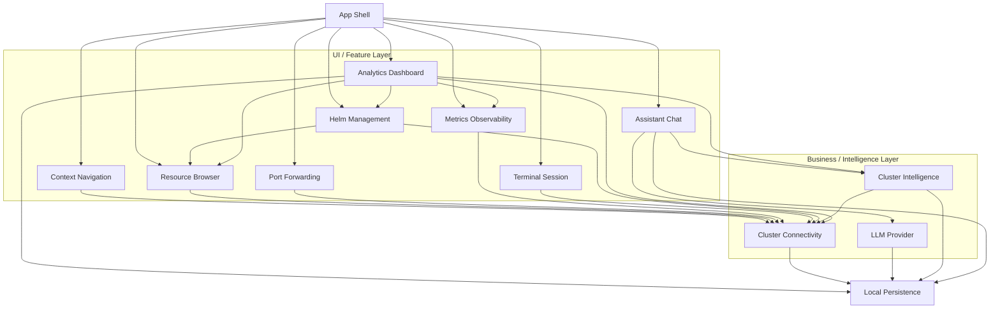

# K8sManager

**macOS-native Kubernetes manager** with a built-in LLM assistant (Anthropic, OpenAI,
OpenAI-compatible) and an in-process Model Context Protocol (MCP) server that exposes read-only
Kubernetes tools to the assistant.

> Project status — **architecture and specification phase**. No application code is committed yet.
> The repository currently holds the spec-as-source-of-truth under [`docs/arch/`](docs/arch/) —
> Architecture Decision Records (MADR 4.0), CUE schemas, Gherkin features, Rego policies, DBML
> database schemas, and a Structurizr C4 workspace. Implementation begins after the specification
> stabilises.

## Why a new manager?

Existing tools (Lens, OpenLens, Headlamp) target cross-platform Electron. K8sManager is built for
operators who live on macOS and want:

- Native window chrome, menu bar, keyboard handling, drag and drop, dark mode, Spotlight
  integration.
- Sub-second cold start, idle memory under 100 MB, single binary.
- A built-in assistant that talks to **your** chosen LLM provider (cloud or local via Ollama / LM
  Studio / vLLM / OpenRouter) and reasons over your cluster through a strict, auditable,
  **read-only** Kubernetes tool surface — no surprises.
- 100% native REST API — no `kubectl`, `helm`, `aws`, `gcloud`, or `kubelogin` subprocess (except as
  a documented fallback for unrecognised exec plugins).
- Per-cluster isolated HTTPClient pools backed by **kqueue** I/O event selection on macOS — every
  cluster gets its own pool and event loops; nothing leaks between clusters.
- Session restoration that survives quit and relaunch — open terminals, port-forwards, dashboard
  layouts, chat sessions all come back where you left them.
- Self-monitoring built in — live CPU, memory, threads, network, SQLite size, active sessions, and
  kqueue events / second visible in Settings → Diagnostics.
- All state under a single backup-friendly directory `~/.config/k8smanager/` (SQLite, per-cluster
  view state, logs, exports).
- SF Symbols iconography across the entire UI; custom symbol set for Kubernetes kinds without stock
  equivalents.
- Integrated editor for Markdown, YAML, and JSON with realtime dry-run apply, diff preview, and
  Kubernetes schema validation.
- Skeleton loaders, shimmer placeholders, and toast notifications for every meaningful operation —
  async UX done properly.
- State-driven realtime UI end-to-end — kqueue at the bottom, Observation framework at the top,
  SwiftUI in between, no polling.
- English / Portuguese / Spanish baseline; the Xcode String Catalog framework lets community add any
  Apple-supported locale.

## Scope (MVP++)

Thirteen bounded contexts, each owning its own ubiquitous language:

- `cluster_connectivity` — parse kubeconfig, probe cluster health, own `KubernetesApiPort` and
  `ExecCredentialPort`.
- `context_navigation` — active context, recents, pinned.
- `app_shell` — window lifecycle (NavigationSplitView 3-column + inspector + status bar), sidebar,
  settings surface, chat surface, terminal surface, metrics surface, design tokens (color, material,
  spacing, radius), typography preferences, theme preference, and a rich menu bar tray with live
  cluster metrics, sparklines, recent mutations, and quick-action shortcuts.
- `llm_provider` — Anthropic, OpenAI, OpenAI-compatible behind one port.
- `assistant_chat` — sessions, messages, streaming, tool-use loop.
- `cluster_intelligence` — in-process MCP server with read-only K8s tools (`kube_list_pods`,
  `kube_describe`, `kube_get_yaml`, `kube_events`, `kube_logs`, `kube_top_pods`,
  `kube_cluster_info`).
- `local_persistence` — SQLite (WAL) for non-secret state; macOS Keychain for LLM API keys.
- `resource_browser` — **full CRUD** with confirmation, double-confirm delete, server-side apply,
  YAML diff preview, dynamic CRD discovery.
- `port_forwarding` — local TCP listener tunnels via WebSocket `portforward.k8s.io` subprotocol.
- `helm_management` — native Helm release list / inspect / history / rollback over Secrets
  `owner=helm` (Phase 1); install / upgrade / template / lint native engine on roadmap (Phase 2 per
  ADR-0015).
- `metrics_observability` — Prometheus HTTP API client with auto-discovery and curated PromQL
  templates.
- `terminal_session` — Pod exec and Node debug sessions via WebSocket `v5.channel.k8s.io`;
  multi-tab.
- `analytics_dashboard` — always-on multi-scope analytics dashboards (cluster, namespace, pod, node,
  workload, service, Helm release, debug timeline, topology). 11 widget kinds including sparklines,
  heatmaps, top lists, topology graphs, log error rates. Drill-down from any widget click.

## Architecture in one diagram



Strategic DDD bounded contexts. Hexagonal port-and-adapter dependency direction enforced at the
Swift Package Manager target level (see
[ADR-0020](docs/arch/decisions/adr-0020-swiftpm-workspace-topology.md)) — the domain core never
imports infrastructure. MADR 4.0 ADRs in [`docs/arch/decisions/`](docs/arch/decisions/) drive every
cross-cutting choice.

## Design system

K8sManager adopts the official **Kubernetes brand palette** (Pantone 285C, hex `#326CE5`) as its
accent color, paired with the modern **Apple Human Interface Guidelines** for everything else —
materials, typography, layout, motion, and dark / light mode adaptation. Operators can override the
accent with the macOS system tint and configure mono font, UI scale, and density via Settings.

| Aspect       | Default                                                                                    |
| ------------ | ------------------------------------------------------------------------------------------ |
| Accent       | Kubernetes blue `#326CE5` (light) / `#5E8FF0` (dark)                                       |
| Surfaces     | SwiftUI Materials — `.sidebar`, `.regular`, `.thin`, `.ultraThin`, `.thick`                |
| Liquid Glass | Enabled on macOS 26+; graceful fallback to `.regularMaterial` below                        |
| Typography   | SF Pro Display (≥20 pt), SF Pro Text (<20 pt), SF Mono (code)                              |
| Layout       | NavigationSplitView 3-column + `.inspector` + status bar                                   |
| Dark / Light | System default; operator can force light or dark per ADR-0021                              |
| Configurable | UI scale, density, accent source, mono font, mono size, reduce motion, Liquid Glass toggle |

Full details in [ADR-0021](docs/arch/decisions/adr-0021-app-shell-design-system-and-layout.md).

## Menu bar tray

A first-class menu bar `NSStatusItem` keeps the operator one click away from cluster health, with
live metrics and quick actions:

- Cluster picker dropdown (instant context switch).
- Live sparklines for CPU, memory, and network usage (last 60 minutes).
- Stacked-bar Pod counts by phase (Running / Pending / Failed / Succeeded).
- Node Ready / NotReady counts and namespace totals.
- Recent mutating operations (per ADR-0012) with outcome icon.
- Active port-forward and terminal session counts.
- Quick actions: open main window, open assistant chat, pause refresh, open settings.

Refresh interval is operator-configurable (5 / 15 / 30 / 60 seconds or manual). Refresh pauses
automatically on laptop lid close, system low power mode, or unreachable cluster. Full spec in
[ADR-0022](docs/arch/decisions/adr-0022-menu-bar-tray-with-live-metrics.md).

## UX patterns

The user experience layer combines the Lens multi-cluster workflow with the k9s keyboard-first
power-user model, the Grafana RED / USE dashboard methodology, the Raycast / Linear / GitHub
command-palette pattern, and the Nielsen Norman three-layer progressive disclosure strategy.
Captured in [ADR-0023](docs/arch/decisions/adr-0023-ux-patterns-command-palette-and-shortcuts.md).

- **Command palette** — `⌘P` (primary) or `⌘K` (alternative) opens a fuzzy-search palette over
  commands, resources, namespaces, clusters, and recent invocations.
- **k9s-style shortcut map** — `l` logs, `s` shell, `d` describe, `e` edit YAML, `u` used-by, `:`
  command mode, `/` inline search, `Ctrl-N` cycle namespaces, `?` hotkey help, `⌘1..9` pinned
  clusters, plus full macOS-native shortcuts (`⌘W`, `⌘R`, `⌘F`, `⌘,`, `Esc`).
- **Progressive disclosure** — Overview KPIs always visible, Detail on click, Config on deliberate
  intent. A power-user toggle in Settings opens every advanced control at once.
- **Drill-down dashboards** — every analytics widget click resolves to logs at the timestamp,
  related scopes, or YAML.
- **Color semantics** — consistent green / red / yellow / blue / gray across status badges,
  sparklines, log lines, and notifications.
- **Accessibility** — keyboard-only navigation, VoiceOver labels, WCAG AA contrast, Dynamic Type,
  reduce motion mirrored from system, focus-ring visible on every interactive element.

## Analytics dashboards

A first-class `analytics_dashboard` bounded context provides nine scope presets so operators get
always-on visual debugging and load analysis at every level:

- **Cluster Overview** — nodes, pods by phase, namespaces, CPU and memory cluster-wide, top
  namespaces.
- **Namespace Detail** — workloads, requests vs limits vs usage, network in / out, top pods, recent
  events.
- **Pod Detail (debug)** — CPU and memory time-series with limit overlays, restart and OOMKilled
  correlation (exit code 137), network rx / tx, disk I/O, log error rate sparkline, events timeline,
  container breakdown.
- **Node Detail** — kubelet metrics, conditions (Ready, MemoryPressure, DiskPressure, PIDPressure),
  pod density, top consuming pods, capacity vs allocatable.
- **Workload Detail** — replicas desired vs available, rollout progress, image versions, rollout
  history, restart rate.
- **Service Detail** — endpoints, selector match, latency p50 / p95 / p99 heatmap (RED method).
- **Helm Release Detail** — version timeline, manifest diff, hook outcomes.
- **Debug Timeline** — Kubernetes events + mutation audit + assistant tool calls, cross-scope
  chronological view.
- **Topology Graph** — owner references + service selectors + Helm release relationships,
  interactive zoom and pan.

Every widget is clickable: a click on a CPU spike drills down to the pod logs at that exact
timestamp; a heatmap column drills to the logs of the slow requests; a topology node opens the
corresponding detail scope. Widgets follow the Grafana RED and USE methods and a consistent color
palette (green healthy, red error, yellow warning, blue info, gray unknown). Heatmaps expose bimodal
latency distributions that single percentile lines hide. Full specification in
[ADR-0024](docs/arch/decisions/adr-0024-analytics-dashboard-bounded-context.md).

## Reactive stack

Every K8sManager bit moves through a single reactive pipeline (ADR-0035):

- **Kernel** — `kqueue` file descriptor per cluster session with six active filters: `EVFILT_READ`,
  `EVFILT_WRITE`, `EVFILT_VNODE` (file watch), `EVFILT_TIMER` (debounce, retry, idle reap),
  `EVFILT_SIGNAL` (graceful shutdown), `EVFILT_PROC` (exec credential plugin lifecycle).
- **Transport** — SwiftNIO `MultiThreadedEventLoopGroup` for sockets,
  `DispatchSource.makeFileSystemObjectSource` for files, `DispatchSourceTimer` /
  `DispatchSourceSignal` for timing and process control, GRDB async API for SQLite,
  `FileHandle.AsyncBytes` for streaming reads.
- **Domain ports** — `AsyncStream<Event>` / `AsyncThrowingStream` exposed by every port;
  backpressure-aware buffering.
- **Domain core** — actor-isolated aggregates (`ClusterSessionActor`, `PersistenceActor`,
  `AssistantSessionActor`, `MCPServerActor`, `EditorOrchestratorService`) consume the streams and
  mutate state.
- **Read models** — `@Observable` projections live on `MainActor`; SwiftUI tracks them via
  `withObservationTracking`.
- **SwiftUI** — `body` is a pure function of the read-model state; no `ObservableObject`, no
  Combine, no polling.

Toast notifications, loading skeletons, editor diagnostics, and dashboard widgets are all
state-driven projections of the same pipeline (ADR-0031, ADR-0032, ADR-0034).

## Async architecture and isolation

K8sManager is async end-to-end. Every I/O operation is driven by
[kqueue](https://man.openbsd.org/kqueue.2) through SwiftNIO's `MultiThreadedEventLoopGroup`
(ADR-0029). Each open cluster runs its own `ClusterSessionActor` with a dedicated event-loop group,
isolated `HTTPClient` pool, credential cache, watch / exec / port-forward / terminal registries, and
view state (ADR-0025). Nothing leaks across clusters.

State persistence is operator-friendly: everything lives under `~/.config/k8smanager/` (ADR-0026) —
a single backup-friendly XDG-style directory containing `storage.sqlite3` (chat history, provider
profiles, audit log), `clusters/<id>/` (per-cluster view state), `cache/` (transient), `logs/`, and
`exports/`. macOS Keychain still holds LLM API keys.

Every cold launch reads a `RestorationManifest` and rebuilds the world: pinned and recent cluster
sessions in parallel, dashboard layouts, chat sessions, and operator-opt-in prompts for reopening
previously active terminals and port-forwards.

Self-monitoring is first-class (ADR-0027). Settings → Diagnostics shows live CPU, RSS memory,
threads, file descriptors, network, SQLite size, active sessions per kind, and kqueue events /
second sampled every 5 seconds. An optional menu bar widget exposes the same. Operators can export a
redacted diagnostics bundle (`.zip`) for issue triage.

## Iconography

The UI uses [SF Symbols 6+](https://developer.apple.com/sf-symbols/) as the primary symbol library,
with a small custom `.symbolset` bundle for Kubernetes kinds that have no stock equivalent (Pod,
Deployment, StatefulSet, DaemonSet). Symbols render in hierarchical or palette mode depending on
context (status badges use `.fill` variants; sidebar uses `.symbolRenderingMode(.hierarchical)`).
Each `Image(systemName:)` is paired with an explicit `.accessibilityLabel()`. No emoji is ever used
in UI. Full catalogue in [ADR-0028](docs/arch/decisions/adr-0028-sf-symbols-native-iconography.md).

## Technology stack

Library choices are pinned in [ADR-0019](docs/arch/decisions/adr-0019-adopted-swift-libraries.md).
Highlights:

| Layer                         | Library                                                                                  | Tier                  |
| ----------------------------- | ---------------------------------------------------------------------------------------- | --------------------- |
| Runtime                       | Swift 6.1, SwiftUI, macOS 14 Sonoma minimum                                              | —                     |
| Kubernetes client             | `swiftkube/client` 0.26 + `async-http-client` 1.33                                       | A                     |
| Exec / port-forward transport | `URLSessionWebSocketTask` (Foundation)                                                   | A                     |
| LLM Anthropic                 | `jamesrochabrun/SwiftAnthropic` 2.2                                                      | B (`@preconcurrency`) |
| LLM OpenAI and compatible     | `MacPaw/OpenAI` 0.4                                                                      | B (`@preconcurrency`) |
| MCP                           | `modelcontextprotocol/swift-sdk` 0.12 with `InMemoryTransport`                           | A                     |
| YAML                          | `jpsim/Yams` 6.2                                                                         | A                     |
| Local store                   | `groue/GRDB.swift` 7.10 (WAL)                                                            | A                     |
| Crypto / X.509 / JWT          | `apple/swift-crypto`, `swift-certificates`, `swift-asn1`, `vapor/jwt-kit`                | A                     |
| AWS auth                      | `soto-project/soto` 7.14 (SigV4 + STS presign + EKS token assembly)                      | A                     |
| GCP auth                      | manual (URLSession + jwt-kit) — community library archived Oct 2025                      | —                     |
| Azure auth                    | MSAL for Objective-C (Swift bridging)                                                    | B                     |
| OIDC generic                  | `openid/AppAuth-iOS` 2.0                                                                 | B                     |
| Prometheus query              | custom client (~340 LoC); no public Swift library exists                                 | —                     |
| Compression                   | Foundation `Compression` framework (built-in)                                            | A                     |
| Logging / Collections / DI    | `swift-log`, `swift-collections`, `swift-dependencies`, `swift-concurrency-extras`       | A                     |
| Editor                        | `mchakravarty/CodeEditorView` 0.16 + `apple/swift-markdown` 0.6                          | B / A                 |
| i18n                          | Xcode String Catalog (.xcstrings) + Foundation Locale                                    | A built-in            |
| Reactive UI                   | Observation framework (Swift 6) + AsyncSequence                                          | A built-in            |
| Distribution                  | Direct download, Developer ID signed, notarized via `notarytool`; optional Homebrew Cask | —                     |

Native cloud credential resolution (AWS, GCP, Azure, OIDC) is captured in
[ADR-0018](docs/arch/decisions/adr-0018-native-cloud-credential-resolution.md). A subprocess
fallback adapter remains for unrecognised exec plugins per
[ADR-0002](docs/arch/decisions/adr-0002-swiftkube-client-adapter.md).

## Repository layout

```
.
├── README.md                        product pitch (this file)
├── LICENSE                          Apache-2.0
├── CONTRIBUTING.md                  workflow + spec-driven conventions
├── .gitignore                       Swift + Xcode + macOS
└── docs/
    └── arch/                        spec-as-source-of-truth
        ├── README.md                conventions and decision index
        ├── architecture/            Structurizr C4 workspace
        ├── decisions/               MADR 4.0 ADRs
        └── contexts/                bounded-context artefacts
            └── <bc>/
                ├── schemas/         CUE definitions (+ DBML)
                ├── policies/        Rego validation rules
                ├── features/        Gherkin scenarios
                └── domain/          ubiquitous language narrative
```

## Prerequisites

- macOS 14 Sonoma or later.
- Xcode 16+ with Swift 6.1+ toolchain.
- Homebrew (optional) or direct download for installation once binaries are available.
- Commit signing is recommended for contributors (`git config commit.gpgsign true`).

## Getting Started

```sh
git clone https://github.com/archanjo/K8S-Manager.git
cd K8S-Manager
open docs/arch/README.md   # start with the architecture root
```

1. Read [`docs/arch/README.md`](docs/arch/README.md) for conventions, bounded context definitions,
   and the full ADR index.
2. Browse [`docs/arch/decisions/`](docs/arch/decisions/) to understand each architectural choice —
   ADR-0001 through ADR-0046 (baseline lock 2026-05-15).
3. The repository is currently **spec-only**. No application binary exists yet; implementation
   begins after the specification stabilises.
4. To contribute an architectural decision, open a PR that adds a new MADR 4.0 ADR under
   `docs/arch/decisions/` and updates the decision index in `docs/arch/README.md`. See
   [`CONTRIBUTING.md`](CONTRIBUTING.md).

## Decisions

The full index lives in [`docs/arch/README.md`](docs/arch/README.md). At the time of writing the
repository holds 46 accepted ADRs covering platform choice, Kubernetes adapter, kubeconfig read-only
invariant, distribution and notarization, bounded contexts (initial and expanded), connection
pooling, LLM provider abstraction, MCP host and in-process server, local persistence and Keychain
split, Swift concurrency conventions, mutating operations policy, resource browser scope,
port-forwarding lifecycle, Helm phased delivery, Prometheus integration, terminal sessions, native
cloud credential resolution, adopted Swift libraries, Swift Package Manager workspace topology,
design system and layout, menu bar tray, UX patterns, analytics dashboard, per-cluster isolation,
state persistence, app self-monitoring, SF Symbols iconography, kqueue I/O event selection,
integrated multi-format editor, loading states, toast notifications, internationalisation,
state-driven realtime UI, reactive stack integration, and watch stream lifecycle.

## Roadmap

The roadmap is captured in ADRs rather than a separate document — each new capability lands as a new
ADR before the first commit of code that implements it. The high-level direction is:

1. Stabilise the MVP++ spec — all 46 ADRs accepted as baseline lock 2026-05-15.
2. Begin implementation under a Swift Package Manager workspace (ADR-0020): 14 targets including 13
   bounded-context cores, a shared kernel, an application target, and a parallel adapter tree.
3. Phase 2 work on native Helm (template engine + Sprig port; full install/upgrade) per ADR-0015 —
   large multi-quarter effort.

## Contributing

See [`CONTRIBUTING.md`](CONTRIBUTING.md). In short — the project follows a strict spec-driven
workflow. Architectural changes go through MADR ADRs under `docs/arch/decisions/` before any
implementation work begins.

## License

Apache License 2.0. See [`LICENSE`](LICENSE) for the full text.
