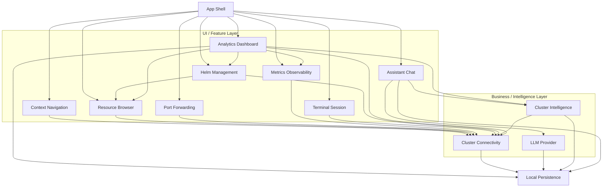

# K8sManager — Architecture Documentation Root

Spec-as-source-of-truth for **K8sManager**, a macOS-native Kubernetes
manager with a built-in LLM assistant and 100% native REST-API
integration (no `kubectl`, `helm`, `aws`, `gcloud`, `kubelogin` or
other binary subprocess except as a documented fallback for unknown
exec plugins). This directory is the single source of truth for
architectural decisions, domain schemas, behavioural specifications,
and validation policies.

## Product summary

- **Product name** — K8sManager.
- **Bundle identifier** — `com.archanjo.K8sManager`.
- **Target platform** — macOS 14 Sonoma and later.
- **UI framework** — SwiftUI with strict Swift Concurrency (Swift 6.1+).
- **Kubernetes client** — SwiftkubeClient + async-http-client with
  per-cluster TLS overlays and a pooled HTTPClient; PATCH server-side
  apply is a custom adapter route.
- **WebSocket transports** — URLSessionWebSocketTask (Foundation) for
  `pods/exec` subprotocol `v5.channel.k8s.io` and `pods/portforward`
  subprotocol `portforward.k8s.io`.
- **LLM integration** — Anthropic Messages (SwiftAnthropic), OpenAI
  Chat Completions / Responses (MacPaw/OpenAI), and any
  OpenAI-compatible endpoint (Ollama, LM Studio, vLLM, OpenRouter).
- **MCP role** — host plus an in-process Model Context Protocol server
  exposing read-only Kubernetes tools to the assistant. Uses
  `modelcontextprotocol/swift-sdk` with `InMemoryTransport`.
- **Cloud credentials** — native AWS (soto), GCP (manual + jwt-kit),
  Azure (MSAL), and OIDC (AppAuth-iOS); subprocess remains only as
  fallback for unrecognised exec plugins.
- **Local persistence** — SQLite (WAL) via GRDB.swift for chat history,
  provider configuration, cluster-analysis cache, mutating operation
  audit, and operator preferences; macOS Keychain for LLM API keys.
- **Distribution** — direct download, Developer ID signed, notarized
  via `notarytool`.
- **Scope summary** — multi-cluster connectivity and context switching;
  built-in assistant; in-process MCP server with read-only K8s tools;
  full CRUD resource browser with confirmation, double-confirm delete,
  audit log; native Helm release list/inspect/history/rollback (Phase 1)
  with full native install/upgrade/template engine on roadmap
  (Phase 2 per ADR-0015); auto-discovered Prometheus dashboards;
  port-forwarding and terminal sessions (Pod exec + Node debug,
  multi-tab) via WebSocket.
- **Per-cluster isolation** — each cluster materialises its own
  `ClusterSession` with dedicated `HTTPClient`, `EventLoopGroup`,
  credential cache, and registries; nothing leaks across clusters
  (ADR-0025).
- **I/O event selection** — kqueue everywhere via SwiftNIO's
  `MultiThreadedEventLoopGroup` on macOS; the only kernel event
  notification primitive used (ADR-0029).
- **Filesystem layout** — `~/.config/k8smanager/` houses
  `storage.sqlite3`, `clusters/<id>/` per-cluster view state, `cache/`,
  `logs/`, `exports/` (ADR-0026).
- **State restoration** — every cold launch restores the active
  context, pinned and recent cluster sessions, dashboard layouts,
  chat sessions, and prompts for terminal and port-forward
  reopen (ADR-0026).
- **App self-monitoring** — live CPU, RSS memory, threads, file
  descriptors, network, SQLite size, active sessions, kqueue
  events/s; settings → Diagnostics + optional tray widget +
  analytics dashboard scope (ADR-0027).
- **Iconography** — SF Symbols 6+ catalogue with custom
  `.symbolset` glyphs for Kubernetes kinds where stock symbols
  do not exist (ADR-0028).
- **Integrated editor** — MD / YAML / JSON in a single editor with
  realtime dry-run apply, diff preview, schema validation, draft
  auto-save (ADR-0030).
- **Async UX everywhere** — skeleton loaders, shimmer placeholders,
  toast notifications for every operation outcome (ADR-0031,
  ADR-0032).
- **State-driven realtime** — Observation framework + AsyncSequence
  end-to-end; SwiftUI body is a pure function of @Observable read
  models (ADR-0034).
- **Reactive stack integration** — kqueue at the bottom (sockets,
  files, timers, signals, subprocess) wired through SwiftNIO /
  libdispatch → AsyncSequence → actors → @Observable → SwiftUI
  (ADR-0035).
- **Internationalisation** — en, pt-BR, es-ES baseline with a
  community-extensible Xcode String Catalog framework (ADR-0033).

## Layout

```
docs/arch/
  architecture/      Structurizr C4 workspace
  decisions/         MADR 4.0 architecture decision records
  contexts/<bc>/     bounded contexts, one directory each
    schemas/         CUE definitions; SQLite DDL in DBML where applicable
    policies/        Rego validation rules
    features/        Gherkin behavioural scenarios
    domain/          ubiquitous language narratives
```

## Conventions (enforced)

- All artefacts written in **en-US**.
- **CommonMark + Mermaid diagrams** — fenced ` ```mermaid ` blocks are
  permitted for architecture diagrams. All other GFM extensions remain
  prohibited (no tables, no task lists, no strikethrough, no autolinks,
  no footnotes, no alerts). Tables are reserved for the root `README.md`
  and `CONTRIBUTING.md`.
- Markdown filenames use `kebab-case.md`.
- CUE filenames use `snake_case.cue`; definitions use `#PascalCase`.
- Database schemas use **DBML** (`*.dbml`), one logical schema per
  file under the relevant bounded context's `schemas/`.
- Every domain artefact carries the **DDD role header** on the
  first line:
  `// DDD role: AggregateRoot | Entity | ValueObject | DomainService | ReadModel`.
- Entity identifiers are **UUIDv7** (time-ordered, sortable).
- ADRs follow **MADR 4.0**; ADR numbers are never reused; superseded
  ADRs link forward to their successor.
- Dependency direction — **domain core never imports infrastructure**.
  Adapters depend on domain ports; the reverse is forbidden. This is
  enforced at the SwiftPM target level (see ADR-0020).

## Bounded contexts (MVP++)

- **cluster_connectivity** — parse kubeconfig, probe cluster health,
  own `KubernetesApiPort` and `ExecCredentialPort`.
- **context_navigation** — track active context, recents, pinned
  items, drive context switching.
- **llm_provider** — abstract Anthropic, OpenAI, and any
  OpenAI-compatible endpoint behind a single `LLMProviderPort`.
- **assistant_chat** — sessions, messages, streaming, tool-use loop;
  hosts the MCP host side.
- **cluster_intelligence** — translates assistant intents into safe,
  read-only Kubernetes operations through the in-process MCP server.
- **local_persistence** — SQLite (WAL) storage and macOS Keychain
  adapter; owns repository ports for every persistent surface,
  including the mutating-operation audit log.
- **resource_browser** — full CRUD with confirmation, double-confirm
  delete, server-side apply, YAML diff preview, dynamic CRD discovery.
- **port_forwarding** — local TCP listener tunnels via WebSocket
  `portforward.k8s.io` subprotocol with full lifecycle handling.
- **helm_management** — native Helm release list / inspect / history /
  rollback over Secrets with label `owner=helm` (Phase 1);
  install/upgrade/template/lint native engine on roadmap (Phase 2).
- **metrics_observability** — Prometheus HTTP API client with
  auto-discovery and curated PromQL templates for CPU, memory,
  network, API-server health, and workload health.
- **terminal_session** — Pod exec and Node debug sessions via
  WebSocket `v5.channel.k8s.io`; multi-tab; debug container created
  per ADR-0012 (mutating op with confirmation).
- **app_shell** — window lifecycle (NavigationSplitView 3-column +
  inspector + status bar), sidebar, settings surface, chat surface,
  terminal surface, metrics surface, design tokens (color, material,
  spacing, radius), typography preferences, theme preference, and a
  rich menu bar tray with live cluster metrics, sparklines, recent
  mutations, and quick-action shortcuts.
- **analytics_dashboard** — multi-scope analytics dashboards with
  widgets always visible (sparklines, heatmaps p50/p95/p99,
  stacked bars, top lists, event timelines, topology graphs, log
  error rates, diff viewers, conditions lists). Drill-down from
  widget click to logs at timestamp, related scopes, or YAML.
  Aggregates `metrics_observability`, `cluster_connectivity`,
  `resource_browser`, `helm_management`, and `cluster_intelligence`
  read models. Auto-refresh respects energy-saver constraints from
  the menu bar tray.

### Dependency direction



## Decision index

- **ADR-0001** — macOS-native distribution via Swift and SwiftUI.
  Proposed.
- **ADR-0002** — SwiftkubeClient as primary Kubernetes API adapter.
  Proposed; library set pinned by ADR-0019; exec plugin strategy
  refined by ADR-0018.
- **ADR-0003** — Kubeconfig is read-only; no kubeconfig credential
  persistence. Proposed; scope clarified by ADR-0010 for LLM API
  keys; cluster-write rules introduced by ADR-0012.
- **ADR-0004** — Distribution via Developer ID and notarization.
  Proposed.
- **ADR-0005** — Initial MVP bounded contexts.
  **Superseded by ADR-0006.**
- **ADR-0006** — MVP+ scope and expanded bounded context catalogue.
  Proposed.
- **ADR-0007** — Connection pool and persistent keep-alive.
  Proposed.
- **ADR-0008** — LLM provider abstraction (Anthropic, OpenAI,
  OpenAI-compatible). Proposed; library set pinned by ADR-0019.
- **ADR-0009** — MCP host plus in-process MCP server.
  Proposed; transport library pinned by ADR-0019.
- **ADR-0010** — Local persistence — SQLite for non-secret state,
  macOS Keychain for LLM API keys. Proposed; driver library
  pinned by ADR-0019.
- **ADR-0011** — Swift concurrency conventions for a fluid async UI.
  Proposed.
- **ADR-0012** — Mutating Kubernetes operations policy. Proposed.
  Restricts the scope of ADR-0003 to allow cluster-write operations
  under explicit confirmation, audit logging, and double-confirm for
  destructive verbs; assistant remains read-only.
- **ADR-0013** — Resource browser scope and supported kinds. Proposed.
- **ADR-0014** — Port forwarding lifecycle. Proposed.
- **ADR-0015** — Native Helm in phased delivery (Phase 1 read-only
  list/inspect/history/rollback over Secrets; Phase 2 full native
  template engine and install/upgrade). Proposed.
- **ADR-0016** — Prometheus integration with auto-discovery and
  curated PromQL templates. Proposed.
- **ADR-0017** — Terminal sessions (Pod exec and Node debug,
  multi-tab) via WebSocket. Proposed.
- **ADR-0018** — Native cloud credential resolution
  (AWS / GCP / Azure / OIDC). Proposed. Replaces the generic
  subprocess exec-plugin strategy of ADR-0002 for known cloud backends.
- **ADR-0019** — Adopted Swift libraries (inventory plus tier
  matrix). Proposed.
- **ADR-0020** — SwiftPM workspace topology (one target per bounded
  context plus shared kernel plus adapters). Proposed.
- **ADR-0021** — App shell design system and layout
  (Kubernetes brand palette + Apple HIG materials + dark/light + typography
  + operator-configurable preferences). Proposed.
- **ADR-0022** — Menu bar tray with live cluster metrics. Proposed.
- **ADR-0023** — UX patterns: command palette ⌘P/⌘K, k9s-style
  keyboard shortcut map, progressive disclosure with power-user
  override, drill-down dashboards, color semantics, accessibility-first.
  Proposed.
- **ADR-0024** — Analytics dashboard bounded context (multi-scope:
  cluster / namespace / pod / node / workload / service / Helm
  release / debug timeline / topology). Proposed.
- **ADR-0025** — Per-cluster isolation strategy (dedicated
  `HTTPClient`, `EventLoopGroup`, registries per cluster).
  Proposed. Refines ADR-0007.
- **ADR-0026** — State persistence and filesystem layout under
  `~/.config/k8smanager/`. Proposed. Refines ADR-0010.
- **ADR-0027** — App self-monitoring (in-app diagnostics).
  Proposed.
- **ADR-0028** — SF Symbols and native iconography. Proposed.
  Refines ADR-0021.
- **ADR-0029** — kqueue I/O event selector strategy. Proposed.
  Refines ADR-0007, ADR-0011, ADR-0025.
- **ADR-0030** — Integrated multi-format editor (MD, YAML, JSON).
  Proposed.
- **ADR-0031** — Loading states and async resource UX. Proposed.
- **ADR-0032** — Toast notification system. Proposed.
- **ADR-0033** — Internationalisation and multi-language support.
  Proposed.
- **ADR-0034** — State-driven realtime UI architecture. Proposed.
  Refines ADR-0011.
- **ADR-0035** — Reactive stack integration (kqueue + AsyncSequence
  + Observation + SwiftUI). Proposed. Refines ADR-0007, ADR-0011,
  ADR-0025, ADR-0029, ADR-0034.

## Validation

When the spec framework is installed at `~/.claude/.work/spec-framework/`,
run `spec validate --lane fast` for the fast lane (~1.5 s) or
`spec validate` for the default lane (~10 s). Until then, artefacts
are authored to the documented conventions and validated by review.
