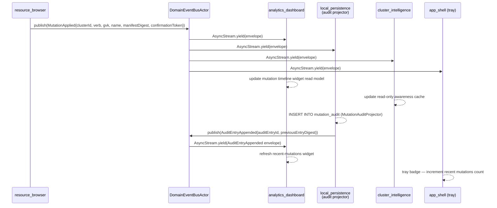
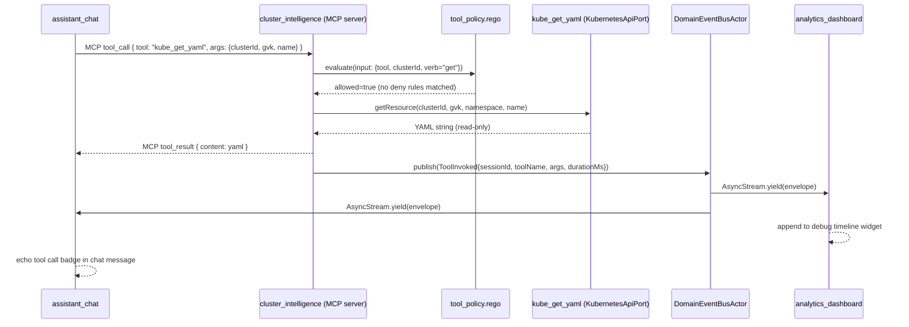
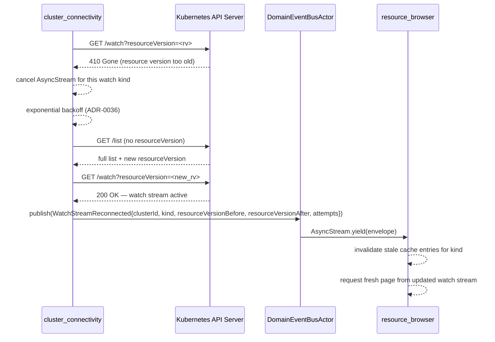
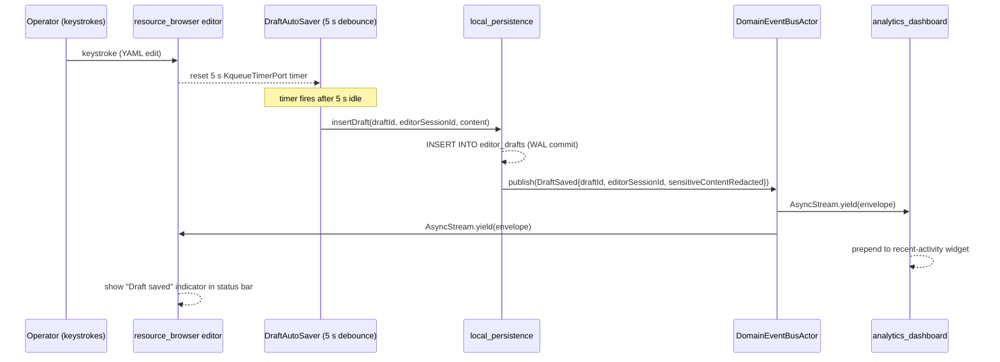
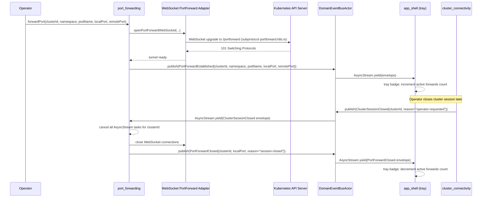
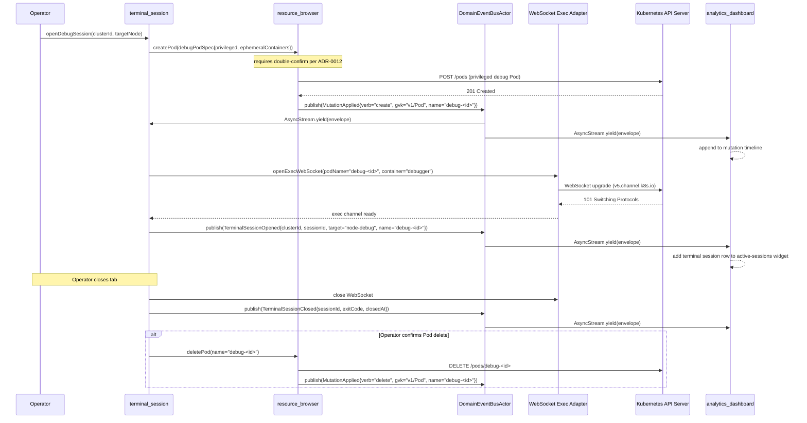

# K8sManager — Cross-Context Event Flows

This document describes how domain events flow across the 13 bounded contexts via the
`DomainEventBusPort` defined in ADR-0040. The canonical envelope schema (`#EventEnvelope`, all 23
event types) lives in `contexts/_shared/schemas/domain_events.cue`; that schema is the normative
reference — this document focuses on ordering, lifecycle, and sequence semantics. The reactive stack
integration contract (kqueue → `AsyncStream` → actor → `@Observable` → SwiftUI) is specified in
ADR-0035.

---

## Subscription lifecycle invariants

Every bounded context that needs to observe cross-context signals does so through the
`DomainEventBusPort.subscribe(to:subscriberId:)` method, which returns an
`AsyncStream<EventEnvelope>`. The following invariants govern subscription lifecycles throughout the
application.

**Registration and stream shape.** Subscribers call
`port.subscribe(to: sourceContext, subscriberId: id)` and receive a typed
`AsyncStream<EventEnvelope>`. The returned stream is the subscriber's exclusive channel; no other
subscriber shares it. Filters on `eventType` are applied by the subscriber inside its `for await`
loop; the bus itself delivers all events from the requested `sourceContext` without further
narrowing.

**Task binding.** Each subscription is bound to the Swift structured concurrency `Task` that drives
the `for await envelope in stream` loop. When that Task is cancelled — whether due to a view
dismissal, a cluster session teardown, or application quit — Swift delivers a `CancellationError` at
the next suspension point, exiting the loop cleanly. The `onTermination` handler registered when the
`AsyncStream` was created then fires synchronously and removes the subscriber's `Continuation` from
the `DomainEventBusActor`'s registry. No explicit unsubscribe call is needed.

**Per-subscriber buffer.** Each subscriber holds its own `AsyncStream.Continuation` created with
`bufferingOldest(64)` per ADR-0035. The bus never suspends during `publish`; if a subscriber's
buffer is full when the next envelope arrives, the oldest buffered envelope is silently dropped and
a `DomainEventDropped` meta-event is emitted on the dedicated meta-stream (fed to the ADR-0027
self-monitoring surface). The meta-stream is always drained by the self-monitoring subsystem; it
never overflows.

**Non-blocking handlers.** Subscribers must not perform blocking or long-running work inside the
`for await` loop body. Any work that takes more than a trivial in-memory update must spawn a child
Task: `Task { await longRunningProjection(envelope) }`. This ensures the subscriber drains its
buffer promptly and a slow projection cannot stall event delivery to itself.

**At-most-once, no replay.** Events are held only in subscriber buffers while the subscriber is
alive. The bus does not persist events. A subscriber that subscribes after an event is emitted will
never receive that event. Bounded contexts that need historical state must query `local_persistence`
(which projects selected events to SQLite). Specific events projected to SQLite: `MutationApplied` →
`mutation_audit` table; `AuditEntryAppended` → `audit_log` table.

**Producer anonymity.** Producers call `port.publish(_:)` and have no knowledge of how many
subscribers exist or which bounded contexts they belong to. The `DomainEventBusActor` registry is
private; producers cannot enumerate subscribers.

---

## Sequence diagrams

### flow-mutation-applied

A `MutationApplied` event fans out from `resource_browser` to four subscribers. `local_persistence`
writes the audit row and emits a back-channel `AuditEntryAppended` event that `analytics_dashboard`
and `app_shell` may also observe (shown abbreviated).



### flow-cluster-session-lifecycle

`context_navigation` drives a `ClusterSessionOpened` event when a session is successfully
established. Later, `ClusterSessionClosed` cascades a teardown through all subscribers.

```mermaid
sequenceDiagram
    participant CN as context_navigation
    participant CC as cluster_connectivity
    participant BUS as DomainEventBusActor
    participant AD as analytics_dashboard
    participant AS as app_shell (tray)
    participant CI as cluster_intelligence
    participant LP as local_persistence

    CN->>CC: openSession(clusterId)
    CC-->>CC: health probe succeeds; session active
    CC->>BUS: publish(ClusterSessionOpened{clusterId, contextId, openedAt})
    BUS->>AD: AsyncStream.yield(envelope)
    BUS->>AS: AsyncStream.yield(envelope)
    BUS->>CI: AsyncStream.yield(envelope)

    AD-->>AD: create cluster scope panel
    AS-->>AS: tray: set health badge to green
    CI-->>CI: register available MCP tools for clusterId

    Note over CN,LP: ... time passes; operator switches context or quits ...

    CC->>BUS: publish(ClusterSessionClosed{clusterId, closedAt, reason})
    BUS->>AD: AsyncStream.yield(envelope)
    BUS->>AS: AsyncStream.yield(envelope)
    BUS->>CI: AsyncStream.yield(envelope)

    AD-->>AD: remove cluster scope; archive timeline snapshot
    AS-->>AS: tray: remove cluster badge
    CI-->>CI: cancel watch subscriptions; deregister MCP tools
    LP-->>LP: (no direct subscription — cleanup is operator-commanded)
```

### flow-helm-rollback

`helm_management` emits `HelmRollbackInitiated`, delegates the actual apply operations to
`cluster_connectivity` via the `ServerSideApplyPort`, and emits `HelmRollbackCompleted` once the API
server confirms all resources.

```mermaid
sequenceDiagram
    participant HM as helm_management
    participant CC as cluster_connectivity
    participant BUS as DomainEventBusActor
    participant LP as local_persistence
    participant AD as analytics_dashboard

    HM->>BUS: publish(HelmRollbackInitiated{clusterId, releaseName, fromRevision, toRevision})
    BUS->>AD: AsyncStream.yield(envelope)
    BUS->>LP: AsyncStream.yield(envelope)

    AD-->>AD: show in-progress indicator on Helm release widget

    loop SSA apply per manifest resource
        HM->>CC: ServerSideApplyPort.apply(manifest)
        CC-->>CC: PATCH /apply on Kubernetes API
        CC-->>HM: MutationResult (success | conflict)
        HM->>BUS: publish(MutationApplied{clusterId, verb="apply", gvk, name})
        BUS->>AD: AsyncStream.yield(MutationApplied envelope)
        BUS->>LP: AsyncStream.yield(MutationApplied envelope)
        LP-->>LP: INSERT INTO mutation_audit
        LP->>BUS: publish(AuditEntryAppended{auditEntryId, previousEntryDigest})
    end

    HM->>BUS: publish(HelmRollbackCompleted{clusterId, releaseName, completedAt, status})
    BUS->>AD: AsyncStream.yield(envelope)
    BUS->>LP: AsyncStream.yield(envelope)

    AD-->>AD: update Helm release read model; clear in-progress indicator
```

### flow-assistant-tool-call

`assistant_chat` drives a tool call through the in-process MCP host into `cluster_intelligence`. The
policy gate in `tool_policy.rego` runs synchronously before the Kubernetes read is dispatched. A
`ToolInvoked` event is emitted after the tool returns, enabling `analytics_dashboard` to update its
debug timeline.



### flow-watch-stream-reconnect

When a Kubernetes watch returns HTTP 410 Gone, `cluster_connectivity` performs an exponential
backoff, re-lists the resource version, and emits `WatchStreamReconnected`. `resource_browser`
receives the event and invalidates its local cache.



### flow-draft-save

`resource_browser` debounces editor keystrokes. After a 5-second idle period, `DraftAutoSaver` calls
`local_persistence` to persist the draft, which emits `DraftSaved`. `analytics_dashboard` updates
its recent-activity widget on receipt.



### flow-port-forward-establish

`port_forwarding` opens a WebSocket tunnel. `PortForwardEstablished` is published to `app_shell`,
which increments the tray badge. When the cluster session closes, all active port forwards are torn
down as part of the cascade.



### flow-terminal-debug-pod

`terminal_session` creates an ephemeral debug Pod (mutating operation), waits for `MutationApplied`,
then opens the exec WebSocket. On tab close, the operator is offered the option to delete the debug
Pod.



---

## Ordering and delivery guarantees

**Per-source FIFO ordering.** Events emitted by the same source context arrive at each subscriber in
the order they were emitted. Because each source context calls `DomainEventBusPort.publish(_:)` from
within a single actor (for example, `resource_browser` publishes `MutationApplied` from within its
`ResourceBrowserActor`), the calls are serialised by that actor's executor. The bus iterates its
subscriber registry in a deterministic order within each `publish` invocation. A subscriber will
therefore see all `MutationApplied` events from `resource_browser` in emission order.

**Cross-source ordering is not guaranteed.** An `AuditEntryAppended` event emitted by
`local_persistence` and a `WatchStreamReconnected` event emitted by `cluster_connectivity` are
produced by independent actors and may arrive at a shared subscriber such as `analytics_dashboard`
in any order. Subscribers must not assume any ordering relationship between events from different
source contexts.

**At-most-once delivery.** An event may be dropped if a subscriber's buffer overflows. This is
observable via a `DomainEventDropped` meta-event emitted on the dedicated meta-stream (ADR-0027).
The drop is not retried; the oldest buffered envelope is discarded.

**No event is delivered retroactively.** A subscriber that subscribes after an event is emitted will
never receive that event. Subscribers that need historical state must query `local_persistence`
snapshots, not wait for bus replay.

---

## Trace propagation

The `traceId` field of `#EventEnvelope` is optional (nil when no active trace context exists). When
a producer sets `traceId`, every downstream subscriber that emits further events in response to the
triggering envelope is expected to carry the same `traceId` forward in any events it publishes.

For example: `resource_browser` publishes `MutationApplied` with `traceId = "abc123"`.
`local_persistence` consumes it and emits `AuditEntryAppended` also with `traceId = "abc123"`.
`analytics_dashboard`, which subscribes to both events, can correlate them by `traceId` without
relying on timestamp ordering. This enables end-to-end tracing of a single operator action across
all bounded contexts using the self-monitoring surface defined in ADR-0027.

The `correlationId` field serves a related but distinct purpose: it groups events from the same
logical operator action (for example, all `MutationApplied` events from a Helm rollback share a
`correlationId` equal to the rollback operation identifier) without requiring a live trace session.

---

## Backpressure

Each subscriber's `AsyncStream` is created with `bufferingOldest(64)` per ADR-0035. This means:

- The producer (`DomainEventBusActor`) never suspends. `publish` returns immediately after iterating
  all registered continuations.
- If a subscriber's buffer holds 64 unread envelopes and a new envelope arrives, the **oldest**
  buffered envelope is dropped and the new one is enqueued. This preference for recency means a slow
  subscriber converges on the latest known state rather than processing a stale queue.
- A `DomainEventDropped` meta-event is emitted for each drop. The self-monitoring surface (ADR-0027)
  aggregates drop rates per subscriber.
- `analytics_dashboard`, which consumes events from multiple high-frequency sources, reconciles
  buffer drops by re-querying the relevant SQLite snapshot in `local_persistence` whenever it
  receives a `DomainEventDropped` meta-event with `subscriberId` equal to its own identifier.

The buffer size of 64 is a system-wide default. Individual port definitions may declare a higher
limit when the expected event rate of their source justifies it (for example, a watch stream that
emits many hundreds of pod status updates during a rolling deployment). Any departure from 64 must
be justified in the relevant bounded-context spec file.

---

## Subscription cancellation propagation

When a subscriber's Task is cancelled, the following sequence of operations occurs deterministically
within Swift structured concurrency:

1. The `for await envelope in stream` loop receives a `CancellationError` at the next suspension
   point and exits.
2. Swift calls the `onTermination` closure registered on the `AsyncStream.Continuation` at creation
   time.
3. The `onTermination` closure calls into `DomainEventBusActor` to remove the subscriber's
   continuation from the registry, guarded by the actor's serial executor.
4. The bus no longer holds a reference to the continuation; the continuation is deallocated.

The `DomainEventBusActor` must hold subscriber continuations via weak references or through an
explicit registration identifier that is removed on termination, in order to prevent the bus from
keeping cancelled subscribers alive. The chosen implementation uses explicit registration:
`subscriberId` is the registry key, and `onTermination` removes that key from the
`[String: [String: Continuation]]` dictionary.

Common teardown scenarios:

- **View dismissed.** The SwiftUI view's `.task {}` modifier cancels its enclosing Task when the
  view leaves the hierarchy. The subscriber loop exits; the bus unregisters within one event-loop
  iteration.
- **Cluster session closed.** `ClusterSessionActor` is torn down, cancelling its entire Task tree.
  All BCs that subscribed within that task tree unsubscribe automatically.
- **Application quit.** The top-level `@main` entry point cancels the root Task tree. All
  subscriptions terminate before the process exits.

No manual unsubscribe call is ever required. The invariant is: lifetime of subscription == lifetime
of the consuming Task.
