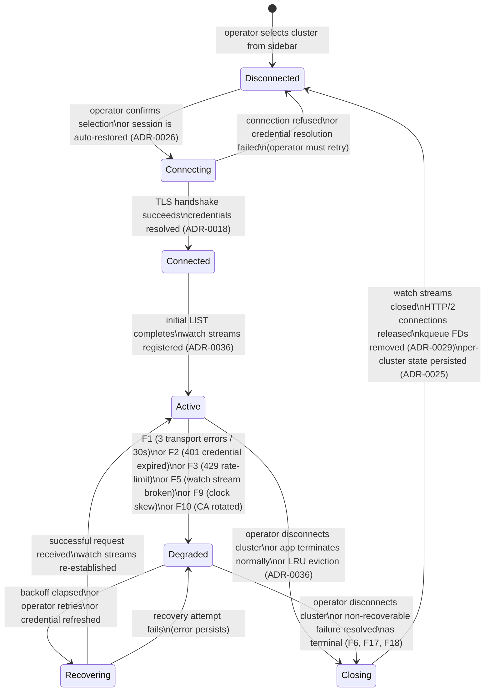

<!-- DDD role: LifecycleSpecification -->

# ClusterSession lifecycle

The `ClusterSession` entity is owned by the `cluster_connectivity` bounded context. Its lifecycle
governs the full progression from an operator selecting a cluster to the point where that cluster's
connection is permanently closed.

## State machine



## States

**Disconnected** — no network activity. No open FDs. The cluster row is visible in the sidebar but
shows no live data. This is also the state entered after a session is cleanly closed.

**Connecting** — TLS handshake in progress; credential resolution via `AuthResolverPort` (ADR-0018)
in progress. No resource data is visible. A loading indicator is shown in the cluster row.

**Connected** — authentication is established. The initial LIST (ADR-0036 Phase 1) is executing. The
cluster row shows a spinner. No watch streams are open yet.

**Active** — at least one watch stream is open and delivering events. Resource lists are live. This
is the nominal operating state.

**Degraded** — one or more failure modes (F1–F10 from ADR-0041) are active. The cluster row shows a
"Degraded" badge. Existing watch streams may still be delivering events for resources that are not
affected by the failure.

**Recovering** — a recovery procedure is in progress (backoff elapsed, credential re-resolved, TLS
renegotiation in progress). The "Degraded" badge transitions to a "Reconnecting…" indicator.

**Closing** — all child tasks are cancelling. The state is read-only from the operator's
perspective. No new requests are issued.

## Transitions

```
From          To            Guard                                Side effects
Disconnected  Connecting    operator action or auto-restore      emit ClusterSessionOpened
Connecting    Connected     TLS + auth succeed                   none
Connecting    Disconnected  TLS or auth fails                    show error toast
Connected     Active        initial LIST complete                register watch streams in WatchStreamRegistry
Active        Degraded      F1/F2/F3/F5/F9/F10 detected          emit ClusterSessionDegraded
Degraded      Recovering    backoff elapsed or operator retry    update cluster row indicator
Recovering    Active        successful request                   emit WatchStreamReconnected
Recovering    Degraded      recovery attempt fails               increment failure counter
Active        Closing       operator or LRU eviction             cancel child task group
Degraded      Closing       operator or terminal failure         cancel child task group
Closing       Disconnected  all FDs closed                       emit ClusterSessionClosed; persist last-known state
```

## Guard conditions

- `Connecting → Connected` requires that `AuthResolverPort` returned a valid credential and TLS
  chain validation succeeded against the kubeconfig CA bundle (ADR-0003). If either fails, the
  transition does not occur.
- `Active → Degraded` requires the detecting condition to be confirmed (e.g., 3 consecutive failures
  within 30 s for F1, not a single transient error).
- `Recovering → Active` requires at least one successful request, not merely the absence of an
  error.

## Side effects

- `Disconnected → Connecting` emits `ClusterSessionOpened`.
- `Active → Degraded` emits `ClusterSessionDegraded`.
- `Recovering → Active` emits `WatchStreamReconnected`.
- Any `→ Closing` transition cancels the `ClusterSessionActor`'s child task group (ADR-0025). All
  child WatchStreamState machines transition to `Closed`.
- `Closing → Disconnected` emits `ClusterSessionClosed`. Per-cluster JSON state (ADR-0026) is
  written atomically before the FD is released.

## Recoverable vs terminal states

**Recoverable** — `Degraded` and `Recovering` are always recoverable unless a terminal failure mode
(F6, F17, or F18 from ADR-0041) forces the session to `Closing`.

**Terminal** — `Closed` (the `[*]` exit state). Once `Closing → Disconnected` completes and the
domain event is emitted, the session cannot be resumed; the operator must create a new session by
re-selecting the cluster.

## Related ADRs

- ADR-0003 — kubeconfig read-only; CA bundle for TLS validation in `Connecting`.
- ADR-0018 — native cloud credential resolution; credential resolution in `Connecting` and
  credential refresh in `Degraded → Recovering`.
- ADR-0025 — per-cluster isolation; `ClusterSessionActor` owns this lifecycle.
- ADR-0029 — kqueue I/O selector; FD management in `Closing`.
- ADR-0036 — watch stream lifecycle; watch streams are a child lifecycle of the `Active` state.
- ADR-0040 — domain event taxonomy; events emitted at each transition.
- ADR-0041 — failure-mode catalogue; F1–F10 are the triggers for `Active → Degraded`.
