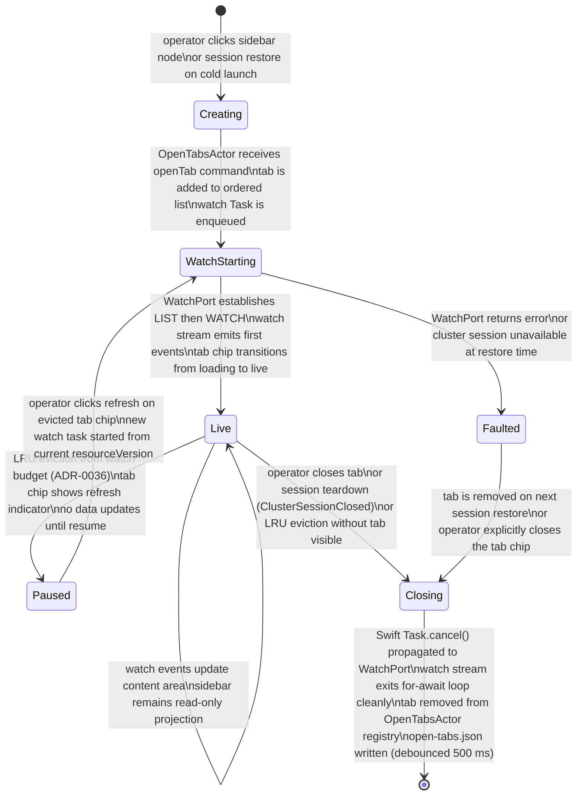

<!-- DDD role: LifecycleSpecification -->

# DocumentTab lifecycle

The `DocumentTab` entity is owned by the `OpenTabsActor` in the `app_shell` bounded context. Its
lifecycle governs the full progression from an operator clicking a sidebar tree node to the point
where the tab is permanently closed and its watch stream is cancelled.

This lifecycle is defined by ADR-0050 (resource navigation taxonomy and tab system) and is
constrained by ADR-0036 (watch stream lifecycle), ADR-0034 (state-driven UI), and ADR-0026 (tab
persistence path).

## State machine

## States

**Creating** — the tab has been requested (sidebar click or cold-launch restore) but the
`OpenTabsActor` has not yet confirmed the tab identity tuple uniqueness check. If a tab with the
same identity already exists, this state transitions immediately to bringing the existing tab to
focus (no new state created).

**WatchStarting** — the tab entry exists in `OpenTabsActor`'s ordered list. A new `Task` is spawned
to call `WatchPort.watch(gvr:namespace:resourceVersion:)`. The tab chip renders a loading indicator.
For cold-launch restores, `resourceList` tabs enter this state immediately; `resourceDetail` tabs
wait until the cluster session is `Active` before entering this state.

**Live** — the watch stream is established. The content area receives `ADDED`, `MODIFIED`, and
`DELETED` events. The sidebar tree remains a read-only projection; no watch stream mutation is
triggered by sidebar selection while this tab is live. Bookmark events advance the tracked
`resourceVersion` per ADR-0036.

**Paused** — the tab's watch stream was evicted by the LRU policy (ADR-0036, ADR-0050 addendum)
because the `ClusterSessionActor`'s `watchBudget` was exhausted. The tab chip shows a refresh
indicator. The content area is frozen at the last-received state. No network activity for this tab.

**Faulted** — the watch stream returned an unrecoverable error (e.g., the cluster session closed
before the watch could be established during cold-launch restore, or the kind was removed from the
cluster while this tab was being restored). The tab chip shows an error indicator. The content area
shows an inline error message.

**Closing** — the tab is being removed. `Task.cancel()` is called on the watch `Task`. Swift
structured concurrency propagates the cancellation to the `WatchPort` adapter. The adapter exits its
`for try await` loop at the next suspension point. The HTTP/2 stream is released. The watch stream
entry is removed from `ClusterSessionActor`'s `WatchStreamRegistry`. The tab entry is removed from
`OpenTabsActor`'s ordered list and watcher registry. The updated state is written to
`open-tabs.json` (debounced 500 ms).

## Transition triggers

Each entry is: `Trigger — From state → To state`.

- Operator clicks sidebar node (new identity) — `[*]` → Creating
- Operator clicks sidebar node (existing identity) — no state created; existing tab focused
- Cold-launch restore — `[*]` → Creating (then WatchStarting)
- openTab command accepted, Task enqueued — Creating → WatchStarting
- WatchPort LIST + WATCH succeeds — WatchStarting → Live
- WatchPort returns error — WatchStarting → Faulted
- LRU eviction (budget exceeded) — Live → Paused
- Operator clicks refresh on evicted chip — Paused → WatchStarting
- Operator closes tab (unpinned) — Live / Paused / Faulted → Closing
- ClusterSessionClosed domain event — Live / Paused → Closing (or Faulted for restoring tabs)
- closeTab command accepted — Live / Paused → Closing
- Task cancellation complete — Closing → `[*]`

## Invariants

1. A tab in the `Live` state MUST have exactly one associated `Task` in the watcher registry.
2. A tab in the `Paused` state MUST NOT have an active `Task` in the watcher registry.
3. A tab's `clusterId` MUST match the `clusterId` of the `ClusterStripPin` that governs its cluster
   session (cross-cluster mutation through a single tab is prohibited per
   `tab_navigation_policy.rego`).
4. Pinned tabs MUST NOT enter the `Closing` state via the close button. They require an explicit
   `unpinTab` command before `closeTab` is valid.
5. The `openTab` command MUST check for identity-tuple uniqueness before creating a new tab entry.
   If a duplicate is found, `focusTab` is issued instead and no new `Task` is spawned.

## Persistence

- Tab state is written to
  `~/Library/Application Support/K8sManager/clusters/<clusterId>/open-tabs.json` on every state
  transition, debounced to 500 ms.
- The write uses atomic rename semantics (write-to-tmp-then-rename) per ADR-0026.
- Only the fields of `#OpenTabsState` (as defined in `open_tabs_state.cue`) are persisted. Runtime
  fields (watch `Task` reference, scroll position cache) are not persisted.

## Related ADRs

- ADR-0025 — `ClusterSessionActor` provides the cluster session that watch streams run against.
- ADR-0026 — State persistence; tab open-tabs.json path and atomic write rules.
- ADR-0034 — `OpenTabsActor` feeds `AsyncStream<[DocumentTab]>` to the `TabBarViewModel`.
- ADR-0036 — Watch stream lifecycle state machine; LRU eviction and budget rules apply to tabs.
- ADR-0050 — Tab system contract, identity tuple, persistence path, `OpenTabsActor` ownership.
- ADR-0051 — Chrome layout; tab bar position, chip rendering, detail drawer toggling.
