<!-- DDD role: LifecycleSpecification -->

# EditorSession lifecycle

The `EditorSession` entity is owned by the `resource_browser` bounded context. Its lifecycle governs
the progression of a single YAML/JSON edit operation from the moment the operator opens the
integrated editor (ADR-0030) to the point where the operation is committed, cancelled, or abandoned.

## State machine

```mermaid
stateDiagram-v2
    [*] --> Idle : resource_browser view is active\nno editor open

    Idle --> Opened : operator clicks Edit\nor assistant opens draft

    Opened --> Dirty : operator makes first keystroke\nor programmatic edit

    Dirty --> DryRunning : operator clicks "Dry run"\nor auto-dry-run on save debounce

    DryRunning --> Dirty : dry run completes\n(result shown inline; operator continues editing)

    DryRunning --> Confirming : dry run succeeds\noperator clicks Apply

    Dirty --> Confirming : operator clicks Apply\n(skips dry run — double-confirm path)

    Confirming --> Applying : operator confirms in dialog\n(single confirm for non-destructive,\ndouble confirm for delete — ADR-0012)

    Confirming --> Cancelled : operator cancels dialog

    Applying --> Applied : SSA PATCH returns 200/201\naudit entry written (ADR-0012)

    Applying --> Dirty : 409 Conflict (F11 — ADR-0041)\ndiff shown; operator returns to editor

    Applied --> Idle : operator closes editor\nor editor auto-closes after N seconds

    Cancelled --> Dirty : operator returns to editor\n(draft preserved)

    Cancelled --> Closed : operator discards draft

    Dirty --> Closed : operator closes editor\nand confirms discard

    Opened --> Closed : operator closes editor\nwithout making changes

    Closed --> [*]
```



## States

**Idle** — the editor is not open. The resource-browser view is visible. No draft exists in memory.

**Opened** — the editor has loaded the resource's current YAML (fetched fresh from the API server).
The draft is a copy of the server-side state. No changes have been made.

**Dirty** — the operator has made at least one change. The draft diverges from the server-side
state. The editor title bar shows an unsaved-changes indicator. Auto-save to an in-memory draft
store occurs on each keystroke via a debounced `DraftSaved` domain event (ADR-0040).

**DryRunning** — a server-side dry run is in progress. The apply path uses `PATCH` with the
`?dryRun=All` query parameter. The editor UI is read-only while dry run is in progress.

**Confirming** — the apply confirmation dialog is shown. For non-destructive operations, a single
"Apply" button suffices. For destructive operations (delete, replace), a double-confirm dialog is
required (ADR-0012). The editor is read-only while the dialog is open.

**Applying** — the SSA PATCH request is in flight. A progress indicator is shown. The editor is
read-only.

**Applied** — the PATCH succeeded. The audit entry is written by `MutationAuditProjector` in
`local_persistence` (ADR-0010). A success toast is shown. The editor closes automatically after 3
seconds unless the operator has already dismissed it.

**Cancelled** — the operator dismissed the confirmation dialog without confirming. The draft is
preserved in memory; the operator may continue editing.

**Closed** — the editor is closed. The draft is discarded from memory. The `DraftPruned` domain
event is emitted if a non-empty draft existed.

## Transitions

```
From        To          Guard                                              Side effects
Idle        Opened      operator or assistant opens editor                 fetch fresh resource YAML from API
Opened      Dirty       first keystroke or programmatic edit               emit DraftSaved (initial)
Dirty       DryRunning  operator requests dry run or debounce fires        issue PATCH ?dryRun=All
DryRunning  Dirty       dry run completes (success or error)               show inline diff or error
DryRunning  Confirming  dry run succeeded and operator clicks Apply        show confirmation dialog
Dirty       Confirming  operator clicks Apply (no explicit dry run)        show double-confirm dialog
Confirming  Applying    operator confirms                                  issue SSA PATCH
Confirming  Cancelled   operator cancels                                   dismiss dialog
Applying    Applied     PATCH 200/201                                      emit MutationApplied; write audit entry
Applying    Dirty       PATCH 409 (F11)                                    show diff in editor; operator must merge
Applied     Idle        auto-close or operator closes                      emit none (already applied)
Cancelled   Dirty       operator returns to editor                         restore focus to editor
Cancelled   Closed      operator discards draft                            emit DraftPruned
Dirty       Closed      operator closes + confirms discard                 emit DraftPruned
Opened      Closed      operator closes without changes                    no domain event
```

## Guard conditions

- `Confirming → Applying` for destructive operations (delete, replace) requires two separate
  operator confirmations within a single dialog session (ADR-0012). A single confirmation is
  insufficient.
- `Applying → Applied` requires both a 200/201 HTTP response and a successful audit-entry write. If
  the audit write fails (F6 or F18 from ADR-0041), the `Applied` state is not entered; instead the
  editor reports "Apply succeeded but audit write failed" and transitions to `Idle`.

## Side effects

- `Dirty` on each change emits `DraftSaved` to the domain event bus; this enables the
  `analytics_dashboard` read model to track unsaved draft counts.
- `Applying → Applied` emits `MutationApplied`, which fans out to `analytics_dashboard`,
  `local_persistence`, and `cluster_intelligence` (ADR-0040).
- `→ Closed` with a non-empty draft emits `DraftPruned`.

## Recoverable vs terminal states

**Recoverable** — `DryRunning` failures, `Cancelled`, and `Applying → Dirty` (F11 Conflict) are all
recoverable; the draft is preserved and the operator may continue.

**Terminal** — `Closed` is terminal for the individual editor session. The resource view remains
active; the operator may open a new editor session for the same resource.

## Related ADRs

- ADR-0012 — mutating operations policy; double-confirm rule for destructive operations; SSA PATCH
  as the apply mechanism.
- ADR-0030 — integrated editor; the UI component that hosts this lifecycle.
- ADR-0034 — state-driven realtime UI; `@Observable` EditorSessionViewModel drives the editor state.
- ADR-0040 — domain event taxonomy; `DraftSaved`, `MutationApplied`, `DraftPruned`.
- ADR-0041 — failure-mode catalogue; F11 (Conflict 409) triggers `Applying → Dirty`.
