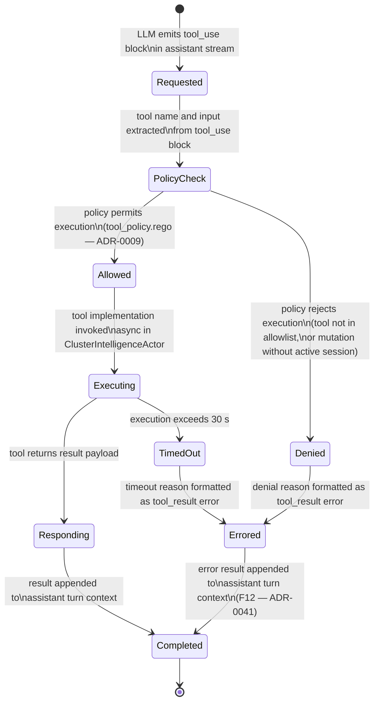

<!-- DDD role: LifecycleSpecification -->

# MCPToolCall lifecycle

The `MCPToolCall` entity is owned by the `cluster_intelligence` bounded context. Its lifecycle
governs a single tool invocation from the moment the LLM emits a tool-use request to the moment the
tool result (or error) is returned to the LLM context. The in-process MCP server (ADR-0009) executes
the tool.

## State machine



## States

**Requested** — the assistant stream (ADR-0008) emitted a `tool_use` content block. The block has
been parsed: tool name, `tool_use_id`, and input JSON are available.

**PolicyCheck** — the Rego policy at `contexts/cluster_intelligence/policies/tool_policy.rego` is
evaluated against the tool name and the current active cluster session. Evaluation is synchronous
and completes in microseconds.

**Allowed** — the policy evaluation returned `allow = true`. The tool is in the allowlist and all
preconditions (active session, required parameters) are met.

**Denied** — the policy evaluation returned `allow = false`. Common denial reasons: tool not in the
registered tool registry (ADR-0009), mutation tool invoked without an active cluster session, or a
disabled-tools override is active.

**Executing** — the tool implementation is running asynchronously within the
`ClusterIntelligenceActor`. This may involve API server calls, resource lookups, or port-forward
state reads. A 30-second execution deadline is active.

**Responding** — the tool implementation returned a result payload. The result is being serialised
into the `tool_result` format for the LLM context.

**TimedOut** — the execution deadline elapsed before the tool returned. The tool's async task is
cancelled.

**Completed** — the `tool_result` content block (success or error) has been appended to the current
assistant turn. The LLM context continues.

**Errored** — an intermediate state reached by `Denied` or `TimedOut`. An error `tool_result` is
being constructed. Always transitions to `Completed`.

## Transitions

```
From         To          Guard                                       Side effects
Requested    PolicyCheck tool_use block fully parsed                  none
PolicyCheck  Allowed     Rego allow = true                            none
PolicyCheck  Denied      Rego allow = false                           none
Allowed      Executing   tool implementation is registered            emit ToolInvoked
Executing    Responding  tool returns within 30 s                     none
Executing    TimedOut    30-second deadline elapsed                   cancel tool task
Responding   Completed   result serialised                            write mcp.tool_result audit entry
Denied       Errored     denial reason formatted                      write mcp.tool_denied audit entry
TimedOut     Errored     timeout reason formatted                     write mcp.tool_timeout audit entry
Errored      Completed   error tool_result appended to context        none (already written in Errored)
```

## Guard conditions

- `PolicyCheck → Allowed` requires that the tool name is present in the `MCPToolRegistry` (ADR-0009)
  and that all mandatory input fields are present in the tool's input JSON schema.
- `Executing → Responding` requires that the tool implementation does not throw an uncaught error.
  Caught tool-implementation errors are returned as a valid `tool_result` with `is_error: true` —
  these route through `Responding` not `TimedOut`.
- The 30-second deadline applies to the full `Executing` phase. Tools that stream results (e.g.,
  log-tail tools) must complete their stream within 30 s or emit a partial result before the
  deadline.

## Side effects

- `Allowed → Executing` emits `ToolInvoked` to the domain event bus; the `assistant_chat` bounded
  context subscribes to this event to render the in-flight tool call indicator in the chat UI
  (ADR-0040).
- `Responding → Completed` writes a `mcp.tool_result` audit entry recording the tool name,
  `tool_use_id`, execution duration, and success status.
- `Denied → Errored` writes a `mcp.tool_denied` audit entry.
- `TimedOut → Errored` writes a `mcp.tool_timeout` audit entry.
- `Errored → Completed` is the path for F12 (MCP server tool error) as documented in ADR-0041; the
  error is shown inline in the chat.

## Recoverable vs terminal states

**Recoverable** — none. A single `MCPToolCall` lifecycle is terminal once it reaches `Completed`.
The LLM context may issue a subsequent tool call (a new `MCPToolCall` lifecycle), but that is a
separate entity.

**Terminal** — `Completed` is the single terminal state for every path. `Denied`, `TimedOut`, and
`Errored` are intermediate states that always resolve to `Completed`.

## Related ADRs

- ADR-0008 — LLM provider abstraction; the assistant stream that emits `tool_use` blocks.
- ADR-0009 — MCP host and in-process server; the tool registry and execution environment.
- ADR-0040 — domain event taxonomy; `ToolInvoked`.
- ADR-0041 — failure-mode catalogue; F12 (MCP tool error) is surfaced through the
  `Errored → Completed` path.
