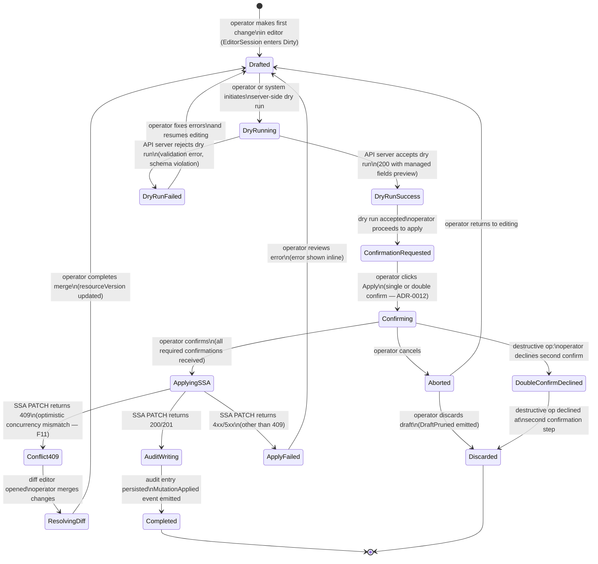

<!-- DDD role: LifecycleSpecification -->

# MutatingOperation lifecycle

The `MutatingOperation` entity is owned by the `resource_browser` bounded context. Its lifecycle
governs the full progression of a resource mutation from the first draft through server-side apply
(SSA) to a completed audit entry. This lifecycle is a more detailed decomposition of the
`EditorSession` lifecycle, focused specifically on the mutation path rather than the editing UX.

## State machine



## States

**Drafted** — the mutation is in draft form in memory. The draft has diverged from the server-side
state. Auto-save emits `DraftSaved` on each change (debounced). No server-side request has been
issued for this draft.

**DryRunning** — a `PATCH` with `?dryRun=All` is in flight. The operation is read-only from the
cluster's perspective. The editor shows a loading indicator.

**DryRunSuccess** — the API server accepted the dry run and returned managed fields and a preview of
what the object would look like after apply. The diff is shown in the editor.

**DryRunFailed** — the API server rejected the dry run with a validation or schema error. The error
is shown inline. The draft is preserved.

**ConfirmationRequested** — the system has determined that the operation is ready to apply and is
requesting operator confirmation. The confirmation dialog is shown.

**Confirming** — the operator has seen the confirmation dialog and is actively deciding. For
non-destructive operations, this state is brief (single click). For destructive operations, the
double-confirm sequence extends this state.

**Aborted** — the operator cancelled the confirmation dialog. The draft is preserved in memory; the
editor is re-enabled.

**ApplyingSSA** — the SSA `PATCH` (using `fieldManager=k8smanager`, `force=false`) is in flight. The
editor is read-only. A progress indicator is shown.

**Conflict409** — the SSA `PATCH` returned 409 due to a `resourceVersion` mismatch (F11 from
ADR-0041). The conflict is surfaced as a diff between the client's draft and the server's current
version.

**ResolvingDiff** — the operator is actively resolving the 409 conflict using the diff editor. The
current server-side `resourceVersion` is loaded. The draft is updated with the server's
`resourceVersion` on merge completion.

**AuditWriting** — the SSA `PATCH` succeeded. The audit entry is being written synchronously to the
`mutation_audit` SQLite table by `local_persistence` (ADR-0010). This state is invisible to the UI;
from the operator's perspective, the operation is completing.

**ApplyFailed** — the SSA `PATCH` returned a non-409 HTTP error (e.g., 422 Unprocessable Entity, 403
Forbidden, 503 Service Unavailable). The error is shown inline in the editor. The draft is
preserved.

**Completed** — the mutation is durably recorded. The audit entry is written, `MutationApplied` is
emitted, and the editor closes automatically.

**Discarded** — the draft is cleared from memory. `DraftPruned` is emitted. No server-side request
was issued in this lifetime (or the operator abandoned after a failed apply).

**DoubleConfirmDeclined** — the operator declined the second confirmation step for a destructive
operation. The operation is immediately aborted without returning to the editor.

## Transitions

```
From                   To                     Guard                                       Side effects
Drafted                DryRunning             operator or debounce triggers dry run       emit none
DryRunning             DryRunSuccess          PATCH ?dryRun=All 200                       show diff preview
DryRunning             DryRunFailed           PATCH ?dryRun=All 422/etc                   show error inline
DryRunFailed           Drafted                operator returns to editor                  clear error indicator
DryRunSuccess          ConfirmationRequested  operator clicks Apply                       show confirmation dialog
ConfirmationRequested  Confirming             operator opens dialog                       none
Confirming             ApplyingSSA            all required confirmations received         issue SSA PATCH
Confirming             Aborted                operator clicks Cancel                      dismiss dialog
Confirming             DoubleConfirmDeclined  destructive op: second confirm declined     none
Aborted                Drafted                operator returns to editor                  re-enable editor
Aborted                Discarded              operator discards draft                     emit DraftPruned
DoubleConfirmDeclined  Discarded              auto-transition                             emit DraftPruned
ApplyingSSA            AuditWriting           PATCH 200/201                               write audit entry
ApplyingSSA            Conflict409            PATCH 409                                   load server-side version
ApplyingSSA            ApplyFailed            PATCH 4xx/5xx (not 409)                     show error inline
Conflict409            ResolvingDiff          diff editor opens                           none
ResolvingDiff          Drafted                operator completes merge                    update draft with new resourceVersion
AuditWriting           Completed              audit entry written                         emit MutationApplied
ApplyFailed            Drafted                operator reviews error                      clear progress indicator
Completed              [terminal]             terminal                                    none
Discarded              [terminal]             terminal                                    none
```

## Guard conditions

- `Confirming → ApplyingSSA` for destructive operations (delete, replace, scale to zero) requires
  that two separate confirmations have been received within the same dialog session (ADR-0012). The
  first confirmation sets a `pendingDestructiveConfirm` flag; the second confirmation clears it and
  proceeds.
- `ApplyingSSA → AuditWriting` requires that the HTTP response status is 200 or 201. Status 204 is
  not expected for SSA PATCH (the API server always returns the full updated object).
- `AuditWriting → Completed` requires that the `mutation_audit` write succeeds. If the write fails
  (F6 or F18 from ADR-0041), the state machine transitions to a `Completed` sub-type with
  `auditFailed = true`; the UI shows "Applied but audit write failed" and the error is reported to
  the self-monitoring system (ADR-0027).
- `ResolvingDiff → Drafted` requires that the operator has selected one of the three merge options
  (accept server, accept client, manual merge) and the resulting merged YAML is valid JSON/YAML.

## Side effects

- `DryRunning → DryRunSuccess` shows the managed-fields diff in the editor.
- `AuditWriting → Completed` emits `MutationApplied` to the domain event bus; this fans out to
  `analytics_dashboard`, `local_persistence` (for read-model projection), and `cluster_intelligence`
  (ADR-0040).
- `→ Discarded` emits `DraftPruned`.
- `Conflict409` causes the `resource_browser` to load the server's current resourceVersion for use
  in the merge resolution.

## Recoverable vs terminal states

**Recoverable** — `DryRunFailed`, `Aborted`, `Conflict409`, `ResolvingDiff`, and `ApplyFailed` are
all recoverable. The draft is preserved and the operator may continue editing.

**Terminal** — `Completed` and `Discarded` are terminal. Neither can be reversed; the `Completed`
state represents a durable write to both the cluster and the audit log.

## Related ADRs

- ADR-0012 — mutating operations policy; SSA field manager, double-confirm rule, audit requirements.
- ADR-0030 — integrated editor; hosts the editor UX for this lifecycle.
- ADR-0034 — state-driven realtime UI; `@Observable` MutatingOperationViewModel.
- ADR-0040 — domain event taxonomy; `DraftSaved`, `MutationApplied`, `DraftPruned`.
- ADR-0041 — failure-mode catalogue; F11 (Conflict 409) triggers `ApplyingSSA → Conflict409`.
