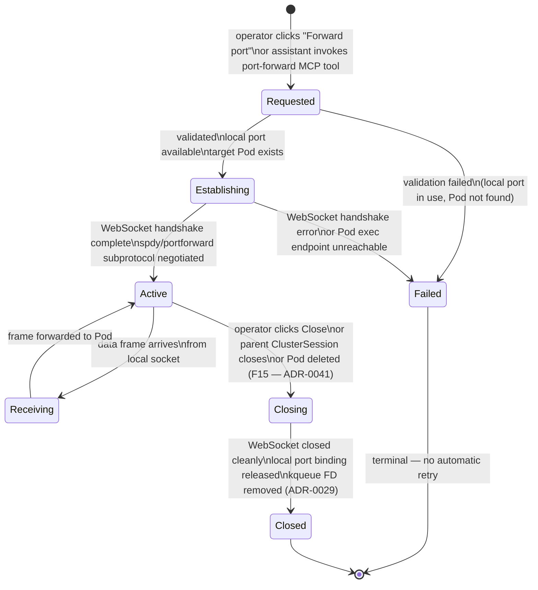

<!-- DDD role: LifecycleSpecification -->

# PortForward lifecycle

The `PortForwardSession` entity is owned by the `port_forwarding` bounded context. Its lifecycle
governs the progression from an operator requesting a port-forward tunnel to the point where the
tunnel is permanently closed.

## State machine



## States

**Requested** — the operator or MCP tool has expressed the intent to open a port-forward tunnel. The
local port and target Pod/port triple are known but not yet validated.

**Establishing** — the local TCP listen socket is bound; the API server WebSocket handshake is in
progress using the `spdy/portforward` subprotocol. The tunnel row in the UI shows "Establishing…".

**Active** — the WebSocket is open. The local port is accepting connections. Data frames flow
bidirectionally between the local socket and the Pod. The tunnel row shows "Active" with a live
byte-counter.

**Receiving** — a transient sub-state indicating that a data frame is being read from the local
socket and forwarded over the WebSocket. This state is not directly observable in the UI; the tunnel
row remains "Active".

**Closing** — the tunnel is shutting down. The WebSocket close frame is sent. The local TCP listener
is unbound. kqueue FDs are deregistered.

**Closed** — the tunnel is permanently terminated. The tunnel row transitions to "Disconnected"
(F15) or is removed from the list (clean close by operator).

**Failed** — establishment failed before the tunnel was ever active. The tunnel row shows an error
message. No retry is attempted automatically.

## Transitions

```
From          To            Guard                                                  Side effects
Requested     Establishing  local port available; Pod found in API                 bind local TCP socket; emit PortForwardEstablished intent
Requested     Failed        local port in use or Pod not found                     show error in tunnel row
Establishing  Active        WebSocket handshake succeeds                           update tunnel row to "Active"; emit PortForwardEstablished
Establishing  Failed        WebSocket error or connection refused                  release local port binding
Active        Receiving     data frame available on local socket                   none
Receiving     Active        frame forwarded successfully                           update byte counter
Active        Closing       operator/parent session closes or Pod gone (F15)       send WebSocket close frame
Closing       Closed        WebSocket closed and FDs released                      emit PortForwardClosed; update tunnel row
Failed        [terminal]    terminal                                               none
Closed        [terminal]    terminal                                               none
```

## Guard conditions

- `Requested → Establishing` requires that the target Pod is in `Running` phase with at least one
  container `Ready`. If the Pod is in `Pending` or `Failed` phase, the transition goes to `Failed`.
- `Requested → Establishing` also requires that the requested local port is not bound by any other
  process (checked via `bind(2)` before WebSocket negotiation).
- `Active → Closing` triggered by Pod deletion (F15) does not wait for an operator action; it fires
  immediately on detection of the WebSocket close frame or `ECONNRESET`.

## Side effects

- `Establishing → Active` emits `PortForwardEstablished` to the domain event bus (ADR-0040);
  `analytics_dashboard` and `app_shell` subscribe.
- `Active → Closing → Closed` emits `PortForwardClosed`.
- `Closing` deregisters the kqueue `EVFILT_READ` filter for the WebSocket FD (ADR-0029) and releases
  the local TCP port binding.

## Recoverable vs terminal states

**Recoverable** — none. The `PortForward` lifecycle does not have a `Recovering` state. Failure or
disconnection is terminal for the individual tunnel; the operator must explicitly restart the tunnel
using the "Restart" action (which creates a new `PortForwardSession` in `Requested` state).

**Terminal** — `Failed` and `Closed` are both terminal. The distinction is: `Failed` means the
tunnel was never established; `Closed` means it was active at some point.

## Related ADRs

- ADR-0014 — port-forwarding lifecycle; the initial design that this document refines.
- ADR-0029 — kqueue I/O selector; FD management for the WebSocket connection.
- ADR-0040 — domain event taxonomy; `PortForwardEstablished`, `PortForwardClosed`.
- ADR-0041 — failure-mode catalogue; F15 (port-forward target gone) triggers `Active → Closing`.
