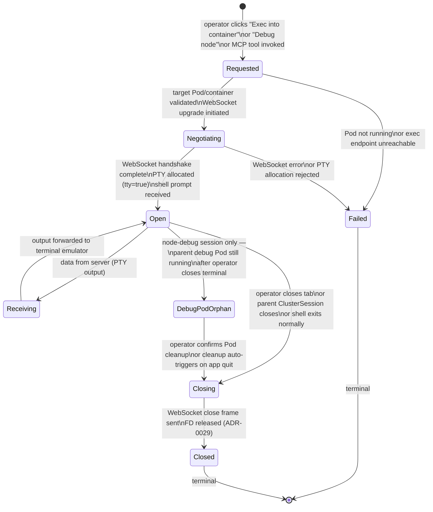

<!-- DDD role: LifecycleSpecification -->

# TerminalSession lifecycle

The `TerminalSession` entity is owned by the `terminal_session` bounded context. Its lifecycle
governs the progression from an operator requesting a `kubectl exec` or node-debug session to the
point where the terminal is permanently closed. A terminal session uses the Kubernetes API exec
sub-resource WebSocket (`spdy/3.1` or `websocket`) to stream PTY I/O.

## State machine



## States

**Requested** — the operator has expressed intent to open a terminal session. The target `podName`,
`containerName`, `namespace`, and `clusterId` are known. For node-debug sessions, an ephemeral debug
Pod is about to be created.

**Negotiating** — the API server WebSocket upgrade is in progress. For node-debug sessions, the
ephemeral debug Pod is being created and its `Running` status is awaited. The terminal tab shows a
"Connecting…" indicator.

**Open** — the WebSocket is established and a PTY shell is running. The terminal emulator (ADR-0017)
is rendering PTY output. The tab shows a live cursor.

**Receiving** — a transient sub-state during which a PTY output chunk is being decoded and forwarded
to the terminal emulator. Not directly observable in the UI; the tab remains in the `Open` visual
state.

**Closing** — the terminal is shutting down. The WebSocket close frame is being sent. The PTY is
being de-allocated by the container runtime. kqueue FDs are being deregistered.

**Closed** — the terminal is permanently terminated. The tab is removed from the multi-tab strip
(ADR-0017).

**Failed** — the session failed before the PTY was ever established. The tab shows an error message.
No retry is attempted automatically.

**DebugPodOrphan** — applies to node-debug sessions only. The operator has closed the terminal tab
but the ephemeral debug Pod (created by the node-debug flow) is still `Running`. This state exists
to surface the orphan to the operator and prevent resource leaks.

## Transitions

```
From            To              Guard                                                              Side effects
Requested       Negotiating     Pod Running and container Ready                                    initiate WebSocket upgrade
Requested       Failed          Pod not Running or exec endpoint fails                             show error in tab
Negotiating     Open            WebSocket handshake complete; PTY shell prompt received            emit TerminalSessionOpened
Negotiating     Failed          WebSocket error or PTY allocation rejected                         release resources
Open            Receiving       PTY data available                                                 decode and forward to terminal emulator
Receiving       Open            data forwarded                                                     none
Open            Closing         operator closes tab / parent closes / shell exits                  send WebSocket close frame
Open            DebugPodOrphan  node-debug: operator closes tab while debug Pod still Running      show orphan indicator
DebugPodOrphan  Closing         operator confirms cleanup or app quits                             delete orphan debug Pod via API
Closing         Closed          WebSocket closed; FDs released                                     emit TerminalSessionClosed; remove tab
Failed          [terminal]      terminal                                                           none
Closed          [terminal]      terminal                                                           none
```

## Guard conditions

- `Requested → Negotiating` requires that the target container is in `Running` state. A container in
  `ContainerCreating`, `Terminated`, or `Waiting` state causes the transition to `Failed`.
- `Negotiating → Open` requires that the server sends a non-error initial frame on the PTY data
  stream within the 10-second negotiation timeout. Timeout causes transition to `Failed`.
- `Open → DebugPodOrphan` applies only to sessions initiated via the node-debug flow (ADR-0017).
  Standard `exec` sessions skip this state entirely.
- `DebugPodOrphan → Closing` auto-triggers at app-quit time via the `NSApplicationWillTerminate`
  notification, to prevent leaving debug Pods running in the cluster after the user closes
  K8sManager.

## Side effects

- `Negotiating → Open` emits `TerminalSessionOpened`.
- `Closing → Closed` emits `TerminalSessionClosed`.
- `DebugPodOrphan → Closing` issues a `DELETE` request for the orphan debug Pod and writes a
  `resource.deleted` audit entry (ADR-0012).
- `Closing` deregisters the kqueue `EVFILT_READ` filter for the WebSocket FD (ADR-0029).

## Recoverable vs terminal states

**Recoverable** — none. Like the PortForward lifecycle, TerminalSession does not have a `Recovering`
state. If the WebSocket drops (e.g., due to a network interruption), the session transitions through
`Closing` to `Closed`. The operator must open a new tab.

**Terminal** — `Failed`, `Closed`. `DebugPodOrphan` is a liminal state that always resolves to
`Closing`.

## Related ADRs

- ADR-0017 — terminal sessions; multi-tab design and node-debug pod flow.
- ADR-0029 — kqueue I/O selector; WebSocket FD management.
- ADR-0040 — domain event taxonomy; `TerminalSessionOpened`, `TerminalSessionClosed`.
