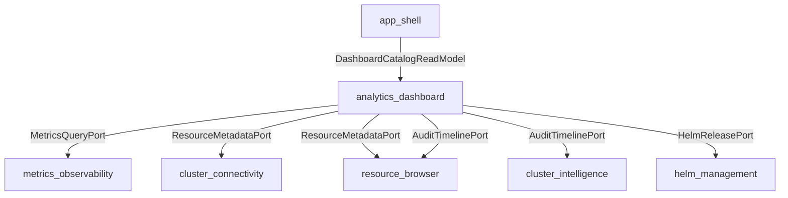
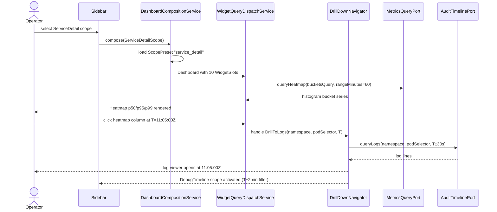

# analytics_dashboard — Domain Narrative

## Purpose

The `analytics_dashboard` bounded context provides persistent, always-visible analytics dashboards
that aggregate data from multiple upstream bounded contexts and present it through a curated,
scope-scoped widget layout. It is the thirteenth bounded context in the K8S-Manager spec.

The context exists because no single upstream BC owns the cross-domain assembly required for
operator debug workflows. A latency investigation requires Prometheus time-series from
`metrics_observability`, Kubernetes object state from `cluster_connectivity`, mutation audit records
from `resource_browser`, and Helm release history from `helm_management`. The `analytics_dashboard`
context is the only consumer of all four simultaneously.

Unlike the on-demand inline metric panels in `resource_browser`, dashboards here are always visible
— rendered immediately when the operator selects a scope in the sidebar. The context owns the
dashboard lifecycle, widget catalog, scope presets, drill-down navigation, and auto-refresh.

## Ubiquitous Language

**Dashboard** — The aggregate root. A persistent record binding a DashboardScope to a curated layout
of WidgetSlots for one Kubernetes context. One Dashboard exists per (kubernetesContextId, scope)
pair in the catalog. When the operator has not customised the layout, the Dashboard is fully
regenerated from the matching ScopePreset on each application launch.

**Scope** — The lens through which a Dashboard views the cluster. Nine scope variants exist:
ClusterOverview, NamespaceDetail, PodDetail, NodeDetail, WorkloadDetail, ServiceDetail,
HelmReleaseDetail, DebugTimeline, and TopologyGraph. Each scope determines which ScopePreset is
loaded, which upstream ports are queried, and which widget types are valid.

**Preset** — A `ScopePreset` value object shipped with the application. It defines the default
ordered widget layout for a given scope variant. Presets are immutable at the spec level; operators
may override them per-Dashboard, in which case `Dashboard.customisedByOperator` is set to `true`.

**Widget** — A renderable, self-contained data panel. The `AnalyticsWidget` sum type enumerates
eleven variants: Sparkline, LineChart, Heatmap, StackedBar, Count, TopList, EventTimeline,
TopologyGraph, LogErrorRate, DiffViewer, and ConditionsList. Each widget carries its own typed
configuration; the `kind` field is the discriminant.

**WidgetSlot** — A placement record binding a `widgetId` (referencing an AnalyticsWidget) to a
`GridPosition` (row, col, rowSpan, colSpan) within the 12-column dashboard grid.

**DrillDown** — A first-class navigation intent emitted when an operator clicks an interactive data
point. Four variants: `DrillToScope` (change dashboard scope), `DrillToLogs` (open log viewer at
timestamp), `DrillToYAML` (open YAML resource viewer), `DrillToEvents` (open filtered event
timeline). DrillDown events carry provenance (sourceDashboardId, sourceWidgetId) and are handled by
`DrillDownNavigator`.

**RED** — Request rate, Error rate, latency (Duration). The column layout enforced for
`ServiceDetailScope` dashboards: request rate on the left, error rate left-adjacent, latency on the
right. Each row represents one logical data flow direction.

**USE** — Utilization, Saturation, Errors. The widget ordering enforced for resource-level
dashboards (NodeDetail, PodDetail): utilization metrics first, saturation indicators second, error
counts third.

**Heatmap** — A `HeatmapWidget` rendering Prometheus histogram bucket data as time-column color
bands. Always displays p50/p95/p99 simultaneously. A stable P50 with a rising P99 surfaces a
`LatencyDivergenceHint` indicating queueing, connection pool exhaustion, or GC pressure.

**TopologyGraph** — An interactive, zoomable node-edge graph of Kubernetes resource relationships.
Edges represent owner references, service selector matches, and Helm release ownership. Supports PNG
export and click-to-drill-down.

**EventTimeline** — A scrollable, filterable chronological list of events from one or more sources:
`k8s_events`, `mutation_audit`, `assistant_tool_calls`, or all. Used in DebugTimeline scope for
cross-source post-mortem investigation.

**ColorSemantic** — The five-value closed enum for widget colors: `healthy` (green), `warning`
(yellow), `error` (red), `info` (blue), `neutral` (gray). No arbitrary hex values are permitted.
Enforced by the CUE schema.

**LatencyDivergenceHint** — A transient value object computed at query time when heatmap percentile
divergence exceeds threshold ratios (P99/P50 > 3x). Surfaced as an inline banner on the widget with
an operator-readable explanation.

**Auto-refresh** — The periodic re-query of all widget data at the
`Dashboard.refreshIntervalSeconds` cadence (default 30s). When macOS low-power mode is active the
effective interval doubles. A subtle animated indicator appears in the dashboard header during each
refresh cycle.

**DataLink** — The pairing of a widget click event to a `DrillDownEvent`. Data links are domain
concepts, not URL strings. `WidgetActions.primaryDrillDown` encodes the link at the schema level.

## Tactical Roles

### Aggregate Roots

**`#Dashboard`** (AggregateRoot) — Binds scope, kubernetes context, widget layout, refresh interval,
and customisation flag. Identified by UUIDv7. `DashboardCompositionService` is the only service that
mutates the aggregate.

### Value Objects

**`#AnalyticsWidget`** (ValueObject, sum type) — Closed union of eleven widget variants. Immutable
once placed in a Dashboard layout. Widget configuration (queries, colors, thresholds) is intrinsic
to the value.

**`#ScopePreset`** (ValueObject) — Immutable default layout for one scope variant. Ships with the
application. Referenced by `DashboardCompositionService` to build new Dashboard aggregates.

**`#DrillDownEvent`** (ValueObject, sum type) — Navigation intent emitted by an interactive widget
click. Four variants. Carries provenance (sourceDashboardId, sourceWidgetId) and target coordinates.

**`#WidgetSlot`** (ValueObject) — Grid placement record. Contained by `#Dashboard`.

**`#GridPosition`** (ValueObject) — Row/col/rowSpan/colSpan in a 12-column grid.

**`#ResourceRef`** (ValueObject) — Kubernetes resource coordinates (apiVersion, kind, namespace,
name). Used by DiffViewer, ConditionsList, TopologyGraph, and DrillDownEvent.

**`#WidgetActions`** (ValueObject) — Optional primary and secondary `#DrillDownAction` entries for a
widget.

**`#DrillDownAction`** (ValueObject) — Encodes the drill-down intent for a widget click: source
widget, target scope, parameter mapping.

**`#LatencyDivergenceHint`** (ValueObject, computed transiently) — Inline annotation surfaced when
P99/P50 divergence exceeds threshold. Not persisted.

### Domain Services

**`DashboardCompositionService`** — Creates or updates a `#Dashboard` aggregate by loading the
matching `#ScopePreset` for the requested scope. Sets `customisedByOperator` on layout mutations.
Validates grid position constraints (col + colSpan <= 12).

**`WidgetQueryDispatchService`** — Resolves each `#WidgetSlot` in the active Dashboard to its data
source port. Substitutes scope-derived placeholders ({namespace}, {pod}, {node}, {service}) into
PromQL templates. Coalesces duplicate queries within a single refresh cycle. Doubles
`refreshIntervalSeconds` when `NSProcessInfo.isLowPowerModeEnabled == true`.

**`DrillDownNavigator`** — Handles `#DrillDownEvent` values. Resolves `#DrillToScope` by requesting
`DashboardCompositionService` to load the target scope. Resolves `#DrillToLogs` by invoking
`AuditTimelinePort` with timestamp context. Resolves `#DrillToYAML` by requesting
`ResourceMetadataPort`. Resolves `#DrillToEvents` by constructing a filtered EventTimeline query.

### Ports (anti-corruption layer)

**`ScopeRegistryPort`** — Provides the list of available scopes for the currently selected
Kubernetes context. Consumed by `app_shell` sidebar via `DashboardCatalogReadModel`.

**`MetricsQueryPort`** — Consumes `metrics_observability`. Used by `WidgetQueryDispatchService` to
execute PromQL range and instant queries for Sparkline, LineChart, Heatmap, Count, TopList, and
LogErrorRate widgets.

**`ResourceMetadataPort`** — Consumes `cluster_connectivity` (object state, conditions, owner
references, endpoint lists) and `resource_browser` read models (resource counts, YAML snapshots).
Used by TopologyGraph, ConditionsList, StackedBar (pod phases), and Count (node ready count)
widgets.

**`AuditTimelinePort`** — Consumes `resource_browser` MutationAuditReadModel (kubectl
apply/patch/delete mutations) and `cluster_intelligence` MCPInvocationLogReadModel (assistant tool
call invocations). Used by EventTimeline and DebugTimeline widgets and by DrillDownNavigator for
`#DrillToLogs` resolution.

**`HelmReleasePort`** — Consumes `helm_management`. Used by HelmReleaseDetail scope widgets:
DiffViewer (revision manifests), EventTimeline (hook outcomes), TopologyGraph (release → managed
resource edges).

## Dependencies

## Drill-Down Sequence

## Read Models Exposed

**`DashboardCatalogReadModel`** — Consumed by `app_shell` sidebar. Provides the list of available
DashboardScope variants for the currently selected Kubernetes context, their labels, and whether
each scope has a customised operator layout. Drives the sidebar scope picker UI.

## Invariants

1. No credential, token, secret, or kubeconfig fragment appears in any widget configuration value.
   PromQL templates and resource refs contain only Kubernetes resource coordinates.
2. `WidgetQueryDispatchService` coalesces identical PromQL queries within a single refresh cycle —
   the same expression for the same time range is sent to `MetricsQueryPort` at most once per
   refresh, regardless of how many widgets reference it.
3. Auto-refresh respects low-power mode: when `NSProcessInfo.isLowPowerModeEnabled` returns `true`,
   the effective interval is `refreshIntervalSeconds * 2`. This mirrors the tray metric behavior
   from ADR-0022.
4. A click drill-down preserves the click timestamp: `DrillToLogs` and `DrillToEvents` always carry
   the x-axis value from the click as `timestampRFC3339`, never a server-clock value.
5. Heatmap widgets always display p50, p95, and p99 simultaneously. Single- percentile display is
   prohibited at the schema level by the constraint `percentilesShown: [50, 95, 99]`.
6. `ColorSemantic` is the only permitted color type in all widget configuration. Arbitrary hex
   values are rejected by the CUE schema.
7. `Dashboard.layout` grid constraint: for every `#WidgetSlot`,
   `position.col + position.colSpan <= 12`. Violations are rejected by `DashboardCompositionService`
   at composition time.

## Out of Scope

- **Alerting** — Prometheus alerting rules, Alertmanager routing, and PagerDuty integration are out
  of scope for the initial release. Planned for v1.x.
- **Recording rules** — Authoring or modifying Prometheus recording rules is out of scope.
  `metrics_observability` handles PromQL execution; rule management belongs to a future infra
  management BC.
- **Multi-cluster cross-overlay** — Rendering data from multiple Kubernetes contexts simultaneously
  on a single dashboard is out of scope. Each Dashboard is scoped to one `kubernetesContextId`.
- **Custom widget authoring** — Operators cannot define widget types beyond the eleven variants in
  the `#AnalyticsWidget` sum type. Extensions require a schema amendment.
- **Dashboard sharing** — Exporting or importing Dashboard configurations between K8S-Manager
  installations is out of scope for the initial release.
