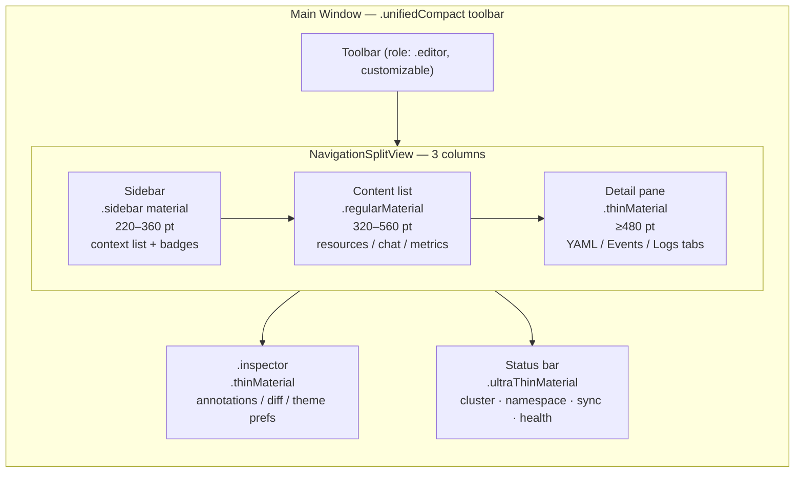
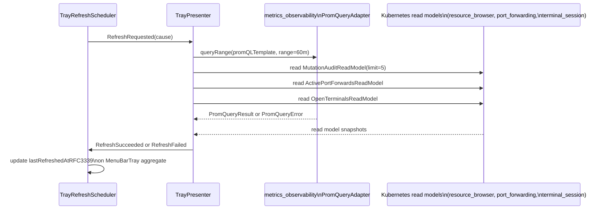
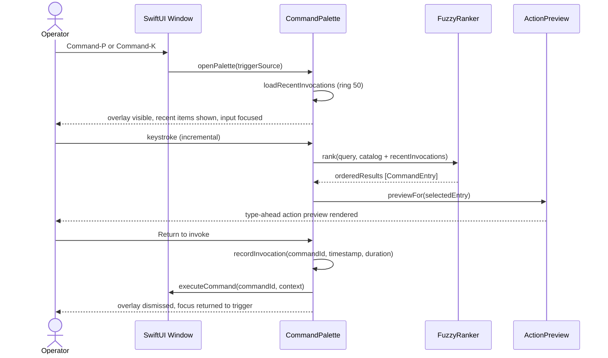

# Bounded Context — `app_shell`

## Purpose

Own the model of "how K8sManager presents itself to the operator on
macOS". This context coordinates window lifecycle, sidebar, menu
bar, settings, and the surfacing of read models from the other
bounded contexts. It contains no business invariants of its own and
declares no aggregates.

## Ubiquitous language

- **Main window** — the single primary window of the application.
  The MVP runs exactly one main window; multi-window navigation is
  out of scope.
- **Sidebar** — the left-hand panel listing pinned contexts at the
  top and the recents window beneath. Powered by
  `SidebarReadModel` from `context_navigation`.
- **Cluster health badge** — a status indicator rendered alongside
  each context in the sidebar. Powered by the
  `ClusterReadModel.lastHealth` field from `cluster_connectivity`.
- **Title bar** — the macOS-native window chrome. Displays the
  active context's display name from `ActiveContextReadModel`.
- **Settings surface** — the standard macOS Settings window
  (Command-comma). The MVP exposes only one setting: the
  KUBECONFIG override path. No telemetry or auto-update preferences
  in the MVP.

## Tactical roles

- No aggregates. The shell is a consumer.
- **`MainWindowCoordinator`** — DomainService (in this context
  loosely; it borders on infrastructure). Reacts to
  `ActiveContextChanged` and re-renders the title bar and main
  content area.
- **`SidebarPresenter`** — DomainService. Transforms
  `SidebarReadModel` into `SidebarViewState` for SwiftUI.
- **`SettingsCoordinator`** — DomainService. Surfaces the
  KUBECONFIG override and writes it back to the kubeconfig loader
  port hosted by `cluster_connectivity`.

## Dependencies

- Consumes `ActiveContextReadModel` and `SidebarReadModel` from
  `context_navigation`.
- Consumes `ClusterReadModel` and
  `KubeconfigLoadReportReadModel` from `cluster_connectivity`.
- Does not import `Yams`, `SwiftkubeClient`, or any I/O library.
  SwiftUI and AppKit are part of the macOS runtime, not
  infrastructure for the purposes of this layering.

## Read models exposed to other contexts

- None. The shell is a sink.

## Invariants

- The shell never reads kubeconfig files directly.
- The shell never invokes the Kubernetes API directly.
- The shell never holds credential material.

## Design system tokens

The app shell defines four categories of design token as CUE value
objects in `contexts/app_shell/schemas/`. They are resolved at launch
by the ThemePreferenceService and TypographyService and injected into
the SwiftUI `Environment`. No view computes color, spacing, or font
properties directly.

`#ColorTokens` (design_tokens.cue) carries:

- **Brand palette** — `brandPrimaryLight` (#326CE5), `brandPrimaryDark`
  (#5E8FF0), `brandNavy` (#0F3074), `brandSky` (#9DB8E9). The
  CNCF palette (#0086FF) is explicitly rejected per ADR-0021.
- **Semantic surface tokens** — `surfaceBackground`, `surfaceElevated`,
  `accentBrand`. Each token is a `#ColorPair` with independent light
  and dark hex values stored in the SwiftUI Color Asset Catalog.
- **Semantic text tokens** — `textPrimary`, `textSecondary`,
  `textTertiary`.
- **Status tokens** — `statusHealthy`, `statusWarning`, `statusError`,
  `statusTerminating`, `statusUnknown`. Each passes 3:1 contrast
  against `surfaceBackground` in both appearances (WCAG AA).
- **Kind accent tokens** — `kindAccentPod` (blue), `kindAccentDeploy`
  (indigo), `kindAccentService` (teal), `kindAccentStorage` (purple),
  `kindAccentConfig` (brown), `kindAccentRBAC` (pink).

`#MaterialTokens` (design_tokens.cue) maps structural surface roles
to SwiftUI `Material` values: sidebar = `.sidebar`, content = `.regular`,
inspector = `.thin`, popovers = `.ultraThin`, sheets = `.thick`. Material
assignments are fixed and not operator-configurable.

`#SpacingTokens` (design_tokens.cue) defines a 4-pt-base discrete scale
[4, 8, 12, 16, 24, 32] with semantic aliases (xsmall through xlarge). No
intermediate values are permitted.

`#RadiusTokens` (design_tokens.cue) defines a discrete corner-radius scale
[4, 8, 12] with semantic aliases small/medium/large.

## Window layout

The primary window uses `NavigationSplitView` with three explicit
columns. A `.inspector` panel is toggled independently. A status bar
is pinned at the bottom of the window below the split view.

Column widths and panel visibility are persisted as `#WindowLayout`
(window_layout.cue, DDD role AggregateRoot) in the `local_persistence`
bounded context and restored on every cold launch.

The toolbar uses `.windowToolbarStyle(.unifiedCompact)` with hidden
title bar. The toolbar role is `.editor`; the operator may customise
toolbar items via the standard macOS customization sheet.

Detail pane tabs follow a fixed convention: Summary, YAML, Events for
all resource kinds; Logs added for Pod and Node; Terminal added for
exec sessions.

Layering invariant: `AppShell` never reads kubeconfig files directly,
never invokes the Kubernetes API, and never holds credential material.

## Theme preference and configurability

The ThemePreferenceService resolves `#ThemePreference`
(theme_preference.cue) on launch and exposes the result through a
SwiftUI `EnvironmentKey`. All operator-configurable knobs are exposed
in Settings > Appearance.

Configurable knobs:

- `colorScheme` — system / light / dark (default: system).
- `accentSource` — kubernetes_brand / system_tint (default:
  kubernetes_brand). When `kubernetes_brand`, the accent resolves to
  #326CE5 (light) or #5E8FF0 (dark). When `system_tint`, the accent
  follows `NSColor.controlAccentColor`.
- `uiDensity` — compact / comfortable / spacious (default: comfortable).
  Controls vertical padding rhythm in list rows and form controls.
- `sidebarDensity` — compact (28 pt rows) / regular (36 pt rows)
  (default: regular). Independent of `uiDensity`.
- `reduceMotion` — bool (default: false). Mirrors
  `accessibilityReduceMotion`; operator may override independently.
  When true or when the system flag is set, all transitions use
  `withAnimation(nil) {}`.
- `liquidGlassEnabled` — bool. Default true on macOS 26+, false on
  macOS 14/15. Setting is hidden on macOS 14/15. When false on 26+,
  eligible surfaces fall back to standard material treatment.

All knobs are persisted in `local_persistence` under the key
`app_shell/theme_preference` with schema version `v1`
(`#ThemePreferenceV1`). Migrations are append-only.

## Typography

The TypographyService computes `#ResolvedTextStyle` records
(typography_preferences.cue, DDD role ReadModel) from the operator's
`#TypographyPreferences` and injects them into the SwiftUI environment.
No view calls `Font.system` with hardcoded point sizes.

Font family assignment:

- SF Pro Display — all text at 20 pt and above (displayLarge, display,
  headline roles).
- SF Pro Text — all text at 19 pt and below (body, subheadline,
  callout, footnote, caption roles).
- Monospace family — YAML editor, log viewer, terminal panel. Default
  SF Mono; operator may switch to JetBrains Mono, Berkeley Mono, or IBM
  Plex Mono via Font Book. An unrecognised family name silently falls
  back to SF Mono.

Operator-configurable typography knobs:

- `uiScale` — small (0.875×) / medium (1.0×) / large (1.125×). Applied
  as a multiplier on top of Dynamic Type scaling.
- `monoFontFamily` — PostScript family name string. Validated at launch.
- `monoBaseSizePoints` — integer 10–16 pt (default 12). The uiScale
  multiplier is applied on top of this base.
- `useSystemDynamicType` — bool (default true). When true, text styles
  scale with the system accessibility font size preference.

The Clarity City font family is permanently rejected per ADR-0021. It
is a CNCF marketing typeface not optimised for dense information-display
UI on macOS.

## Menu bar tray

The tray sub-domain owns the `NSStatusItem` installed in the macOS system
menu bar, the `NSPopover` that presents live cluster metrics to the operator,
and the refresh lifecycle that drives all widget data updates. It is
implemented inside `app_shell` because it coordinates across the same set of
read models as the main window and shares design tokens, theme preferences,
and the active context signal from `context_navigation`.

### Tactical roles

- **`#MenuBarTray`** (AggregateRoot) — persisted snapshot of operator
  preferences (display mode, refresh interval, background refresh flag,
  popover pin flag) and the transient lifecycle state of the popover.
  Restored from `local_persistence` on cold launch under the key
  `app_shell/menu_bar_tray`.

- **`#TrayMetricWidget`** (ValueObject) — sum type representing one widget
  in the popover: `#SparklineWidget`, `#StackedBarWidget`, `#CountWidget`,
  `#RecentMutationsWidget`, or `#ActiveSessionsWidget`. Authored in the CUE
  schema; not mutated at runtime. The `TrayLayout` value object orders the
  active widgets.

- **`#TrayRefreshEvent`** (ValueObject) — sum type representing all
  discrete events in the refresh state machine: `#RefreshRequested`,
  `#RefreshSucceeded`, `#RefreshFailed`, `#RefreshPaused`, `#RefreshResumed`.
  Emitted as Combine Subject payloads; never persisted to disk.

- **`TrayRefreshScheduler`** (DomainService) — owns the interval timer
  (Combine `Timer.publish(every:)`), observes system signals (lid,
  low-power mode, NWPathMonitor), and emits `#TrayRefreshEvent` values.
  Manages the `#MenuBarTray.popoverState` transitions and controls
  subscription lifetime in response to `popoverDidClose`.

- **`TrayPresenter`** (DomainService) — transforms `#TrayRefreshEvent`
  values into widget view models. Issues PromQL queries through the
  `PromQueryAdapter` port and reads from Kubernetes-backed read models.
  Marks individual widgets as degraded when their query fails.

### Dependencies

- Consumes `ClusterReadModel` and `ActiveContextReadModel` from
  `context_navigation` for the active cluster identity and health badge.
- Consumes `PromQueryAdapter` port from `metrics_observability` for all
  Prometheus query_range and instant queries that drive sparklines,
  stacked bars, and count widgets.
- Consumes `MutationAuditReadModel` from `resource_browser` for the
  recent mutations widget.
- Consumes `ActivePortForwardsReadModel` from `port_forwarding` for the
  port-forward session count chip.
- Consumes `OpenTerminalsReadModel` from `terminal_session` for the
  terminal session count chip.
- Consumes `MCPInvocationLogReadModel` from `cluster_intelligence` for
  the active AI diagnostic trace chip.

### Refresh flow

### Invariants

- The refresh scheduler never issues a Prometheus query on the main
  thread. All `URLSession` work happens on the `metrics_observability`
  background queue; results arrive via `AsyncStream` and are consumed
  with `await` in a detached Task bound to the widget's view model
  actor.
- No credential material (bearer tokens, kubeconfig paths, API server
  URLs with embedded secrets) appears in any `#TrayRefreshEvent` payload.
  The `reason` field of `#RefreshFailed` is stripped by the event
  producer before emission.
- The local rate limit is 1 outbound query per Prometheus endpoint per
  `refreshIntervalSeconds`. The `TrayPresenter` tracks in-flight query
  handles and drops duplicate requests that arrive within the same
  window.

### Settings keys

All tray preferences are persisted under `app_shell/menu_bar_tray` in
`local_persistence`:

- `displayMode` — "active_cluster" | "all_clusters_summary"
- `refreshIntervalSeconds` — 5 | 15 | 30 | 60
- `manualRefreshOnly` — bool
- `backgroundRefreshEnabled` — bool
- `popoverPinned` — bool

## Command palette and keyboard shortcuts

Introduced by ADR-0023. The command palette is the single discoverable
entry point for every command, resource jump, namespace switch, and
cluster switch in the application. It is activated by `⌘P` (primary)
or `⌘K` (alternate) from any screen state and provides fuzzy search
across the full command catalog, recent invocations (ring size 50),
resource names, namespace names, and cluster names simultaneously.

### Tactical roles

- **`#CommandPalette`** — AggregateRoot. Owns the lifecycle of the
  palette overlay, the recent-invocations ring, and the current query
  state. Persisted to `local_persistence` under
  `app_shell/command_palette/recent_invocations`. The ring stores only
  `commandId`, `invokedAt`, and `durationMillis` — no resource names,
  cluster names, or user-typed query strings.

- **`#CommandEntry`** — ValueObject. An immutable description of a
  single palette command: `commandId`, `title`, `subtitle`,
  `keyboardShortcut`, `scope`, `whenContext` predicate, and
  `requiresContext` flag. Declared statically in the CUE schema
  `command_palette.cue` and supplemented at runtime by entries
  registered from other bounded contexts.

- **`#ShortcutBinding`** — ValueObject. Maps a `keyChord` to a
  `commandId` within a `scope` (global, resource_browser, terminal).
  Carries a `whenContext` predicate string evaluated by
  `ShortcutScopeEvaluator` at key-press time against the current
  `ApplicationFocusSnapshot`.

- **`CommandResolverService`** — DomainService. Maintains the in-memory
  command catalog merged from the static `command_palette.cue` entries
  and runtime registrations from bounded contexts. Resolves a
  `commandId` to a callable handler. Detects conflicts at startup (fatal
  in debug, logged at error in release).

- **`ShortcutDispatchService`** — DomainService. Receives raw key events
  from the SwiftUI focus system, evaluates `#ShortcutBinding` entries
  against the current `ApplicationFocusSnapshot`, and dispatches
  matched commands to `CommandResolverService`. Single-key bindings
  (k9s-style: `l`, `s`, `d`, `e`, `u`) are evaluated only when the
  `ApplicationFocusSnapshot.focusedPanel` is `resourceBrowserListRow`.

### Command palette flow

## Progressive disclosure

The three-layer disclosure model applies to all resource views across
the application shell. Layer transitions are driven by explicit operator
gestures and are never triggered automatically.

- **Layer 1 — Overview KPIs** (always visible): aggregate health, pod
  ready counts, restart counts, age, and the five-color semantic status
  badge. Sidebar lazy-reveals resource kinds grouped by category; only
  the active group's kinds are expanded in the sidebar to avoid visual
  overload.

- **Layer 2 — Detail Panel** (on click or Return): events, conditions,
  owner references, and the RED method metrics panel (requests/errors
  left column, latency right column). Activated by clicking a list row
  or pressing Return when a row is selected.

- **Layer 3 — Config / YAML** (deliberate `⌘E` or `e` key): full YAML
  editor and advanced config controls. Only reachable from Layer 2 via
  an explicit gesture. The YAML editor is never opened automatically.

Sidebar lazy reveal: when the sidebar has more than twelve resource
kinds in the current namespace, kinds are grouped by category (Workloads,
Networking, Configuration, Storage, RBAC, CRDs). Only the active
category is expanded. Expanding a category is a one-click gesture.

Power-user mode: when enabled in Settings > General, Layers 1 and 2
are collapsed into a single dense list view that shows name, namespace,
status, age, and resource-specific quick-stats in one row. Power-user
mode does not affect Layer 3 (YAML editor) access.

Layering invariant: `AppShell` never reads kubeconfig files directly,
never invokes the Kubernetes API, and never holds credential material.
No layer transition may trigger an implicit mutation or a read of
credential material.

## Onboarding and accessibility

### First-launch tour

On cold start when no onboarding state is persisted, the application
presents a three-step welcome overlay: step 1 is a welcome message,
step 2 guides the operator through importing a kubeconfig file, and step
3 introduces the AI assistant with an example prompt. The tour can be
skipped at any step by pressing Escape. Onboarding state (complete or
skipped) is persisted to `local_persistence` under
`app_shell/onboarding_state`. The tour is resumable from Settings >
General via a "Restart onboarding tour" action.

Empty states carry action hints: when the cluster list is empty the
content area displays "Configure your first cluster" with an "Add
cluster" action button. When the LLM provider has no key configured and
the operator adds one, a "Try a prompt" CTA appears pointing to the
assistant chat panel.

The first time the operator initiates a mutating operation, a
one-time modal explains the mutation safety policy as specified in
ADR-0012. The operator must acknowledge before the mutation flow
proceeds. This modal is presented exactly once per installation.

### Keyboard-only navigation

The full application shell is navigable without a pointer device. Tab
and Shift-Tab traverse all interactive elements in DOM order. Arrow
keys navigate within list and sidebar rows. Return activates the focused
element. Escape closes overlays and returns to the previous state.
`⌘P` opens the command palette from any focused element. All palette
result rows, sidebar items, and resource list rows are keyboard-focusable
and activatable with Return.

### VoiceOver labels

Every widget in the shell declares an `accessibilityLabel`. Cluster
health badges announce cluster name and health status. Resource list
rows announce kind, name, namespace, and status. The command palette
overlay declares `accessibilityLabel("Command Palette")` and traps
focus within the overlay while open. Result rows announce title,
subtitle, and keyboard shortcut. The type-ahead preview region posts an
`accessibilityAnnouncement` on each result-set change.

### WCAG AA target

All text tokens defined in `design_tokens.cue` achieve a minimum 4.5:1
contrast ratio against their background surface token in both Light and
Dark appearances. Status tokens achieve at least 3:1 against the
`surfaceBackground` token in both appearances. When the operator enables
Increase Contrast (Increased Contrast mode), the brand accent token is
replaced with a higher-contrast variant. All interactive element borders
receive increased opacity in Increased Contrast mode.

### Reduce motion

When `NSWorkspace.shared.accessibilityDisplayShouldReduceMotion` is true,
or when the `reduceMotion` knob in the `#ThemePreference` schema is set
to true, all panel open/close transitions and disclosure-layer transitions
are immediate — no spring animation, no opacity crossfade, no transform.
The operator may set the `reduceMotion` knob independently of the system
flag; the system flag takes precedence when it is true.

## Out of scope

- Resource browsing, Helm, dashboards, telemetry, auto-update
  surfaces. These will arrive in later milestones and will each
  introduce their own bounded contexts or extend `app_shell`.
