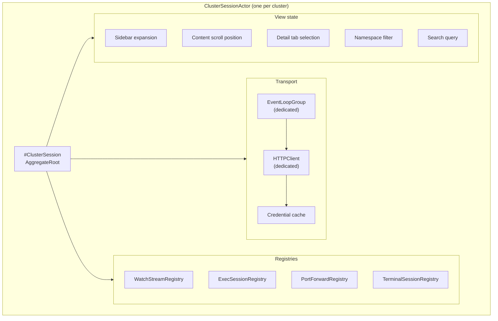

# Bounded Context — `cluster_connectivity`

## Purpose

Own the model of "what is a Kubernetes endpoint, and how do we know it is alive". This context is
the single source of truth for parsing kubeconfig files, materialising domain entities for each
cluster, and probing those clusters for reachability.

No other context reads kubeconfig files. No other context decides whether a cluster is reachable.

## Ubiquitous language

- **Kubeconfig** — the YAML file (or merged set of files) referenced by `KUBECONFIG` or
  `~/.kube/config`. The aggregate root of this context. Identified by a UUIDv7 generated at load
  time and keyed by the absolute, symlink-resolved source path.
- **Cluster** — a domain entity assembled from a kubeconfig `clusters[]` entry plus its resolved
  certificate authority. Identified by a `ClusterId` (shared kernel).
- **AuthInfo** — an immutable, in-memory value object representing the resolved credential for a
  single context. Never persisted, never logged. One of `client_cert`, `bearer_token`, or
  `exec_plugin`.
- **HealthStatus** — the result of one health probe. Immutable. One of `reachable`, `degraded`,
  `unreachable`, `unauthorized`, `forbidden`, or `unknown`.
- **Load report** — a structured summary returned by the kubeconfig loader. Contains
  `success | error` status, `deny` and `warn` entries from the validation policy, and the resolved
  source path(s).
- **Probe** — a single invocation of `ClusterHealthProbe` against a cluster. Produces exactly one
  `HealthStatus`.

## Tactical roles

- **`Kubeconfig`** — AggregateRoot. Holds the parsed clusters/users/contexts plus provenance
  (`sourcePath`, `sourceMTimeRFC3339`). Reload happens by replacing the whole aggregate; in-place
  mutation is forbidden.
- **`Cluster`** — Entity (lives inside the Kubeconfig aggregate).
- **`AuthInfo`** — ValueObject.
- **`HealthStatus`** — ValueObject.
- **`ClusterHealthProbe`** — DomainService. Pure function `(Cluster, AuthInfo) -> HealthStatus`.
  Depends on `KubernetesApiPort` (port in this context's domain core).
- **`KubeconfigLoaderPort`** — Port. Loads bytes from disk and returns either a parsed `Kubeconfig`
  or a `LoadError`. Default adapter uses Yams.
- **`KubernetesApiPort`** — Port. Probes the health endpoint of a given cluster using a given
  `AuthInfo`. Default adapter is SwiftkubeClient (ADR-0002). Exec-credential resolution is delegated
  to a dedicated `ExecPluginPort`.
- **`ExecPluginPort`** — Port. Invokes an exec credential plugin and parses its stdout JSON. Default
  adapter wraps `Foundation.Process`.

## Dependencies

- This context **does not depend on any other bounded context**.
- This context **depends on the shared kernel** for `ClusterId` and `KubeconfigPath` value objects.
- Adapters (infrastructure) implement the ports declared in this context's domain core. The domain
  core never imports `Yams`, `SwiftkubeClient`, `Foundation` networking APIs, or `Process`.

## Read models exposed to other contexts

- `ClusterReadModel` — a flat projection of `Cluster` + last known `HealthStatus`. Consumed by
  `context_navigation` and `app_shell`.
- `KubeconfigLoadReportReadModel` — a flat projection of the most recent load. Consumed by
  `app_shell` for the "kubeconfig health" badge.

## Invariants

- The aggregate is immutable after construction; reload replaces it.
- `HealthStatus.detail` MUST NOT contain credential material, full kubeconfig paths, or token
  fingerprints.
- An `AuthInfo` value is held in memory for at most the lifetime of one outgoing HTTP request. The
  context never persists, serialises, or transmits an `AuthInfo` to any other context.

## Per-cluster session isolation

ADR-0025 introduces a `#ClusterSession` AggregateRoot for each active cluster. Every cluster the
operator opens or pins materialises exactly one `ClusterSessionActor` (a Swift actor per ADR-0011)
that owns the aggregate. Nothing inside a session is accessible from outside that actor boundary.

### Tactical roles added by ADR-0025

- **`#ClusterSession`** — AggregateRoot. Holds all transport and runtime state that is specific to
  one cluster connection.
- **`ClusterSessionActor`** — DomainService (Swift actor). Sole owner and lifecycle manager of a
  `#ClusterSession`. Orchestrates all sub-tasks via `withThrowingTaskGroup`.
- **`#ClusterSessionEvent`** — ValueObject. The discriminated union of events (`#SessionOpened`,
  `#SessionDegraded`, `#SessionDisconnected`, `#SessionTerminated`, `#PoolStatsSnapshot`) published
  by a `ClusterSessionActor` to observers via `AsyncStream`.

### Components isolated per `#ClusterSession`

Switching the active cluster changes only the `activeClusterId` in `ContextNavigationState`; every
`ClusterSessionActor` continues running and its state is preserved intact.

## Idle pool reaping

The `connectionPool.idleTimeout` setting from ADR-0007 (45 seconds) applies within each
`#ClusterSession`'s dedicated `HTTPClient`. Idle HTTP/1.1 connections are reaped after 45 s of
disuse. The `EventLoopGroup` is not torn down on idle connection reaping; it remains alive for the
duration of the session.

An optional `idleTimeoutMinutes` field on `#ClusterSession` (default `0`, meaning disabled) triggers
a full `ClusterSessionActor` teardown after N consecutive minutes of session-level idleness. When
teardown occurs, the `EventLoopGroup` is stopped and all OS threads for that cluster are released.
Re-opening the cluster recreates the group from scratch.

The interaction between the two timers:

- `connectionPool.idleTimeout = 45s` — controls HTTP connection reaping within an active session.
  Always in effect.
- `idleTimeoutMinutes` — controls full session teardown. Off by default; configurable via
  `operator_preferences` in ADR-0026.

## Out of scope

- Resource listing, watch streams, exec, port-forward, log streaming. These will live in future
  contexts (`resource_browser`, etc.) and consume the `KubernetesApiPort` they need.
- Editing the kubeconfig on disk (ADR-0003).
- Service-account creation or any cluster-side write. The MVP is read-only against the cluster.
