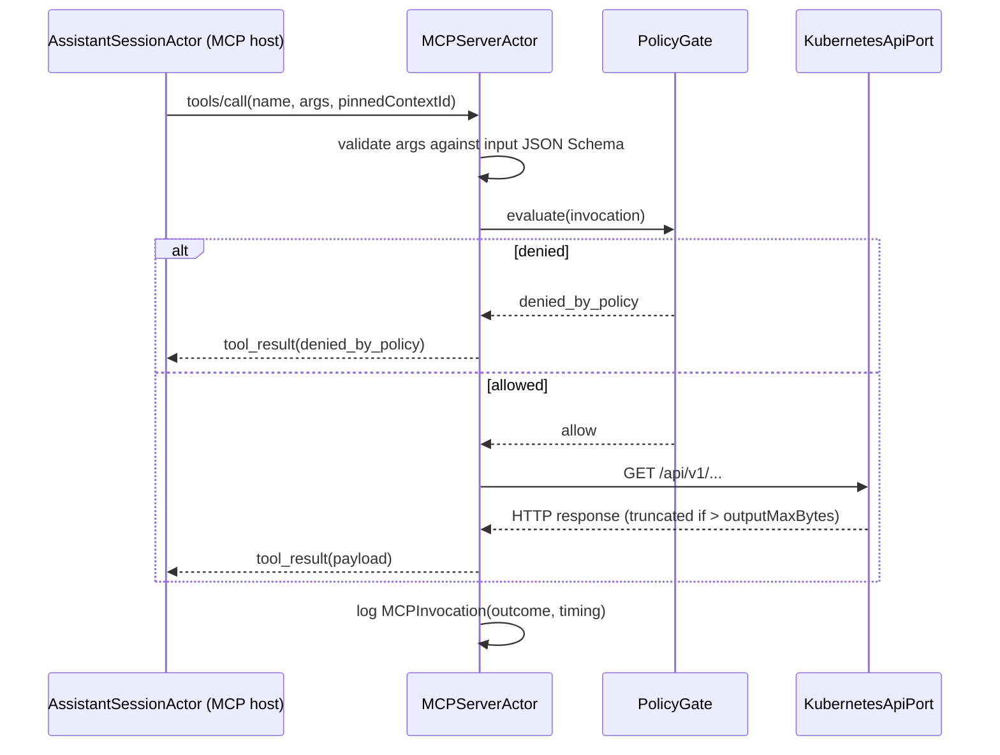

# Bounded Context — `cluster_intelligence`

## Purpose

Translate assistant intents into safe, read-only Kubernetes operations through a single auditable
surface — the in-process Model Context Protocol (MCP) server. This context owns the tool registry
the assistant may invoke, the policy that gates every invocation, and the wire log of every call.

## Ubiquitous language

- **MCP server** — the in-process implementation of a Model Context Protocol server. Speaks the MCP
  wire protocol over an in-process transport (`AsyncStream` pair). Owns the tool registry and the
  policy gate.
- **Tool registry** — the immutable catalogue of tools the server advertises to the host. Each entry
  carries name, description, input JSON Schema, allowed Kubernetes verbs, allowed resource kinds,
  and an output-size cap.
- **Policy gate** — the Rego policy that authorises (or denies) each invocation before it reaches
  the Kubernetes API.
- **Invocation** — one tool execution. Records inputs (validated), outcome (succeeded, denied,
  failed, cancelled), Kubernetes status code (when applicable), and timing.
- **Truncation marker** — a JSON suffix appended to outputs that exceed the tool's `outputMaxBytes`.
  Format — `{"_truncated":true,"_omittedBytes":<n>}`.
- **Pinned context** — the `ContextId` (shared kernel) the invocation runs against, inherited from
  the session unless the tool's arguments explicitly name another.

## Tactical roles

- **`MCPToolRegistry`** — AggregateRoot. Versioned; replaced wholesale on registry change.
- **`MCPTool`** — Entity inside the registry. Identified by `name`.
- **`MCPInvocation`** — ValueObject. One per executed call.
- **`MCPOutcome`** — ValueObject (sum type).
- **`MCPServerActor`** — DomainService. Owns the wire protocol loop, registry cache, policy cache,
  and per-invocation logging.
- **`PolicyGate`** — DomainService. Evaluates the Rego policy with the validated invocation and
  emits either an allow or a `denied_by_policy` outcome.
- **`KubernetesApiPort`** — Port (consumed). Shared with `cluster_connectivity`. The MCP server uses
  it to issue the actual API call when the policy gate allows.

## Tool registry (MVP+)

The first registry version (v1) catalogues seven tools:

- `kube_list_pods(namespace?, labelSelector?, fieldSelector?, limit?)`
- `kube_describe(kind, namespace, name)`
- `kube_get_yaml(kind, namespace, name)`
- `kube_events(namespace?, since?, limit?)`
- `kube_logs(namespace, podName, containerName?, tailLines?, sinceSeconds?, follow=false)`
- `kube_top_pods(namespace?)` (degrades when `metrics.k8s.io` is unavailable)
- `kube_cluster_info()`

Adding, removing, or modifying a tool requires an ADR and bumps the registry's `version`.

## Dependencies

- Consumes `KubernetesApiPort` and `ClusterReadModel` from `cluster_connectivity`.
- Consumes the shared kernel `ContextId` value object.
- Does not depend on `assistant_chat` or `llm_provider`; the MCP host (in `assistant_chat`) speaks
  to this context via the MCP protocol surface only.

## Read models exposed to other contexts

- `MCPRegistrySnapshotReadModel` — the current registry version and tool descriptors. Consumed by
  `assistant_chat` to advertise tools to the LLM.
- `MCPInvocationLogReadModel` — the recent N invocations with outcomes. Consumed by the diagnostics
  panel in `app_shell`.

## Invariants

- The `ClusterIntelligence` domain core never imports `swiftkube/client`, `async-http-client`,
  `URLSession`, `GRDB`, or the `modelcontextprotocol/swift-sdk` directly. The Kubernetes API, the
  MCP wire protocol, and the invocation log are reached through `KubernetesApiPort`, the in-process
  MCP transport port, and `MCPInvocationLogPort` respectively.
- The registry advertises only tools whose verbs are a subset of `{get, list, watch}`.
- Every invocation passes through the policy gate before any Kubernetes HTTP request is made.
- A denied invocation MUST NOT result in any HTTP traffic to the Kubernetes API.
- The MCP server's response body is capped at the tool's `outputMaxBytes`; oversize payloads are
  truncated with the defined marker rather than dropped silently.
- Cancellation propagates from the host through the server to the underlying HTTP request within 200
  ms.
- Invocation log entries MUST NOT include bearer tokens, client certificates, kubeconfig paths, or
  label values matching the substring `secret` (case-insensitive).

## Out of scope

- Tool execution against systems other than Kubernetes (Linear, GitHub, Grafana) — deferred to v1.x
  when external MCP servers are integrated.
- Mutating Kubernetes operations — explicitly out of scope per ADR-0009 and ADR-0003; a future ADR
  would be required.
- Long-running watch streams initiated by tools — not in the MVP+ registry; the operator-facing
  diagnostics panel uses watch streams directly via `cluster_connectivity`.
