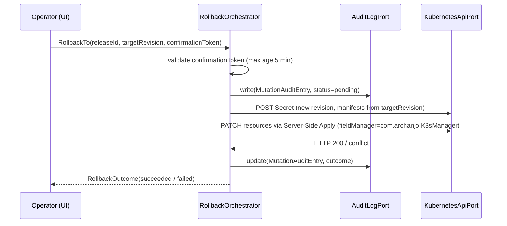

# Bounded Context — `helm_management`

## Purpose

Own the complete model of Helm release state as it exists in a connected
Kubernetes cluster. This context is the single source of truth for release
enumeration, revision history, chart metadata, rendered manifest inspection,
values inspection, hook introspection, and release rollback within K8sManager.

No other context decodes `helm.sh/release.v1` Secrets, constructs rollback
commands, or projects release history read models. The `resource_browser`
context may display the underlying Secrets as raw Kubernetes resources but
does not interpret their contents as Helm release data.

This context covers Phase 1 of ADR-0015 (read-only surface plus rollback).
Phases 2 capabilities (template rendering, install, upgrade, OCI chart pull,
HTTP repository management) are explicitly out of scope for this narrative.

## Ubiquitous language

- **Release** — a named, namespaced logical unit of Helm-managed Kubernetes
  resources. A release is identified by the tuple (kubernetesContextId,
  namespace, name). A release has one or more revisions over its lifetime.

- **Revision** — a specific point-in-time snapshot of a release, identified
  by its integer revision number (starting at 1). Each revision is stored as
  a separate Kubernetes Secret. The current revision is the one with the
  highest revision number and a non-superseded status.

- **Chart** — the Helm chart that was used to render a release revision. A
  chart is identified by its name and semantic version. The chart metadata
  embedded in the release Secret describes the chart at the time of the
  install or upgrade, not the chart as it currently exists in any repository.

- **Values** — the user-supplied configuration overrides that were passed to
  the chart at install or upgrade time. Values are stored as a JSON map in
  the release Secret under the "config" field.

- **Manifest** — the full rendered Kubernetes YAML string that Helm applied to
  the cluster for a given revision. The manifest is the concatenation of all
  rendered chart template outputs, separated by YAML document separators.
  The manifest represents the cluster state that Helm intended to apply; it
  may differ from the actual cluster state if resources were manually modified
  after the install or upgrade.

- **Hook** — a Kubernetes resource declared in the chart that Helm applies
  at specific lifecycle events (pre-install, post-install, pre-upgrade,
  post-upgrade, pre-delete, post-delete, pre-rollback, post-rollback, test).
  Hooks are carried in the release Secret alongside the main manifest.

- **History** — the ordered sequence of revisions for a release, from
  revision 1 to the current revision. The history view shows the deployment
  timestamp, chart version, status, and description of each revision.

- **Driver** — the Helm storage backend. The default driver is "secret",
  which stores release data in Kubernetes Secrets of type
  `helm.sh/release.v1`. Alternative drivers (configmap, sql, memory) are not
  supported by this context in Phase 1.

- **ReleaseDecoder** — the component responsible for reading a Kubernetes
  Secret, applying the release_decoder_invariants Rego policy, and
  materialising a #Release aggregate from the decoded JSON payload.

- **RollbackTo** — the mutating command that creates a new revision Secret
  containing the manifests from a target earlier revision, then applies those
  manifests to the cluster via Server-Side Apply. Governed by ADR-0012.

- **FieldManager** — the fixed identifier embedded in all Server-Side Apply
  requests issued by this context: `com.archanjo.K8sManager`. Enables
  field ownership traceability in the cluster.

## Tactical roles

- **`#Release`** — AggregateRoot. Represents a single Helm release revision
  as decoded from a `helm.sh/release.v1` Secret. Carries chart metadata,
  values, manifest YAML, hooks, lifecycle info, and source Secret name.
  Defined in `schemas/release.cue`.

- **`#ChartMetadata`** — ValueObject. Immutable description of the chart used
  to render a release revision. Nested within #Release. Defined in
  `schemas/chart_metadata.cue`.

- **`#ReleaseHistoryEntry`** — Entity. A single row in the revision history of
  a logical release. Projected from a set of #Release aggregates with the same
  (name, namespace) identity. Defined in `schemas/release_history_entry.cue`.

- **`#ReleaseInfo`** — ValueObject. Lifecycle timestamps and textual metadata
  for a release revision. Nested within #Release. Defined in
  `schemas/release_history_entry.cue`.

- **`#HookManifest`** — ValueObject. Describes a single hook declared by the
  chart. Nested within #Release as an element of the hooks list. Defined in
  `schemas/release_history_entry.cue`.

- **`ReleaseReaderActor`** — DomainService (Swift actor). Orchestrates the
  enumeration of `helm.sh/release.v1` Secrets via `KubernetesApiPort` from
  `cluster_connectivity`, delegates decoding to `ReleaseDecoderPort`, groups
  aggregates by (name, namespace) into logical releases, and emits
  `ReleaseListReadModel` and `ReleaseDetailReadModel` projections.

- **`ReleaseDecoderPort`** — Port (inbound on the domain side). Adapter
  responsibility: read the raw Secret data, base64-decode, gunzip (using
  Foundation Compression or SWCompression), JSON-decode into the Swift struct,
  evaluate the release_decoder_invariants Rego policy, and construct a #Release
  aggregate. Implemented by `HelmSecretDecoderAdapter` in the infrastructure
  layer.

- **`RollbackOrchestrator`** — DomainService. Receives an operator-confirmed
  `#RollbackTo` command (validated by ADR-0012 double-confirm and confirmation
  token), writes an audit entry via `AuditLogPort`, constructs the new revision
  Secret, applies the stored manifest resources via Server-Side Apply through
  `KubernetesApiPort`, and emits a rollback outcome event.

## Dependencies

- **Reads** `ClusterReadModel` from `cluster_connectivity` to obtain the
  active context's API server URL, authentication info reference, and cluster
  UID. Does not parse kubeconfig itself.

- **Consumes** `KubernetesApiPort` from `cluster_connectivity` for:
  listing Secrets with label selector `owner=helm`; reading individual revision
  Secrets; creating new revision Secrets for rollback; issuing Server-Side Apply
  PATCH requests for rollback manifest application.
- **Consumes** the `resource_browser` apply pipeline (SSA PATCH) for rollback
  manifest application, sharing the same field manager and conflict-resolution
  patterns defined in ADR-0012 and ADR-0013.
- **Persists** audit entries via `AuditLogPort` backed by `local_persistence`.
  The `cluster_mutation_audit` table schema is owned by `local_persistence`;
  the column mapping must match the existing mutation_audit_entry.cue schema
  from `resource_browser`, which is reused for rollback audit entries.
- **Does not depend on** `context_navigation`, `app_shell`, `llm_provider`,
  `assistant_chat`, or `cluster_intelligence`. These contexts may consume
  read models from `helm_management` but the dependency never flows the
  other way.

## Read models exposed to other contexts

- **`ReleaseListReadModel`** — a list of logical releases grouped by
  (name, namespace), showing the current revision, status, chart name,
  chart version, and last deployed timestamp. Consumed by `app_shell` for
  the Helm releases panel sidebar entry and by `cluster_intelligence` for
  answering questions about what is installed.

- **`ReleaseDetailReadModel`** — the full decoded detail of a single release:
  chart metadata, values JSON, manifest YAML, hooks, and the full revision
  history as a list of `#ReleaseHistoryEntry` values. Consumed by `app_shell`
  for the release detail panel tabs.

## Invariants

- The Helm storage driver must be "secret" for this context to function.
  The context detects the absence of `helm.sh/release.v1` Secrets and
  degrades gracefully with an informational banner rather than an error.

- Every `helm.sh/release.v1` Secret must pass the release_decoder_invariants
  Rego policy before being materialised into a #Release aggregate. A failing
  Secret is surfaced to the operator with a structured decode error and is
  never partially displayed.

- Rollback is a mutating operation governed by ADR-0012. The rollback command
  must carry a valid, non-expired confirmation token. An audit entry must be
  written before the API call is dispatched.

- The rendered manifest YAML stored in a #Release aggregate must not contain
  PEM-encoded certificate or private key blocks. The `embedded_credential_detected`
  Rego rule enforces this at decode time.

- The domain core (`ReleaseReaderActor`, `RollbackOrchestrator`, aggregate
  types) must never import infrastructure modules (SwiftkubeClient, async-http-client,
  Foundation.Compression). All infrastructure access is mediated through ports.

## Out of scope for Phase 1

- `helm install` — requires the template engine; Phase 2.
- `helm upgrade` — requires the template engine; Phase 2.
- `helm template` — requires the template engine; Phase 2.
- `helm lint` — requires the template engine and JSON Schema validation of
  values.schema.json; Phase 2.
- `helm repo add` and HTTP repository management — Phase 2.
- OCI chart pull via `apple/swift-container-plugin` — Phase 2.
- `helm dependency update` — requires chart pull infrastructure; Phase 2.
- Helm plugin management — out of scope entirely.
- Helm 2 Tiller-based release Secrets (a different Secret format) — not supported.
- Non-secret storage drivers (configmap, sql, memory) — graceful degradation only.
