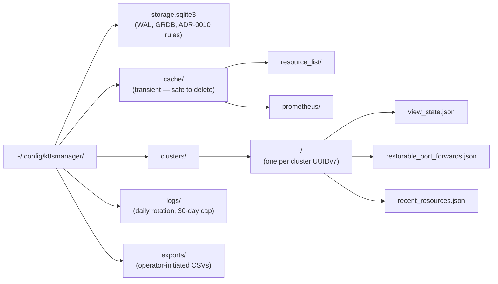

# Bounded Context — `local_persistence`

## Purpose

Own durable local state for K8sManager. Maintain a single SQLite database (WAL) for non-secret state
— chat history, provider configuration, cluster-analysis cache, MCP invocation log, and operator
preferences — and a separate macOS Keychain entry per LLM provider profile for API keys. Kubeconfig
and Kubernetes credentials are out of scope per ADR-0003.

## Ubiquitous language

- **Storage file** — the single SQLite file at
  `~/Library/Application Support/com.archanjo.K8sManager/storage.sqlite3`, opened in WAL journal
  mode with `synchronous=NORMAL` and foreign keys enforced.
- **Migration** — one numbered Swift function that runs inside a transaction and advances the
  `schema_migrations` table. Migrations are append-only.
- **Repository port** — a domain-side interface owned by another bounded context (chat, provider,
  intelligence). Each port is implemented by exactly one adapter that lives in this context's
  infrastructure layer.
- **Key alias** — the slug stored on a provider profile that identifies the matching Keychain entry.
  The alias is not a secret.
- **Redaction policy** — the Rego policy that backstops sanitisation by inspecting every persisted
  string for credential-shaped patterns before a write commits.
- **Vacuum task** — the weekly background task that prunes expired cluster-analysis cache rows and
  trashed sessions, then runs `PRAGMA optimize` and a `VACUUM INTO` snapshot.

## Tactical roles

- **`StorageFile`** — AggregateRoot. Singleton per installation; identified by absolute path.
- **`SchemaMigration`** — Entity. One row per applied migration.
- **`KeychainEntry`** — ValueObject. Describes the shape of items the application creates under
  `service="com.archanjo.K8sManager.llm"`.
- **`PersistenceActor`** — DomainService (Swift actor per ADR-0011). Sole writer.
- **`DatabaseReader`** — DomainService. Issues snapshot reads via GRDB's `DatabaseReader` interface;
  safe to call from any actor.
- **Ports implemented here** (consumed by other contexts):
  - `ProviderRepositoryPort` (consumed by `llm_provider`).
  - `ChatRepositoryPort` (consumed by `assistant_chat`).
  - `MCPInvocationLogPort` (consumed by `cluster_intelligence`).
  - `OperatorPreferencesPort` (consumed by `app_shell`).
  - `LLMKeyStorePort` (consumed by `llm_provider`).
  - `ClusterAnalysisCachePort` (consumed by `assistant_chat`).

## Storage layout

The full SQLite schema is captured in DBML at
`docs/arch/contexts/local_persistence/schemas/storage.dbml`. The tables are —

- `schema_migrations` — applied migrations.
- `provider_profiles` and `provider_capabilities` — LLM provider configuration and detected
  capabilities.
- `chat_sessions`, `chat_messages`, `tool_call_records` — assistant conversation log and tool-call
  audit trail.
- `mcp_invocations` — every MCP tool invocation with outcome.
- `cluster_analysis_cache` — assistant-generated cluster summaries keyed by
  `(kubernetes_context_id, analysis_kind)` with expiry.
- `operator_preferences` — small key/value store for app-level settings.

## Dependencies

- Depends on the shared kernel for `ContextId`, timestamps, and UUIDv7 generation.
- Depends on the macOS Security framework (Keychain) and on GRDB in its infrastructure layer.
- Consumes no other bounded context.

## Read models exposed to other contexts

- This context is a sink and provider of repository ports; it does not expose read models in the DDD
  sense. It exposes typed repositories to its consumers.

## Invariants

- The file at `storage.sqlite3` is opened in WAL mode (`PRAGMA journal_mode='wal'`) and with
  `PRAGMA foreign_keys=ON`.
- Migrations are append-only and run in numeric order inside a transaction; the `schema_migrations`
  row commits in the same transaction.
- Writes that contain strings matching the redaction policy are rejected and surfaced as
  developer-facing errors; the data does not land in the database.
- API key values appear only in Keychain entries under service `com.archanjo.K8sManager.llm`; no row
  in any SQLite table contains an API key value.
- "Delete local data" removes both the SQLite file and every Keychain entry under the application's
  service. Confirmation requires two affirmative actions.

## Filesystem layout (`~/.config/k8smanager/`)

ADR-0026 moves the storage root from `~/Library/Application Support/com.archanjo.K8sManager/` to the
XDG-style path `~/.config/k8smanager/`. All other rules from ADR-0010 (WAL mode, GRDB, Keychain for
secrets, redaction policy, append-only migrations) carry forward unchanged.

Key write rules:

- Per-cluster JSON files are written atomically (write-to-tmp then `rename(2)`) within a 5-second
  debounced window by `ClusterSessionActor` (ADR-0025).
- `storage.sqlite3` is written exclusively through `PersistenceActor`.
- `cache/` is wiped on app version bump; never store authoritative data here.
- Log lines must not contain credential material; the `RedactionPolicy` Rego rule and log-formatter
  regex scrub enforce this.

## State restoration on cold launch

On every cold launch `PersistenceActor` assembles a `#RestorationManifest` from `storage.sqlite3`
and the per-cluster JSON files. The bootstrap sequence then:

1. Opens the SQLite database and runs pending migrations.
2. Renders the initial shell with a loading state on `MainActor`.
3. Spawns `ClusterSessionActor` instances for pinned and recently used clusters in a parallel
   `TaskGroup`.
4. Restores dashboard custom layouts and chat session list.
5. Presents a `#RestorationPrompt` of kind `"reopen_terminals"` if any terminal sessions were open
   at last shutdown (operator opt-in).
6. Presents a `#RestorationPrompt` of kind `"reopen_port_forwards"` if any port-forward listeners
   were active at last shutdown (operator opt-in).

### First-run storage migration

On the first launch of a build that uses the new path, the bootstrap checks for a legacy database at
`~/Library/Application Support/com.archanjo.K8sManager/storage.sqlite3`. If found, a
`#RestorationPrompt` of kind `"migrate_storage_path"` is shown. Accepting moves the file to
`~/.config/k8smanager/storage.sqlite3` via `rename(2)` and leaves the legacy directory empty.
Declining creates a fresh database at the new path without touching the legacy file. Subsequent
launches skip this prompt regardless of choice.

## Out of scope

- Kubeconfig persistence. Kubeconfigs remain read-only on disk (ADR-0003); this context never copies
  them.
- Server-side or cloud-synced storage; the MVP+ store is device-local only.
- Telemetry, crash reporting, or analytics persistence — not in scope for MVP+.
