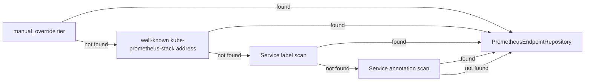

# metrics_observability — Domain Narrative

## Purpose

The `metrics_observability` bounded context is responsible for discovering Prometheus endpoints
associated with Kubernetes clusters, executing PromQL queries against those endpoints, and
providing time-series data to UI components (primarily the resource_browser context) for rendering
curated dashboards. It does not implement alerting, Alertmanager integration, or recording rule
authoring; those capabilities are explicitly out of scope.

The context exists because native Kubernetes metrics (Metrics Server) cover only instantaneous CPU
and memory for Pods and Nodes and do not support historical queries, rate calculations, or
composite health indicators. Prometheus, when deployed in-cluster, fills that gap via a REST HTTP
API that any authorized HTTP client can consume without a dedicated SDK.

## Ubiquitous Language

The following terms have precise meanings within this context. When these terms appear in code,
tests, or documentation they refer to the definitions below.

Endpoint — A `PrometheusEndpoint` aggregate: a URL plus metadata (discovery source, auth strategy,
health status, TLS configuration) identifying one reachable Prometheus instance scoped to one
Kubernetes context. An Endpoint is the unit of connectivity.

Discovery — The process by which `PrometheusDiscoveryService` determines the Endpoint URL for a
cluster. Discovery follows a four-tier pipeline: manual override, well-known kube-prometheus-stack
address, Service label scan, Service annotation scan. The result of Discovery is one or more
Endpoint candidates stored in `PrometheusEndpointRepository`.

PromQL — The Prometheus Query Language. Within this context, PromQL strings appear in two forms:
a CuratedQuery template (with placeholders) and a resolved expression (placeholders substituted,
ready to send to the API).

InstantVector — A PromQL query result with `resultType == "vector"`. Each element is a Sample: a
single (timestamp, value) pair plus the metric label set. InstantVector results answer "what is
the current value?" questions.

RangeMatrix — A PromQL query result with `resultType == "matrix"`. Each element is a Series: an
ordered sequence of (timestamp, value) Points plus the metric label set. RangeMatrix results
answer "how did this metric evolve over time?" questions and are the primary input to line charts.

CuratedQuery — A compile-time PromQL template shipped with the application. It has a slug
identifier, a display name, an expression template with curly-brace placeholders, a functional
category, and default range parameters. CuratedQueries are the pre-defined set of queries rendered
as dashboard panels.

Sample — One (timestamp, value) pair from an InstantVector result, associated with a metric label
set.

Series — One labeled time series from a RangeMatrix result, containing an ordered list of Points.

## Tactical Roles

The tactical patterns used in this context follow standard DDD conventions as applied across the
K8sManager architecture.

`PrometheusEndpoint` — AggregateRoot. Owns identity (UUIDv7), connectivity state, authentication
configuration, and health status. Persisted via `PrometheusEndpointRepository`. Mutable only
through domain operations (health probe updates, operator override). Never mutated directly from
UI code.

`PromQuery` — ValueObject. Immutable description of a single PromQL query: expression string,
instant or range flag, optional TimeRange, optional label selector. Created by
`PrometheusQueryActor` before each HTTP call.

`PromQueryResult` — ValueObject. Immutable discriminated result: one of InstantVectorResult,
RangeMatrixResult, ScalarResult, or StringResult. Returned by `PrometheusHTTPClient` and passed
to UI read models without further transformation except downsampling.

`CuratedQuery` — ValueObject. Immutable template entry from the compile-time catalog. Placeholders
are resolved at query time; the template itself is never mutated.

`PrometheusDiscoveryService` — DomainService. Implements the four-tier discovery pipeline.
Depends on `KubernetesApiPort` (to list Services) and `PrometheusEndpointRepositoryPort` (to
persist results). Stateless between invocations.

`PrometheusQueryActor` — DomainService (Swift actor). Manages the HTTP client instance, the 5s
in-memory result cache, and bearer token lifecycle. Executes PromQL queries and returns
`PromQueryResult` values. Responsible for downsampling series to 200 points before returning. All
calls are async/await; the actor boundary serialises cache access.

`PrometheusEndpointRepositoryPort` — Port (interface / Swift protocol). Abstracts persistence of
`PrometheusEndpoint` aggregates. Implemented in local_persistence (SQLite via GRDB). The domain
core declares the protocol; the infra layer provides the concrete implementation.

## Dependencies

This context depends on the following other contexts and ports:

`KubernetesApiPort` — consumed by `PrometheusDiscoveryService` to list Services via
`/api/v1/namespaces/{ns}/services` and to retrieve bearer tokens for `bearer_inherit` auth
strategy. Discovery cannot proceed without an active Kubernetes session.

`local_persistence` — provides the SQLite-backed implementation of
`PrometheusEndpointRepositoryPort` for storing discovered endpoints and operator overrides. Also
stores the operator's choice of active endpoint when multiple candidates exist.

`resource_browser` — consumes this context (outbound). The resource_browser supplies the
currently selected Pod or Node context (namespace, name) that is used to resolve CuratedQuery
placeholders. Charts are rendered inside resource_browser views; they call
`PrometheusQueryActor` directly.

`assistant_chat` — not consumed. Prometheus tools are not part of the MCP registry in the MVP+
release. The assistant does not have access to PromQL execution or metric data via tool calls in
this release cycle.

## Read Models

`PrometheusEndpointStatusReadModel` — a lightweight projection used by the settings UI and the
metrics panel header. Contains: endpointId, url, discoverySource, status, lastProbedAt, version.
Updated whenever a health probe completes. Never mutates the aggregate directly; reads are served
from the repository.

`CuratedQueryCatalogReadModel` — a static projection of the compile-time curated query set.
Provides the ordered list of `CuratedQuery` entries for the UI to render as selectable dashboard
panels. Since the catalog is compile-time, this read model has no repository dependency; it wraps
the static `CuratedQueryCatalog` value.

## Invariants

The following constraints are enforced by domain logic and must not be bypassed by infra or UI
code:

- A series with more than 200 data points must be downsampled to exactly 200 points using uniform
  index sampling before it is returned from `PrometheusQueryActor`. UI components must never
  receive raw series with more than 200 points.

- Bearer tokens (whether inherited from KubernetesSession or explicitly supplied) are never
  written to SQLite or to the macOS Keychain. They exist only in memory for the duration of the
  active session and are released when the session ends.

- Query timeout is 30 seconds per request. This is enforced at the URLSession level and cannot
  be overridden by UI code. Requests that time out produce a `PrometheusClientError.timeout` and
  mark the endpoint status as `unreachable`.

- The discovery pipeline always checks the `manual_override` tier first. A manually configured
  URL is never replaced by auto-discovery results without explicit operator action.

## Out of Scope

The following capabilities are not provided by this context in the current release:

- Alerting and alert rule authoring.
- Alertmanager integration (silences, receivers, routing trees).
- Recording rule creation or editing.
- Prometheus configuration management (scrape configs, remote write).
- Integration with the assistant_chat MCP server for PromQL execution.
- Long-term metric storage or federation.
