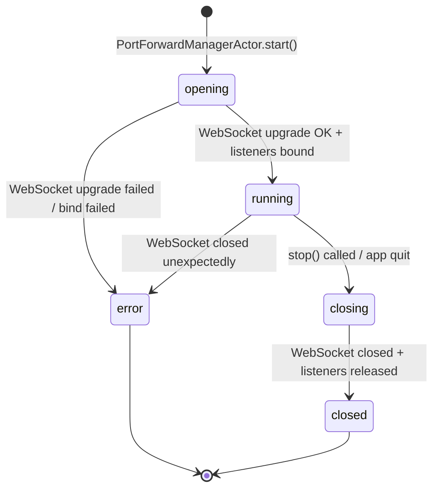

# Bounded Context — `port_forwarding`

## Purpose

Own the complete lifecycle of port-forward tunnel sessions within
K8sManager. A port-forward session is a bidirectional TCP tunnel that
connects a locally-bound socket on the operator's machine to a TCP port
inside a Kubernetes Pod, routed through the Kubernetes API server via the
`portforward.k8s.io` WebSocket subprotocol.

This context is the single source of truth for session lifecycle
(opening, running, closing, closed, error), local TCP listener
management, multi-port multiplexing within a single WebSocket connection,
and failure event propagation. No other context opens port-forward
WebSocket connections. No other context binds local TCP listeners for
Kubernetes traffic.

Port-forwarding is explicitly non-mutating: it does not alter any
Kubernetes resource. ADR-0012 confirmation requirements and audit entries
do not apply. The tunnel is purely an operator convenience for accessing
in-cluster services without modifying cluster topology.

## Ubiquitous language

- **Session** — a single continuous port-forward tunnel between the
  operator's local machine and a Kubernetes Pod. A session has an
  identity (UUIDv7), a target (Pod or Service), one or more
  PortMappings, and a lifecycle status. Owned by exactly one
  PortForwardManagerActor.

- **PortMapping** — a value pairing a `localPort` on the operator's
  machine with a `remotePort` inside the target Pod. Each PortMapping
  corresponds to one `portIndex` in the wire protocol and one local
  TCP server socket.

- **Listener** — the POSIX TCP server socket bound to `bindAddress:localPort`
  on the operator's machine. One Listener exists per PortMapping for the
  duration of the session. The Listener accepts incoming client
  connections from local tools (database clients, browsers, curl, etc.).

- **Tunnel** — the path data travels from a local TCP client, through
  the Listener, across the WebSocket connection to the Kubernetes API
  server, and into the target Pod's port. A Tunnel is active for each
  accepted TCP client connection; multiple Tunnels may be active
  simultaneously within a Session.

- **Frame** — a binary WebSocket message conforming to the
  `portforward.k8s.io` wire format. Each frame begins with a 2-byte
  header: byte 0 is the channel (0x00 = data, 0x01 = error), byte 1 is
  the portIndex (0-based, matching the order of `ports` query parameters
  in the upgrade URL). The payload follows immediately.

- **portIndex** — the 0-based ordinal position of a PortMapping within
  the session's `portMappings` list. portIndex is embedded in every
  Frame header to associate the frame with the correct PortMapping on
  both sides of the WebSocket connection.

- **bindAddress** — the local IP address the TCP Listener is bound to.
  Defaults to `127.0.0.1` (loopback-only). May be overridden to
  `0.0.0.0` (all interfaces) by the operator; the UI must display a
  network-exposure warning in this case.

## Tactical roles

### PortForwardSession — AggregateRoot

The root aggregate. Holds session identity (UUIDv7), the active
kubeconfig context reference, the target (PodTarget or ServiceTarget),
the ordered list of PortMappings, lifecycle status, and open/closed
timestamps. Written exclusively by the owning PortForwardManagerActor.
Immutable to all other components. Persisted to SQLite via
PortForwardRepositoryPort for UI restore after relaunch (restored
sessions always surface as `closed`; the context never auto-reopens a
previous session).

### PortForwardEvent — ValueObject

Discriminated union of seven domain events emitted during a session
lifecycle: `#SessionOpened`, `#SessionFailed`, `#ListenerBound`,
`#ListenerClosed`, `#ConnectionAccepted`, `#BytesTransferred`,
`#SessionClosed`. Each variant is immutable and carries a `sessionId`
back-reference. Events are published via AsyncStream to the UI and feed
the `ActivePortForwardsReadModel` projection.

### PortForwardManagerActor — DomainService

A Swift actor (per ADR-0011) that owns the `URLSessionWebSocketTask` for
one session and all associated local TCP server sockets. Responsibilities:

- Drives the session lifecycle state machine (opening → running →
  closing → closed, with error transitions).

- Initiates the WebSocket upgrade request to the Kubernetes portforward
  subresource.
- Binds and manages the local TCP server socket(s) per PortMapping.
- Runs the accept(2) loop as a structured Task for each Listener.
- Spawns a scoped per-connection Task for each accepted TCP client that
  pumps data between the local socket and the WebSocket via frame
  encoding/decoding.
- Emits domain events via AsyncStream.
- Implements cooperative cancellation; closes WebSocket and listeners
  within 200 ms of stop().
- On app quit, participates in the 500 ms global shutdown deadline.

One actor instance per session. Actors are not pooled or reused across
sessions.

### KubernetesPortForwardPort — Port

Secondary port (driven by the application, implemented by an infra
adapter). Opens a WebSocket connection to the Kubernetes portforward
subresource for a given Pod, namespace, and port list. Negotiates the
`portforward.k8s.io` subprotocol. Returns a `URLSessionWebSocketTask`
to the caller. Handles mTLS credential injection from the cluster
credential chain supplied by `cluster_connectivity`.

### ServiceEndpointReaderPort — Port

Secondary port. Resolves a Kubernetes Service name to a single backing
Pod name by querying the Service endpoint slice. Called by
PortForwardManagerActor during session open when the target is a
`#ServiceTarget`. Returns the resolved Pod name and namespace. Implemented
by an infra adapter against the Kubernetes API; consumed from the
`cluster_connectivity` context via `KubernetesApiPort`.

### LocalTCPListenerPort — Port

Secondary port. Abstracts the POSIX socket operations (socket(2),
setsockopt(2), bind(2), listen(2), accept(2), close(2), getsockname(2))
used to create and manage local TCP server sockets. Implemented by an
infra adapter using Network.framework or raw POSIX. Isolates the domain
actor from the platform socket API.

### PortForwardRepositoryPort — Port

Secondary port. Persists active `PortForwardSession` aggregates to SQLite
via `local_persistence` for UI restore after application relaunch. On
restart, all previously stored sessions are surfaced with status `closed`;
no re-activation attempt is made. Byte payloads from the tunnel are never
persisted.

## Read models exposed

### ActivePortForwardsReadModel

A live projection of all `PortForwardSession` aggregates with status
`opening` or `running`, ordered by `createdAtRFC3339` descending.
Consumed by `app_shell` to render the active port-forwards list in the
status bar or side panel. Fields projected: session id, target display
name (Pod or Service name), list of PortMappings (localPort,
remotePort, effectiveLocalPort), status, bytesIn, bytesOut, createdAt.
No frame payload data is included.

## Dependencies

- Consumes `KubernetesApiPort` from `cluster_connectivity` — reads the
  active context's server URL and credential chain for WebSocket upgrade.
- Consumes `ServiceEndpointReaderPort` (infra adapter over
  `KubernetesApiPort`) to resolve Service targets to Pod names.
- Persists session aggregates to SQLite via `local_persistence` through
  `PortForwardRepositoryPort`.
- Exposes `ActivePortForwardsReadModel` to `app_shell` for UI rendering.
- Does NOT consume `cluster_intelligence` or expose MCP tools. Tunnel
  traffic is operator-facing only and must never be routed to the
  assistant or persisted as LLM context.
- Does NOT interact with `resource_browser`; port-forward is not a
  mutating operation and requires no ADR-0012 confirmation or audit entry.

## Invariants

- Exactly one `URLSessionWebSocketTask` exists per session at any time.
- Each PortMapping corresponds to exactly one local TCP server socket
  for the duration of the session.
- bindAddress defaults to `127.0.0.1`. Sessions with
  `bindAddress == "0.0.0.0"` require the UI to surface a network-exposure
  warning before the listener is bound.
- Cooperative cancellation must close all listeners and the WebSocket
  connection within 200 ms of stop().
- No byte of tunnelled payload is persisted to disk or emitted in events.
  `#BytesTransferred` carries aggregate counts only.
- Sessions reaching `closed` or `error` cannot be reactivated. A new
  session aggregate with a fresh UUIDv7 must be created.
- After application relaunch, all previously stored sessions surface as
  `closed` in the UI without attempting WebSocket reconnection.
- `#SessionFailed.detail` must never contain credential material
  (bearer tokens, client certificates, kubeconfig secrets).

## Out of scope

- UDP forwarding — Kubernetes port-forward is TCP-only at the wire
  protocol level; UDP is not supported by the `portforward.k8s.io`
  subprotocol.
- Automatic session reconnect after WebSocket closure — explicitly
  rejected; the operator must manually re-open a session.
- Persistent tunnels that survive application restarts — sessions are
  always surfaced as `closed` after relaunch.
- SPDY-based port-forward — the legacy SPDY path is unsupported by
  Foundation and deprecated in Kubernetes 1.31+.
- Port-forward to Services without a running backing Pod — the
  ServiceEndpointReaderPort must find at least one Ready Pod or the
  session fails with an appropriate error code.
