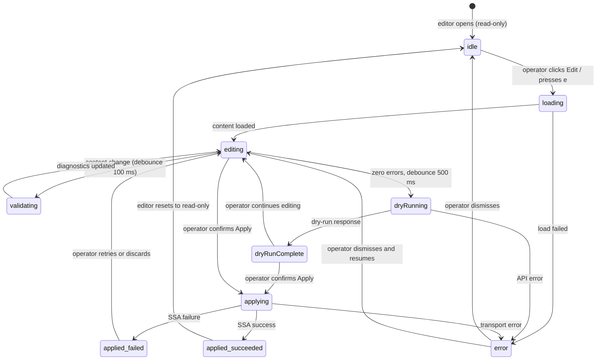

# Bounded Context — `resource_browser`

## Purpose

Own the complete model of "what Kubernetes resources are present in a
cluster, and how does an operator inspect and mutate them". This
context is the single source of truth for resource enumeration,
kind-catalogue management, YAML editing, mutation command construction,
mutation guard evaluation, and audit log persistence within K8sManager.

No other context lists or watches Kubernetes resources. No other context
constructs or dispatches mutation commands. No other context evaluates
the mutation guard policy. The `cluster_intelligence` assistant context
reads from this context's read models but MUST NOT hold a reference to
any port that can issue mutations.

## Ubiquitous language

- **Kind** — a Kubernetes resource type identified by its group,
  version, and kind name (GVK). The `resource_browser` context
  maintains a static catalogue of supported kinds supplemented by
  dynamically discovered CRD kinds.
- **Resource** — a single instance of a kind. Identified by the tuple
  (contextId, namespace, name, uid). Resources are always fetched live
  from the cluster; the context holds no durable cache of resource state
  beyond the current watch stream.
- **Watch** — a long-lived server-sent-events stream opened on a kind
  (optionally filtered by namespace). Watch events carry incremental
  deltas (ADDED, MODIFIED, DELETED) that the context applies to the
  in-memory read model for the current list view.
- **ResourceDescriptor** — an immutable value object that describes a
  kind: its GVK, plural name, namespaced flag, supported verbs, and
  supported subresources. The static catalogue is a map from GVK to
  #ResourceDescriptor. Dynamic CRDs are projected into #ResourceDescriptor
  values and merged into the catalogue at runtime.
- **ApplyOperation** — the act of submitting a full resource manifest
  to the Kubernetes API via server-side apply. Every ApplyOperation
  carries a field manager identifier (`com.archanjo.K8sManager`), a
  manifest YAML string, and a manifest digest.
- **MutationCommand** — an immutable value object representing the
  operator's intent to change cluster state. The sum type covers
  ApplyYAML, ScaleReplicas, RolloutRestart, DeleteResource, LabelPatch,
  and AnnotationPatch. Commands are constructed in the UI confirmation
  flow and evaluated by the MutationGuardPort before dispatch.
- **Confirmation** — the operator gesture that authorises a mutation.
  All mutations require at least a single-confirm modal. Delete
  operations require a double-confirm with exact name entry. The
  confirmation modal generates a #ConfirmationToken (UUIDv7) at display
  time. The token is embedded in the MutationCommand and verified by
  the mutation guard for freshness (maximum age 5 minutes).
- **AuditEntry** — an immutable record of a mutation attempt written
  to the `cluster_mutation_audit` SQLite table before the API call is
  dispatched. Carries the command, outcome, confirmation token,
  Kubernetes status code, and manifest digest. Never contains
  credential material.
- **FieldManager** — the identifier sent in every server-side apply
  request. Fixed value `com.archanjo.K8sManager`. Enables traceability
  of field ownership in the cluster.
- **ConflictResolution** — the strategy used when the API server
  returns HTTP 409 due to field ownership conflicts. Default strategy
  is to surface the conflict to the operator and block the apply.
  Force-ownership is an opt-in that re-issues the request with
  `force=true`. The opt-in requires an explicit operator gesture in the
  diff preview modal.
- **DiffPreview** — the structured three-way diff between the live
  server manifest and the proposed manifest, shown in the confirmation
  modal before every apply. Lines present only in the live manifest
  are shown as removals; lines present only in the proposed manifest
  are shown as additions; unchanged lines are collapsed.
- **KindCatalogue** — the in-memory registry of #ResourceDescriptor
  values. Static entries are loaded at application start from the list
  defined in ADR-0013. Dynamic entries are added (and removed) as
  CRDs are discovered or deleted on the connected cluster.

## Tactical roles

- **`ResourceBrowserService`** — DomainService. Orchestrates list,
  get, and watch operations against KubernetesApiPort. Holds the
  in-memory KindCatalogue. Emits #ResourceListItem and #ResourceDetail
  projections to the UI layer.
- **`MutationCommandFactory`** — DomainService. Constructs
  MutationCommand variants from UI input. Embeds the confirmation
  token and computes the manifest digest before handing the command
  to the guard.
- **`MutationDispatchService`** — DomainService. Receives an approved
  command from the guard, persists the audit entry, and invokes
  KubernetesApiPort. Handles retry-on-conflict (force-ownership flow)
  and maps API error responses to domain error types.
- **`KubernetesResourceRepositoryPort`** — Port (inbound). Adapter
  responsibility: translate Swift domain types to HTTP requests via
  `swiftkube/client 0.26` (static kinds) and `async-http-client`
  (dynamic CRDs and server-side apply PATCH).
- **`MutationGuardPort`** — Port (inbound). Adapter responsibility:
  evaluate a MutationCommand against the `mutation_guard.rego` policy
  and return either `allowed` or a set of denial reasons. Implemented
  by an in-process OPA evaluator.
- **`AuditLogPort`** — Port (outbound). Adapter responsibility: write
  a #MutationAuditEntry to the `cluster_mutation_audit` table via
  `PersistenceActor` (ADR-0011). Implemented by the
  `local_persistence` context adapter.
- **`WatchStreamCoordinator`** — DomainService (actor). Manages the
  lifecycle of watch streams opened against the cluster. Maintains a
  map of (GVK, namespace?) to active `AsyncThrowingStream`. Cancels
  streams when the operator switches kind or namespace. Reconnects on
  stream error with exponential back-off.

## Dependencies

- **Reads** `ClusterReadModel` from `cluster_connectivity` to obtain
  the active context's API server URL, auth info reference, and
  cluster UID. Does NOT parse kubeconfig itself.
- **Consumes** `KubernetesApiPort` from `cluster_connectivity` for
  outbound HTTP calls. The port is injected at startup; the domain
  core never imports SwiftkubeClient or async-http-client directly.
- **Persists** via `AuditLogPort` backed by `local_persistence`. The
  `cluster_mutation_audit` table schema is owned by
  `local_persistence`; the column mapping must match the CUE schema
  in `contexts/resource_browser/schemas/mutation_audit_entry.cue`.
- **Does not depend on** `context_navigation`, `app_shell`,
  `llm_provider`, `assistant_chat`, or `cluster_intelligence`. These
  contexts may consume read models from `resource_browser` but the
  dependency never flows the other way.

## Read models exposed to other contexts

- **`ResourceListReadModel`** — a paginated list of #ResourceListItem
  values for the current (kind, namespace) selection. Consumed by the
  `app_shell` search and by `cluster_intelligence` for assistant
  context about running workloads.
- **`ResourceDetailReadModel`** — a single #ResourceDetail value for
  the currently open resource. Consumed by `cluster_intelligence` for
  answering questions about a specific resource.
- **`AuditLogReadModel`** — a paginated, reverse-chronological view
  of #MutationAuditEntry rows. Consumed by `app_shell` for the audit
  history panel.

## Resource iconography

All Kubernetes resource-kind icons shown in the resource browser (sidebar
rows, content-list leading area, detail pane header) are resolved from
the `#IconCatalog` ValueObject defined in
`contexts/app_shell/schemas/icon_catalog.cue` (ADR-0028). The
`resource_browser` context does not define symbols independently; it
consumes the catalog via the `IconResolver` DomainService in `app_shell`.

The kind-to-symbol mapping for all kinds supported by this context
(ADR-0013) is:

| Kind | Symbol name | Custom |
|:---|:---|:---:|
| Pod | `k8s.pod` | Yes |
| Deployment | `k8s.deployment` | Yes |
| StatefulSet | `k8s.statefulset` | Yes |
| DaemonSet | `k8s.daemonset` | Yes |
| ReplicaSet | `square.3.layers.3d` | No |
| Job | `clock` | No |
| CronJob | `clock.arrow.circlepath` | No |
| Service | `antenna.radiowaves.left.and.right` | No |
| Ingress | `arrow.left.and.right.righttriangle.left.righttriangle.right` | No |
| ConfigMap | `doc.text` | No |
| Secret | `lock.doc` | No |
| PersistentVolumeClaim | `externaldrive` | No |
| PersistentVolume | `externaldrive.connected.to.line.below` | No |
| StorageClass | `externaldrive.badge.checkmark` | No |
| NetworkPolicy | `shield` | No |
| Role | `person.badge.key` | No |
| ClusterRole | `person.badge.key` | No |
| RoleBinding | `person.2.badge.key` | No |
| ClusterRoleBinding | `person.2.badge.key` | No |
| ServiceAccount | `person.crop.circle.badge.checkmark` | No |
| CustomResourceDefinition | `rectangle.dashed` | No |
| Node | `server.rack` | No |
| Helm release | `shippingbox` | No |

Custom symbols (`k8s.*`) are embedded in the app bundle and are available
offline. All entries use `renderingMode: hierarchical` with the appropriate
`kindAccent*` token from `#ColorTokens`. Every call site in the resource
browser views uses the `IconView` wrapper, which applies the
`.accessibilityLabel` from the catalog entry — no view declares an ad-hoc
accessibility label for a kind symbol.

## Invariants

- The kind allowlist encoded in ADR-0013 and evaluated by the
  `mutation_guard.rego` policy is the authoritative source of which
  GVKs may be mutated. A mutation command whose `targetGVK.kind` is
  not in the allowlist is denied without an API call.
- Server-side apply is the default and only apply strategy. The
  application never sets `kubectl.kubernetes.io/last-applied-configuration`.
  Client-side apply is forbidden.
- Every mutation command must carry a non-empty confirmation token.
  The token must be at most 5 minutes old at evaluation time.
- Delete commands must carry `doubleConfirmed=true`. This field may
  only be set by the UI layer after the operator has typed the exact
  resource name into the confirmation text field.
- The `cluster_intelligence` assistant context does not hold a
  reference to `MutationGuardPort`, `MutationDispatchService`, or any
  port that can issue Kubernetes write operations. This invariant is
  enforced architecturally (the assistant context's dependency graph
  does not include these types) and is confirmed by a code search in CI.
- Audit entries are append-only. No code path in the application
  issues `UPDATE` or `DELETE` on `cluster_mutation_audit`.
- Credential material (tokens, certificates, Secret data values) MUST
  NOT appear in any audit entry field. The `MutationCommandFactory`
  redacts Secret data values before serialising the command.

### Contextual keyboard shortcuts

The `resource_browser` context registers `#ShortcutBinding` entries in
the `app_shell` `ShortcutDispatchService` with `whenContext` predicates
that restrict activation to the resource browser list row focus domain.
Single-key bindings are never active inside a text input field, the
inline search bar, or an embedded terminal pane.

Bindings registered by kind:

- **Pod** — `l` opens the log stream panel via `terminal_session`;
  `s` opens an exec shell (container selection prompt when multi-container)
  via `terminal_session`; `d` opens the describe view at Layer 2 (read-only,
  no mutation command constructed).
- **Deployment** — `s` opens the scale dialog sheet; confirming constructs
  a `#ScaleReplicas` mutation command evaluated by `MutationGuardPort` and
  subject to the single-confirm modal required by ADR-0012. `s` also applies
  to `StatefulSet` and `ReplicaSet` via the same shortcut binding with
  `resource.kind in [Deployment, StatefulSet, ReplicaSet]` predicate.
  Rollout restart is available via the command palette (`restart` query)
  and via the detail pane action button; no single-key shortcut is assigned
  for restart to avoid accidental invocation.
- **ConfigMap** — `e` opens the YAML editor at Layer 3 with the live
  server manifest; saving constructs an `#ApplyYAML` mutation command
  subject to the ADR-0012 diff preview and confirmation policy.
- **Secret** — `e` opens the YAML editor at Layer 3; the editor renders
  data values base64-decoded for readability and re-encodes on save. A
  persistent warning banner is shown within the editor: "Secret data is
  visible — ensure no screen-sharing is active." Saving constructs an
  `#ApplyYAML` mutation command with Secret data values redacted from the
  `#MutationAuditEntry` per ADR-0012 audit field redaction rules.
- **Service** — `u` opens the used-by panel showing backing Endpoints,
  EndpointSlices, and the owning workload resolved via owner references
  (read-only; no mutation command).
- **CRD instance** — `e` opens the YAML editor at Layer 3 with inline
  schema validation against the CRD OpenAPI schema registered in the
  `KindCatalogue`; schema violations are surfaced as inline annotations
  before the operator can save; saving constructs an `#ApplyYAML` mutation
  command subject to ADR-0012 confirmation policy.

All mutating shortcut actions (`s` for scale, `e` for edit/apply) route
through `MutationCommandFactory` → `MutationGuardPort` → single-confirm
modal (or double-confirm for delete via `⌘⌫`) → `MutationDispatchService`
as specified in ADR-0012. The mutation guard evaluates the
`mutation_guard.rego` policy including the kind allowlist, confirmation
freshness (token age ≤ 5 minutes), and double-confirm requirement for
delete operations.

The `?` key in the resource browser opens a hotkey help overlay listing
all active bindings for the currently selected resource kind. The overlay
is navigable via VoiceOver.

## Integrated editor (MD / YAML / JSON)

The `resource_browser` context owns the integrated multi-format editor
introduced in ADR-0030. The editor is the Layer 3 editing surface for all
Kubernetes resource manifests opened from the resource browser. It supports
three formats: YAML (with real-time Kubernetes schema validation and dry-run
server-side apply), JSON (with JSON Schema validation when a schema is
resolvable), and Markdown (with side-by-side rendered preview).

### New tactical roles

- **`EditorOrchestratorService`** — DomainService. Coordinates the full
  editing lifecycle: opens the `#EditorSession`, drives state transitions,
  routes the operator's Apply intent through `MutationCommandFactory` →
  `MutationGuardPort` → `MutationDispatchService`. Holds the single active
  `#EditorSession` for the current editor pane.
- **`RealtimeValidatorService`** — DomainService (background actor). Receives
  content-change events, debounces 100 ms, parses YAML/JSON via `Yams` /
  `JSONSerialization`, validates against `K8sSchemaValidator`, and emits an
  updated `[#Diagnostic]` array.
- **`DryRunApplyService`** — DomainService. Debounces 500 ms, sends a
  `PATCH dryRun=All` to the Kubernetes API via `KubernetesApiPort`, parses the
  response into a `diffPreview` string and `[#FieldConflict]` array, then
  transitions `#EditorState`.
- **`DraftAutoSaver`** — DomainService. Observes `isDirty` on the active
  `#EditorSession`. While `isDirty == true`, persists a `#Draft` entity to the
  `editor_drafts` SQLite table every 5 seconds via `AuditLogPort`-equivalent
  draft port backed by `local_persistence`.
- **`K8sSchemaValidator`** — DomainService. Loads OpenAPI v3 schemas from
  `/openapi/v3` on the active cluster, caches them per GVK for the session
  lifetime, and exposes a validate(document, gvk) → `[#Diagnostic]` interface
  backed by `mattt/JSONSchema`.

### New value objects and entities

| Type | DDD role | Description |
|:---|:---|:---|
| `#EditorSession` | AggregateRoot | One per editor invocation. Holds format, content buffers, `#EditorState`, and `#ResourceRef`. |
| `#EditorState` | Value Object (sum) | Nine-state discriminated union driving SwiftUI `@Observable` reactive bindings. |
| `#Diagnostic` | Value Object | Single validation finding: severity, line, column, message, source. |
| `#FieldConflict` | Value Object | SSA field ownership conflict: fieldPath, currentManager, attemptingManager. |
| `#Draft` | Entity | Persisted snapshot of a dirty `#EditorSession` for crash recovery and cross-session draft resumption. |

### EditorState transitions

## Out of scope

- `exec` into a container (deferred; requires pty-level UX and
  additional security review).
- Port-forward tunnels (deferred to a future milestone).
- Bulk select and bulk delete operations (deferred).
- Helm install, upgrade, and rollback (deferred to the
  `helm_management` bounded context, future ADR).
- Custom column configuration and advanced field-selector queries
  (deferred).
- LLM-initiated mutations via the `cluster_intelligence` assistant
  (deferred to a future ADR covering prompt-injection resistance and
  rollback strategies).
- Kubeconfig editing (explicitly out of scope per ADR-0003; not
  affected by ADR-0012).
