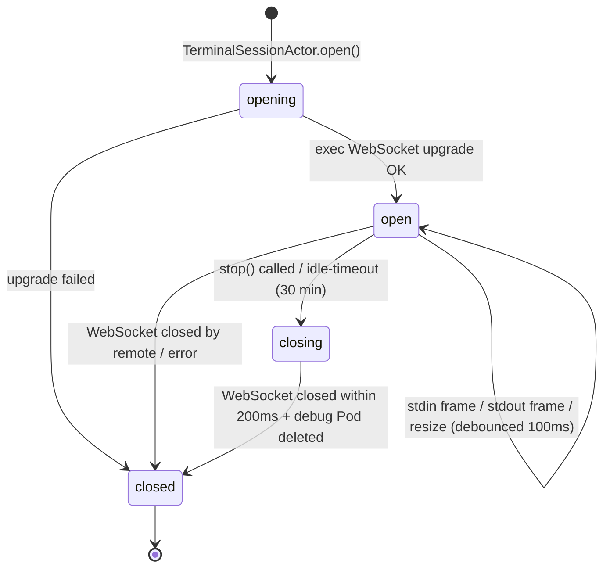

# Bounded Context — `terminal_session`

## Purpose

Own the complete lifecycle of interactive terminal sessions within
K8sManager. A terminal session is a bidirectional byte stream between
the operator's UI and a remote process running inside a Kubernetes
workload — either a container inside a Pod (`pod_exec`) or a privileged
debug container on a Node's host namespace (`node_debug`).

This context is the single source of truth for session lifecycle (open,
resize, close, idle-timeout), channel-level frame routing, and the
creation and cleanup of ephemeral debug Pods. No other context opens exec
WebSocket connections. No other context creates debug Pods for node-level
access.

The terminal session context is a pure consumer of the Kubernetes API. It
reads cluster topology from `cluster_connectivity` (active context,
credentials) and issues exec and Pod-management calls via ports. It does
not expose any MCP tool to the `cluster_intelligence` LLM context:
terminal output is operator-visible only and must not be routed to the
assistant or persisted as LLM context.

## Ubiquitous language

- **Session** — a single continuous connection between the operator's
  terminal UI and a remote process. A session has an identity (UUIDv7),
  a kind (pod_exec or node_debug), a lifecycle status, a terminal size,
  and an owning actor.

- **Channel** — one of five logical byte streams multiplexed over a single
  WebSocket connection under the `v5.channel.k8s.io` subprotocol.
  Channel 0 carries stdin, channel 1 carries stdout, channel 2 carries
  stderr, channel 3 carries API-level error and exit-code messages,
  channel 4 carries resize events. Every wire frame is prefixed by a
  single channel-number byte.

- **Frame** — a single logical message on one channel. Represented in
  the domain as a `#TerminalIOFrame` value object (discriminated union
  of `#StdinFrame`, `#StdoutFrame`, `#StderrFrame`, `#ErrorFrame`,
  `#ResizeFrame`).

- **ResizeFrame** — a channel-4 frame carrying the new terminal
  dimensions as a JSON object `{"Width":<int>,"Height":<int>}`.
  TerminalSessionActor debounces resize events at 100 ms before
  emitting a ResizeFrame to the wire.

- **DebugDescriptor** — see `NodeDebugDescriptor` below.

- **EphemeralContainer** — in the context of node debug sessions, the
  single container inside the ephemeral debug Pod. Not to be confused
  with Kubernetes's native ephemeral container feature used by
  `kubectl debug --target`; the node debug path creates a standalone Pod
  with `hostNetwork: true` and `hostPID: true`, not an ephemeral container
  in the target Pod's container list.

- **IdleTimeout** — the 30-minute inactivity threshold enforced by
  `TerminalSessionActor`. The timer resets on any stdin or stdout frame.
  Expiry closes the session cooperatively and displays an inactivity
  message in the UI.

## Tactical roles

### TerminalSession — AggregateRoot

The root aggregate. Holds session identity, kind, target reference,
command, TTY/stdin flags, timestamps, lifecycle status, exit code, and
current terminal size. Written exclusively by the owning
`TerminalSessionActor`. Immutable to all other components.

### TerminalIOFrame — ValueObject

Discriminated union of the five channel-specific frame types. Immutable.
Constructed by `TerminalSessionActor` from raw WebSocket frames on
receive; constructed by the actor from UI events on send.

### NodeDebugDescriptor — ValueObject

Immutable descriptor created by `TerminalSession` when a `node_debug`
session is initiated. Records the ephemeral Pod name, debug image,
security context, and expiry timestamp. Passed to
`KubernetesDebugCreatorPort` to drive Pod creation and deletion.

### TerminalSessionActor — DomainService

A Swift actor (per ADR-0011) that owns the `URLSessionWebSocketTask` for
one session. Responsibilities:

- Drives the session lifecycle state machine.

- Runs the WebSocket receive loop as a structured `Task`.
- Demultiplexes inbound frames and publishes them to the UI via an
  `AsyncStream`.
- Serialises outbound stdin and resize frames.
- Enforces the 100 ms resize debounce.
- Implements the idle-timeout check loop.
- Executes cooperative cancellation and ensures the WebSocket closes
  within 200 ms.

One actor instance per session. Actors are not pooled or reused across
sessions.

### KubernetesExecPort — Port

Secondary port (driven by the application, implemented by an infra
adapter). Opens a WebSocket connection to the Kubernetes exec subresource
for a given Pod, container, command, and TTY configuration. Returns a
`URLSessionWebSocketTask` to the caller. Handles subprotocol negotiation
(`v5.channel.k8s.io` preferred, `v4.channel.k8s.io` fallback) and
mTLS credential injection.

### KubernetesDebugCreatorPort — Port

Secondary port. Creates and deletes the ephemeral debug Pod described by
a `NodeDebugDescriptor`. Returns the created Pod name and polls Pod phase
until the Pod is `Running` or a timeout is reached. Issues Pod delete at
session close and on expiry.

### TerminalRepositoryPort — Port

Secondary port. Persists open `TerminalSession` aggregates to SQLite
(via `local_persistence`) for crash-recovery purposes. On application
restart, previously open sessions are surfaced in the UI as closed
(reconnect is the operator's responsibility). Stdout, stderr, and stdin
bytes are never persisted.

## Read models exposed

### OpenTerminalsReadModel

A live projection of all `TerminalSession` aggregates with status
`opening` or `open`, ordered by display tab index. Consumed by
`app_shell` to render the terminal tab bar and route UI focus events to
the correct `TerminalSessionActor`.

Fields projected: session id, kind, display name (Pod/Node name +
container name), status, current sizeRows/sizeCols, tab display index.
No frame payload is included.

## Dependencies

- Consumes `KubernetesApiPort` (exec subresource) from the
  `cluster_connectivity` context — reads the active context's server URL
  and credential chain.
- Consumes `MutationAuditPort` from the `resource_browser` context —
  records audit entries for debug Pod creation and deletion per ADR-0012.
- Persists session state to SQLite via `local_persistence` through
  `TerminalRepositoryPort`. No stdout/stderr buffer is ever written.
- Does NOT consume the `cluster_intelligence` MCP server. Terminal
  sessions are operator-facing only and are never exposed as LLM tools.

## Invariants

- Exactly one `URLSessionWebSocketTask` exists per session at any time.
- Resize events are debounced at 100 ms in `TerminalSessionActor`.
- Cooperative cancellation must close the WebSocket connection within 200 ms.
- Debug Pod auto-delete runs at session close; `NodeDebugDescriptor.expiresAtRFC3339`
  provides a safety-net expiry (session close + 60 s grace).
- No byte of stdout, stderr, or stdin is persisted to disk.
- `TerminalSession.targetRef` discriminator matches `kind`: `pod_exec`
  requires `#PodTarget`; `node_debug` requires `#NodeTarget`.
- Debug Pod creation is a mutating operation per ADR-0012 and requires
  operator confirmation and an audit entry before the Pod create call
  is issued.

## Out of scope

- Port-forward tunnels — owned by the `port_forwarding` bounded context.
- `kubectl cp` (file copy to/from Pod) — not implemented in MVP+.
- Serial console access to nodes — not in scope for K8sManager.
- Streaming container logs — owned by the `resource_browser` context via
  the `/log` subresource; distinct from an interactive exec session.
- Automatic session reconnect — explicitly rejected in ADR-0017 due to
  ambiguous semantics on remote process state after disconnect.
