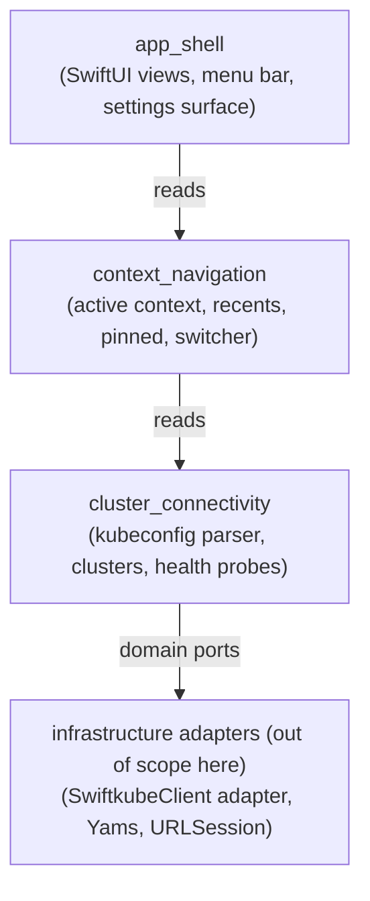

# ADR-0005 — Bounded contexts for the MVP

- Status — Superseded by ADR-0006
- Date — 2026-05-15
- Deciders — Fabricio Fonseca
- Consulted — (none yet)
- Informed — (none yet)
- Tags — ddd, bounded-context, modular, hexagonal

> **Superseded by [ADR-0006](adr-0006-mvp-plus-scope-expanded.md).**
> The three-context catalogue defined here remains valid as a strict
> subset of the MVP+ catalogue introduced in ADR-0006, which adds the
> assistant, LLM provider, in-process MCP server, and local
> persistence contexts. Read this ADR for the original rationale; read
> ADR-0006 for the current authoritative catalogue.

## Context and problem statement

K8sManager's MVP scope (multi-cluster connectivity and context
switching) is small, but the long-term roadmap (resource browser,
Helm, dashboards, exec, port-forward) is broad. The project must
choose a modular structure today that survives roadmap expansion
without a large refactor.

Strategic Domain-Driven Design (DDD) prescribes **bounded contexts** —
independent models with their own ubiquitous language. Two distinct
modelling choices are on the table:

(a) One coarse-grained context for the entire application, with
internal modules later if needed; or
(b) Multiple bounded contexts from day one, each owning its schemas,
features, policies, and narrative.

## Decision drivers

- **Surface that grows** — resource browsing, Helm, exec, dashboards
  will each introduce a separate ubiquitous language; coarse contexts
  collapse under the weight.
- **Hexagonal alignment** — bounded contexts map cleanly onto Swift
  Package Manager targets with explicit `dependencies:`; this enforces
  the "domain core never imports infrastructure" invariant at compile
  time.
- **Specification surface (this repository)** — bounded contexts give
  schemas, policies, features, and narratives a natural home; flat
  layouts get muddled fast.
- **Cost of splitting later** — moving types across contexts in Swift
  is mechanical but invasive; getting the seams right early is cheap.

## Considered options

- **Option A** — Three bounded contexts for the MVP —
  `cluster_connectivity`, `context_navigation`, `app_shell`.
- **Option B** — One bounded context (`k8s_manager`) for the MVP;
  split later when a second feature lands.
- **Option C** — Five bounded contexts from day one
  (`cluster_connectivity`, `context_navigation`, `resource_browser`,
  `settings`, `app_shell`), even though the last three lack
  immediate scope.

## Decision outcome

Chosen option — **Option A**, because three contexts cover every MVP
responsibility without empty placeholders, map directly to natural
team-of-one workflows, and leave clean seams for the roadmap.

### Context catalogue

- **cluster_connectivity** — owns the model of "what is a Kubernetes
  endpoint and how do we know it is alive". Aggregates `Kubeconfig`,
  `Cluster`, `AuthInfo`; domain services include `ClusterHealthProbe`.
  Depends on no other context. Imports no infrastructure (per ADR-0002
  and the hexagonal invariant).
- **context_navigation** — owns the model of "which cluster is the
  user looking at right now and which have they used recently".
  Aggregates `ActiveContext`, `RecentContext`, `PinnedContext`.
  Consumes `Cluster` identifiers from `cluster_connectivity` via a
  shared kernel of identifier value objects; does **not** import the
  full `Cluster` aggregate.
- **app_shell** — owns the model of "how the application presents
  itself to the operator". No domain aggregates of its own; consumes
  read models exposed by the other two contexts. Hosts the window,
  sidebar, menu bar, and settings surface.

### Shared kernel

A minimal **shared kernel** lives at
`contexts/_shared/schemas/` (and the equivalent Swift target). It
contains only fully-immutable value objects that are safe to copy
across contexts — `ClusterId`, `ContextId`, `KubeconfigPath`,
timestamps. The shared kernel is a deliberate exception to the
"contexts do not share types" rule; expanding it requires an ADR.

### Hexagonal dependency direction

Each upper layer depends only on the layer below; no cycles. The
infrastructure layer is the only place that imports SwiftkubeClient,
Yams, Foundation networking, or any other I/O concern.

### Consequences

- **Positive** — three clear seams, three SwiftPM targets, three
  separate spec directories. Adding `resource_browser` is a new
  bounded context, not a refactor. Spec validation runs per context
  in parallel.
- **Negative** — a small amount of boilerplate per context
  (Swift target, schema directory, README); the shared kernel must be
  policed to avoid creeping growth.
- **Neutral** — internal naming conventions for cross-context events
  must be agreed before any context emits one (deferred to a future
  ADR).

### Confirmation

- The Swift workspace exposes three targets matching the bounded
  contexts; `swift build` succeeds with no domain target importing
  any infrastructure dependency.
- The `docs/arch/contexts/` directory contains exactly three
  bounded-context directories matching the catalogue.
- No type appears in more than one context outside the shared kernel.

## Pros and cons of the options

### Option A — Three MVP contexts

- **Pros** — every directory has content from day one; seams match
  Swift targets; future contexts slot in cleanly.
- **Cons** — small boilerplate cost; requires shared-kernel
  discipline.

### Option B — Single context, split later

- **Pros** — minimum boilerplate today.
- **Cons** — invasive refactor when the second feature lands; team
  forms habits around a single model that resist later splitting.

### Option C — Five contexts upfront

- **Pros** — leaves slots for every planned roadmap feature.
- **Cons** — empty contexts dilute the value of the directory
  structure; out-of-scope contexts attract premature schema work.

## More information

- ADR-0001 — macOS runtime; constrains target topology.
- ADR-0002 — Kubernetes adapter; lives in the infrastructure layer.
- ADR-0003 — Read-only kubeconfig; constrains `cluster_connectivity`
  capabilities.
- Future ADR — first cross-context event taxonomy when the second
  bounded context starts emitting domain events.
