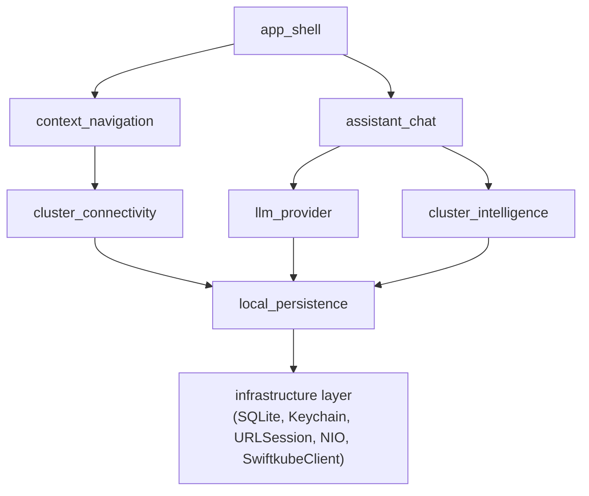

# ADR-0006 — MVP+ scope and the expanded bounded-context catalogue

- Status — Proposed; supersedes ADR-0005
- Date — 2026-05-15
- Deciders — Fabricio Fonseca
- Consulted — (none yet)
- Informed — (none yet)
- Tags — scope, ddd, bounded-context, mvp, llm, mcp

## Context and problem statement

ADR-0005 captured a three-context MVP centred on Kubernetes
connectivity and context navigation. The product direction has since
expanded — K8sManager will ship an in-application assistant powered
by configurable LLM providers (Anthropic, OpenAI, OpenAI-compatible)
that drives Kubernetes-aware reasoning through an in-process Model
Context Protocol (MCP) server. The application also needs durable
local storage for chat history, provider configuration, and
cluster-analysis caches, and high-performance Kubernetes API access
backed by a pooled HTTP client.

This ADR redefines the MVP+ scope and the authoritative
bounded-context catalogue so that the additional capabilities slot
into the existing hexagonal model without contradicting earlier ADRs.

## Decision drivers

- **Coherent expansion** — the original three contexts must remain
  valid as a subset of the new catalogue; no rework of existing
  schemas, features, or narratives is permitted.
- **Bounded-context independence** — each new capability gets its
  own context with explicit ports and read models rather than being
  bolted into existing ones.
- **MCP as an explicit boundary** — the in-process MCP server is a
  bounded context, not a utility inside `cluster_connectivity`. This
  keeps tool-calling concerns separated from raw connectivity and
  makes the tool surface trivially auditable.
- **Persistence is a context, not a leaf adapter** — the SQLite
  store underpins multiple contexts and has its own invariants
  (schema evolution, WAL safety, vacuum policy), so it earns a
  bounded context rather than living as an opaque adapter.

## Considered options

- **Option A** — Seven bounded contexts (the canonical MVP+ catalogue
  introduced here) — `cluster_connectivity`, `context_navigation`,
  `app_shell`, `llm_provider`, `assistant_chat`, `cluster_intelligence`,
  `local_persistence`.
- **Option B** — Keep the three ADR-0005 contexts; fold the assistant,
  the LLM provider, the MCP server, and the SQLite store into
  `app_shell` as internal modules.
- **Option C** — Collapse the assistant chat, LLM provider, MCP server,
  and persistence into a single new "assistant" bounded context;
  leave the original three intact.

## Decision outcome

The MVP+ catalogue is **seven bounded contexts**:

- **cluster_connectivity** — unchanged from ADR-0005. Owns kubeconfig
  parsing and cluster health.
- **context_navigation** — unchanged from ADR-0005. Owns active,
  recents, and pinned context state.
- **app_shell** — unchanged role; gains an assistant chat surface
  alongside the existing sidebar.
- **llm_provider** — new. Owns the abstraction over Anthropic,
  OpenAI, and OpenAI-compatible endpoints, including streaming
  protocol differences and rate-limit handling.
- **assistant_chat** — new. Owns conversation state, the tool-use
  loop, attachment lifecycle, and stream cancellation.
- **cluster_intelligence** — new. Hosts the in-process MCP server
  that exposes read-only Kubernetes tools to the LLM, and owns the
  policy that gates which Kubernetes operations the assistant may
  perform.
- **local_persistence** — new. Owns the SQLite database (WAL),
  schema migrations, the Keychain adapter for LLM API keys, and the
  cluster-analysis cache lifecycle.

### Dependency direction

No cycles. `cluster_intelligence` reads `ClusterReadModel` from
`cluster_connectivity` and uses the same `KubernetesApiPort` family;
it does **not** receive credentials directly. `assistant_chat` reads
from `llm_provider` and `cluster_intelligence`. `local_persistence`
is consumed by every context that needs durable storage and never
imports any of them.

### Scope confirmation

- **In-scope for MVP+** — original ADR-0005 features, plus:
  one or more configured LLM providers; a chat with streaming,
  cancellation, and attachments (text only in the first cut);
  an in-process MCP server exposing read-only tools `kubeListPods`,
  `kubeDescribe`, `kubeEvents`, `kubeLogs`, `kubeGetYAML` per a
  policy approved by the operator; SQLite-backed chat history and
  provider configuration; Keychain-backed API-key storage;
  pooled HTTPS connections to Kubernetes API servers.
- **Out of scope for MVP+** — any mutating Kubernetes operation
  (apply, scale, exec, port-forward, delete); Helm; dashboards or
  metric panels; team or cloud-synced chat history; LLM providers
  beyond Anthropic, OpenAI, and OpenAI-compatible endpoints
  (Bedrock and Vertex deferred); cross-cluster automation.

### Consequences

- **Positive** — additional capabilities land as well-modelled
  contexts rather than as appendices to existing modules; the
  hexagonal invariant is preserved; the assistant's tool surface
  is auditable because it is owned by a single context.
- **Negative** — seven contexts is a step up in operational
  surface for a single maintainer; each context grows its own
  schema, feature, and narrative material.
- **Neutral** — future contexts (`resource_browser`,
  `dashboard`, `helm`) slot in cleanly behind a new ADR each.

### Confirmation

- The `docs/arch/contexts/` directory contains exactly seven
  bounded-context directories matching the catalogue.
- The Swift workspace, when introduced, exposes seven targets with
  no cycles. `swift package show-dependencies` confirms.
- No domain target imports `SwiftkubeClient`, `URLSession`, `GRDB`,
  `Security` (Keychain), or any other infrastructure library.

## Pros and cons of the options

### Option B — Keep three contexts plus inline assistant

- **Pros** — minimal directory churn.
- **Cons** — `app_shell` would carry transport, tool, and
  persistence concerns and would become the largest context by far;
  the hexagonal layering would collapse around the chat feature.

### Option C — Single assistant context owning LLM, MCP, and persistence

- **Pros** — fewer directories.
- **Cons** — the SQLite store underpins more than the assistant
  (provider configuration is consumed by the settings surface;
  cluster-analysis caches survive chat sessions); persistence
  invariants are not chat invariants and should not share an
  ubiquitous language.

## More information

- ADR-0005 — Original three-context MVP (superseded).
- ADR-0007 — Connection pool and keep-alive (depends on this scope).
- ADR-0008 — LLM provider abstraction (creates the `llm_provider`
  context defined here).
- ADR-0009 — MCP host plus in-process MCP server (creates the
  `cluster_intelligence` context defined here).
- ADR-0010 — Local persistence (creates the `local_persistence`
  context defined here; clarifies ADR-0003 for LLM secrets).
