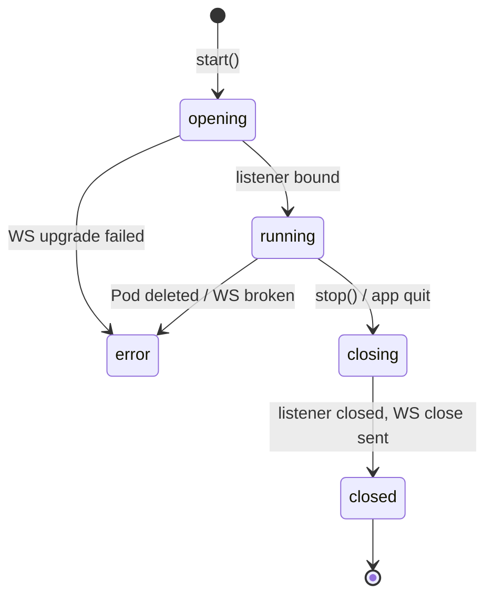

# ADR-0014 — Port-forwarding lifecycle: WebSocket subprotocol and local TCP listener

- Status — Proposed
- Date — 2026-05-15
- Deciders — Fabricio Fonseca
- Consulted — (none yet)
- Informed — (none yet)
- Tags — port-forward, websocket, tcp-listener, lifecycle, foundation, actors, cancellation

## Context and problem statement

K8sManager needs a port-forward capability that lets an operator tunnel one or more TCP ports from a
Kubernetes Pod (or a Pod selected by a Service) to a locally-bound TCP address. This is the
equivalent of `kubectl port-forward pod/<name> <localPort>:<remotePort>` and is required for
operators who need to interact with in-cluster services directly from their local tools (database
clients, browser, curl, etc.) without exposing those services via Ingress or LoadBalancer.

The questions this ADR must settle are:

- What transport and Kubernetes wire protocol handles the tunnel?
- What is the frame format on the wire?
- How is the local TCP listener created and bound?
- How are multiple remote ports handled within a single session?
- What is the session lifecycle state machine?
- What cancellation and shutdown guarantees apply?
- How is the feature represented in the Swift concurrency model?
- What are the security and operational constraints?

## Decision drivers

- **Tier A transport** — ADR-0011 established that Foundation's `URLSessionWebSocketTask` is the
  preferred WebSocket transport. It is built into macOS 14+, requires no external dependencies, and
  integrates naturally with Swift structured concurrency.
- **Kubernetes 1.31+ GA protocol** — since Kubernetes 1.31 the API server supports the
  `portforward.k8s.io` WebSocket subprotocol as a GA alternative to the legacy SPDY-based
  port-forward path. The WS path is the recommended forward-compatible choice.
- **Non-mutating** — a port-forward tunnel does not alter any cluster resource. ADR-0012
  confirmation requirements do not apply.
- **Minimal external footprint** — binding to loopback by default confines the tunnel to the local
  machine and avoids accidental LAN exposure.

## Decision outcome

Adopt the `portforward.k8s.io` WebSocket subprotocol over `URLSessionWebSocketTask` for all
port-forward tunnels. Each session opens exactly one WebSocket connection. The local TCP listener is
bound on `127.0.0.1` with a system-assigned dynamic port unless the operator specifies a fixed port.
Multiple `remotePort` targets within a single session are each assigned a `portIndex` (0-based) and
multiplexed over the same WebSocket connection. Session lifecycle follows the state machine:
`opening` → `running` → `closing` → `closed` (with `error` reachable from `opening` and `running`).
There is no automatic reconnect; manual re-open is the operator's responsibility.

### Positive consequences

- No third-party WebSocket library required; Foundation handles TLS, mTLS credential injection, HTTP
  upgrade, and subprotocol negotiation.
- Single WebSocket connection per session regardless of port count reduces connection overhead and
  simplifies cancellation.
- Loopback-default binding prevents unintended network exposure.
- Deterministic lifecycle state machine enables clean shutdown on app quit without leaked sockets.
- No auto-reconnect eliminates the ambiguous-state problem that arises when the remote Pod is
  replaced after a disconnect.

### Negative consequences

- Dynamic port assignment means the operator must read the assigned port from the UI after session
  open; port numbers are not stable across sessions.
- Without auto-reconnect, a transient network blip forces the operator to manually re-open a
  session.
- The `portforward.k8s.io` WS protocol requires Kubernetes 1.31+; clusters running 1.30 or earlier
  must use the legacy SPDY path, which is out of scope for this ADR.

### Confirmation

- A live test against a cluster running Kubernetes 1.31+ confirms the WebSocket upgrade with
  subprotocol `portforward.k8s.io` succeeds and bidirectional frames flow with the documented 2-byte
  header.
- A unit test asserts that closing the listener via `Task.cancel()` terminates the underlying
  `URLSessionWebSocketTask` and releases the local TCP port within 200 milliseconds.
- An integration test forwards two remote ports in one session and verifies independent
  byte-transferred counters per `portIndex`.
- A negative test attempts a forward against a Pod that immediately exits; the session transitions
  to `error` with a `SessionFailed` event carrying a non-credential `detail` string.
- An end-to-end test verifies application quit closes every active session within 500 milliseconds.
- A frame-layout unit test encodes a known payload (`"hello"`, 5 bytes) for port index 0 on the data
  stream, asserts the wire bytes are `[0x00, 0x00, 0x68, 0x65, 0x6C, 0x6C, 0x6F]` (byte 0 =
  portIndex 0, byte 1 = streamType data, followed by ASCII "hello"), then decodes the same bytes and
  asserts the recovered payload equals `"hello"` with `portIndex=0` and `streamType=data`. This test
  catches any regression to the previously incorrect byte order (channel-first).
- A frame-layout unit test for the error stream asserts that a 7-byte frame beginning with
  `[0x01, 0x01]` is decoded as portIndex 1, streamType error, with the remaining 5 bytes as the
  error message payload.

## Considered options

### Option A — URLSessionWebSocketTask + portforward.k8s.io (selected)

The Kubernetes API server negotiates the `portforward.k8s.io` subprotocol during the HTTP Upgrade
request for `GET /api/v1/namespaces/{ns}/pods/{name}/portforward`. Once the WebSocket handshake is
complete, the client and server exchange binary frames according to the frame format described
below.

Frame format: every binary WebSocket frame begins with a 2-byte header. The first byte is the port
index (0-based, matching the order of `ports` query parameters in the upgrade URL). The second byte
is the stream type: `0x00` indicates the data stream for that port; `0x01` indicates the error
stream for that port. Each port therefore has exactly two streams — one data stream and one error
stream — identified by the same port index byte with different stream-type bytes. The payload
follows immediately after the 2-byte header and may be empty (zero-byte payload on the data stream
signals end-of-data for that direction).

This byte order is verified against the Kubernetes source at
`k8s.io/apiserver/pkg/util/wsstream/conn.go`. The `portforward.k8s.io` subprotocol encodes the port
index in byte 0 and the stream type in byte

1. An earlier draft of this ADR had the order reversed; this entry documents the correction.

For each accepted TCP client connection on the local listener, `PortForwardManagerActor` opens a new
data path over the existing WebSocket by associating the client socket with the appropriate port
index. Multiple concurrent TCP client connections to the same local listener are forwarded through
the same WebSocket.

The choice of `URLSessionWebSocketTask` is consistent with ADR-0011. No new dependencies are
introduced.

Effort: moderate. All logic lives in a new `port_forwarding` bounded context. The infra adapter
implementing `KubernetesPortForwardPort` wraps `URLSessionWebSocketTask` identically to the pattern
already used by `KubernetesExecPort` in `terminal_session`.

### Option B — websocket-kit (vapor/websocket-kit)

An open-source Swift WebSocket library built on NIO. Would provide lower-level control over framing,
ping/pong, and close-handshake timing at the cost of a new package dependency, a NIO event-loop
threading model that diverges from Swift structured concurrency, and additional porting effort to
macOS sandbox and App Sandbox entitlements.

Rejected. ADR-0011 explicitly reserves third-party WebSocket libraries for cases where Foundation is
insufficient. Foundation handles the `portforward.k8s.io` subprotocol entirely via the custom
subprotocol string parameter on `URLSessionWebSocketTask`; there is no functional gap that justifies
the extra dependency and threading complexity.

### Option C — SPDY legacy port-forward

Prior to Kubernetes 1.28 the only supported port-forward transport was SPDY/3.1 over HTTP. Apple's
Foundation network stack does not implement SPDY. Supporting this path would require a third-party
SPDY library or raw TCP socket management.

Rejected. K8sManager targets macOS 14+ and Kubernetes 1.31+ clusters. The SPDY path is deprecated
and disabled by default in Kubernetes 1.31. The `portforward.k8s.io` WebSocket path is GA from 1.31
onward and is the designated replacement.

## Wire protocol detail

The Kubernetes port-forward WebSocket subprotocol `portforward.k8s.io` is described in the
Kubernetes source at `staging/src/k8s.io/apiserver/pkg/util/wsstream/`. The wire contract relevant
to the K8sManager implementation is:

### HTTP upgrade request

```
GET /api/v1/namespaces/{namespace}/pods/{podName}/portforward
    ?ports={port0}&ports={port1}...
Upgrade: websocket
Connection: Upgrade
Sec-WebSocket-Protocol: portforward.k8s.io
```

The `ports` query parameter is repeated once per `remotePort`. The order of `ports` values defines
the port index (0-based) used in the frame header.

### Binary frame header (2 bytes)

```
Byte 0: portIndex
  0x00 — refers to the first port listed in the upgrade URL query
  0x01 — refers to the second port, etc.

Byte 1: streamType
  0x00 — data stream (bidirectional payload bytes for the given port)
  0x01 — error stream (server-to-client error message for the given port)
```

Each port has exactly one data stream and one error stream, distinguished by the same `portIndex`
byte and different `streamType` bytes.

Frames with `streamType=0x00` and zero-length payload signal EOF for the given port's data stream
direction and are used to implement graceful half-close.

Note on prior ADR text: an earlier version of this section placed the channel/stream-type byte first
and the port-index byte second. The corrected order above matches the Kubernetes source at
`staging/src/k8s.io/apiserver/pkg/util/wsstream/conn.go`. All adapter code implementing
`PortForwardManagerActor` must use the corrected byte order.

### WebSocket close handshake

When the operator closes the session, `PortForwardManagerActor` sends a WebSocket Close frame (code
1000 — normal closure). It then waits up to 200 ms for the server's Close echo before discarding the
task. The local TCP listener is closed synchronously after the WebSocket task is cancelled, ensuring
no new TCP client connections are accepted after the session begins shutting down.

## Lifecycle state machine



Transitions:

- `opening` → `running`: WebSocket upgrade succeeds and the local TCP listener is successfully
  bound. `#ListenerBound` event is emitted.
- `opening` → `error`: WebSocket upgrade fails (e.g., 403 Forbidden, Pod not found, port not
  exposed). `#SessionFailed` event is emitted.
- `running` → `error`: WebSocket closes unexpectedly or the server sends an error frame with a
  non-recoverable error code. `#SessionFailed` is emitted. The local listener is closed.
- `running` → `closing`: operator calls `stop()` or the application is quitting.
  `PortForwardManagerActor` begins cooperative shutdown.
- `closing` → `closed`: listener closed, WebSocket close handshake complete (or 200 ms timeout
  elapsed). `#SessionClosed` is emitted.

There is no transition from `error` or `closed` back into `opening`. The operator must create a new
`PortForwardSession` aggregate to re-establish a tunnel.

## Local TCP listener

`PortForwardManagerActor` creates a POSIX TCP server socket bound to `bindAddress` (default
`127.0.0.1`) and either a fixed `localPort` supplied by the operator or port `0` for dynamic
assignment. After `bind(2)` and `listen(2)`, the kernel assigns the ephemeral port. The assigned
port is read with `getsockname(2)` and stored in the session aggregate as the effective `localPort`
of the corresponding `#PortMapping`.

Each `accept(2)` call returns a new client file descriptor. The actor spawns a scoped `Task` per
accepted connection that pumps data between the local TCP socket and the WebSocket using the frame
format described above. When the WebSocket connection closes, all active per-connection tasks are
cancelled and all client file descriptors are closed.

When `bindAddress` is set to `0.0.0.0`, `PortForwardManagerActor` emits a `#ListenerBound` event
annotated with `isNetworkExposed: true`. The application layer must surface a warning to the
operator indicating that the tunnel is accessible from the local network, not just `localhost`.

## Multi-port sessions

A single `PortForwardSession` may forward multiple remote ports. Each `#PortMapping` in
`portMappings` maps to one `portIndex` value. The upgrade URL includes one `ports` query parameter
per mapping. The local listener for each `portIndex` is a separate TCP server socket; each accepted
connection on that socket carries frames tagged with the corresponding `portIndex` byte.

The maximum number of port mappings per session is bounded by the Kubernetes API server's
frame-header portIndex field width (1 byte), giving a theoretical maximum of 256 mappings per
session. In practice the UI caps this at 16 for usability.

## Security and operational constraints

- Loopback binding is the default. The UI must warn the operator before creating a session with
  `bindAddress != "127.0.0.1"`.
- No stdout, stdin, or tunnelled byte payloads are logged or persisted. `#BytesTransferred` events
  carry aggregate byte counts only, never payload content.
- A port-forward is not a mutating operation and does not require an audit entry per ADR-0012.
- When the application quits (AppDelegate `applicationWillTerminate`), all `PortForwardSession`
  aggregates in state `running` or `opening` are transitioned to `closing` and the cooperative
  shutdown sequence is awaited with a 500 ms total deadline before process exit.
- The credential chain used for the WebSocket upgrade is the same chain supplied by
  `cluster_connectivity` for the active kubeconfig context (client certificate, token, or proxy
  configuration). Credentials are never written to the tunnel byte stream or emitted in events.

## Comparison with terminal_session / exec context

Port-forward and exec both use WebSocket connections to the Kubernetes API server, both rely on
`URLSessionWebSocketTask`, and both are implemented as Swift actors per ADR-0011. The key
differences are:

- **Subprotocol**: exec uses `v5.channel.k8s.io` (5 channels, 1-byte header); port-forward uses
  `portforward.k8s.io` (2 channels, 2-byte header with portIndex).
- **Local socket**: exec sessions have no local TCP server socket; port-forward sessions bind one
  TCP server socket per mapped port.
- **Multiplexing dimension**: exec multiplexes stdin/stdout/stderr/error/ resize over channels;
  port-forward multiplexes data/error over ports.
- **Mutating status**: exec sessions that open debug Pods are mutating (ADR-0012); port-forward
  sessions are never mutating.
- **Reconnect policy**: both contexts reject auto-reconnect explicitly.

## More information

- ADR-0011 — Swift concurrency conventions and URLSessionWebSocketTask
- ADR-0012 — Mutating operations policy
- ADR-0017 — Terminal sessions (reference implementation for WS lifecycle)
- Kubernetes port-forward WS protocol —
  <https://github.com/kubernetes/kubernetes/blob/main/staging/src/k8s.io/apiserver/pkg/util/wsstream/conn.go>
- Kubernetes 1.31 release notes — portforward WS GA
