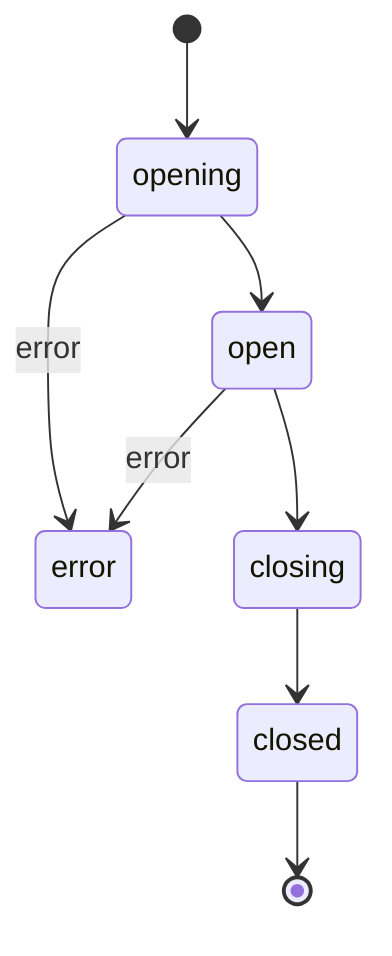

# ADR-0017 — Terminal sessions: Pod exec and Node debug

- Status — Accepted (ratified 2026-05-15)
- Date — 2026-05-15
- Deciders — Fabricio Fonseca
- Consulted — (none yet)
- Informed — (none yet)
- Tags — terminal, websocket, exec, ephemeral-container, multi-tab, actors, cancellation

## Context and problem statement

K8sManager needs an interactive terminal surface covering two distinct use cases.

The first use case is `pods/exec`: opening an interactive shell (or running a one-shot command)
inside a running container. This is the equivalent of `kubectl exec -it <pod> -- /bin/sh` and is
among the most frequently performed tasks by operators working with Kubernetes clusters.

The second use case is `nodes/debug`: attaching a debug container to a node's host namespace — the
equivalent of `kubectl debug node/<name> -it --image=nicolaka/netshoot:v0.13 -- /bin/bash`. This is
a privileged, mutating operation that requires a special-purpose ephemeral pod to be created on the
target node.

Both use cases require a persistent, bidirectional byte stream between the application and the
Kubernetes API server. Both must support terminal resize. Both must support cooperative cancellation
within a strict latency budget (<200 ms). Both must be independently addressable within a multi-tab
UI so that an operator can maintain several concurrent sessions without interference.

The questions this ADR must settle are:

- What transport layer handles the WebSocket connection?
- How is the Kubernetes channel-multiplexing subprotocol implemented?
- How is terminal resize communicated?
- What is the lifecycle (open, close, idle timeout, reconnect policy)?
- How is each session represented in the Swift concurrency model?
- How does node debug differ from pod exec at the domain level?
- What are the security and operational risks?

## Decision drivers

- **Tier A transport** — ADR-0011 established that Foundation's `URLSessionWebSocketTask` is the
  preferred WebSocket transport. It is built into macOS 14+, requires no external dependencies, and
  integrates naturally with Swift concurrency.
- **Kubernetes subprotocol** — since Kubernetes 1.31 the API server negotiates `v5.channel.k8s.io`
  as the preferred exec subprotocol. Support for v5 is required. SPDY (the original transport used
  before WebSocket became the default) is explicitly out of scope.
- **Channel framing** — the v5 subprotocol multiplexes five logical channels over one WebSocket
  connection via a 1-byte channel-number prefix on every binary message. The application must
  correctly frame outbound messages and correctly demultiplex inbound messages.
- **Resize** — terminal resize events are sent on channel 4 as a binary WebSocket frame whose
  payload is `<channel-byte>` followed by a UTF-8 JSON object `{"Width":<int>,"Height":<int>}`.
- **Multi-tab** — ADR-0011 established that long-lived async operations run inside dedicated actors.
  A terminal session is a textbook example: each session gets exactly one `TerminalSessionActor`
  that owns the WebSocket task, manages the read loop, and serialises resize events.
- **Mutating safety** — ADR-0012 classifies `pods/exec` as a non-mutating read-like operation (it
  does not alter durable cluster state) and `nodes/debug` as a mutating operation (it creates a
  Pod). The node debug path must go through the ADR-0012 confirmation and audit flow.
- **Cancellation budget** — operator-initiated cancel must abort the underlying WebSocket connection
  within 200 ms. Cooperative task cancellation (`Task.cancel`) is the mechanism; no polling is
  permitted.
- **Idle timeout** — sessions idle for 30 minutes (no stdin activity) are closed automatically. The
  operator is expected to reopen if needed; automatic reconnect is explicitly not provided
  (reconnect semantics on exec sessions are ambiguous: the remote process may already have exited).
- **No stdout persistence** — terminal output must never be written to disk. The in-memory buffer
  exists only for the lifetime of the UI view displaying the session.

## Considered options

### Option A — URLSessionWebSocketTask (Foundation built-in)

`URLSessionWebSocketTask` is available in Foundation since macOS 11 and is fully integrated with
`URLSession` and its delegate-based authentication callbacks. On macOS 14 (the project's minimum
deployment target per ADR-0001) it supports subprotocol negotiation via the `URLRequest`
initialiser. It exposes an `AsyncSequence`-compatible receive loop in Swift 5.9+.

Relevant limitations:

- The raw binary framing required by `v5.channel.k8s.io` (length- prefixed channel byte) must be
  implemented in application code. `URLSessionWebSocketTask` delivers complete WebSocket frames as
  `URLSessionWebSocketTask.Message` values; application code reads the first byte to determine the
  channel and passes the remainder as payload.
- Subprotocol negotiation is requested via `URLRequest` header
  `Sec-WebSocket-Protocol: v5.channel.k8s.io`. The API server may downgrade to `v4.channel.k8s.io`
  on clusters older than 1.31. The application must check the negotiated subprotocol from the
  response and handle the v4 channel set (which lacks the separate error channel at index 3 present
  in v5).
- TLS client certificates (mTLS clusters using `SecIdentity` in the kubeconfig credential chain) are
  handled via `URLSessionDelegate` `urlSession(_:didReceive:completionHandler:)`. This is the same
  path used by the existing SwiftKube adapter (ADR-0002) and requires no new authentication
  plumbing.

### Option B — websocket-kit (SwiftNIO-based)

`websocket-kit` is the WebSocket library used by the Vapor server framework. It is built on SwiftNIO
and supports custom header injection, raw frame access, and back-pressure-aware reads.

Drawbacks:

- Adds a significant SwiftNIO dependency tree (~12 transitive packages). ADR-0002 explicitly
  preferred minimal external dependencies.
- `URLSession`-based mTLS via `SecIdentity` does not apply; a separate TLS configuration path would
  be needed.
- SwiftNIO's event-loop model requires careful bridging to Swift Concurrency and the main actor.
  ADR-0011 warns against importing callback-based concurrency models that resist
  structured-concurrency composition.

### Option C — SPDY / HTTP/1.1 upgrade (legacy)

Kubernetes clusters prior to 1.13 used SPDY as the exec transport. SPDY support was removed from
kubectl in 1.28 and is not supported by any modern cluster. This option is rejected without further
analysis.

## Pros and cons of the options

### Option A — URLSessionWebSocketTask (Foundation built-in, chosen)

- Good, because `URLSessionWebSocketTask` ships with macOS 14+, requires no external dependencies,
  and integrates naturally with Swift structured concurrency and `URLSession` authentication
  delegates.
- Good, because mTLS via `SecIdentity` is handled through the standard `URLSessionDelegate` path,
  consistent with the existing cluster connectivity context.
- Good, because Swift actor model maps naturally to one-session-one-actor, keeping all mutable
  session state (receive buffer, last-activity timestamp, current size) fully contained.
- Bad, because the v5 channel-framing layer (1-byte prefix demux/mux) must be implemented and tested
  in application code; an off-by-one in channel parsing silently corrupts terminal output.
- Bad, because fallback detection for v4 requires conditional logic in the receive loop for clusters
  older than 1.31.

### Option B — websocket-kit (SwiftNIO-based)

- Good, because it provides lower-level control over raw frame access and back-pressure-aware reads
  not exposed by Foundation's opaque `URLSessionWebSocketTask`.
- Bad, because it adds a significant SwiftNIO dependency tree (approximately 12 transitive
  packages), contradicting ADR-0002's preference for minimal external dependencies.
- Bad, because SwiftNIO's event-loop model requires careful bridging to Swift Concurrency; ADR-0011
  explicitly warns against callback-based concurrency models that resist structured-concurrency
  composition.
- Bad, because `URLSession`-based mTLS via `SecIdentity` does not apply; a separate TLS
  configuration path would be needed for client-certificate clusters.

### Option C — SPDY / HTTP/1.1 upgrade (legacy)

- Good, because it would provide compatibility with clusters running Kubernetes versions earlier
  than 1.13 that used SPDY as the exec transport.
- Bad, because SPDY support was removed from `kubectl` in 1.28 and is not supported by any modern
  cluster; investing in it has no future benefit.
- Bad, because Apple's Foundation network stack does not implement SPDY, requiring a third-party
  library or raw TCP socket management with no maintained Swift options.

## Decision outcome

**Option A is adopted.** `URLSessionWebSocketTask` is the transport for both `pods/exec` and
`nodes/debug` sessions.

The application negotiates `v5.channel.k8s.io` and falls back to `v4.channel.k8s.io` when the server
downgrades. Fallback detection reads the `Upgrade` response header via the `URLSessionTaskDelegate`
`urlSession(_:task:didCompleteWithError:)` callback on the initial HTTP/101 exchange.

Each active session is owned by exactly one `TerminalSessionActor` (Swift actor isolation, per
ADR-0011). The actor holds the `URLSessionWebSocketTask`, the receive `Task`, and the current
`TerminalSession` aggregate value. Tab close sends a cooperative cancel to the receive task, which
triggers `URLSessionWebSocketTask.cancel(with: reason:)` before the task returns. The wall-clock
budget for this sequence is 200 ms.

`nodes/debug` creates a Pod via the Kubernetes core/v1 Pods API before opening the exec WebSocket.
This Pod creation is a mutating operation and is subject to the full ADR-0012 confirmation and audit
flow. The debug Pod is named `node-debugger-<nodeName>-<short-uuid>` and is created in the `default`
namespace (configurable). A `NodeDebugDescriptor` value object records the ephemeral Pod name, debug
image, and the `expiresAt` timestamp (session close + 60 s grace). The application issues a Pod
delete at session close; if the application crashes, the Pod remains until the cluster's garbage
collector or the operator removes it.

## Protocol detail

### Channel map (v5.channel.k8s.io)

- Channel 0 — stdin (client to server)
- Channel 1 — stdout (server to client)
- Channel 2 — stderr (server to client)
- Channel 3 — error (server to client; JSON object with `message` key)
- Channel 4 — resize (bidirectional; client sends resize events)

Every WebSocket binary frame carries one logical channel message. The first byte of the frame
payload is the channel number (0x00 through 0x04). The remaining bytes are the channel payload.

Example outbound stdin frame for the character `l` (0x6c):

    [0x00, 0x6c]

Example outbound resize frame for 80x24:

    [0x04, 0x7b, 0x22, 0x57, 0x69, 0x64, 0x74, 0x68, 0x22, 0x3a, 0x38,
     0x30, 0x2c, 0x22, 0x48, 0x65, 0x69, 0x67, 0x68, 0x74, 0x22, 0x3a,
     0x32, 0x34, 0x7d]

Which is channel byte `0x04` followed by `{"Width":80,"Height":24}`.

### Resize debouncing

The UI layer (SwiftUI `GeometryReader` or explicit resize handle) generates continuous resize events
during window drag. The `TerminalSessionActor` debounces resize events to 100 ms: if a new size
arrives within 100 ms of the last dispatched resize frame, the intermediate events are discarded and
only the final size is sent. This prevents resize-frame floods from saturating the WebSocket
connection on rapid window resizes.

### Subprotocol negotiation

The `URLRequest` sent to open the exec WebSocket must include:

    Upgrade: websocket
    Connection: Upgrade
    Sec-WebSocket-Protocol: v5.channel.k8s.io

If the server responds with `Sec-WebSocket-Protocol: v4.channel.k8s.io`, the application operates
without channel 3 (the dedicated error channel introduced in v5). Error information in v4 is instead
embedded in the stderr stream.

### Idle timeout

A `TerminalSessionActor` maintains a `lastActivityAt` timestamp updated on every inbound frame
(stdout, stderr) or outbound frame (stdin). A cooperative `Task.sleep(for:)` loop wakes every 60 s
and checks elapsed time. If `now - lastActivityAt > 1800 s` (30 minutes), the session is closed by
the actor and its status transitions to `closed`. The UI displays a "Session closed due to
inactivity" message in the terminal output area.

### Reconnect policy

Automatic reconnect is not implemented. After a session enters `closed` or `error` state, the
operator must explicitly open a new terminal tab. The rationale: exec sessions attach to a specific
process inside the container. That process may have exited, the container may have been restarted,
and the output produced after the disconnect is lost regardless. Silently reconnecting would present
a misleading terminal with a fresh shell and no indication that state was lost.

## Lifecycle state machine

- `opening` — WebSocket handshake in progress (including Pod creation for node debug sessions).
- `open` — WebSocket connected; receive loop running; resize and stdin accepted.
- `closing` — cooperative cancel dispatched; waiting for WebSocket close frame or 200 ms timeout.
- `closed` — connection terminated cleanly; exit code captured if available.
- `error` — connection failed or was reset unexpectedly; `TerminalSession` carries a human-readable
  error string.

## Consequences

### Positive consequences

- No new package dependencies. `URLSessionWebSocketTask` ships with macOS and requires no build-time
  or runtime overhead beyond what the application already links.
- mTLS (`SecIdentity`) works through the standard `URLSessionDelegate` path, consistent with the
  cluster connectivity context.
- Swift actor model maps naturally to one-session-one-actor: shared mutable state (receive buffer,
  last-activity timestamp, current size) is fully contained inside `TerminalSessionActor` with no
  locks.
- The `terminal_session` bounded context is isolated: it exposes ports (`KubernetesExecPort`,
  `KubernetesDebugCreatorPort`, `TerminalRepositoryPort`) and produces read models
  (`OpenTerminalsReadModel`), but holds no import-time reference to any infra adapter.

### Negative consequences

- The v5 channel-framing layer (1-byte prefix demux/mux) must be implemented and tested in
  application code. This is approximately 50 lines of Swift but must be correct — an off-by-one in
  channel parsing silently corrupts terminal output.
- Fallback to v4 requires conditional logic in the receive loop. Clusters older than 1.28 that serve
  only SPDY are not supported and will fail at the WebSocket handshake with a `426 Upgrade Required`
  or `400 Bad Request` response.
- Debug Pod auto-delete depends on the application issuing a Pod delete at session close. If the
  process is force-killed (SIGKILL, OOM) the cleanup does not run. A future enhancement could use a
  finalizer or a TTL controller, but those require additional cluster permissions.

### Confirmation

- A live test against Kubernetes 1.31+ confirms that the `pods/exec` WebSocket upgrade with
  subprotocol `v5.channel.k8s.io` succeeds and that frames on channels 0 through 4 are correctly
  multiplexed and demultiplexed.
- A unit test asserts that resize frames on channel 4 carry a JSON payload
  `{"Width":<int>,"Height":<int>}` and are debounced to at most one frame per 100 milliseconds.
- A cancellation test confirms that closing a session via `Task.cancel()` aborts the WebSocket and
  releases the underlying HTTP connection within 200 milliseconds.
- A node-debug test verifies that opening a `node_debug` session creates an ephemeral pod with
  `hostNetwork=true`, `hostPID=true`, and `privileged=true`, that the session waits until the pod
  reaches `Running`, and that the pod is deleted automatically within 60 seconds of session close.
- A multi-tab test opens five concurrent sessions, each with its own `TerminalSessionActor`, and
  verifies that closing one does not impact the others.

## Risks and mitigations

- **mTLS provider clusters** — some managed Kubernetes providers (EKS with IAM auth, GKE with
  Workload Identity) use non-certificate authentication mechanisms (bearer tokens, OIDC) rather than
  client TLS certificates. The `URLSession`-based mTLS path covers the client-certificate case.
  Token-based auth is handled via the `Authorization: Bearer <token>` header injected by the
  `cluster_connectivity` port. No additional risk beyond what the existing HTTP paths already
  handle.
- **ttyd alternative** — some clusters expose a browser-based terminal via `ttyd` as an alternative
  exec surface. K8sManager does not support the ttyd protocol; it targets the standard Kubernetes
  exec API exclusively. This is an accepted limitation.
- **Debug Pod permissions** — `kubectl debug node` creates a Pod with `hostNetwork: true`,
  `hostPID: true`, and `securityContext.privileged: true`. This is an inherently privileged
  operation. The ADR-0012 audit trail records the creation. A future ADR may harden this by making
  the `securityContext` configurable or by supporting non-privileged node-debug profiles. For now,
  the `NodeDebugDescriptor` schema marks `privileged: true` as the default with a comment citing
  this risk.
- **Container selection** — when a Pod contains multiple containers and the operator has not
  specified one, the application defaults to the first container in the Pod spec. This matches
  `kubectl exec` default behaviour. The UI must make the selected container visible and provide a
  way to switch before opening the session.
- **Process exit codes** — the v5 protocol delivers exit code information via channel 3 (error
  channel) as a JSON object `{"ExitCode":<int>}`. The application must distinguish between the
  WebSocket connection closing normally (no error channel message) and the remote process exiting
  with a specific code. Exit code 0 is displayed as "Process exited (0)"; non-zero codes are
  displayed with a warning colour.

## More information

- ADR-0001 — macOS native Swift; sets deployment target macOS 14+
- ADR-0002 — SwiftKube client adapter; establishes transport conventions
- ADR-0011 — Swift concurrency conventions; establishes actor model
- ADR-0012 — Mutating operations policy; governs node debug Pod creation
- ADR-0013 — Resource browser scope; reserved `exec` subresource
- Kubernetes documentation — Exec into a container (websocket)
- KEP-4006 — WebSocket exec subprotocol v5 (Kubernetes 1.31)
