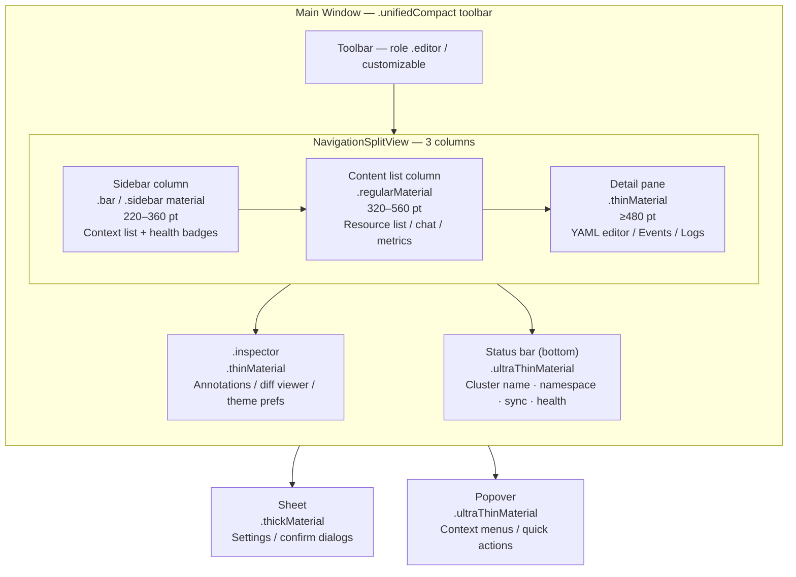

# ADR-0021 — App shell design system and main layout

- Status — Superseded by ADR-0028 (closed 2026-05-15); chrome layout refined by ADR-0051
- Date — 2026-05-15
- Deciders — Fabricio Fonseca
- Consulted — (none yet)
- Informed — (none yet)
- Refined by — ADR-0028 (SF Symbols and native iconography), ADR-0051 (multi-cluster workspace:
  cluster strip, sidebar tree, tab bar, detail drawer, status bar, top-right chrome)
- Tags — ui, design-system, layout, accessibility, typography, color, material

> **Iconography note** — The SF Symbols section of this ADR (symbol name assignments per Kubernetes
> kind, rendering modes, symbol variants, animation effects, accessibility label policy, and the
> `#IconCatalog` CUE schema) has been superseded by ADR-0028 — SF Symbols and native iconography.
> ADR-0028 is the canonical reference for all symbol-related decisions. The SF Symbols subsection
> below is retained for historical context only.

## Context and problem statement

K8sManager targets macOS-native desktop operators (ADR-0001). As of ADR-0005 and ADR-0006, the
application scope has grown to cover resource browsing, Helm management, terminal sessions, port
forwarding, AI assistant chat, and metrics dashboards, all surfaced from a single primary window. No
visual design contract has been recorded: color tokens, material usage, typography, window
structure, sidebar conventions, animation defaults, and operator-configurable preferences have
accumulated as informal assumptions across multiple implementation decisions.

Without a formal design-system ADR the following risks compound over time:

- Inconsistent color usage across views (brand blue used as an accent in some views, system tint in
  others, with no documented rule).
- Material choices diverge (some popovers use `.regularMaterial`, some use `.ultraThinMaterial`),
  producing visual incoherence at different rendering depths.
- Typography deviates across views (wrong SF Pro variant at a given point size, wrong weight for
  heading roles).
- Operator preferences (color scheme, density, mono font) are expressed as ad-hoc UserDefaults keys
  with no schema, no documented defaults, and no migration path.
- Liquid Glass (`glassEffect()`) introduced in macOS 26 is adopted inconsistently or blocked by a
  missing `@available` guard.
- WCAG AA contrast requirements are not verified systematically.

This ADR records the design-system baseline for the app shell bounded context and closes the open
questions listed above.

## Decision drivers

- **Kubernetes brand identity** — K8sManager is a Kubernetes-centric tool. Operators associate the
  product with the Kubernetes community. The CNCF color (#0086FF) and the Clarity City font are
  generic CNCF assets shared across hundreds of unrelated projects; they do not express K8sManager's
  own identity.
- **Native macOS feel** — Materials, SF Pro, and dynamic type are the Apple-idiomatic components
  that give macOS applications their characteristic look. Non-Apple fonts and non-Material surface
  treatments break the coherence with system applications.
- **Operator configurability** — Power users expect to control accent color (system vs. brand),
  density, color scheme, and mono font selection. Hard-wiring any of these limits the audience.
- **Future-proof for macOS 26** — Liquid Glass is the signature system visual of macOS 26.
  Conditional adoption (enabled by default on 26+, off on 14–15) lets the application participate in
  the new paradigm without abandoning macOS 14/15 users.
- **Accessibility** — WCAG AA is the floor requirement for all text. Body text (under 18pt) must
  meet 4.5:1; large text and icons must meet 3:1. Color-alone communication is prohibited.
- **DDD layering** — Design tokens belong to the `app_shell` bounded context as value objects. They
  must not bleed into domain-core layers. SwiftUI and AppKit are part of the macOS runtime and are
  explicitly excluded from the infrastructure ban (ADR-0020).

## Considered options

- **Option A — Kubernetes brand palette only, no operator accent override.** Lock the accent to
  `#326CE5` unconditionally. Simpler configuration, zero runtime branching on accent.

- **Option B — Apple system tint only, no brand palette.** Defer all color identity to the macOS
  system accent color set by the operator in System Settings. Simplest possible configuration; zero
  brand asset maintenance.

- **Option C — Hybrid: Kubernetes brand default with operator toggle to system tint, plus full
  operator density and typography configuration.** Adopt `#326CE5` as the documented brand accent
  for new installations. Expose a preference knob (`accentSource`) that lets the operator choose
  between `kubernetes_brand` and `system_tint`. Pair this with density, color scheme, mono font
  family, mono font size, UI scale, sidebar density, reduce-motion, and Liquid Glass toggles. This
  is the chosen option.

## Decision outcome

Chosen option — **Option C**, because:

- It preserves K8sManager's Kubernetes community identity for operators who have not customised the
  accent.
- It respects the established macOS convention of allowing per-application accent overrides.
- It is strictly more flexible than Option A or Option B without introducing architectural
  complexity: the preferences are resolved once at window presentation time and injected via SwiftUI
  `Environment`.
- The operator-preference schema (see `theme_preference.cue`) is defined as a CUE value object, is
  validated at build time, and is serialised to the existing SQLite-backed persistence layer
  (`local_persistence` bounded context) with a versioned migration key, eliminating the ad-hoc
  UserDefaults risk.

### Color and brand identity

The Kubernetes project brand color is `#326CE5` (Pantone 285C as published in the Kubernetes brand
guidelines). This color is adopted as the default `accentBrand` token for K8sManager. The CNCF
palette (`#0086FF`) is explicitly rejected: it is a different hue, it belongs to the CNCF umbrella
brand rather than Kubernetes specifically, and it has lower contrast against white backgrounds in
certain rendering environments.

Brand variants declared as named tokens:

- `brandNavy` — `#0F3074`: used for pressed or active states in light mode.
- `brandSky` — `#9DB8E9`: used for tinted backgrounds, soft highlights.
- `brandPrimaryDark` — `#5E8FF0`: the dark-mode counterpart of `#326CE5`, chosen to preserve
  contrast against dark surface backgrounds while maintaining hue continuity.

The Clarity City font family is rejected. It is a CNCF corporate typeface distributed for marketing
use and is not optimised for dense information-display UI. SF Pro Display and SF Pro Text are the
correct Apple-platform choices for the heading and body roles respectively and integrate with
Dynamic Type without additional font loading.

### Semantic color tokens

All UI color references use semantic token names resolved through the SwiftUI Color Asset Catalog at
build time. Two assets are defined per token: a `light` appearance value and a `dark` appearance
value. The runtime resolves the active appearance automatically via `@Environment(\.colorScheme)`.
No hardcoded hex literals appear in view source outside the Color Asset Catalog.

Status semantic tokens (paired light/dark):

- `statusHealthy` — green family, passes 3:1 against `surfaceBackground` in both appearances.
- `statusWarning` — amber family, passes 3:1.
- `statusError` — red family, passes 3:1.
- `statusTerminating` — muted amber/orange, passes 3:1.
- `statusUnknown` — neutral grey family, passes 3:1.

Status tokens are never used alone as the sole indicator of state. Every status display also
includes an SF Symbol or text label (WCAG 1.4.1 — Use of Color).

Kind accent tokens (paired light/dark, used for resource-kind badges):

- `kindAccentPod` — blue family (hue-adjacent to `accentBrand`).
- `kindAccentDeploy` — indigo family.
- `kindAccentService` — teal family.
- `kindAccentStorage` — purple family.
- `kindAccentConfig` — brown/sienna family.
- `kindAccentRBAC` — pink family.

### Surface materials

SwiftUI material values are assigned per structural surface role. Material assignments are fixed;
they are not operator-configurable.

- Sidebar column — `.bar` on macOS 14, `.sidebar` on macOS 15+. Both produce the translucent sidebar
  look expected by macOS users for navigation panels.
- Content list column — `.regularMaterial`. The content list sits behind the detail pane and
  benefits from the regular vibrancy.
- Detail pane / inspector — `.thinMaterial`. The inspector panel (shown via
  `.inspector(isPresented:)`) uses `.thinMaterial` to distinguish it visually from the content pane.
- Popovers — `.ultraThinMaterial`. Popovers are ephemeral; the ultra-thin treatment keeps them
  lightweight.
- Sheets — `.thickMaterial`. Modal sheets (settings, resource create, rollback confirm) use
  `.thickMaterial` to reinforce their blocking nature.

Liquid Glass (`glassEffect()`) is enabled by default on macOS 26 and above. On macOS 14 and 15 the
operator preference `liquidGlassEnabled` defaults to `false` and the field is hidden in Settings
(the `.glassEffect()` modifier is unavailable at those deployment targets). On macOS 26+ the
preference defaults to `true` and is exposed in Settings, allowing operators who prefer the
flat-material look to opt out.

### Window structure

The primary window uses a `NavigationSplitView` with three columns:

1. **Sidebar column** — minimum 220 pt, maximum 360 pt, default 260 pt. Contains the context
   navigation sidebar (`SidebarView`), cluster health badges, and application-level navigation items
   (Settings, What's New). Scrollable. Supports drag-reorder for pinned contexts.
2. **Content list column** — minimum 320 pt, maximum 560 pt, default 420 pt. Displays the resource
   list, release list, metrics panel, or assistant chat thread depending on the selected navigation
   item. Uses `List` with swipe actions and context menus.
3. **Detail pane** — minimum width 480 pt, no maximum. Displays the selected resource detail, Helm
   release detail, YAML editor, events tab, or log stream.

An `.inspector` panel is toggled independently of the three-column layout. The inspector carries
`ThemePreference`, per-resource annotation editor, and diff viewer for YAML changes.

A status bar is pinned at the bottom of the window (outside `NavigationSplitView`). It displays:
active cluster name, active namespace, last-sync timestamp, and a traffic-light indicator for
connection health. The status bar uses `.ultraThinMaterial` and a compact typography scale.

The window toolbar uses `.windowToolbarStyle(.unifiedCompact)` with hidden title bar
(`titleBarSeparatorStyle(.none)`). The toolbar role is `.editor`. Toolbar items are
operator-customizable via the standard macOS toolbar customization sheet
(`allowsCustomization: true`).



### Toolbar and sidebar conventions

The toolbar exposes:

- Cluster and namespace picker (leading group, fixed).
- Context-sensitive action group (variable, depends on selected resource kind).
- Search field (trailing, fixed).
- Share / export button when applicable.

The sidebar is divided into named sections. Section headers use `subheadline` weight with
`textSecondary` token color. Badges are numeric or status-icon only. Context menus on sidebar items
expose rename, pin/unpin, and navigate-to-settings.

The sidebar item row height follows `sidebarDensity`: `compact` = 28 pt per row, `regular` = 36 pt
per row.

### Detail pane tab conventions

Resource detail panes use a `TabView` with three tabs:

1. **Summary** — read-only key/value grid of the most-used fields.
2. **YAML** — full YAML representation rendered in `monoFont` with line numbers. Editable if the
   operator has write permissions and the mutation guard (ADR-0012) passes.
3. **Events** — chronological list of Kubernetes events associated with the resource.

Log-streaming resources (Pod, Node) add a fourth **Logs** tab. Terminal-session resources add a
**Terminal** tab.

### Animations

The default animation token is `.smooth` (SwiftUI Spring with default parameters, duration 0.35 s).
Disclosure group toggles, sidebar expand/collapse, and sidebar scroll use `.smooth`.
NavigationSplitView column show/hide transitions use `.spring(duration: 0.45, bounce: 0.12)`.

When `reduceMotion` is `true` (operator preference mirrors `accessibilityReduceMotion`), all
animation transitions degrade to instant (`.animation(nil, value:)` or `withAnimation(nil) {}`). No
animation is triggered for status badge updates regardless of the reduce-motion setting.

### SF Symbols

SF Symbols 6 is the icon system. All symbols are referenced by name string; no raster fallbacks.
Rendering modes:

- Structural icons (sidebar items, toolbar buttons) — `.hierarchical` with `accentBrand` primary
  layer.
- Status indicators — `.palette` with semantic status color on the primary layer and
  `surfaceBackground` on the secondary layer.
- Resource-kind badges — `.multicolor` where the system provides a multicolor variant;
  `.hierarchical` otherwise with the appropriate `kindAccent*` token.
- Numeric badges — system badge modifier (`.badge()`) on `List` rows.

### Typography

SF Pro Display is used for all text at 20 pt and above. SF Pro Text is used for all text at 19 pt
and below. The explicit family distinction between Display and Text variants is enforced in the
`ResolvedTextStyle` read model (see `typography_preferences.cue`); no view may use a `Font.system`
call that omits the `design: .default` parameter.

The monospace font family for YAML, log, and terminal surfaces defaults to SF Mono. Operators may
override the family to JetBrains Mono, Berkeley Mono, or IBM Plex Mono by selecting from installed
fonts in System Preferences (Font Book). The selection is validated at load time: if the selected
family is not installed, the system falls back to SF Mono silently.

Mono base size defaults to 12 pt. Operators may select any integer in 10–16 pt. The UI scale
multiplier (`small` = 0.875×, `medium` = 1.0×, `large` = 1.125×) is applied on top of the mono base
size and on all `Font.system` calls in the content list and detail pane.

Dynamic Type is respected for accessibility: `useSystemDynamicType` defaults to `true`. When
enabled, `Font.system(.body)` and related textStyle initializers scale with the user's accessibility
font size preference. When the operator explicitly sets `uiScale`, the `large` setting is additive
on top of Dynamic Type, not a replacement.

### WCAG accessibility targets

- Body text and all interactive control labels: contrast ratio ≥ 4.5:1 against the surface
  background token (WCAG AA, 1.4.3).
- Large text (≥ 18 pt regular or ≥ 14 pt bold) and graphical elements: contrast ratio ≥ 3:1 (WCAG
  AA, 1.4.11).
- Focus indicators: contrast ratio ≥ 3:1 between the focused and unfocused states (WCAG AA, 1.4.11).
- All interactive elements have accessible labels declared via `.accessibilityLabel(_:)`.
- Status color tokens are supplemented with shape or text (WCAG 1.4.1).

### Operator-configurable knobs

The following preferences are exposed in the Settings window under a dedicated "Appearance" pane:

- `colorScheme` — system / light / dark. Default: system.
- `accentSource` — kubernetes_brand / system_tint. Default: kubernetes_brand.
- `uiDensity` — compact / comfortable / spacious. Default: comfortable.
- `sidebarDensity` — compact / regular. Default: regular.
- `uiScale` — small / medium / large. Default: medium.
- `monoFontFamily` — SF Mono (default) + any family installed in Font Book whose PostScript name is
  in the operator-allowed list (JetBrains Mono, Berkeley Mono, IBM Plex Mono).
- `monoBaseSizePoints` — integer 10–16. Default: 12.
- `reduceMotion` — bool. Default: mirrors `accessibilityReduceMotion`. Operator may override.
- `liquidGlassEnabled` — bool. Default: `true` on macOS 26+, `false` on macOS 14/15. Setting hidden
  on macOS 14/15.

All knobs are persisted in the `local_persistence` bounded context under the
`app_shell/theme_preference` key with a schema version field. Migrations are append-only.

### Consequences

Positive:

- A single canonical source for color, material, typography, and layout decisions eliminates
  view-level divergence.
- CUE schemas (`design_tokens.cue`, `typography_preferences.cue`, `theme_preference.cue`) are
  validated at CI time. Invalid token additions produce build errors before code review.
- Operator preferences degrade gracefully: an unknown `monoFontFamily` value silently falls back to
  SF Mono rather than crashing.
- WCAG AA is a documented, testable target rather than a best-effort intention.
- Liquid Glass adoption is gated and reversible: operators uncomfortable with the macOS 26 aesthetic
  can opt out without any functionality loss.

Negative:

- The Color Asset Catalog must be maintained manually: adding a new semantic token requires both a
  light and dark variant. Automated contrast-ratio checks must be added to CI (snapshot tests or
  XCTest color extraction).
- The `monoFontFamily` validation list is manually curated. A family outside the list cannot be
  selected even if it is installed, which may frustrate operators with uncommon preferences. The
  list is intentionally conservative for the 1.0 milestone.
- Liquid Glass on macOS 26 requires conditional `@available(macOS 26, *)` guards in `AppShell`.
  These guards must not appear in domain-core targets; they are UI-layer only.

### Confirmation

The following checks must pass before this ADR moves to Accepted:

- A snapshot test suite covers each semantic color token in both light and dark appearances,
  asserting that the resolved hex value matches the catalog entry.
- An automated contrast-ratio check verifies that each body-text token against each
  surface-background token meets the 4.5:1 threshold; large-text tokens meet 3:1.
- The `AppShell` SwiftPM target compiles without errors on macOS 14 (Xcode 16 simulator) and on
  macOS 26 (when available in CI).
- A `ThemePreferenceTests` test target instantiates every combination of `colorScheme` ×
  `accentSource` × `uiDensity` and asserts that the resolved `accentBrand` token equals `#326CE5`
  (light) or `#5E8FF0` (dark) when `accentSource == "kubernetes_brand"` and equals the system accent
  when `accentSource == "system_tint"`.
- An integration test drives the Settings Appearance pane via XCUITest, cycles through all
  `uiDensity` values, and asserts that the sidebar row height changes to 28 pt (compact) or 36 pt
  (regular) by inspecting the accessible frame of the first sidebar item.
- The `NavigationSplitView` three-column layout is verified by an XCUITest that opens the
  application, asserts that all three column frames are non-zero, collapses the sidebar, and asserts
  that the content list width expands.

## Pros and cons of the options

### Option A — Kubernetes brand palette only

Positive:

- Zero runtime branching on accent color.
- Simplest Color Asset Catalog (no `system_tint` branch).
- Consistent brand presentation across all operator environments.

Negative:

- Operators who use a custom system accent color lose the macOS convention of per-application accent
  preference.
- No accommodation for accessibility use cases where the operator's preferred system accent is
  optimised for their vision profile.
- Incompatible with the established precedent in other native macOS developer tools (e.g., Xcode,
  Instruments) which respect system accent.

### Option B — Apple system tint only

Positive:

- Zero brand asset maintenance.
- Perfectly integrates with the operator's chosen system accent.
- Cannot produce a brand-inconsistent appearance.

Negative:

- K8sManager loses visual differentiation from generic macOS applications. Operators who run
  multiple Kubernetes tools would not be able to identify K8sManager by its accent.
- The Kubernetes community's documented brand asset (Pantone 285C) goes unused.
- No mechanism to reinforce brand identity in documentation screenshots, marketing assets, or
  conference demos.

### Option C — Hybrid: Kubernetes brand default with operator toggle (chosen)

Positive:

- Default appearance aligns with Kubernetes community brand.
- Operators retain full control via the `accentSource` preference.
- Both paths (brand and system) are formally specified in `theme_preference.cue` and validated by
  CI.
- No additional complexity in views: a single `@Environment(\.accentColor)` injection resolves the
  correct value at render time.

Negative:

- Two runtime code paths for accent resolution.
- Color Asset Catalog must carry both brand-specific and system-proxy color assets.
- The settings UI must document the difference between the two options clearly to avoid operator
  confusion.

## Implementation notes

### SwiftUI environment injection pattern

`ThemePreferenceService` and `TypographyService` are `@Observable` actors wired at the composition
root (`K8sManagerApp` executable target). They are injected into the SwiftUI environment using
custom `EnvironmentKey` conformances:

```
ThemePreferenceKey: EnvironmentKey — value: ThemePreference
TypographyKey: EnvironmentKey — value: [TextStyleRole: ResolvedTextStyle]
WindowLayoutKey: EnvironmentKey — value: WindowLayout
```

Views access tokens via `@Environment(\.themePreference)` and `@Environment(\.typography)`. No view
reads `UserDefaults` or accesses the `local_persistence` layer directly. The services own all reads
and writes to persistence.

### Color Asset Catalog generation

A SwiftPM build plugin (`ColorTokenPlugin`) reads `design_tokens.cue` at build time, extracts all
`#ColorPair` instances, and generates:

1. One `.colorset` folder per semantic token in `Assets.xcassets`.
2. A `ColorTokens.swift` extension on `SwiftUI.Color` exposing each token as a static computed
   property (e.g., `Color.accentBrand`, `Color.statusHealthy`).

The plugin runs `cue export design_tokens.cue --out json` and parses the JSON output. If the CUE
file fails validation the build fails with a diagnostic pointing to the offending field.

### Liquid Glass adoption strategy

`glassEffect()` is annotated `@available(macOS 26, *)`. The adoption pattern inside `AppShell` is:

```swift
if #available(macOS 26, *) {
    surface.glassEffect()
} else {
    surface.background(.regularMaterial)
}
```

No `@available` annotation is introduced in any domain-core target. The `AppShell` SwiftPM target
carries the minimum deployment target macOS 14, so the conditional compilation is required for all
`glassEffect()` call sites.

### Accessibility audit schedule

A full accessibility audit against WCAG AA is scheduled at the end of each milestone. The audit
covers:

- Automated: `XCUIAccessibility` element inspection for missing labels.
- Automated: snapshot-based contrast ratio extraction for all semantic color token pairs (light and
  dark appearances).
- Manual: VoiceOver navigation through the full sidebar, content list, and detail pane using the
  macOS VoiceOver screen reader.
- Manual: keyboard-only navigation through all interactive controls in the main window, inspector,
  and settings panes.

Results are recorded as a sub-section of the milestone retro document. Any WCAG AA failure blocks
the milestone release.

### Status bar specification

The status bar is a `HStack` pinned at the bottom of the `ZStack` that wraps `NavigationSplitView`.
Layout:

- Leading: cluster display name (body weight, `textPrimary` token) + namespace label (subheadline,
  `textSecondary` token).
- Center: last-sync relative timestamp updated every 30 s via a background `Task` that reads from
  `ClusterReadModel.lastProbeTime`.
- Trailing: connection health icon using `.palette` rendering with `statusHealthy` / `statusError`
  token; accompanied by the text label "Connected" / "Disconnected" for WCAG 1.4.1 compliance.

The status bar height is fixed at 24 pt in comfortable density, 20 pt in compact density, and 28 pt
in spacious density.

### Kind badge rendering

Kind badges appear in the content list row leading area. Each badge is a `RoundedRectangle` with
`RadiusTokens.small` (4 pt) corner radius, filled with the appropriate `kindAccent*` token at 15%
opacity, with the kind abbreviation in the token color at full opacity. Badge width is fixed at 40
pt; height matches the row typography cap-height.

For the three-letter abbreviations:

- Pod → POD, Deployment → DEP, StatefulSet → STS, DaemonSet → DS, Service → SVC, ConfigMap → CM,
  Secret → SEC, PersistentVolumeClaim → PVC, Role → ROL, RoleBinding → RBN, ClusterRole → CRL,
  ClusterRoleBinding → CRB.

### Versioning policy for design token schemas

CUE schema files under `contexts/app_shell/schemas/` follow the same versioning rules as all other
bounded-context schemas:

- Breaking changes (removing a field, changing a type) require a new versioned definition (e.g.,
  `#ThemePreferenceV2`) and a documented migration transform.
- Additive changes (adding an optional field with a default) are non-breaking and do not require a
  new version.
- The schema version field is stored alongside the serialised value in the `local_persistence`
  store. The persistence layer reads the version tag and applies the migration chain before
  deserialising.

## More information

- ADR-0001 — Established Swift + SwiftUI + macOS-native commitment.
- ADR-0010 — Local persistence layer that stores `ThemePreference` under
  `app_shell/theme_preference`.
- ADR-0011 — Swift concurrency conventions that govern `@Observable` view-model actors used in the
  Appearance settings pane.
- ADR-0012 — Mutating operations policy; status-color tokens are used in the mutation-guard
  confirmation dialog.
- ADR-0013 — Resource browser scope; kind accent tokens are assigned per the resource kinds listed
  in ADR-0013.
- ADR-0020 — SwiftPM topology: `AppShell` target is the host for all views and view-models; domain
  tokens live there; `@available(macOS 26, *)` guards are allowed only in `AppShell`.
- `design_tokens.cue` — canonical token schema for colors, materials, spacing, and radii.
- `typography_preferences.cue` — canonical schema for typography roles and operator overrides.
- `theme_preference.cue` — canonical schema for all operator-configurable appearance knobs.
- `window_layout.cue` — canonical schema for window geometry, inspector, and terminal window
  placement.
- `window-layout.feature` — BDD scenarios covering NavigationSplitView layout, persistence,
  multi-monitor, and fullscreen.
- `theme-and-typography.feature` — BDD scenarios covering accent source, color scheme, scale, mono
  font, and reduce motion.

---

## Addendum — Chrome layout refinement (2026-05-16, ADR-0051 refinement)

ADR-0051 introduces a Lens IDE-style chrome layout that supersedes the `NavigationSplitView`
3-column structure described in this ADR's "Window structure" section. The following changes are
introduced:

**Cluster strip** — a fixed-width 52 pt column at the left extreme of the window, outside the
`NavigationSplitView`, displaying pinned cluster session avatars. Always visible; not collapsible.
Owned by `ClusterStripActor`.

**Per-cluster sidebar tree** — the sidebar column is restructured from a flat bounded-context list
to a provider-grouped, category-expanded tree per the taxonomy in ADR-0050. Provider sections (AKS,
EKS, GKE, OIDC, Local Kubeconfigs) group clusters by authentication method.

**Tab bar** — a horizontally-scrollable tab bar above the content area (below the window toolbar)
replaces the single-active-view model. Each tab is a `DocumentTab` owned by `OpenTabsActor`.

**Detail drawer** — a slide-in right panel (280–600 pt, default 360 pt) replaces the `.inspector`
panel and the `NavigationSplitView` third column for resource detail. The drawer carries: resource
header, action toolbar, Prometheus metrics panel, properties grid, containers/volumes sections,
events section.

**Status bar extension** — the status bar is extended with Kubernetes version, CPU/Mem telemetry,
watch stream count, and error count badge in addition to the cluster name and health indicator
already specified in this ADR.

**Top-right chrome** — the assistant AI toggle (`⌘⇧A`), notifications dropdown, and user/
preferences menu are added to the unified toolbar's trailing group.

The design token system (color, materials, typography, WCAG requirements) and operator-configurable
knobs specified in this ADR remain unchanged. ADR-0051 governs layout structure; this ADR remains
the canonical reference for design tokens and accessibility requirements.

## Amendments

### ADR-0074 — 2026-05-16 — Toolbar density ceiling enforced

ADR-0074 (Apple HIG toolbar header consolidation) refines the toolbar invariant stated in
§"Toolbar and sidebar conventions". The toolbar ceiling is fixed at seven interactive items:
two leading (back/forward arrows, built-in sidebar toggle) and five trailing (namespace pill,
assistant, notifications, avatar, inspector toggle). Any future addition to the primary window
toolbar requires a new ADR ratified by the deciders. The design-system requirement for
icon-only chrome buttons is now enforced by the toolbar ceiling invariant in ADR-0074.
