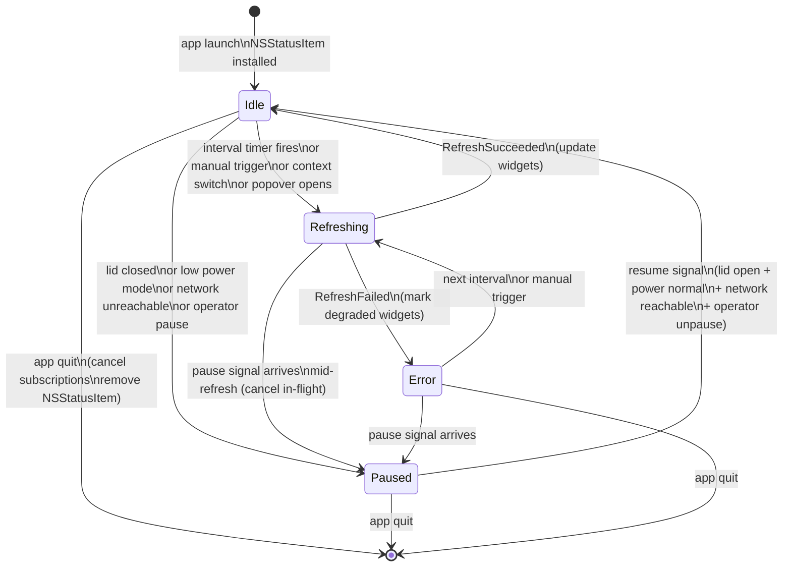
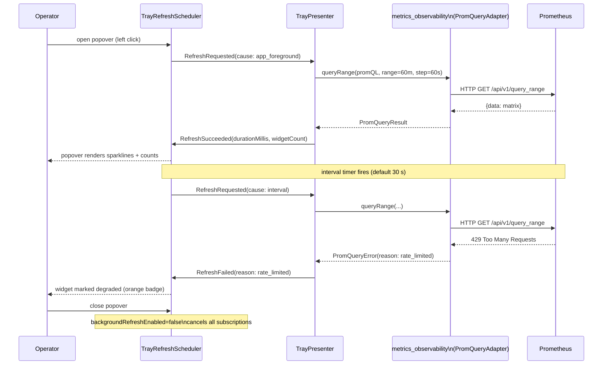

# ADR-0022 — Menu Bar Tray with Live Cluster Metrics

## Status

Proposed

## Context

K8sManager is a macOS-native Kubernetes management application with 13 bounded
contexts after ADR-0021 (app_shell extended with design system and layout). The
operator workflow demands persistent cluster visibility without requiring the
main window to be open or focused. macOS provides three interaction surfaces for
persistent status: `NSStatusItem` in the system menu bar, `MenuBarExtra` from
the SwiftUI scene API, and a free-floating auxiliary `NSWindow`. Each surface
involves trade-offs in customisation depth, energy efficiency, lifecycle control,
and SwiftUI integration.

The tray must satisfy the following operator needs simultaneously:

- At-a-glance cluster health without switching focus from other applications.
- One-click access to live metrics (CPU, memory, pod counts, network rates)
  without opening the full main window.
- Context switching directly from the tray to change the active cluster.
- Quick actions (open main window, open assistant chat, pause refresh, settings).
- Multi-cluster awareness with an operator-configurable "all clusters summary"
  overview mode.
- Graceful degradation when Prometheus is not configured, when the network is
  unreachable, or when the laptop is in low-power mode.
- Energy efficiency compliant with App Store guidelines and Apple's efficiency
  criteria: no background network activity beyond what the operator explicitly
  enables.

The tray is owned by the `app_shell` bounded context. It consumes read models
from `context_navigation`, `cluster_connectivity`, `metrics_observability`,
`resource_browser`, `port_forwarding`, `terminal_session`, and
`cluster_intelligence`. It emits no domain events of its own; context switching
triggers `ContextSwitcher` in `context_navigation` which then emits
`ActiveContextChanged`.

## Decision Drivers

- Native macOS feel and accessibility compliance (VoiceOver, Dynamic Type).
- Full layout control over the popover content area (custom SwiftUI).
- Independent lifecycle: popover opens/closes without affecting the main window.
- Subscriptions to Combine publishers and AsyncSequence streams with
  backpressure; no polling on the main thread.
- Pause and resume mechanics must respond to system events (lid, low power,
  network) without operator intervention.
- Schema-first: all tray state, widget definitions, and refresh events are
  captured in CUE value objects under `contexts/app_shell/schemas/`.

## Considered Options

### Option A — NSStatusItem + NSPopover with SwiftUI content (chosen)

`NSStatusItem` with `variableLength` hosts a template image (Kubernetes helm
symbol as a PDF vector asset compiled into the asset catalog). Clicking the
status item programmatically shows or hides an `NSPopover` whose
`contentViewController` wraps a SwiftUI `NSHostingController`. The popover
content is fully custom SwiftUI. Right-click on the status button presents a
native `NSMenu` with quick actions. The status item button displays a
secondary glyph (a filled orange circle overlay) when the active cluster is
degraded or unreachable, toggled by an `iconState` property on
`#MenuBarTray`.

Pros:

- Full control over popover dimensions and content layout; can host custom
  `Chart` framework sparklines, stacked bars, and multi-line text rows.
- Independent lifecycle: `NSPopover` delegates (`popoverWillShow`,
  `popoverDidClose`) drive subscription start and stop with no coupling to the
  main window.
- `NSMenu` for right-click is native AppKit; no SwiftUI workarounds needed.
- Template images honour macOS appearance and tint colour automatically.
- `NSStatusItem` has been the stable API since macOS 10.0; no deprecation risk.

Cons:

- Requires bridging SwiftUI into `NSHostingController`; minor boilerplate.
- Popover arrow and positioning must be managed manually when the status item
  is near the screen edge.

### Option B — MenuBarExtra SwiftUI Scene

SwiftUI's `MenuBarExtra` scene API (macOS 13+) provides a declarative way to
declare the status item and its popover entirely in SwiftUI without AppKit
bridging. The `.menuBarExtraStyle(.window)` style presents a window-like
surface; `.menuBarExtraStyle(.menu)` presents a native menu.

Pros:

- Pure SwiftUI; no `NSHostingController` bridging.
- Declarative scene lifecycle managed by SwiftUI.

Cons:

- `.menuBarExtraStyle(.window)` does not produce a true `NSPopover`; it renders
  a borderless floating window with fixed placement and no arrow, which does not
  match macOS HIG conventions for status item popover UX.
- Cannot simultaneously support a right-click `NSMenu` and a left-click window
  without dropping down to AppKit, defeating the benefit.
- Scene lifecycle is tied to the SwiftUI app scene graph; pausing subscriptions
  on popover close requires observing `scenePhase`, which is coarser than
  `NSPopover` delegate callbacks.
- Less tested with complex `Chart` framework content embedded alongside
  multiple `AsyncSequence` subscriptions; risk of layout instability under
  rapid data updates.

### Option C — Separate floating NSWindow

A dedicated `NSPanel` or `NSWindow` with `.nonactivating` flag and
`NSWindowStyleMask.borderless` mimics a popover. It can host any SwiftUI
content.

Pros:

- Maximum flexibility for size and positioning.
- No `NSPopover` arrow management needed.

Cons:

- Loses the popover visual language that macOS operators expect; breaks HIG
  convention.
- Window focus management is complex: the panel must not steal focus from
  the foreground application, requiring careful `NSWindowDelegate` handling.
- Requires custom drop-shadow and corner-radius styling to approximate the
  popover look; maintenance burden.
- No accessibility tree relationship between the status button and the floating
  window; VoiceOver cannot announce the popover as related to the button.

## Decision

Adopt **Option A**: `NSStatusItem` with `variableLength`, template image for
the Kubernetes helm symbol, and `NSPopover` hosting a SwiftUI
`NSHostingController`. Right-click opens a native `NSMenu`.

The tray aggregate root is `#MenuBarTray` (schemas/menu_bar_tray.cue). Widgets
in the popover are modelled as a `#TrayMetricWidget` sum type
(schemas/tray_metric_widget.cue). Refresh lifecycle events are modelled as
`#TrayRefreshEvent` (schemas/tray_refresh_event.cue).

## Tray Lifecycle

The tray stays in `Idle` between refresh cycles. The `TrayRefreshScheduler`
DomainService owns the interval timer and emits `RefreshRequested`. The
`TrayPresenter` DomainService processes the response and emits either
`RefreshSucceeded` or `RefreshFailed`.

## Refresh Interaction Sequence

## Popover Content Layout

The popover is 360 pt wide with adaptive height between 400 and 600 pt,
constrained by the sum of rendered widget heights plus fixed padding. Sections
in order:

1. **Header** — cluster selector `Picker` (`Menu` style). Displays the active
   context display name. On selection change, calls `ContextSwitcher.switch(to:)`
   which emits `ActiveContextChanged` in `context_navigation`. The tray
   immediately issues a `RefreshRequested(cause: context_switch)` after the
   event propagates. The status badge appears inline with the cluster name: a
   coloured dot using `statusHealthy / statusWarning / statusError` colour
   tokens from design_tokens.cue. A `last checked X ago` timestamp sits below
   the badge, formatted as a relative duration string.

2. **Live Metrics** — four widgets stacked vertically:
   - CPU usage sparkline (`#SparklineWidget`, yUnit "percent", 60 samples over
     60 minutes, PromQL `sum(rate(node_cpu_seconds_total{mode!="idle"}[2m]))`).
   - Memory usage sparkline (`#SparklineWidget`, yUnit "bytes").
   - Pod count stacked bar (`#StackedBarWidget`, three segments: Running/healthy,
     Pending/warning, Failed/error).
   - Network rx/tx dual-line sparkline (`#SparklineWidget`, yUnit "per_second",
     two series rendered as a dual-line chart using Swift Charts
     `LineMark` with `foregroundStyle(by:)`).

3. **Counts** — a grid of `#CountWidget` cells: Nodes Ready/NotReady,
   Namespaces total, Deployments Available/Total, Pods by status.

4. **Recent Mutations** — `#RecentMutationsWidget` (limit 5). Consumes
   `MutationAuditReadModel` from `resource_browser`. Displays timestamp,
   verb (created/deleted/patched/scaled), kind, resource name, and an outcome
   icon (checkmark.circle/xmark.circle).

5. **Active Sessions** — two `#ActiveSessionsWidget` cells:
   port-forwards (with hover preview listing tunnel specs) and terminal
   sessions. A third cell appears when `cluster_intelligence` MCPInvocationLog
   has active diagnostic traces.

6. **Quick Actions toolbar** — four icon buttons pinned to the bottom of the
   popover: open main window, open assistant chat, pause/resume refresh,
   settings.

## Multi-cluster Mode

`#MenuBarTray.displayMode` controls presentation. When `"active_cluster"` (the
default), all widgets reflect the cluster currently active in
`context_navigation`. When `"all_clusters_summary"`, the header shows an
aggregated health indicator across all known contexts; widgets use PromQL
expressions that aggregate across all configured Prometheus endpoints. The
operator configures this in Settings > Tray.

## Refresh Rate and Pause Mechanics

The operator configures `refreshIntervalSeconds` in Settings > Tray. Valid
values: 5, 15, 30 (default), 60. Setting `manualRefreshOnly = true` disables
the interval timer entirely. The `TrayRefreshScheduler` observes:

- `NSWorkspace.didWakeFromSleepNotification` / `NSWorkspace.screensDidSleepNotification`
  to detect lid events.
- `ProcessInfo.processInfo.isLowPowerModeEnabled` (KVO observable) for low
  power mode changes.
- `NWPathMonitor` path status for network reachability.

Any of these signals issues a `RefreshPaused` event with the appropriate cause.
All three conditions must clear before `RefreshResumed` is emitted.

## Energy and Subscription Strategy

The tray uses Combine publishers bridged from async contexts. Each widget holds
a `Cancellable` reference stored in a `Set<AnyCancellable>`. When the operator
closes the popover and `backgroundRefreshEnabled = false`, the entire cancellable
set is cleared, ending all subscriptions. The interval timer is a
`Timer.publish(every:)` Combine publisher that also goes into the set. When
`backgroundRefreshEnabled = true`, the interval timer subscription is preserved
but refreshes at half the configured rate (e.g., 30 s → 60 s interval) to
reduce background network load.

No PromQL queries are sent on the main thread. All HTTP work goes through the
`PromQueryAdapter` port in `metrics_observability`, which internally uses
`URLSession` on a background queue and delivers results as `AsyncStream` elements.

## Accessibility

Every widget view declares a `.accessibilityLabel` describing its content type
and current value (e.g., "CPU usage sparkline, current 38 percent"). The cluster
status badge uses `.accessibilityValue` to announce the health string. The
cluster picker uses the standard `Picker` accessibility contract. The quick
actions toolbar buttons use `.accessibilityLabel` and `.accessibilityHint`. All
interactive controls meet WCAG 2.1 AA keyboard navigation requirements via
`focusable()` and tab order.

## Prometheus Integration

If `metrics_observability` reports that no Prometheus endpoint is configured,
the four live metrics widgets are replaced by a single empty-state view with the
message "Install Prometheus stack" and a link that opens the settings panel at
the Prometheus configuration section. Counts and recent mutations widgets remain
visible because they are sourced from the Kubernetes API, not Prometheus.

## Settings Keys

All tray preferences are persisted in `local_persistence` under
`app_shell/menu_bar_tray` with schema version `v1`. Keys:

- `displayMode` — "active_cluster" | "all_clusters_summary" (default:
  "active_cluster")
- `refreshIntervalSeconds` — 5 | 15 | 30 | 60 (default: 30)
- `manualRefreshOnly` — bool (default: false)
- `backgroundRefreshEnabled` — bool (default: false)
- `popoverPinned` — bool (default: false)

## Consequences

Positive:

- Operators have continuous cluster health visibility at a glance from any
  application on macOS.
- `NSPopover` lifecycle cleanly controls subscription lifetimes; no memory
  leaks from dangling Combine pipelines.
- Template image for the status item icon automatically adapts to Light/Dark
  appearance and is tinted by the system accent colour in accessibility modes.
- All tray state is schema-validated at startup via CUE; configuration
  corruption is detected before the first refresh.

Negative:

- `NSHostingController` bridging adds a small integration surface that must be
  tested across macOS 14, 15, and 26.
- Multi-cluster aggregated Prometheus queries increase query complexity; PromQL
  templates in `#SparklineWidget.promQLTemplate` must be authored carefully to
  avoid cardinality explosions.
- Background refresh (opt-in) continues HTTP traffic when the main window is
  closed; must be clearly disclosed in the settings UI to comply with App Store
  guidelines.

## Confirmation / Test Criteria

A build satisfies this ADR when all of the following are verified:

1. The tray icon appears in the system menu bar within 2 seconds of application
   launch on macOS 14, 15, and 26.
2. Left-clicking the icon shows an `NSPopover` with width 360 ± 2 pt and height
   between 400 and 600 pt.
3. Right-clicking the icon presents a native `NSMenu` with at minimum: "Open
   K8sManager", "Pause Refresh", "Settings", and "Quit".
4. Selecting a different cluster in the header `Picker` triggers
   `ActiveContextChanged` in `context_navigation` within 500 ms and re-populates
   all widgets within `refreshIntervalSeconds` or less.
5. Closing the popover with `backgroundRefreshEnabled = false` cancels all
   Combine subscriptions; verified by confirming zero outbound HTTP requests
   during a 60-second observation window after close.
6. Putting the system in low-power mode (via `pmset -a lowpowermode 1`) within
   10 seconds sets `trayState = Paused` and stops outbound Prometheus queries.
7. When no Prometheus endpoint is configured, the four sparkline widgets are
   replaced by the empty-state link; counts and mutations rows remain visible.
8. VoiceOver focus traverses all interactive elements in the popover in logical
   reading order and announces meaningful labels for each widget.
9. The tray icon displays an orange overlay dot when `iconState = "degraded"` and
   a greyed-out appearance when `iconState = "offline"`.
10. `TrayRefreshScheduler` respects a local rate limit of 1 query per Prometheus
    endpoint per `refreshIntervalSeconds`; concurrent requests are not issued.
