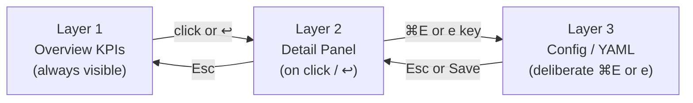
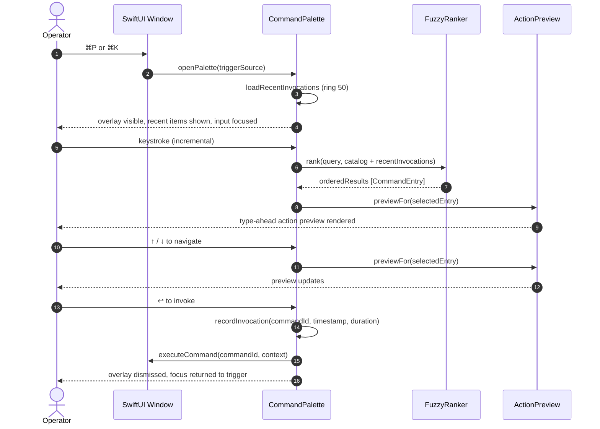

# ADR-0023 — UX Patterns: Command Palette and Keyboard Shortcuts

- Status — Accepted (ratified 2026-05-15)
- Date — 2026-05-15
- Deciders — Fabricio Fonseca
- Consulted — (none yet)
- Informed — (none yet)
- Tags — ux, command-palette, keyboard-shortcuts, accessibility, progressive-disclosure

## Context and problem statement

K8sManager targets experienced Kubernetes operators who live in the terminal and expect every action
to be reachable without lifting their hands from the keyboard. The application presents a dense
information hierarchy — clusters, namespaces, resource kinds, individual resources, metrics, logs,
YAML editors, and embedded terminals — across a macOS SwiftUI NavigationSplitView shell.

Without a coherent keyboard interaction model the following friction points emerge:

- Operators must reach for the mouse to switch between distantly located UI areas.
- There is no single entry point for discovering and executing arbitrary commands regardless of the
  currently focused panel.
- Progressive disclosure — exposing detail only when requested — conflicts with a flat
  always-visible control surface.
- Accessibility requirements (keyboard-only navigation, VoiceOver, WCAG AA, reduce-motion) demand a
  first-class interaction model rather than an afterthought.

This ADR decides the command-discovery strategy and the keyboard shortcut vocabulary for the entire
application shell.

## Decision drivers

- Keyboard-only operators must be able to reach any command within two keystrokes from any screen
  state.
- The interaction model must feel native on macOS (Cmd-based shortcuts, AppKit/SwiftUI focus system)
  while remaining familiar to k9s users.
- Progressive disclosure must be enforceable at the interaction level, not only at the layout level.
- The shortcut vocabulary must be extensible without creating conflicts as new bounded contexts are
  added.
- Accessibility compliance (keyboard-only 100%, VoiceOver labels, WCAG AA contrast,
  `NSWorkspace.accessibilityDisplayShouldReduceMotion`) is non-negotiable.

## Considered options

### Option A — k9s-only keyboard model, no palette

Replicate k9s TUI bindings verbatim inside the macOS window. Single-key commands dominate (`l` logs,
`d` describe, `e` edit, `s` shell, `d` delete). No floating overlay; all navigation via resource
list key events.

Advantages:

- Zero learning curve for k9s veterans.
- No modal overlay implementation cost.

Disadvantages:

- Single-key bindings conflict with native macOS text input (typing in search fields, YAML editors,
  terminal panes).
- Undiscoverable: no visual affordance for commands, no fuzzy search.
- Cannot surface cross-context actions (switch cluster, open settings, apply YAML from disk) without
  a separate menu hierarchy.
- VoiceOver users cannot enumerate available actions in the current context.
- Recent items, context-aware suggestions, and type-ahead preview are impossible.

### Option B — Menu-bar only, no custom shortcuts

Rely entirely on the macOS menu bar (Application, View, Navigate, Window, Help menus) plus the
built-in `NSTextView`/`SwiftUI.focusedSceneValue` shortcut system.

Advantages:

- Zero custom shortcut infrastructure.
- Fully VoiceOver and accessibility-audited by Apple.

Disadvantages:

- Menu traversal is slow for power operators; deeply nested menus for resource-specific actions
  (exec shell on a specific pod) are impractical.
- No command discovery across all resources simultaneously.
- k9s-style positional navigation (`j`/`k`, `l`, `s`) is impossible in a menu model.
- No recent-items, type-ahead, or fuzzy matching.
- Heavy mouse reliance contradicts core operator persona.

### Option C — Hybrid: Command Palette (primary) + k9s-style in-list shortcuts + macOS-native Cmd bindings (chosen)

A floating command palette activated by `⌘P` (primary) or `⌘K` (alternate) provides a unified
fuzzy-search entry point for commands, resources, namespaces, clusters, and recent items. It
coexists with:

- k9s-inspired single-key bindings active only inside resource browser list rows (never inside text
  input or terminal focus).
- macOS-native `Cmd`-prefixed bindings for all destructive and global operations.
- A progressive disclosure model that defers detail and advanced controls behind deliberate
  interactions.

Advantages:

- Single discoverable entry point covers the full command catalog.
- k9s ergonomics preserved in list context without conflicting with text input.
- Native Cmd bindings satisfy macOS HIG and AppKit focus system.
- Type-ahead preview and recent-first ranking reduce time-to-action for repeated operations.
- VoiceOver and keyboard-only navigation are first-class because the palette is an
  accessibility-annotated overlay with full focus trap.

Disadvantages:

- Higher implementation complexity: palette overlay, fuzzy ranker, recent-invocations ring,
  context-aware filtering.
- Two activation shortcuts (`⌘P` / `⌘K`) must be communicated to operators.
- Scope guards for single-key bindings (active only when resource list has key focus) require
  careful SwiftUI focus state management.

## Decision outcome

**Chosen option: Option C — Hybrid Command Palette + k9s-style list shortcuts + macOS-native Cmd
bindings.**

The palette provides the single discoverable entry point that satisfies accessibility requirements
and operator ergonomics simultaneously. k9s bindings are preserved as a muscle-memory layer inside
the resource browser without polluting global shortcut space. Cmd bindings align with macOS
conventions and avoid conflicts with embedded terminal panes.

### Consequences

Positive:

- Operators discover all available actions via one surface regardless of screen state.
- Recent-first ranking and type-ahead preview reduce command latency for repeated workflows.
- Progressive disclosure is enforced by the palette: advanced commands are accessible but not
  visually prominent on the main canvas.
- Accessibility compliance is centralized in a single overlay component with a well-defined focus
  trap and VoiceOver announcement contract.

Negative:

- The palette aggregate (`CommandPalette`, `CommandEntry`, `CommandInvocation`) adds a
  bounded-context schema that must stay synchronized with the runtime command catalog.
- Single-key binding scope guards add SwiftUI `FocusState` complexity and must be regression-tested
  when new panels are introduced.

### Confirmation

The following checks must pass before this ADR moves to Accepted:

- The keyboard-only tour sequence (10 keystrokes from cold start to exec shell) passes as an
  automated XCUITest on every release candidate build.
- The command palette opens within 50 ms of key-down on `⌘P` measured from a warm cache.
- Incremental query response (keystroke to ranked list update) stays below 30 ms on an Apple Silicon
  M1 baseline.
- VoiceOver focus is trapped inside the palette overlay while it is open; pressing `Esc` returns
  focus to the prior element.
- The `ShortcutRegistry` conflict check causes a `fatalError` in debug builds when two conflicting
  bindings are registered at startup.

## Progressive Disclosure Model

The three-layer disclosure model applies to all resource views.



Layer 1 presents aggregate health: pod ready counts, restart counts, age, and the five-color
semantic status (green healthy, red error, yellow warning, blue info, gray unknown). Layer 2 reveals
events, conditions, owner references, and the RED method metrics panel (requests/errors left column,
latency right column, row order matches data flow). Layer 3 exposes the full YAML editor and
advanced config controls. The power-user toggle in settings collapses Layers 1 and 2 into a single
dense list view.

## Command Palette Interaction Model

The palette supports fuzzy search across the full command catalog, recent invocations (ring size
50), resource names, namespace names, and cluster names simultaneously.



The palette is dismissed by `Esc`, by executing a command, or by clicking outside the overlay. Focus
is always returned to the element that held focus before activation.

## Keyboard Shortcut Vocabulary

### Global Cmd bindings (active in all contexts)

```
Action                          Shortcut
------------------------------  ------------
Open command palette            ⌘P / ⌘K
Refresh current view            ⌘R
Filter current list             ⌘F
New terminal tab                ⌘T
Reopen closed terminal          ⌘⇧T
Close active panel              ⌘W
Open settings                   ⌘,
Delete selected resource        ⌘⌫
Navigate history back           ⌘[
Navigate history forward        ⌘]
Switch to pinned cluster 1–9    ⌘1 – ⌘9
```

### Resource browser single-key bindings (active only when list row focused, not in text input or terminal)

```
Key    Action
-----  ----------------------------------------
l      Open log stream
s      Open exec shell or node debug
d      Describe resource
e      Edit YAML
u      Show used-by (owner references and dependants)
y      Copy YAML to clipboard
:      Enter command mode
/      Inline search within list
?      Show hotkey help overlay
```

### Navigation bindings

```
Key        Action
---------  -----------------------------------------------
Ctrl-N     Cycle to next namespace
j / k      Vim-style up/down (opt-in toggle in settings)
Esc        Cancel / close overlay / go up one disclosure level
```

## Accessibility Contract

- The command palette overlay must declare `accessibilityLabel("Command Palette")` and trap focus
  entirely within the overlay while open.
- Every `CommandEntry` must expose `accessibilityLabel` composed from `title` and `subtitle` and
  `keyboardShortcut` fields.
- The type-ahead preview region must post an `accessibilityAnnouncement` on each result-set change
  using `.accessibilityAddTraits(.updatesFrequently)`.
- All animations in the palette open/close transition must check
  `NSWorkspace.shared.accessibilityDisplayShouldReduceMotion` and skip the animation when true.
- WCAG AA contrast: all text on the palette overlay background must achieve minimum 4.5:1 ratio.
- The `?` hotkey help overlay must be navigable via VoiceOver with a flat list of `VStack` rows,
  each row announcing key and action description.

## Metrics Panel Layout (RED Method)

RED method panels within Layer 2 detail views follow a fixed column and row contract:

- Left column: Request rate (req/s), Error rate (errors/s), Error percentage.
- Right column: Latency p50, p95, p99 as a heatmap for bimodal distributions.
- Row order matches data flow: ingress → processing → egress.
- Color semantics applied to threshold brackets: green < warning threshold, yellow warning
  threshold, red error threshold, gray no data.
- Grafana-style drill-down data links: clicking a spike in the request rate chart navigates to the
  log stream filtered to that timestamp range.

## Color Semantics Reference

**Healthy / running** — Green. Pod ready, deployment available.

**Error / failed** — Red. CrashLoopBackOff, OOMKilled, failed job.

**Warning / degraded** — Yellow. Pending > threshold, partial ready.

**Informational** — Blue. Evicted (recoverable), scaled to zero.

**Unknown / no data** — Gray. Metrics unavailable, status unknown.

## Implementation Notes

### SwiftUI Focus State Architecture

The hybrid shortcut model requires explicit SwiftUI `FocusState` management across three independent
focus domains:

1. **Resource browser domain** — `FocusState<ResourceBrowserFocus>` with cases for list rows, filter
   field, and inline search field. Single-key bindings are registered via `.onKeyPress` modifiers
   gated on `.focused($browserFocus, equals: .listRow)`.

2. **Terminal domain** — The embedded terminal pane uses a custom `NSViewRepresentable` wrapping
   `TerminalView`. When the terminal window is first responder the `FocusState` in the SwiftUI layer
   is `.terminal`, suppressing all single-key shortcut handlers above.

3. **Palette overlay domain** — The palette overlay uses a `ZStack` with `.compositingGroup()` and
   posts a custom `focusDomain: .commandPalette` environment value. All `FocusState` bindings
   outside the palette observe this environment value and short-circuit when it is set.

The scope predicate `whenContext` in `#ShortcutBinding` is evaluated by a `ShortcutScopeEvaluator`
value type at key-press time. The evaluator receives the current `ApplicationFocusSnapshot` — a
value type capturing active panel, selected resource kind, and focused element — and returns a
Boolean. This avoids binding activation decisions in view code.

### Fuzzy Ranking Algorithm

The `FuzzyRanker` accepts a query string and a heterogeneous slice of `RankableItem` (conforming
types: `CommandEntry`, `ResourceSummary`, `NamespaceEntry`, `ClusterEntry`). The ranking score for
each item is a composite of:

- **Subsequence match score** — the fraction of query characters that appear in order in the item
  title and keywords, weighted by contiguity (consecutive matches score higher than scattered
  matches).
- **Recency boost** — for items that appear in the `recentInvocations` ring, an exponential decay
  factor `e^(−λ·age_seconds)` is added, with λ = 0.0001.
- **Frequency boost** — items appearing more than once in the ring receive a log-scale multiplier
  capped at ×3.
- **Context relevance** — items with `requiresContext: true` that match the current focused resource
  receive a ×1.5 multiplier. Items with `requiresContext: true` when no resource is focused score
  zero.

The algorithm runs synchronously on the main actor for query lengths ≤ 3 characters (catalog is
small) and off the main actor via `Task.detached` for longer queries, posting results back via
`MainActor.run`.

### Palette Activation Performance Contract

- Cold open (no query, ring hydrated from persistence): result list must appear within 50 ms of
  key-down on `⌘P`.
- Incremental query response (keystroke → ranked list update): latency budget is 30 ms on an Apple
  Silicon M1 baseline.
- The overlay open/close animation is a 180 ms spring animation
  (`response: 0.18, dampingFraction: 0.82`) unless `accessibilityDisplayShouldReduceMotion` returns
  `true`, in which case the animation is skipped entirely (immediate presentation).

### Vim-Style Navigation Opt-In

The `j` and `k` keys are not registered in the default shortcut map. When the operator enables
vim-style navigation in settings, the `ShortcutRegistry` appends two additional `ShortcutBinding`
entries at runtime with `commandId: "list-cursor-down"` and `commandId: "list-cursor-up"` scoped to
`resource_browser`. These bindings are never persisted to the static catalog; they are synthesised
from the `vimNavigationEnabled` preference on each app launch.

### Recent Items and Privacy

The `recentInvocations` ring is persisted locally in the `local_persistence` bounded context under
the key `app_shell/command_palette/recent_invocations`. The ring contains only `commandId`,
`invokedAt`, and `durationMillis` — no resource names, no cluster names, no namespace names, and no
user-typed query strings. Dynamic resource-jump entries (e.g., "Jump to pod nginx-abc123") are
recorded only by their `commandId` slug (`resource-jump`), not by the resource name, to avoid
persisting sensitive infrastructure identifiers.

### Grafana-Style Drill-Down Data Link Contract

When the operator clicks a spike element in the RED method request rate or error rate chart within
the Layer 2 detail panel, the application constructs a `LogNavigationRequest` value containing:

- `resourceKind` — the Kubernetes resource kind of the currently viewed resource.
- `resourceName` — the resource name.
- `namespace` — the current namespace.
- `timestampRangeStart` — the lower bound of the chart bucket the operator clicked, as RFC 3339.
- `timestampRangeEnd` — the upper bound of the chart bucket.

This value is published to the `metrics_observability` bounded context via a shared `EventBus`. The
log stream panel subscribes, opens, and applies the timestamp filter automatically. If the log
stream is already open it seeks to the timestamp without closing and reopening.

### Heatmap Rendering for Bimodal Latency Distributions

The p50/p95/p99 latency heatmap in the Layer 2 detail panel is rendered as a horizontal stacked bar
with three coloured segments. Each segment uses the five-color semantic scheme with thresholds
configurable per-service via annotations on the `Service` resource (annotation key
`k8sm.io/latency-warn-ms` and `k8sm.io/latency-error-ms`). When no annotation is present, default
thresholds of 200 ms (warn) and 1000 ms (error) apply. Bimodal distributions — where p50 is well
below the warn threshold but p99 exceeds the error threshold — are surfaced by rendering the p95 and
p99 bars in a contrasting color even when p50 is green.

### Option D — Considered but Rejected: VS Code-style Activity Bar

A fourth option was considered informally: adopt a VS Code Activity Bar pattern with a left-side
icon strip for switching between major views (Clusters, Resources, Helm, Terminals, Metrics, AI
Assistant). This was rejected because:

- The NavigationSplitView sidebar already provides hierarchical navigation that subsumes the role of
  an activity bar for this domain.
- Activity bars are not a macOS HIG pattern; they belong to the Electron/cross-platform design
  vocabulary and would feel foreign on macOS 14+.
- The sidebar can be toggled and collapsed; an additional chrome element would add clutter without
  proportional discoverability gain given the palette covers the same cross-section navigation.

### Relation to ADR-0021 Design System

The command palette visual design inherits the following tokens from ADR-0021:

- Background: `surface/elevated` semantic color token (adapts light/dark).
- Border radius: `cornerRadius/overlay` (12 pt).
- Shadow: `shadow/modal` (blur 32, opacity 0.24).
- Typography: `type/body/regular` for result titles, `type/caption/secondary` for subtitles.
- Icon size: 20 × 20 pt SF Symbols at weight Regular.

The palette overlay sits in the `overlayWindowLevel` above the main window content but below system
alerts.

### Shortcut Conflict Resolution Policy

When a new bounded context registers commands that require shortcuts, the `ShortcutRegistry`
performs a conflict check at startup:

1. Two bindings are in conflict if they share the same `keyChord` and their `scope` values are not
   disjoint (e.g., one is `global` and the other is `resource_browser` — these are in conflict
   because `global` subsumes `resource_browser`).
2. Two bindings are not in conflict if their `whenContext` predicates are mutually exclusive (e.g.,
   `resource.kind == Pod` vs. `resource.kind == Node`).
3. Conflicts detected at startup cause a `fatalError` in debug builds and a structured log entry at
   `error` level in release builds, with the conflicting binding IDs surfaced in the Diagnostics
   panel.

New bounded contexts must declare their proposed shortcuts in their CUE schema and run `cue vet`
against the `keyboard_shortcut_map.cue` catalog before merging to ensure no conflicts are introduced
silently.

### Command Mode (`:` key)

Pressing `:` in the resource browser activates a command-line input bar at the bottom of the
resource list, mirroring k9s command mode. The operator types a resource kind alias (e.g., `po` for
pods, `deploy` for deployments, `svc` for services) and presses Enter to switch the list to that
resource kind in the current namespace. Tab-completion is provided against the list of known
resource kinds from the API server discovery cache. Esc dismisses command mode and returns focus to
the previously selected row. Command mode is a scoped feature of the resource browser and does not
interact with the global palette.

### Inline Search (`/` key)

Pressing `/` in the resource browser activates an inline filter bar above the list. The operator
types a name prefix or label expression. The list filters in real time; no server round-trip is
required because filtering operates against the locally cached resource list. The filter is cleared
when the operator presses Esc or navigates to a different namespace. The inline search query is not
persisted across sessions. When the inline search is active, single-key bindings (other than Esc)
remain active so the operator can still press `l` to stream logs for the first filtered result
without deactivating the filter.

### History Navigation Stack

The `⌘[` and `⌘]` bindings navigate a per-session history stack maintained by the
`NavigationHistoryService` in the `app_shell` bounded context. Each entry in the stack is a
`NavigationHistoryEntry` value containing:

- `resourceKind` — the Kubernetes resource kind displayed.
- `resourceName` — optional; set when a specific resource detail panel was open.
- `namespace` — the namespace active at the time of navigation.
- `clusterId` — the cluster context UUID.
- `disclosureLayer` — which of the three disclosure layers was active (overview, detail, or YAML).

The stack is bounded to 100 entries per session and is not persisted across launches. History
navigation is disabled inside the palette overlay and the YAML editor to avoid unintended navigation
during editing.

### Pinned Cluster Slots

The `⌘1` – `⌘9` bindings map to a user-configurable ordered list of cluster contexts stored in the
`local_persistence` bounded context under `app_shell/pinned_clusters`. The list has a maximum of
nine entries. Slots are managed via the Settings panel (Clusters tab) or via the `pin-cluster`
command in the palette. When a slot is empty and the corresponding shortcut is pressed, the
application takes no action and posts a brief informational notification indicating the slot is
unassigned.

### Keyboard-Only Tour

The following sequence demonstrates reaching any resource operation from application cold start
without touching the mouse:

1. Application launches; sidebar has focus on the cluster list.
2. Operator presses `⌘1` to switch to pinned cluster one.
3. Operator presses `Ctrl-N` twice to advance to the desired namespace.
4. Operator presses `⌘P` and types "po" to jump to the Pods resource kind.
5. Operator presses Enter; the resource browser shows pods.
6. Operator presses `j` (if vim mode enabled) or arrow keys to select the target pod.
7. Operator presses `l` to stream logs.
8. Operator presses `Esc` to close logs and return to the pod list.
9. Operator presses `s` to open an exec shell.
10. Entire workflow: 10 keystrokes, zero mouse interactions.

This keyboard-only tour is the acceptance benchmark for the interaction model. Automated UI tests
covering this exact sequence must pass on every release candidate build before the release is
considered shippable.

## More information

- ADR-0021 — App shell design system and layout; palette visual tokens (surface/elevated,
  cornerRadius/overlay, shadow/modal) defined there.
- ADR-0022 — Menu bar tray; tray quick-action buttons follow this ADR's accessibility contract.
- ADR-0024 — Analytics dashboard; drill-down navigation events integrate with the palette context
  model.
- ADR-0034 — State-driven realtime UI; `@Observable` read models drive the palette result list.
- `contexts/app_shell/schemas/command_palette.cue` — palette aggregate schema.
- `contexts/app_shell/schemas/keyboard_shortcut_map.cue` — shortcut registry schema.
- `contexts/app_shell/features/command-palette.feature` — palette BDD scenarios.
- `contexts/app_shell/features/keyboard-shortcuts.feature` — shortcut BDD scenarios.
- `contexts/app_shell/features/progressive-disclosure.feature` — three-layer disclosure BDD
  scenarios.
