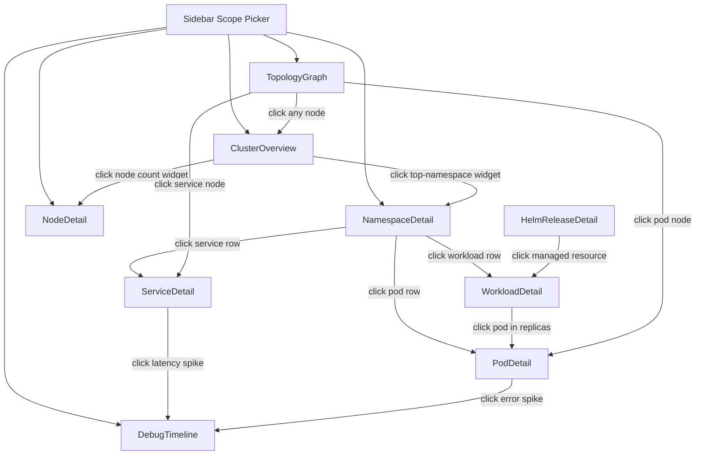
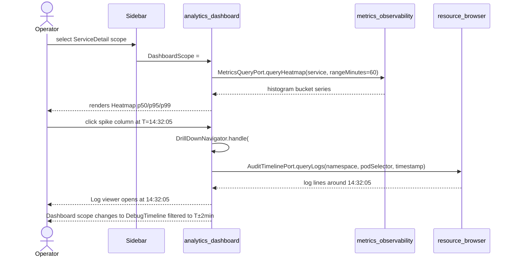

# ADR-0024 — Analytics Dashboard Bounded Context

- Status — Accepted (ratified 2026-05-15)
- Date — 2026-05-15
- Deciders — Fabricio Fonseca
- Consulted — (none yet)
- Informed — (none yet)
- Tags — analytics, dashboard, bounded-context, observability, drill-down

## Context and problem statement

K8sManager currently provides per-resource metric panels rendered inline inside the
`resource_browser` context, drawing data exclusively from `metrics_observability` (Prometheus). As
the application matures, operators request persistent, always-visible dashboards that aggregate data
from multiple bounded contexts simultaneously — Prometheus time-series, Kubernetes object state from
`cluster_connectivity`, resource counts and audit events from `resource_browser`, and Helm release
status from `helm_management`.

A single operator workflow — debugging a latency spike — crosses all four data domains within
seconds: they inspect service request rates (Prometheus), confirm endpoint count
(cluster_connectivity), check recent mutation events (resource_browser audit log), and verify
whether a new Helm revision was deployed (helm_management). No existing bounded context owns this
cross-domain assembly or the UX patterns required to navigate it.

The application therefore needs a dedicated analytics and dashboard layer with the following
characteristics:

- Dashboards are always visible — rendered immediately when the operator selects a scope in the
  sidebar — not opened on demand from a detail view.
- Each scope (Cluster, Namespace, Pod, Node, Workload, Service, Helm Release, DebugTimeline,
  TopologyGraph) has a curated default layout of widgets appropriate to that scope.
- Widgets support drill-down: clicking a data point in one widget navigates to a deeper scope,
  preserving the timestamp and resource context.
- Multiple widget types are needed — sparklines, line charts, heatmaps, stacked bars, count tiles,
  top-N lists, event timelines, topology graphs, log error rate sparklines, manifest diff viewers,
  and conditions lists — which is more than the current inline metric panels in `resource_browser`
  can accommodate.
- Color semantics, RED method layout, USE method layout, progressive disclosure, and data link
  patterns identified in ADR-0023 must be encoded as invariants in the spec, not implementation
  conventions.

This ADR decides whether to create a new `analytics_dashboard` bounded context, extend an existing
context, or build a dependency-free aggregator module.

## Decision drivers

- A single operator debug session crosses Prometheus, Kubernetes object state, audit events, and
  Helm data — no existing BC owns all four ports simultaneously.
- Dashboards must be always visible, not on-demand — a layout and lifecycle model that does not
  exist in any current BC.
- Eleven distinct widget types demand a domain model that is independent of the rendering logic of
  `resource_browser` inline panels.
- Drill-down navigation requires a first-class event type (`DrillDownEvent`) that is meaningless
  inside a data-source BC like `metrics_observability`.
- UX invariants (RED column order, USE grouping, heatmap percentile set, color semantics) must be
  enforced at the spec layer, not left to each widget implementor.
- The `metrics_observability` BC must remain a pure Prometheus adapter — adding aggregation logic
  would violate its single-responsibility and make it harder to replace Prometheus with a different
  backend.

## Considered options

### Option A — Extend `metrics_observability` to become the universal dashboard host

`metrics_observability` would grow ports for `cluster_connectivity`, `resource_browser`, and
`helm_management` in addition to its existing Prometheus port. Dashboard layout, scope presets,
widget catalog, and drill-down events would all be added to its domain model.

**Pros:**

- No new package or BC directory to create.
- Metrics and dashboard code co-located.

**Cons:**

- `metrics_observability` becomes a god context — it would import from three other BCs, violating
  the acyclic-dependency rule for contexts that were intentionally kept isolated.
- The Prometheus-only focus of the context is lost; future work to swap Prometheus for Victoria
  Metrics or Thanos requires changing the dashboard schema simultaneously.
- Widget types that have nothing to do with Prometheus (ConditionsList, TopologyGraph, DiffViewer,
  EventTimeline) would live inside a "metrics" package, confusing the ubiquitous language.
- Scope presets, DrillDownEvent, and WidgetSlot are pure dashboard domain objects; they do not
  belong in a metrics-query context.

### Option B — Build a dependency-free aggregator as a Swift module (no BC schema ownership)

A Swift module `AnalyticsDashboard` would aggregate data at the application layer without owning a
CUE schema or Gherkin feature spec. All types would be Swift structs defined inline.

**Pros:**

- Faster initial implementation — no schema artifacts to maintain.
- No inter-BC dependency rules to enforce at spec level.

**Cons:**

- Without a CUE schema the invariants (UUID format, refresh interval enum, widget kind enum, color
  enum, drill-down action structure) cannot be validated by the spec pipeline.
- Gherkin scenarios for always-visible dashboard behavior, heatmap bimodal detection, and topology
  graph drill-down cannot be traced to a bounded context.
- As the widget catalog grows, the lack of a typed schema causes drift between UI implementation and
  operator-facing documentation.
- Progressive disclosure tiers (Overview / Detail / Config), which are behavioral invariants from
  ADR-0023, cannot be encoded without a spec.

### Option C — Create a new `analytics_dashboard` bounded context (chosen)

A dedicated thirteenth BC owns the dashboard domain model: Dashboard aggregate, WidgetSlot,
AnalyticsWidget value-object sum type, ScopePreset, and DrillDownEvent. It consumes four upstream
BCs through read-only ports and exposes a `DashboardCatalogReadModel` to `app_shell`.

**Pros:**

- Clean separation: `metrics_observability` stays a pure Prometheus adapter; `analytics_dashboard`
  owns the assembly and presentation layer.
- All eleven widget types, nine scope variants, and drill-down event types are specified in CUE and
  validated by the spec pipeline.
- UX invariants (RED layout, USE grouping, color semantics, heatmap percentile set) are
  machine-checkable constraints, not conventions.
- The BC can evolve independently — adding a new scope or widget type does not touch any upstream BC
  schema.
- `app_shell` sidebar consumes a single, stable `DashboardCatalogReadModel` read model; the
  aggregation complexity is hidden behind the BC boundary.

**Cons:**

- Additional BC directory, CUE schemas, Gherkin features, and domain narrative to maintain.
- Four upstream ports introduce coordination overhead when upstream read models change.

## Decision outcome

Create the `analytics_dashboard` bounded context as the thirteenth BC in the K8sManager spec.

The context owns:

- `#Dashboard` aggregate root with nine scope variants and eleven widget slot types.
- `#AnalyticsWidget` value-object sum type covering all eleven widget variants.
- `#ScopePreset` value objects defining the curated default widget layouts for each scope.
- `#DrillDownEvent` value objects modeling the four drill-down navigation intents.
- Three domain services: `DashboardCompositionService`, `WidgetQueryDispatchService`,
  `DrillDownNavigator`.
- Four ports: `MetricsQueryPort` (consumes `metrics_observability`), `ResourceMetadataPort`
  (consumes `cluster_connectivity` and `resource_browser` read models), `AuditTimelinePort`
  (consumes `resource_browser` MutationAuditReadModel and `cluster_intelligence`
  MCPInvocationLogReadModel), `HelmReleasePort` (consumes `helm_management`).

The context exposes one read model to `app_shell`: `DashboardCatalogReadModel` (list of available
scopes for the currently selected Kubernetes context, used to populate the sidebar scope picker).

### Query budget invariant

The following ceilings apply per dashboard scope per refresh cycle and are machine-checkable via the
CUE schema in `docs/arch/contexts/analytics_dashboard/schemas/widget_budget.cue`. They are
invariants — not implementation hints — and may not be relaxed without a new ADR.

**Maximum Prometheus range queries per cycle.** A single refresh of any scope MUST issue at most 5
distinct Prometheus range queries. Query identity is determined by the tuple
`(promQLTemplate, rangeMinutes, scopeParameters)`. Identical tuples within a cycle count as one
query (coalescing is mandatory, not optional).

**Maximum simultaneous widget queries per cycle.** The combined number of in-flight queries across
all data sources (Prometheus range queries plus Kubernetes API list/get calls) for a single scope
MUST NOT exceed 8 at any point during a refresh cycle.

**Refresh interval bounds.** `refreshIntervalSeconds` MUST be at least 5 and at most 60. The default
value is 30. When `NSProcessInfo.isLowPowerModeEnabled` is true (energy-saver mode), the effective
interval MUST be extended to at least 60 seconds; sub-5-second refresh is always prohibited
regardless of mode.

**Widget-level query coalescing.** Widgets that share a PromQL template prefix (the portion of the
expression before the first label-selector clause) MUST be combined into a single multi-result
request before dispatch to `MetricsQueryPort`. `WidgetQueryDispatchService` is the mandatory
enforcement point; individual widget implementations must not bypass it.

### Consequences

Positive:

- `metrics_observability` remains a pure Prometheus adapter; aggregation complexity is fully
  contained in `analytics_dashboard`.
- All eleven widget types, nine scope variants, and drill-down event types are specified in CUE and
  validated by the spec pipeline; UX invariants are machine-checkable.
- `app_shell` sidebar consumes a single, stable `DashboardCatalogReadModel`; upstream complexity is
  hidden behind the BC boundary.
- The BC can evolve independently; adding a new scope or widget type does not touch upstream BC
  schemas.

Negative:

- Additional BC directory, CUE schemas, Gherkin features, and domain narrative to maintain.
- Four upstream ports introduce coordination overhead when upstream read models change.

### Confirmation

A proposed implementation satisfies this ADR when all of the following hold:

1. CUE validation passes on all schemas in `docs/arch/contexts/analytics_dashboard/schemas/` with
   zero errors, including `widget_budget.cue`.
2. All Gherkin scenarios in `docs/arch/contexts/analytics_dashboard/features/` are implemented and
   pass in the acceptance test suite.
3. `metrics_observability` schema and domain narrative contain no references to dashboard layout,
   widget slots, or scope presets.
4. Clicking a spike in a heatmap or sparkline widget emits a `DrillDownEvent` verified by a unit
   test with a mock `AuditTimelinePort`.
5. Dashboard refresh in low-power mode uses an interval of at least 60 seconds.
6. `ColorSemantic` enum rejects any value outside `{healthy, warning, error, info, neutral}`.
7. `HeatmapWidget.percentilesShown` is constrained to `[50, 95, 99]`.
8. `DashboardCatalogReadModel` populates the sidebar scope picker with nine scope variants.
9. `TopologyGraphWidget` renders within 2 seconds for 500 nodes (performance test).
10. All drill-down-emitting widget types are listed in `#WidgetActions`.
11. A synthetic `ClusterOverview` dashboard with 11 widgets issues at most 5 Prometheus range
    queries per refresh cycle. The test constructs a mock `MetricsQueryPort` that records every
    query dispatch; after one full refresh of a `ClusterOverview` scope the recorded count MUST be
    `<= 5`. A count of 6 or more MUST fail the test. This test is part of the acceptance suite and
    runs in CI against every pull request that modifies `WidgetQueryDispatchService` or any
    `ClusterOverview` scope preset.

## Dashboard Scopes

The nine supported scopes and their primary data sources:

**ClusterOverview** — Nodes Ready/NotReady, pods total/Running/Pending/Failed, namespace count,
cluster-wide CPU and memory utilization, deployments Available/Total, top namespaces by CPU and
memory. Sources: `cluster_connectivity`, `metrics_observability`.

**NamespaceDetail** — Workload breakdown by kind, pods per kind stacked bar, network in/out rate,
CPU/memory requests vs limits vs actual usage, top pods by consumption, recent filtered events.
Sources: `cluster_connectivity`, `metrics_observability`, `resource_browser`.

**PodDetail** — CPU and memory time-series with limit/request overlays, OOMKilled correlation (exit
code 137 marker), restart count chart, network rx/tx, disk I/O, log error rate sparkline with data
link to log viewer, events timeline, container breakdown for multi-container pods. Sources:
`metrics_observability`, `cluster_connectivity`, `resource_browser`.

**NodeDetail** — Kubelet metrics, node condition indicators (Ready, MemoryPressure, DiskPressure,
PIDPressure), pod density, image GC activity, top consuming pods, capacity vs allocatable. Sources:
`metrics_observability`, `cluster_connectivity`.

**WorkloadDetail** — Replicas desired vs available time-series, rollout progress indicator, image
version per container, rollout history with age, pod restart rate. Applies to Deployment,
StatefulSet, DaemonSet, and ReplicaSet. Sources: `cluster_connectivity`, `metrics_observability`.

**ServiceDetail** — Endpoints count, selector match status, request rate (RED method: rate on left,
error rate on left, latency on right, row equals data flow direction), latency heatmap p50/p95/p99.
Sources: `metrics_observability`, `cluster_connectivity`.

**HelmReleaseDetail** — Release version timeline, manifest diff between current and previous
revision, hook outcome list with status indicators. Sources: `helm_management`.

**DebugTimeline** — Cross-scope chronological event stream combining Kubernetes object events, audit
log mutations, and assistant tool call invocations. Supports range selection (15m / 60m / 6h / 24h),
filter by resource scope, click-to-drill-down to resource detail, and CSV export. Sources:
`resource_browser` (MutationAuditReadModel), `cluster_intelligence` (MCPInvocationLogReadModel),
`cluster_connectivity`.

**TopologyGraph** — Interactive zoomable graph of owner references (Pod → ReplicaSet → Deployment),
service selector relationships (Service → Endpoints → Pods), and Helm release ownership (HelmRelease
→ all managed resources). Click a node to open its detail scope. Supports PNG export. Sources:
`cluster_connectivity`, `helm_management`, `resource_browser`.

## Widget Catalog

Eleven widget types form the complete set for the initial release:

1. **Sparkline** — 60-minute rolling time series for a single PromQL template. Used for CPU/memory
   at-a-glance indicators.
2. **LineChart** — Multi-series time chart with configurable range and optional threshold overlay.
   Used for CPU/memory trend analysis with request/limit comparison lines.
3. **Heatmap** — Prometheus histogram bucket aggregation rendered as color-coded time columns.
   Displays p50/p95/p99 simultaneously, revealing bimodal distributions invisible to
   single-percentile charts. Used for service latency on ServiceDetail scope.
4. **StackedBar** — Status count columns segmented by label. Used for pod phase distribution
   (Running / Pending / Failed / Succeeded / Unknown).
5. **Count** — Single numeric value with threshold-driven color coding (green / yellow / red). Used
   for nodes ready, deployment availability ratio.
6. **TopList** — Ranked list of top-N resources by a PromQL metric. Used for top namespaces by CPU,
   top pods by memory.
7. **EventTimeline** — Filterable scrollable list of events from k8s_events, mutation_audit,
   assistant_tool_calls, or all sources. Supports time range filter and click-to-drill-down.
8. **TopologyGraph** — Interactive node-edge graph with zoom, pan, and PNG export. Nodes are
   Kubernetes resources; edges are owner references, service selectors, or Helm release ownership.
9. **LogErrorRate** — Sparkline showing log line error rate computed by regex against pod logs, with
   data link: click a spike to open the log viewer at that timestamp.
10. **DiffViewer** — Side-by-side or unified diff of two resource manifests (e.g., Helm revision N
    vs N-1). Used on HelmReleaseDetail scope.
11. **ConditionsList** — Compact indicator list for Kubernetes condition types (Ready,
    MemoryPressure, DiskPressure, PIDPressure). Green checkmark / red X / yellow warning per
    condition. Used on NodeDetail scope.

## UX Invariants

**Always-visible dashboards.** Dashboards are rendered immediately when the operator selects a scope
in the sidebar. There is no "open dashboard" action. This contrasts with the on-demand inline metric
panels in `resource_browser`.

**RED method layout.** For service-level dashboards: request rate column on the left, error rate
column on the left adjacent to request rate, latency column on the right. Each row represents one
logical data flow direction (inbound / outbound). This column order is a schema invariant, not a UI
preference.

**USE method grouping.** For resource-level dashboards (Node, Pod): utilization first, saturation
second, errors third. Widget placement in presets enforces this order.

**Heatmap percentile set.** Heatmaps always display p50, p95, and p99 simultaneously.
Single-percentile display is not permitted for heatmap widgets because it masks bimodal
distributions. A rising P95/P99 with a stable P50 indicates queueing or pool exhaustion; the BC
surfaces this as a `LatencyDivergenceHint` value object passed to the widget renderer.

**Color semantics.** Five colors are used exclusively and consistently across all widget types:
green (healthy), red (error/critical), yellow (warning/degraded), blue (informational/selected),
gray (unknown/no data). Widget schemas enforce color as an enum; arbitrary hex values are rejected.

**Data links.** Clickable widgets emit `DrillDownEvent` values. A click on a time-series spike
produces `#DrillToLogs` with a `timestampRFC3339` set to the click's x-axis value; a click on a
topology node produces `#DrillToScope` targeting the appropriate detail scope. Data links are
first-class domain events, not URL strings.

**Progressive disclosure tiers.** Three tiers as specified in ADR-0023:

- Overview tier (ClusterOverview, NamespaceDetail): KPI count tiles and sparklines.
- Detail tier (PodDetail, NodeDetail, WorkloadDetail, ServiceDetail, HelmReleaseDetail): full
  time-series charts, heatmaps, diff viewers, conditions lists.
- Debug tier (DebugTimeline, TopologyGraph): cross-scope investigation tools, always-visible but
  secondary in the sidebar ordering.

**Auto-refresh with indicator.** Default refresh interval is 30 seconds. A subtle animated indicator
in the dashboard header shows time since last refresh. The refresh mechanism respects macOS
`NSProcessInfo.isLowPowerModeEnabled` — when low-power mode is active the interval doubles.

## Scope Hierarchy and Navigation

## Drill-Down Flow

The following sequence illustrates a latency investigation starting from the ServiceDetail scope.

## Extended test criteria

A proposed implementation satisfies this ADR when all of the following hold (full set — confirmation
summary is in the Decision outcome section above):

1. CUE validation passes on all schemas in `docs/arch/contexts/analytics_dashboard/schemas/` with
   zero errors.
2. All Gherkin scenarios in `docs/arch/contexts/analytics_dashboard/features/` are implemented and
   pass in the acceptance test suite.
3. `metrics_observability` schema and domain narrative contain no references to dashboard layout,
   widget slots, or scope presets — these concepts are exclusively owned by `analytics_dashboard`.
4. Clicking a spike in a heatmap or sparkline widget emits a `DrillDownEvent` value that the
   `DrillDownNavigator` domain service resolves to a concrete scope change or log view open,
   verified by a unit test with a mock `AuditTimelinePort`.
5. Dashboard refresh in low-power mode uses an interval of at least 60 seconds, verified by a unit
   test mocking `NSProcessInfo.isLowPowerModeEnabled = true`.
6. `ColorSemantic` enum in the widget schema rejects any value outside
   `{healthy, warning, error, info, neutral}`, enforced by CUE constraints.
7. `HeatmapWidget.percentilesShown` is constrained to `[50, 95, 99]` in the CUE schema; no other
   percentile set is valid without a schema amendment.
8. The `DashboardCatalogReadModel` is consumed by `app_shell` and correctly populates the sidebar
   scope picker with nine scope variants for a connected cluster.
9. `TopologyGraphWidget` renders within 2 seconds for a cluster with up to 500 nodes using the depth
   limit of 3 hops, verified by a performance test in the acceptance suite.
10. All widget types that produce `DrillDownEvent` values are listed in the `#WidgetActions` value
    object; any widget kind absent from that list is treated as non-clickable by the navigator.

## Schema Invariants Enforced at Spec Level

The following invariants are machine-checkable via the CUE schema pipeline and must never be relaxed
without a new ADR:

**UUID format.** All `id` and `kubernetesContextId` fields use the UUIDv7 pattern
`^[0-9a-f]{8}-[0-9a-f]{4}-7[0-9a-f]{3}-[89ab][0-9a-f]{3}-[0-9a-f]{12}$`. This ensures time-ordered
identifiers that sort naturally in the Dashboard catalog.

**Refresh interval enum.** `refreshIntervalSeconds` is constrained to `5 | 15 | 30 | 60`. No
arbitrary integer values are permitted. The default is 30. Sub-5-second refresh is prohibited to
prevent Prometheus query storms on large clusters.

**Color semantic enum.** `#ColorSemantic` is closed: `healthy | warning | error | info | neutral`.
Any widget configuration referencing a color outside this set is invalid. Implementors may not
introduce a sixth color without amending this ADR and the schema.

**Heatmap percentile constraint.** `HeatmapWidget.percentilesShown` is literally `[50, 95, 99]` in
the CUE schema. A three-element array with those exact values. Single-percentile heatmaps and custom
percentile sets are schema errors.

**Scope kind string match.** Each `#DashboardScope` variant declares a literal `scopeKind` string
(e.g., `"cluster_overview"`, `"pod_detail"`). These strings are the stable identifiers used by
`ScopeRegistryPort` and `DashboardCatalogReadModel`. Changing a `scopeKind` value is a breaking
change and requires a migration path.

**Grid boundary.** `position.col + position.colSpan <= 12` for every `#WidgetSlot`. The 12-column
grid model is fixed. Wider layouts require a grid model change and a new ADR.

**Non-empty layout.** `#ScopePreset.defaultLayout` must contain at least one `#WidgetSlot`
(`[_, ...]` constraint). An empty preset is a spec error.

## Implementation Guidance

The following notes are non-binding guidance for the Swift 6.1 implementation team:

**Port implementations.** Each port (`MetricsQueryPort`, `ResourceMetadataPort`,
`AuditTimelinePort`, `HelmReleasePort`) should be a Swift `protocol` in the `analytics_dashboard`
Swift package. Concrete adapters live in the consuming BC packages and are injected at composition
root.

**Query coalescing.** `WidgetQueryDispatchService` MUST use a dictionary keyed by
`(promQLTemplate, rangeMinutes, scopeParameters)` to deduplicate identical PromQL queries within a
single refresh cycle before dispatching to `MetricsQueryPort`. This is an architectural invariant
(see `### Query budget invariant` above and `widget_budget.cue`), not optional guidance; bypassing
coalescing is a spec violation.

**Auto-refresh and low-power mode.** Use `NSProcessInfo.processInfo.isLowPowerModeEnabled` and
observe `NSProcessInfo.powerStateDidChangeNotification` to dynamically adjust the effective refresh
interval. The initial value should be read at Dashboard load time; the notification observer adjusts
it in real time without a Dashboard reload.

**TopologyGraph layout.** The interactive graph should use a force-directed layout algorithm (e.g.,
ForceAtlas2 or Sugiyama for DAGs). Rendering should be offloaded to a background actor to avoid
blocking the main actor during the 2-second budget for 500-node graphs.

**Drill-down timestamp precision.** When emitting `#DrillToLogs`, the `timestampRFC3339` must
preserve millisecond precision if the chart x-axis resolution is sub-second. Use
`ISO8601DateFormatter` with `fractionalSeconds` option enabled.

## More information

- ADR-0022 — Menu bar tray; tray widget catalog (`tray_metric_widget.cue`) is reused by the
  dashboard for shared widget types.
- ADR-0023 — UX patterns; RED/USE layout, color semantics, and progressive disclosure tiers are
  normative references.
- ADR-0027 — App self-monitoring; the `SelfMonitoring` scope preset is an extension of this BC.
- ADR-0034 — State-driven realtime UI; `@Observable` read models back every widget renderer.
- `contexts/analytics_dashboard/schemas/dashboard.cue` — `#Dashboard` aggregate schema.
- `contexts/analytics_dashboard/schemas/analytics_widget.cue` — widget sum type.
- `contexts/analytics_dashboard/schemas/scope_preset.cue` — default layout presets.
- `contexts/analytics_dashboard/schemas/drilldown_event.cue` — drill-down event types.
