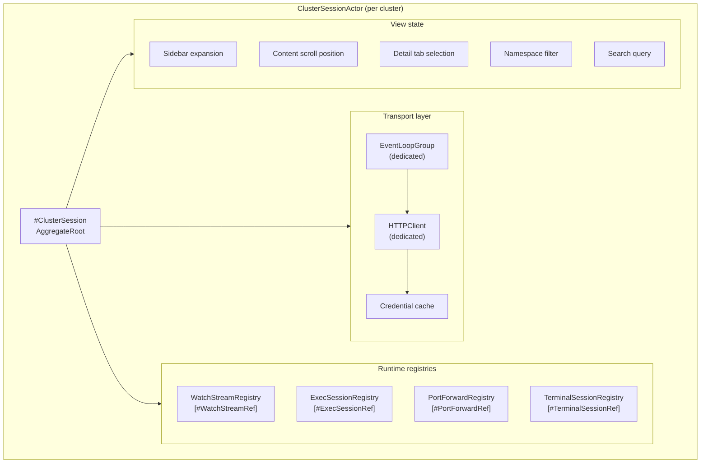
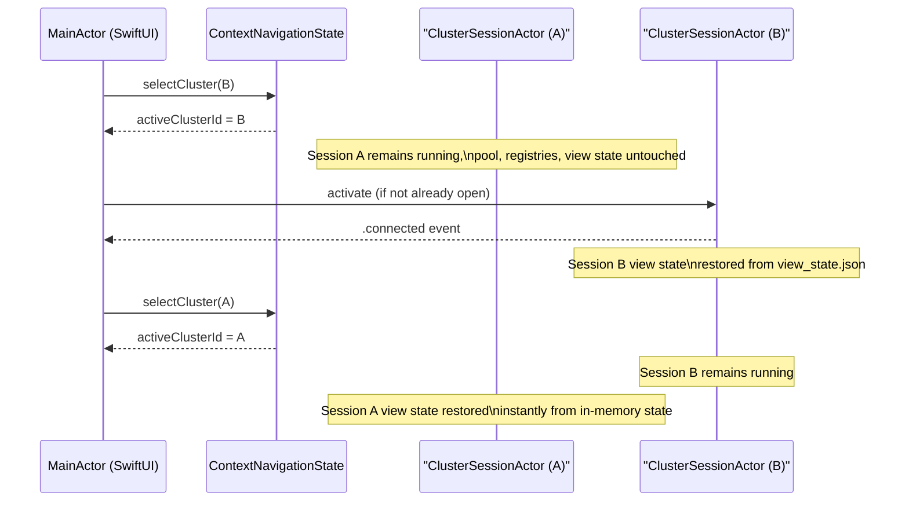

# ADR-0025 — Per-cluster isolation strategy for HTTPClient pools and session state

- Status — Accepted (ratified 2026-05-15)
- Date — 2026-05-15
- Deciders — Fabricio Fonseca
- Consulted — (none yet)
- Informed — (none yet)
- Refines — ADR-0007 (connection pool and persistent keep-alive)
- Tags — architecture, cluster, isolation, connection-pool, swift-concurrency, session

> **Refinement note (2026-05-15).** ADR-0029 supersedes the /2 sizing — the divisor is /4. Earlier
> text retained for context, but the canonical value is `max(2, processorCount / 4)`.

> **Refinement note — kqueue I/O selector (2026-05-15).** ADR-0029 pins the kernel I/O event
> notification mechanism for every `ClusterSessionActor` to `kqueue(2)` via SwiftNIO
> `MultiThreadedEventLoopGroup`. Each `ClusterSessionActor` creates its own
> `MultiThreadedEventLoopGroup` sized at `max(2, ProcessInfo.activeProcessorCount / 4)` event loops.
> Each event loop corresponds to one OS thread and one kqueue file descriptor. `EVFILT_READ` and
> `EVFILT_WRITE` filters drive socket I/O for the session's `HTTPClient`; `EVFILT_USER` drives NIO
> wake-ups; `EVFILT_TIMER` drives scheduled NIO tasks. Session teardown calls
> `EventLoopGroup.syncShutdownGracefully()`, which removes all `kevent` registrations before closing
> the kqueue FD.

> **Refinement note (2026-05-15).** ADR-0007 chose a shared `HTTPClient` instance with per-cluster
> configuration overlays. Operational experience with multi-cluster switching revealed that overlay
> mutation, credential cache invalidation, and watch-stream registry bookkeeping became error-prone
> when state was shared across cluster identities. This ADR supersedes the shared-client model of
> ADR-0007 and replaces it with a fully isolated `#ClusterSession` AggregateRoot per cluster, each
> owning its own `HTTPClient`, `EventLoopGroup`, credential cache, and all runtime registries. The
> trade-off (RAM and event-loop overhead) is accepted in favour of guaranteed zero-leakage isolation
> between clusters.

## Context and problem statement

K8sManager can have multiple Kubernetes clusters active simultaneously. The operator may switch
between them freely, open watch streams, start exec sessions, create port-forward listeners, and run
terminal sessions — all potentially concurrently across different clusters. Under the shared-client
model introduced by ADR-0007, a single `HTTPClient` served all clusters via per-request
configuration overlays. As the feature set expanded to cover watch streams, exec sessions,
port-forward lifecycle management, and terminal sessions, the following problems surfaced:

- **Cross-cluster credential leakage risk** — a bug in overlay selection could apply cluster A's CA
  or bearer token to a request destined for cluster B. Correct overlay dispatch was tested, not
  enforced by construction.
- **Watch registry coupling** — the watch stream registry was shared across clusters; a teardown for
  cluster A required filtering by cluster identifier at every access point.
- **View state entanglement** — sidebar expansion state, content scroll position, detail tab
  selection, namespace filter, and search query were stored in a flat map keyed by cluster
  identifier. The map grew unbounded and was not trivially serialisable per cluster.
- **Exec and port-forward sessions lacked a clear owner** — sessions spawned against cluster A could
  outlive a cluster switch to cluster B, requiring explicit cleanup by callers rather than by
  construction.
- **Terminal session affinity** — terminal sessions are inherently per-cluster; their lifecycle
  needed an enclosing scope to follow.

The desired invariant is: everything that is a function of a specific cluster connection lives
exclusively inside that cluster's session container. Switching away from a cluster does not touch
its container. Tearing down a cluster tears down exactly the right set of resources.

## Decision drivers

- **Zero leakage by construction** — it must be impossible for a request destined for cluster B to
  carry a credential, CA, or connection borrowed from cluster A.
- **Predictable teardown** — shutting down a cluster session must close exactly its own HTTP
  connections, watch streams, exec sessions, port-forward listeners, and terminal sessions — not
  those of any other cluster.
- **Stateful switch semantics** — switching the active cluster preserves view state for every
  cluster independently; returning to a cluster restores its exact previous scroll position, tab
  selection, namespace filter, and search query.
- **Swift 6 strict concurrency** — session lifetime must be expressible without shared mutable state
  visible to more than one task at a time.
- **Operator-friendly resource ceiling** — the cost of N isolated sessions must be clearly
  understood and bounded; the operator accepts the overhead in exchange for correctness.

## Considered options

### Option A — Shared `HTTPClient` with per-cluster configuration overlays (ADR-0007 baseline)

Each cluster contributes a thin `HTTPClient.Configuration` overlay (CA, client cert, proxy hook)
applied per request. All clusters share a single `MultiThreadedEventLoopGroup` and a single
connection pool.

**Pros**

- Lowest resource footprint; one `EventLoopGroup` for all clusters.
- Warm pool latency is minimal even when switching rapidly between clusters.

**Cons**

- Overlay selection is a runtime dispatch; a bug there causes cross-cluster credential use that is
  invisible at compile time.
- Every registry (watch, exec, port-forward, terminal) must carry a `clusterId` discriminator and
  filter at access time.
- View state, credential cache, and other per-cluster runtime data have no natural enclosing scope;
  bookkeeping is ad hoc.
- Teardown on cluster removal requires manual aggregation of all state spread across shared data
  structures.

### Option B — Isolated `HTTPClient` per cluster with shared `EventLoopGroup` (partial isolation)

Each cluster gets its own `HTTPClient` but shares a common `MultiThreadedEventLoopGroup`.

**Pros**

- Eliminates cross-cluster overlay bugs; each client's certificate configuration is fixed at
  construction time.
- Reduces `EventLoopGroup` overhead compared to full isolation.

**Cons**

- Shared event-loop group means one cluster's misbehaving I/O can starve another cluster's event
  loop threads.
- Registries, credential cache, and view state remain unscoped; only the HTTP transport is isolated.
- Partial isolation is harder to reason about than full isolation; reviewers must understand which
  parts are shared.

### Option C — Isolated `#ClusterSession` aggregate per cluster (chosen)

Each cluster materialises a `#ClusterSession` AggregateRoot containing an isolated `HTTPClient`, an
isolated `MultiThreadedEventLoopGroup`, and dedicated registries for all runtime state. A
`ClusterSessionActor` (Swift actor) owns the aggregate and orchestrates all sub-tasks via
`TaskGroup`.

**Pros**

- Zero-leakage by construction: the Swift type system, not runtime dispatch, prevents cross-cluster
  resource access.
- Teardown is trivial: cancel the actor's task group, shut down the client, reap the event-loop
  group.
- Per-cluster view state, credential cache, and all registries have a natural enclosing scope and
  are trivially serialisable per cluster.
- `ClusterSessionActor` directly maps to Swift 6 structured concurrency; no shared mutable state
  crosses actor boundaries.
- Aligns with the `#ClusterSession` AggregateRoot in the domain model.

**Cons**

- N active clusters cost N `EventLoopGroup`s and N `HTTPClient`s. Measured RAM overhead is
  approximately 5–10 MB per cluster at idle.
- Startup time for opening a session includes `EventLoopGroup` creation in addition to TLS
  handshake.
- Idle `EventLoopGroup`s continue to hold OS threads; aggressive shutdown (configurable, default
  off) is required if the operator runs many dormant clusters.

## Pros and cons of the options

### Option A — Shared `HTTPClient` with per-cluster configuration overlays (ADR-0007 baseline)

- Good, because a single `EventLoopGroup` keeps the resource footprint minimal; warm pool latency is
  minimal even when switching rapidly between clusters.
- Bad, because overlay selection is a runtime dispatch — a bug there causes cross-cluster credential
  use that is invisible at compile time and undetectable without a full integration test.
- Bad, because every registry (watch, exec, port-forward, terminal) must carry a `clusterId`
  discriminator and filter at every access point; bookkeeping is ad hoc and error-prone.
- Bad, because teardown on cluster removal requires manual aggregation across shared data
  structures, making it easy to leak resources or leave dangling watch streams.

### Option B — Isolated `HTTPClient` per cluster with shared `EventLoopGroup` (partial isolation)

- Good, because per-cluster `HTTPClient` construction eliminates cross-cluster overlay bugs; each
  client's certificate configuration is fixed at construction time.
- Good, because `EventLoopGroup` overhead is reduced compared to full per-cluster isolation.
- Bad, because a shared event-loop group means one cluster's misbehaving I/O can starve another
  cluster's event-loop threads under load.
- Bad, because registries, credential cache, and view state remain unscoped; only the HTTP transport
  is isolated, making the isolation model harder to reason about and audit.

### Option C — Isolated `#ClusterSession` aggregate per cluster (chosen)

- Good, because zero-leakage isolation is guaranteed by the Swift type system, not by runtime
  dispatch — it is impossible for a request destined for cluster B to carry a credential or
  connection from cluster A.
- Good, because teardown is a single actor cancellation; no manual aggregation across shared data
  structures is required.
- Good, because per-cluster view state, credential cache, and all registries have a natural
  enclosing scope and are trivially serialisable per cluster.
- Bad, because N active clusters cost N `EventLoopGroup` instances and N `HTTPClient` instances;
  measured RAM overhead is approximately 5–10 MB per cluster at idle.
- Bad, because `EventLoopGroup` creation on session open adds a brief latency spike (typically
  20–100 ms) that is absent in the shared-group models.

## Decision outcome

Each cluster that the operator activates or pins materialises exactly one `ClusterSessionActor`
instance. The actor owns a `#ClusterSession` AggregateRoot. Nothing inside a `#ClusterSession` is
accessible from outside that actor.

### What is isolated per `#ClusterSession`

The following resources are created fresh when a `#ClusterSession` is opened and destroyed when it
is terminated:

- `HTTPClient` — one instance per cluster, configured with the cluster's CA, optional client
  certificate, proxy settings, and pool parameters. No overlay dispatch at request time.
- `MultiThreadedEventLoopGroup` — sized at `max(2, processorCount / 4)` threads per cluster
  (canonical value per ADR-0029 refinement; earlier text used `/2` which is superseded). One group
  per cluster eliminates event-loop starvation between clusters.
- **Credential cache** — resolved exec-plugin credentials are cached per-session. Token expiry
  triggers a refresh inside the session; no other session is affected.
- **Watch stream registry** — a `[#WatchStreamRef]` list tracking every active Kubernetes watch
  stream opened against this cluster.
- **Exec session registry** — a `[#ExecSessionRef]` list tracking every active `kubectl exec` (or
  equivalent) channel.
- **Port-forward listener registry** — a `[#PortForwardRef]` list tracking every active local-port
  binding.
- **Terminal session registry** — a `[#TerminalSessionRef]` list tracking every open terminal pane
  pointed at this cluster.
- **View state** — sidebar expansion state, content scroll position, detail tab selection, namespace
  filter string, and search query string. Stored in
  `~/.config/k8smanager/clusters/<clusterId>/view_state.json` (ADR-0026) and loaded into the session
  actor on open.

### Component isolation diagram

### `ClusterSessionActor` concurrency model

`ClusterSessionActor` is a Swift `actor` (per ADR-0011). All mutations to its `#ClusterSession` —
opening a watch stream, registering an exec session, updating view state — go through awaited method
calls. The actor orchestrates sub-tasks via `withThrowingTaskGroup` so that cancellation of the
actor tears down all child tasks in order.

Lifecycle states: `connecting → connected → degraded → disconnected → terminating`. Transitions are
published as `#ClusterSessionEvent` values to any observer holding an `AsyncStream` reference.

### Cluster switch semantics

Switching the active cluster changes the `activeClusterId` in `ContextNavigationState` (ADR-0006)
only. Both the outgoing and the incoming `ClusterSessionActor` continue running. No connection pools
are flushed and no view state is overwritten. The operator returning to the previous cluster finds
their scroll position, tab selection, and search query exactly as they left them.

### Idle pool reaping and aggressive shutdown

The `idleTimeout` from ADR-0007 (`connectionPool.idleTimeout = .seconds(45)`) remains in effect per
session — idle HTTP connections within a session's pool are reaped after 45 s of disuse. The
`EventLoopGroup`, however, remains alive; only HTTP connections are reaped, not the group.

An optional `aggressiveIdleShutdownMinutes` preference (default `0`, meaning disabled) causes
`ClusterSessionActor` to initiate a full teardown (`terminating` → `disconnected`) after the cluster
has been idle for N consecutive minutes. Teardown releases the `EventLoopGroup` and all OS threads
for that cluster. Re-opening the cluster recreates the group from scratch (approximately 50–200 ms
latency penalty).

### Maximum concurrent sessions

The application caps simultaneous live sessions at 8 (configurable via `operator_preferences` in
ADR-0010/ADR-0026). A 9th cluster activation prompts the operator to close one of the existing
sessions. The cap protects against unbounded event-loop thread proliferation on machines with many
kubeconfig contexts.

### Resource accounting

At 8 simultaneous sessions:

- 8 `EventLoopGroup` instances, each with `max(2, processorCount / 4)` threads (canonical per
  ADR-0029). On a 10-core MacBook Pro: `max(2, 10 / 4) = max(2, 2) = 2` threads × 8 = 16 threads
  total for I/O work. Acceptable and conservative relative to the earlier /2 estimate (40 threads),
  leaving more CPU headroom for Swift Concurrency cooperative pool and UI work.
- 8 `HTTPClient` instances, each holding up to `concurrentHTTP1ConnectionsPerHostSoftLimit = 8` idle
  connections. At full load: 64 idle TLS sockets. At idle: 0 (reaped after 45 s).
- RAM per session at idle: approximately 5–10 MB (event-loop thread stacks, pool metadata, registry
  overhead). 8 sessions: 40–80 MB additional resident footprint compared to the single-client
  baseline.

The operator accepted this trade-off in favour of isolation guarantees.

### Consequences

**Positive**

- Zero-leakage isolation is guaranteed by the Swift type system, not by runtime bookkeeping.
- Teardown is a single `actor` cancellation; no manual aggregation across shared data structures.
- View state, registries, and credential cache are trivially per-cluster and naturally serialisable.
- `ClusterSessionActor` maps cleanly onto Swift 6 structured concurrency with no shared mutable
  state escaping actor boundaries.

**Negative**

- RAM overhead is approximately 5–10 MB per active session.
- `EventLoopGroup` creation on session open adds a brief latency spike (typically 20–100 ms).
- The aggressive-shutdown path re-pays TLS handshake cost when a previously terminated cluster is
  re-opened.

**Neutral**

- Maximum 8 concurrent sessions is sufficient for the expected operator profile (DevOps and platform
  engineers typically work with 3–6 clusters simultaneously).
- HTTP/2 multiplexing within a session reduces actual connection counts substantially on managed API
  servers (EKS, GKE, AKS).

### Confirmation

- A unit test opens 3 `ClusterSessionActor` instances concurrently, issues 10 requests against each,
  and asserts that no request against cluster A uses a connection or credential from cluster B.
- A teardown test cancels `ClusterSessionActor` for cluster A while cluster B remains active;
  asserts that B's pool, registries, and view state are unmodified.
- A switch test switches active cluster from A to B 100 times in rapid succession; asserts that both
  `ClusterSessionActor` instances remain alive and their pools are warm on the final read.
- A thread-budget test opens 8 `ClusterSessionActor` instances on a 10-core host and asserts that
  the total number of NIO event-loop threads does not exceed `8 × max(2, processorCount / 4)`
  (canonical divisor per ADR-0029); on 10 cores this bound is 16 threads.
- A memory test idles 8 sessions for 60 s after issuing one request each; asserts that all idle
  connections are reaped and total RSS delta from the baseline is below 80 MB.
- A session-cap test attempts to open a 9th `ClusterSessionActor` and asserts that the application
  emits a `SessionCapExceeded` event and does not spawn the actor.

## More information

- ADR-0007 — Connection pool and persistent keep-alive (superseded in part by this ADR; ADR-0007
  pool parameters carry forward per-session).
- ADR-0010 — Local persistence (view state and registry snapshots are persisted per cluster; see
  ADR-0026 for the filesystem layout).
- ADR-0011 — Swift concurrency conventions (`ClusterSessionActor` is a named addition to the actor
  ownership map).
- ADR-0014 — Port-forwarding lifecycle (`#PortForwardRef` registries live inside `#ClusterSession`).
- ADR-0017 — Terminal sessions (`#TerminalSessionRef` registries live inside `#ClusterSession`).
- ADR-0026 — State persistence and filesystem layout (defines how per-cluster view state is
  serialised and restored on cold launch).
