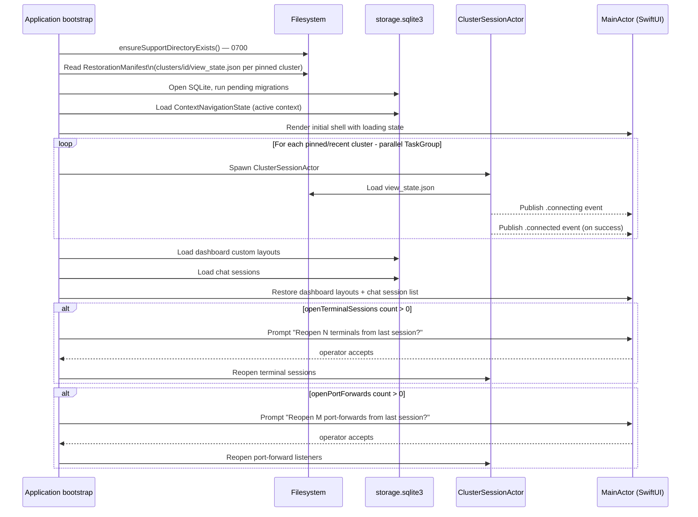

# ADR-0026 — State persistence and filesystem layout under `~/Library/Application Support/K8sManager/`

- Status — Accepted (ratified 2026-05-15; path corrected 2026-05-16)
- Date — 2026-05-15
- Deciders — Fabricio Fonseca
- Consulted — (none yet)
- Informed — (none yet)
- Refines — ADR-0010 (local persistence — SQLite for non-secret state, macOS Keychain for LLM API
  keys)
- Refined by — ADR-0050 (tab persistence path: clusters/`<clusterId>`/open-tabs.json), ADR-0051
  (cluster strip pin order: workspace/cluster-strip-pins.json)
- Tags — persistence, filesystem, storage-path, application-support, cold-launch, restoration

> **Path correction (2026-05-16).** The initial draft of this ADR placed the storage root at
> `~/.config/k8smanager/` following the XDG Base Directory convention. That was an early-draft
> inconsistency carried over from Linux conventions. macOS HIG mandates
> `~/Library/Application Support/` for application data. The storage root is corrected to
> `~/Library/Application Support/K8sManager/`, resolved at runtime via
> `FileManager.default.urls(for: .applicationSupportDirectory, in: .userDomainMask)`. Rationale:
> macOS users expect application data under Application Support; backup tools such as Time Machine
> respect this directory automatically; and the path is correct for both sandboxed and Developer
> ID–distributed builds. The XDG `~/.config` path is not used on macOS outside command-line tools
> that explicitly target cross-platform operators — K8sManager is a native macOS application and
> must follow platform conventions.

> **ADR-0010 refinement note (2026-05-15).** The SQLite storage file formerly specified under
> `~/Library/Application Support/com.archanjo.K8sManager/` in ADR-0010 is now at
> `~/Library/Application Support/K8sManager/storage.sqlite3`. All other rules from ADR-0010 — WAL
> mode, GRDB driver, PRAGMA settings, append-only migrations, Keychain placement under
> `service = "com.archanjo.K8sManager.llm"`, redaction policy, and the `PersistenceActor`
> sole-writer model — carry forward without change. Per-cluster view state and restorable session
> data are stored in per-cluster JSON files under
> `~/Library/Application Support/K8sManager/clusters/<clusterId>/` (ADR-0025), not in the SQLite
> database.

## Context and problem statement

ADR-0010 established the storage strategy (SQLite + macOS Keychain) but fixed the file location at
`~/Library/Application Support/com.archanjo.K8sManager/storage.sqlite3`. As development continued,
three additional requirements emerged:

- **Per-cluster view state** — ADR-0025 introduces per-cluster view state (sidebar expansion,
  content scroll position, detail tab selection, namespace filter, search query) that must be
  persisted and restored independently per cluster. Placing these inside the monolithic SQLite file
  is possible but makes per-cluster reset and operator inspection awkward.
- **Cold-launch restoration** — the application must restore on startup: active navigation context,
  pinned cluster sessions, dashboard layouts, chat sessions, terminal sessions (with opt-in prompt),
  and port-forward listeners (with opt-in prompt). A structured restoration manifest simplifies the
  boot sequence.
- **Consistent path** — the storage root must follow macOS conventions so that Time Machine backs it
  up automatically, App Store sandbox entitlements are straightforward, and macOS users can locate
  application data via "Show in Finder" affordances in System Settings.

## Decision drivers

- **macOS HIG compliance** — `~/Library/Application Support/` is the platform-mandated home for
  application data; deviating requires explicit justification and additional entitlements.
- **Time Machine compatibility** — `~/Library/Application Support/` is automatically included in
  Time Machine backups without any operator configuration.
- **Sandbox-compatible** — `applicationSupportDirectory` is the correct `FileManager` search path
  constant for both sandboxed (App Store) and Developer ID–distributed builds.
- **Per-cluster isolation** — per-cluster view state and restorable session data live under
  `clusters/<clusterId>/` so that removing a cluster context removes exactly one subtree.
- **Privacy by design** — log files must not contain credential material; cache data must be
  clearable independently of application preferences and chat history.
- **Atomic writes** — per-cluster JSON files must survive a hard crash without corruption;
  write-to-tmp-then-rename is the standard approach.
- **Migration safety** — operators who ran an earlier build must not lose data; a first-run prompt
  offers a one-time migration.

## Considered options

### Option A — `~/Library/Application Support/K8sManager/` (chosen)

Use `FileManager.default.urls(for: .applicationSupportDirectory, in: .userDomainMask)` and append
the `K8sManager` component.

**Pros**

- Aligns with Apple platform conventions and macOS HIG.
- Automatic inclusion in Time Machine backups without operator configuration.
- Sandbox-compatible if the app is ever submitted to the App Store.
- No additional entitlements beyond the standard application sandbox.
- `NSFileManager` and SwiftUI "Open in Finder" affordances resolve this path correctly.

**Cons**

- Path is longer and less immediately visible to CLI operators than `~/.config`.
- Operators who use dotfile managers (chezmoi, stow) cannot manage this directory directly.

### Option B — `~/.config/k8smanager/` (XDG — rejected)

Use the XDG Base Directory convention.

**Pros**

- Immediately discoverable by DevOps / platform engineers familiar with `~/.config`.
- Compatible with dotfile management workflows.
- `tar -czf k8smanager-backup.tar.gz ~/.config/k8smanager/` captures everything.

**Cons**

- Deviates from Apple's `~/Library/Application Support` convention; this is an early-draft
  inconsistency carried over from Linux conventions, not a deliberate macOS design choice.
- Requires a hardened-runtime entitlement
  (`com.apple.security.temporary-exception.files. home-relative-path.read-write`) that is not needed
  with Application Support.
- Time Machine does not back up `~/.config` by default; operators must configure exclusions manually
  to avoid this.
- Inconsistent with every other native macOS application the operator uses.

### Option C — Dot-folder in `$HOME` (e.g., `~/.k8smanager/`)

**Pros**

- Single path component; easy to remember.

**Cons**

- `$HOME` dot-folder proliferation is a known usability anti-pattern.
- No separation between application data, cache, and logs.
- No Time Machine coverage by default.

## Decision outcome

The storage root for K8sManager is `~/Library/Application Support/K8sManager/`. The directory is
created on first launch via `ApplicationPaths.ensureSupportDirectoryExists()` with `0700`
permissions. The path is resolved at runtime using:

```swift
FileManager.default
    .urls(for: .applicationSupportDirectory, in: .userDomainMask)
    .first!
    .appendingPathComponent("K8sManager", isDirectory: true)
```

All call sites must use `ApplicationPaths` (defined in `Sources/SharedKernel/Paths/`) rather than
constructing the path inline.

### Complete filesystem layout

```
~/Library/Application Support/K8sManager/
├── storage.sqlite3            # Main SQLite database (WAL, GRDB, ADR-0010 rules)
├── storage.sqlite3-wal        # WAL sidecar (managed by SQLite)
├── storage.sqlite3-shm        # Shared-memory sidecar (managed by SQLite)
├── .instance.lock             # POSIX flock single-instance guard (ADR-0042)
├── cache/                     # Transient caches — safe to delete; reset on app version bump
│   ├── resource_list/         # Kubernetes resource list responses (TTL-keyed)
│   └── prometheus/            # Prometheus query result cache (TTL-keyed)
├── clusters/
│   └── <clusterId>/           # One directory per cluster (clusterId is a UUIDv7)
│       ├── view_state.json    # Sidebar expansion, scroll pos, tab, ns filter, search query
│       ├── restorable_port_forwards.json   # Port-forwards to offer on cold launch
│       └── recent_resources.json           # Recently accessed resources for this cluster
├── logs/
│   └── <yyyy-mm-dd>.log       # Daily rotated app log; max 30 days retained
└── exports/                   # Operator-initiated exports (dashboard CSV, audit log CSV)
```

**Notes on individual entries:**

- `storage.sqlite3` — opened with `journal_mode=WAL`, `synchronous=NORMAL`, `foreign_keys=ON`,
  `busy_timeout=5000`, `cache_size=-65536`. Identical PRAGMAs to ADR-0010; only the path changes.
- `.instance.lock` — `flock(2)` advisory lock; held for the process lifetime (ADR-0042).
- `cache/` — the entire subtree is wiped on app version bump. Any cached value must be fully
  reconstructible from the cluster or from storage. Never put user-authoritative data in `cache/`.
- `clusters/<clusterId>/` — created when a `ClusterSessionActor` is first opened for that cluster;
  removed when the operator deletes the cluster context from the application.
- `view_state.json` — written atomically (write to `view_state.json.tmp`, then `rename(2)`) within 5
  seconds of any state mutation (debounced). Never written on the main actor; the
  `ClusterSessionActor` (ADR-0025) issues the write.
- `restorable_port_forwards.json` — written atomically. Contains the minimal payload to re-establish
  port-forward listeners on next launch, subject to operator opt-in prompt.
- `logs/<yyyy-mm-dd>.log` — written by the logging subsystem; rotated at midnight; files older than
  30 days are deleted by the weekly vacuum task. Log lines must not contain credential material
  (token values, kubeconfig paths with auth data, API key fragments). This is enforced by the
  `RedactionPolicy` (ADR-0010) applied to every log-message formatter.
- `exports/` — written only when the operator explicitly requests a CSV export; not backed up
  automatically.

### Keychain (unchanged)

Keychain entries remain under macOS Keychain with `service = "com.archanjo.K8sManager.llm"` per
ADR-0010. Keychain is OS-managed; it is the correct home for secret material.

### Permissions

The root directory and all subdirectories are created with `0700` permissions via:

```swift
try FileManager.default.createDirectory(
    at: supportDirectory,
    withIntermediateDirectories: true,
    attributes: [.posixPermissions: 0o700]
)
```

### Write rules

- **Debounced write** — any state mutation that is not safety-critical is coalesced into a single
  write within a 5-second window. This prevents continuous I/O churn when the operator scrolls
  rapidly.
- **Atomic write** — per-cluster JSON files use write-to-tmp-then-rename. The `tmp` file is written
  in the same directory as the target so that `rename(2)` is a same-filesystem operation and
  therefore atomic.
- **WAL for SQLite** — concurrent readers and the single `PersistenceActor` writer operate without
  blocking each other under WAL mode.
- **No credential material in files** — the `RedactionPolicy` scans every string before it lands in
  `storage.sqlite3` or any JSON file. Log formatters apply a secondary regex scrub before writing to
  disk.

### Cold-launch restoration flow

On every cold launch the application executes the following sequence:



### First-run migration path

On launch, before opening any storage, the application checks whether the legacy storage file exists
at `~/Library/Application Support/com.archanjo.K8sManager/storage.sqlite3`.

If the legacy file is found **and** `~/Library/Application Support/K8sManager/storage.sqlite3` does
not yet exist, the application presents a one-time migration prompt:

> "K8sManager found an existing database from a previous version at
> `~/Library/Application Support/com.archanjo.K8sManager/`. Move it to
> `~/Library/Application Support/K8sManager/`?"
>
> [Move] [Start fresh]

If the operator confirms:

1. `~/Library/Application Support/K8sManager/` is created.
2. `storage.sqlite3`, `storage.sqlite3-wal`, and `storage.sqlite3-shm` are moved (not copied) to the
   new location.
3. The legacy directory is left in place but empty, so that the operator can confirm the move and
   delete it manually.
4. A `#RestorationPrompt` record with `kind = "migrate_storage_path"` is persisted in the new
   database to record that migration occurred.

If the operator chooses "Start fresh":

1. `~/Library/Application Support/K8sManager/` is created.
2. A fresh `storage.sqlite3` is initialised with the current schema.
3. The legacy directory is left untouched.

If neither file exists (fresh install): step 1 only; no prompt.

### Privacy note

The log files at `~/Library/Application Support/K8sManager/logs/` are intended for operator-facing
diagnostics. They must not contain:

- Bearer tokens, client certificates, or kubeconfig-sourced credentials.
- LLM API key values or key fragments.
- Full content of Kubernetes secret objects.

The `RedactionPolicy` Rego rule enforces this for SQLite writes. For log writes, every log-message
formatter applies a secondary regex pattern matching common credential shapes (base64-encoded JWT
payloads, `Bearer <token>`, `Authorization:` header values) and replaces matches with `[REDACTED]`.

### Backup guidance

An operator wanting a full backup of application state (excluding Keychain secrets and cluster
credentials) may use Time Machine (automatic) or run:

```sh
tar -czf k8smanager-backup-$(date +%Y%m%d).tar.gz \
  ~/Library/Application\ Support/K8sManager/
```

To restore on a new machine: extract and launch the application. The application will find the
existing `storage.sqlite3` and skip the migration prompt. Keychain entries (LLM API keys) must be
re-entered manually; this is the correct security posture.

### Consequences

**Positive**

- Storage root follows macOS HIG; Time Machine backs it up without operator configuration.
- Per-cluster state under `clusters/<clusterId>/` has a natural lifecycle tied to
  `ClusterSessionActor` from ADR-0025.
- No additional hardened-runtime entitlements required beyond the standard application sandbox.
- Sandbox-compatible if the app is ever submitted to the App Store.
- Log rotation (daily, 30-day cap) prevents unbounded disk use.

**Negative**

- Path is less immediately visible to CLI operators than `~/.config`; the "reveal in Finder"
  affordance in Settings is the intended discovery mechanism.
- Keychain backup is a separate workflow; operators must understand that the backup does not include
  their LLM API keys.
- First-run migration adds a conditional code path; it must be tested to prevent data loss.

**Neutral**

- The path change from the draft XDG location is transparent at runtime; `ApplicationPaths`
  centralises the path so no call site needs updating individually.
- SQLite WAL sidecar files (`-wal`, `-shm`) are included in the `tar` backup and are safe to
  restore.

### Confirmation

- A cold-launch test on a fresh machine creates
  `~/Library/Application Support/K8sManager/storage.sqlite3` and confirms `journal_mode` returns
  `wal`.
- `ApplicationPathsTests.test_supportDirectory_endsWithK8sManager` asserts the resolved path ends
  with `K8sManager`.
- `ApplicationPathsTests.test_allPathsUnderSupportDirectory` asserts that `storageURL`,
  `instanceLockURL`, `clusterStateRoot`, and `logDirectory` all share the `supportDirectory` prefix.
- `ApplicationPathsTests.test_ensureSupportDirectoryExists_creates0700` asserts the directory is
  created with `0700` permissions.
- A migration test places a legacy database at
  `~/Library/Application Support/com.archanjo.K8sManager/storage.sqlite3`, launches the app,
  confirms the migration prompt is shown, accepts, and asserts the file is present at the new path
  and absent from the old path.
- A per-cluster view-state test opens two cluster sessions, mutates view state in each, kills the
  app, relaunches, and asserts that both `view_state.json` files were restored correctly.
- A redaction test writes a log message containing a bearer token; asserts that the log file on disk
  contains `[REDACTED]` in place of the token value.

## More information

- ADR-0003 — Kubeconfig read-only; kubeconfig files are not moved or copied to the storage root.
- ADR-0004 — Developer ID distribution; App Store sandbox constraints do not apply, but the chosen
  path is compatible with the App Store if distribution changes in the future.
- ADR-0006 — Bounded contexts; `local_persistence` owns the storage root.
- ADR-0010 — Base persistence decision; GRDB, WAL, Keychain rules carry forward unchanged.
- ADR-0011 — `PersistenceActor` is the sole writer to `storage.sqlite3`.
- ADR-0025 — `ClusterSessionActor` owns per-cluster JSON files under `clusters/<clusterId>/`.
- ADR-0042 — Single-instance enforcement via `flock(2)` on `.instance.lock`.

---

## Addendum — Tab and cluster strip persistence paths (2026-05-16, ADR-0050/ADR-0051 refinements)

ADR-0050 and ADR-0051 introduce two new persistent state artifacts in the filesystem layout:

**Open tabs per cluster** — each cluster's open tab list is persisted to:

```
~/Library/Application Support/K8sManager/clusters/<clusterId>/open-tabs.json
```

This file is written by `OpenTabsActor` (ADR-0050) on every tab mutation, debounced to 500 ms. The
schema is defined in `contexts/app_shell/schemas/open_tabs_state.cue`. The file is restored by
`OpenTabsActor` during cold launch after the cluster session is established. If the file does not
exist (first launch, or after cluster removal), `OpenTabsActor` starts with an empty tab list.

The file follows the same atomic write semantics as other per-cluster JSON files: write to
`open-tabs.json.tmp` in the same directory, then `rename(2)` to `open-tabs.json`.

**Cluster strip pin order** — the ordered list of pinned cluster strip entries is persisted to:

```
~/Library/Application Support/K8sManager/workspace/cluster-strip-pins.json
```

The `workspace/` subdirectory is workspace-global (not per-cluster). It is created by
`ClusterStripActor` (ADR-0051) on first pin operation. The schema is defined in
`contexts/app_shell/schemas/cluster_strip_pin.cue`. The file is restored by `ClusterStripActor`
during cold launch before any cluster session is established, so the strip can display pinned
cluster avatars immediately even while sessions are still connecting.

The atomic-write and redaction rules from the main ADR apply to both files without exception.
