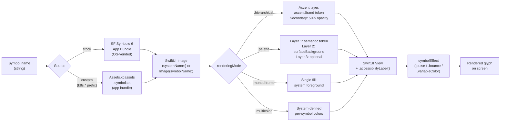

# ADR-0028 — SF Symbols and native iconography

- Status — Proposed
- Date — 2026-05-15
- Deciders — Fabricio Fonseca
- Consulted — (none yet)
- Informed — (none yet)
- Tags — ui, design-system, iconography, accessibility, sf-symbols, a11y
- Refines — ADR-0021

## Context and problem statement

ADR-0021 established the design-system baseline for K8sManager and noted that SF Symbols 6 is the
icon system, using symbol name strings with no raster fallbacks. However ADR-0021 did not define:

- Which specific symbols map to each Kubernetes resource kind, status state, action, and navigation
  element.
- How to handle the ~30 Kubernetes-specific concepts (Pod, Deployment, StatefulSet, DaemonSet, etc.)
  that have no adequate representation in the SF Symbols stock library.
- Which rendering mode (`monochrome`, `hierarchical`, `palette`, `multicolor`) applies to each
  semantic category.
- How symbol variants (`.fill`, `.circle`, `.square`, `.slash`) are selected systematically for
  status vs. structural vs. action contexts.
- How to ensure accessibility labels accompany every `Image(systemName:)` call.
- Which symbol animation effects (`symbolEffect(.bounce)`, `symbolEffect(.pulse)`,
  `symbolEffect(.variableColor)`) apply to dynamic state transitions.

Without a canonical icon catalog two risks compound:

- Different views independently choose symbols for the same Kubernetes kind, producing inconsistent
  presentation across the sidebar, resource list rows, detail pane headers, and toolbar buttons.
- Custom symbol assets are defined ad-hoc per developer rather than embedded once in the app bundle
  under a stable naming convention, breaking upgrade paths and offline availability.

Competing tools (Lens, Headlamp) use emoji or third-party icon libraries (Phosphor, Lucide). Lens
uses emoji in resource rows; these look inconsistent in macOS dark mode and violate the native
application contract. Headlamp bundles SVG icon sets that cannot use SF Symbol rendering modes and
do not adapt to system accent colors.

This ADR closes the iconography specification and establishes the `#IconCatalog` ValueObject as the
single source of truth for all symbol references in K8sManager.

## Decision drivers

- **Native macOS identity** — SF Symbols integrate with SwiftUI rendering modes, system accent
  color, Dark Mode, accessibility, and Dynamic Type without any additional asset pipeline.
  Third-party icon libraries cannot access these platform features.
- **No emoji in UI** — Emoji in resource rows look inconsistent at small sizes and in Dark Mode.
  They carry cultural connotations and vary across OS versions. The policy is zero emoji in any
  interactive UI surface.
- **No raster icons** — PNG and JPEG icons at fixed resolutions look blurry on Retina displays at
  non-integer scale factors. SF Symbols are vector-based and render crisply at every point size.
- **Custom symbols for Kubernetes-specific glyphs** — SF Symbols 6 does not include glyphs for
  Deployment, StatefulSet, DaemonSet, Pod, or the Kubernetes helm-wheel brand mark. These must be
  authored as custom `.symbolset` assets and embedded in the app bundle.
- **Accessibility** — Every `Image(systemName:)` or `Image(symbolName:)` call must declare an
  `.accessibilityLabel()`. This cannot be deferred to a later milestone; the catalog encodes the
  canonical label alongside the symbol name.
- **Rendering mode discipline** — Hierarchical and palette modes are prioritised. Monochrome is used
  only for toolbar items that must follow the system tint. Multicolor is used only when the
  system-provided multicolor variant is semantically correct.
- **Symbol effects** — The `symbolEffect` API (iOS 17 / macOS 14+) provides `pulse`, `bounce`, and
  `variableColor` animations. These are appropriate for status transitions (pending → healthy) and
  must be documented to avoid overuse.
- **Offline availability** — Custom `.symbolset` assets are embedded in the app bundle. No network
  request is required to resolve any icon. This is a hard requirement given the operator context
  (air-gapped clusters, restricted networks).

## Considered options

### Option A — SF Symbols stock library only; fall back to text abbreviation for unmapped kinds

Use only the ~6000 symbols shipped with SF Symbols 6. For Kubernetes-specific kinds that have no
adequate symbol mapping (Pod, Deployment, StatefulSet, DaemonSet, the Kubernetes brand helm-wheel),
use a text abbreviation badge (e.g., "STS", "DS") instead of an icon.

Advantages:

- Zero custom asset authoring. No `.symbolset` design work.
- App bundle is smaller.
- All symbols are guaranteed to be available on macOS 14+ without any asset catalog.

Disadvantages:

- Text abbreviation badges are semantically weak and language-dependent. They do not communicate
  resource kind at a glance the way an icon does.
- Kubernetes-native visual vocabulary (the pod cubic outline, the deployment-arrows glyph) is
  absent. Competing tools that do use kind-specific glyphs will appear more polished.
- The app icon glyph (helm-wheel) cannot be produced from stock SF Symbols. The app would require a
  different brand mark or a raster app icon with no matching in-app symbol.
- Operators familiar with kubectl iconography (used by Lens, k9s, Headlamp) lose a recognisable
  visual vocabulary.

### Option B — Phosphor or Lucide third-party icon library

Bundle the Phosphor or Lucide SVG icon sets. Both have Kubernetes-specific icons. Reference icons by
name via a wrapper view that loads SVG from the bundle.

Advantages:

- Kubernetes-specific glyphs exist in both libraries (Phosphor ships a `cube` for Pod, Lucide ships
  a `box`).
- Uniform visual style across all icons without custom authoring.
- No dependency on SF Symbols rendering modes; icons render identically across all macOS versions.

Disadvantages:

- SVG icons cannot use SF Symbol rendering modes (hierarchical, palette, multicolor). They do not
  adapt to system accent color automatically. Color variants must be managed manually.
- No `symbolEffect` API for animations. Pulse and bounce effects require custom animation code per
  icon.
- No `.symbolVariant` modifier support. Selecting the filled vs. outline variant requires loading a
  different named asset rather than applying a SwiftUI modifier.
- Bundle size increases by ~800 KB (Phosphor regular weight) or ~600 KB (Lucide).
- Accessibility labels must still be provided manually; the framework provides no auto-labeling.
- Violates the native macOS contract. System components (Finder, Activity Monitor, Xcode) use SF
  Symbols exclusively; mixing SVG icons produces an inconsistent visual texture.
- License: Phosphor is MIT but requires maintaining attribution in release notes. Lucide is ISC.

### Option C — Mixed approach: SF Symbols for generic concepts, third-party library for Kubernetes-specific kinds

Use SF Symbols for navigation, action, and status icons, and a subset of Phosphor or Lucide for
Kubernetes-specific resource kinds only.

Advantages:

- Reduces custom asset authoring to zero (no `.symbolset` design required).
- Kubernetes-specific visual vocabulary from a maintained library.

Disadvantages:

- Two icon systems with different visual weight and corner-radius conventions. The visual texture of
  the sidebar and resource list becomes inconsistent: SF Symbol structural icons have one stroke
  weight; Phosphor icons have a different weight at the same point size.
- Rendering modes cannot be unified. SF Symbol structural icons use hierarchical tinting; Phosphor
  icons require manual tint application. Status colors and accent-color propagation diverge.
- The mixing boundary is arbitrary and unclear to future contributors ("why is Service an SF Symbol
  but StatefulSet a Phosphor icon?").
- Maintenance surface doubles: both the SF Symbols version and the Phosphor/Lucide version must be
  tracked.

### Option D — SF Symbols stock + custom `.symbolset` embedded in app bundle (chosen)

Use SF Symbols 6 for all concepts that map cleanly to stock symbols. Author custom `.symbolset`
assets for the Kubernetes-specific concepts that have no adequate stock mapping. Embed all custom
symbols in `Assets.xcassets`. Define the complete mapping in `#IconCatalog` (CUE ValueObject). This
is the chosen option.

Advantages:

- All icons participate in the same rendering pipeline: hierarchical, palette, multicolor, and
  monochrome modes work uniformly whether the symbol is stock or custom.
- `symbolEffect` animations work on custom symbols.
- `.symbolVariant` works on custom symbols.
- `.accessibilityLabel()` discipline is enforced at the catalog level, not as an afterthought per
  call site.
- Offline availability is guaranteed (all assets are bundle-embedded).
- No third-party icon library dependency, no license management.
- Visual consistency: a single stroke-weight convention governs both stock and custom symbols
  because custom symbols are designed to match SF Symbols guidelines.

Disadvantages:

- Custom `.symbolset` authoring requires a design tool (SF Symbols app) and a designer pass.
  Approximately 10–12 custom symbols must be authored for the initial set.
- Custom symbols must be re-exported if the SF Symbols template updates in a future macOS version
  (low cadence risk; SF Symbols template changes are infrequent).
- The `#IconCatalog` schema must be maintained as new resource kinds are supported.

## Decision outcome

Chosen option — **Option D (SF Symbols stock + custom `.symbolset`)**, because:

- It preserves the native macOS rendering pipeline for all icons without exception.
- Custom symbols authored to the SF Symbols template guidelines integrate with rendering modes,
  accessibility, and animation APIs identically to stock symbols.
- The `#IconCatalog` CUE schema creates a single, machine-readable catalog that can be validated at
  CI time, referenced in Gherkin scenarios, and used to generate Swift constants for symbol names.
- The design cost (~10–12 custom symbols) is bounded and front-loaded rather than accreting per-view
  over time.

### Icon rendering pipeline



### Rendering mode policy by semantic category

**Navigation (sidebar items, toolbar)** — `.hierarchical`. Adapts to `accentBrand` token; secondary
layer at 50% opacity provides depth.

**Status badges (healthy / warning / error / pending / unknown)** — `.palette`. Layer 1 = status
semantic token; layer 2 = `surfaceBackground`. Passes WCAG 3:1.

**Resource-kind badges (sidebar + list row leading area)** — `.hierarchical`. Uses `kindAccent*`
token as primary layer. `.multicolor` only when system variant is available and semantically
correct.

**Action buttons (toolbar, context menu)** — `.monochrome`. Actions must follow system tint; color
must not override the operator accent preference.

**Brand / app icon glyph** — `.palette`. Helm-wheel rendered with `accentBrand` on outer spokes and
`brandNavy` on hub.

### Symbol variant policy

- Status indicators always use the `.fill` variant (`checkmark.circle.fill`,
  `exclamationmark.triangle.fill`, `xmark.octagon.fill`, `clock.fill`). Filled variants have higher
  visual weight and are easier to read at small badge sizes.
- Navigation and structural icons use the `.default` (outline) variant unless the `.fill` variant is
  required for active/selected state disambiguation.
- `.circle` and `.square` variants are used only when the surrounding layout requires a consistently
  bounded shape (e.g., avatar-style container icons).
- `.slash` variant is used only for the "disabled" or "blocked" semantic (e.g., network policy
  blocking state).

### Symbol effect policy

**Resource entering pending state** — `.symbolEffect(.pulse)` on `clock.fill`. Applied while status
== pending.

**Health check in progress** — `.symbolEffect(.pulse)` on `checkmark.circle.fill`. Applied during
probe interval.

**Port-forward activity** — `.symbolEffect(.variableColor)` on `arrow.up.arrow.down.circle`. Applied
while bytes are transferred.

**Error state arrival** — `.symbolEffect(.bounce)` on `xmark.octagon.fill`. One-shot on state
transition.

**No-op / stable state** — No effect. Default; effects are not applied to stable states to avoid
visual noise.

When `reduceMotion` is `true` (operator preference or system `accessibilityReduceMotion`), all
`symbolEffect` modifiers degrade to the static rendering. The `symbolEffect` API respects
`accessibilityReduceMotion` natively on macOS 14+.

### Custom symbol naming convention

All custom `.symbolset` assets use the `k8s.` prefix followed by a hyphen-separated semantic name in
lowercase. The prefix guarantees no collision with future SF Symbols additions. Examples:

- `k8s.pod` — cubic outline glyph for the Pod resource kind.
- `k8s.deployment` — arrows-around-squares glyph for Deployment.
- `k8s.statefulset` — ordered-stack glyph for StatefulSet.
- `k8s.daemonset` — broadcast glyph for DaemonSet.
- `k8s.helm.wheel` — 7-spoke ship's wheel matching the Kubernetes brand mark. Used as the app icon
  glyph and for Helm releases.

Custom symbols are designed at the SF Symbols medium weight template (Regular) and include Regular,
Semibold, and Bold weight variants. Ultralight through Black variants are omitted to reduce asset
size; the SwiftUI system will interpolate towards the nearest available weight.

### Accessibility label policy

Every `Image(systemName:)` or custom symbol `Image(symbolName:)` call site must declare:

```swift
Image(systemName: "checkmark.circle.fill")
    .symbolRenderingMode(.palette)
    .foregroundStyle(Color.statusHealthy, Color.surfaceBackground)
    .accessibilityLabel(Text("Status: Healthy"))
```

The canonical accessibility label string for each catalog entry is defined in `#IconCatalog` and
must be used verbatim at every call site. Views MUST NOT declare ad-hoc label strings for symbols
that appear in the catalog. A SwiftUI `ViewModifier` (`IconView`) wraps the lookup and label
application so call sites cannot accidentally omit the label.

### Complete icon mapping (canonical)

The complete mapping is normalised in `icon_catalog.cue` (CUE ValueObject `#IconCatalog`) in
`contexts/app_shell/schemas/`. The table below is a human-readable extract for documentation
purposes.

```yaml
# icon-catalog — human-readable extract (canonical source: icon_catalog.cue)
# Fields: id (slug) | symbol-name | rendering-mode | variant | semantic | custom

nav-cluster:
  rectangle.3.group                                           | hierarchical | default | navigation
  | No
nav-namespace:
  folder                                                       | hierarchical | default | navigation
  | No
kind-pod:
  k8s.pod                                                      | hierarchical | default |
  kind       | Yes
kind-deployment:
  k8s.deployment                                               | hierarchical | default |
  kind       | Yes
kind-statefulset:
  k8s.statefulset                                              | hierarchical | default |
  kind       | Yes
kind-daemonset:
  k8s.daemonset                                                | hierarchical | default |
  kind       | Yes
kind-job:
  clock                                                        | hierarchical | default |
  kind       | No
kind-cronjob:
  clock.arrow.circlepath                                       | hierarchical | default |
  kind       | No
kind-service:
  antenna.radiowaves.left.and.right                            | hierarchical | default |
  kind       | No
kind-ingress:
  arrow.left.and.right.righttriangle.left.righttriangle.right  | hierarchical | default |
  kind       | No
kind-configmap:
  doc.text                                                     | hierarchical | default |
  kind       | No
kind-secret:
  lock.doc                                                     | hierarchical | default |
  kind       | No
kind-pvc:
  externaldrive                                                | hierarchical | default |
  kind       | No
kind-pv:
  externaldrive.connected.to.line.below                        | hierarchical | default |
  kind       | No
kind-storageclass:
  externaldrive.badge.checkmark                                | hierarchical | default |
  kind       | No
kind-networkpolicy:
  shield                                                       | hierarchical | default |
  kind       | No
kind-role:
  person.badge.key                                             | hierarchical | default |
  kind       | No
kind-clusterrole:
  person.badge.key                                             | hierarchical | default |
  kind       | No
kind-rolebinding:
  person.2.badge.key                                           | hierarchical | default |
  kind       | No
kind-clusterrolebinding:
  person.2.badge.key                                          | hierarchical | default |
  kind       | No
kind-serviceaccount:
  person.crop.circle.badge.checkmark                           | hierarchical | default |
  kind       | No
kind-crd:
  rectangle.dashed                                             | hierarchical | default |
  kind       | No
kind-node:
  server.rack                                                  | hierarchical | default |
  kind       | No
kind-helm-release:
  shippingbox                                                  | hierarchical | default |
  kind       | No
action-event:
  exclamationmark.bubble                                       | monochrome   | default |
  action     | No
action-log:
  doc.text.magnifyingglass                                     | monochrome   | default |
  action     | No
action-terminal:
  terminal                                                     | monochrome   | default |
  action     | No
action-port-forward:
  arrow.up.arrow.down.circle                                   | monochrome   | default |
  action     | No
nav-assistant:
  bubble.left.and.bubble.right                                 | hierarchical | default | navigation
  | No
nav-metrics:
  chart.line.uptrend.xyaxis                                    | hierarchical | default | navigation
  | No
nav-settings:
  gearshape                                                    | monochrome   | default | navigation
  | No
status-healthy:
  checkmark.circle.fill                                        | palette      | fill    |
  status     | No
status-warning:
  exclamationmark.triangle.fill                                | palette      | fill    |
  status     | No
status-error:
  xmark.octagon.fill                                           | palette      | fill    |
  status     | No
status-pending:
  clock.fill                                                   | palette      | fill    |
  status     | No
status-unknown:
  questionmark.circle                                          | palette      | default |
  status     | No
brand-app-icon:
  k8s.helm.wheel                                               | palette      | default |
  brand      | Yes
```

### Consequences

Positive:

- A single `#IconCatalog` ValueObject is the canonical source for all symbol references. No view
  invents symbol names ad-hoc.
- Custom symbols with the `k8s.` prefix namespace never collide with future SF Symbols additions.
- CUE validation at CI time ensures every catalog entry has a non-empty `accessibilityLabel`, a
  declared `renderingMode`, and a `semantic` tag.
- The `IconView` SwiftUI wrapper enforces label application at every call site; a missing label is a
  compile-time error (the wrapper is not optional).
- Symbol effects are applied only at state transitions and are automatically suppressed by
  `accessibilityReduceMotion`, eliminating the manual reduce-motion guard code present in many
  animation sites.
- Offline availability is guaranteed for all custom symbols.

Negative:

- Custom `.symbolset` authoring for the initial ~12 symbols requires design tooling (SF Symbols
  application) and a designer pass. This is the primary non-trivial cost of this decision.
- The `#IconCatalog` must be updated whenever a new Kubernetes resource kind is added to the kind
  catalogue (ADR-0013). This is an ongoing maintenance obligation.
- SF Symbols on macOS 14 is version 5; SF Symbols 6 features (new symbols, new effects) require
  macOS 15+. The catalog must annotate which entries require macOS 15+ and provide macOS 14 fallback
  names where necessary.

### Confirmation

The following checks must pass before this ADR moves to Accepted:

- All 12 custom `.symbolset` files (k8s.pod, k8s.deployment, k8s.statefulset, k8s.daemonset,
  k8s.helm.wheel, and the remaining kind-specific symbols) have been exported from the SF Symbols
  app and embedded in `Assets.xcassets`.
- A SwiftUI Previews snapshot test renders each `#IconCatalog` entry in both light and dark
  appearances at 16 pt and 32 pt point sizes and asserts that the image is non-empty and the
  accessibility label is non-empty.
- A CUE lint rule enforces that every `#IconEntry` with `isCustomSymbol: true` uses a `symbolName`
  prefixed with `"k8s."`.
- A CUE lint rule enforces that every `#IconEntry` has a non-empty `accessibilityLabel` string.
- A code search in CI confirms that no view file in the `AppShell` target calls `Image(systemName:)`
  or `Image(symbolName:)` outside the `IconView` wrapper (exceptions: the `IconView` wrapper
  implementation itself and the Color Asset Catalog preview target).
- The `icon-catalog.feature` BDD scenarios pass in the XCUITest suite for the relevant operators.

## Pros and cons of the options

### Option A — SF Symbols stock only, text abbreviation for unmapped kinds

Positive: Zero asset authoring; minimal app bundle overhead.

Negative: Text badges are semantically weak; no Kubernetes visual vocabulary; app icon glyph cannot
be produced; inconsistent with operators familiar with kind-specific glyph vocabulary in Lens/k9s.

### Option B — Phosphor or Lucide third-party icon library

Positive: Kubernetes-specific glyphs available; no custom authoring.

Negative: Cannot use SF Symbol rendering modes, `symbolEffect` API, or `.symbolVariant`; SVG color
management is manual; violates native macOS visual contract; adds ~600–800 KB dependency; license
management required.

### Option C — Mixed SF Symbols and third-party

Positive: Reduces custom authoring burden.

Negative: Two visual systems with different stroke weights; rendering mode unification impossible;
mixing boundary is arbitrary; doubles maintenance surface.

### Option D — SF Symbols + custom `.symbolset` (chosen)

Positive: Unified rendering pipeline; full rendering mode / symbolEffect / symbolVariant support;
accessibility discipline enforced by catalog schema; offline availability; no third-party
dependency.

Negative: Custom symbol authoring cost (~12 symbols) up-front; catalog must be maintained as kind
catalogue grows; SF Symbols version caveat for macOS 14 vs. 15+ features.

## Implementation notes

### `IconView` SwiftUI wrapper

The canonical usage pattern at call sites is:

```swift
IconView(catalog: .kindPod, size: 20)
    // resolves symbolName, renderingMode, variant, tint, and accessibilityLabel
    // from #IconCatalog automatically
```

`IconView` is a generic `View` that accepts an `#IconCatalog.Id` enum case and a `CGFloat` point
size. Internally it constructs the correct `Image`, applies `.symbolRenderingMode`,
`.foregroundStyle`, and `.accessibilityLabel` in one place. Symbol effects are applied via a
separate `.iconEffect(_ effect:)` modifier that checks `accessibilityReduceMotion` before applying.

### CUE validation rules

Three CUE `#constraint` rules are added to `icon_catalog.cue`:

1. `accessibilityLabel` must match `[a-zA-Z0-9 :,()'-]+` and must not be empty.
2. If `isCustomSymbol == true`, `symbolName` must match `^k8s\.`.
3. `renderingMode` must be one of the four declared enum values; `variant` must be one of the five
   declared enum values.

### Offline and sandbox availability

Custom `.symbolset` assets are embedded in the main app bundle under `Assets.xcassets/Symbols/`.
They are read via `Image(symbolName: "k8s.pod")` (the SwiftUI API for custom symbols in the asset
catalog). No network request is issued. App Sandbox restrictions do not affect asset catalog access.

### macOS 14 fallback mapping

Entries that use SF Symbols 6 new symbols (added in macOS 15 / Xcode 16 era) must declare a
`macOS14FallbackName` field in `#IconEntry`. The `IconView` wrapper resolves the fallback name when
`#available(macOS 15, *)` is false. Entries without a fallback name imply the stock symbol is
available on macOS 14+.

## More information

- ADR-0001 — Swift + SwiftUI + macOS-native commitment.
- ADR-0013 — Resource browser scope and kind catalogue; drives the minimum set of kind entries in
  `#IconCatalog`.
- ADR-0021 — App shell design system; established SF Symbols 6 as the icon system; this ADR provides
  the detailed specification that ADR-0021 deferred.
- `icon_catalog.cue` — canonical CUE schema for `#IconCatalog`, `#IconEntry`, `#SymbolRenderHint`.
- `icon-catalog.feature` — BDD scenarios covering kind consistency, status fill variants, dark/light
  palette resolution, offline availability, accessibility label presence, and pulse effect for
  pending state.
- `design_tokens.cue` — `#ColorTokens` referenced by `#SymbolRenderHint.tints`.
