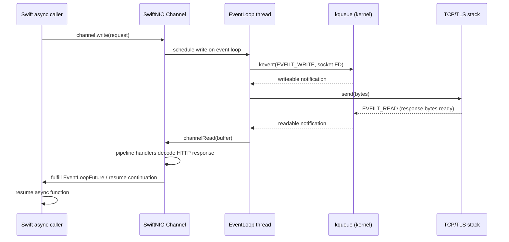
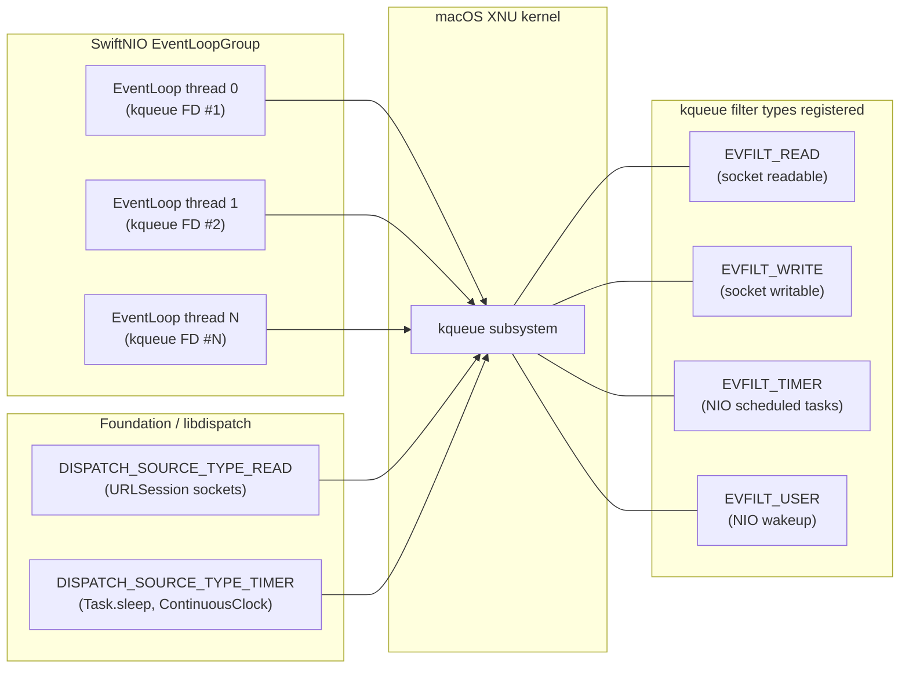
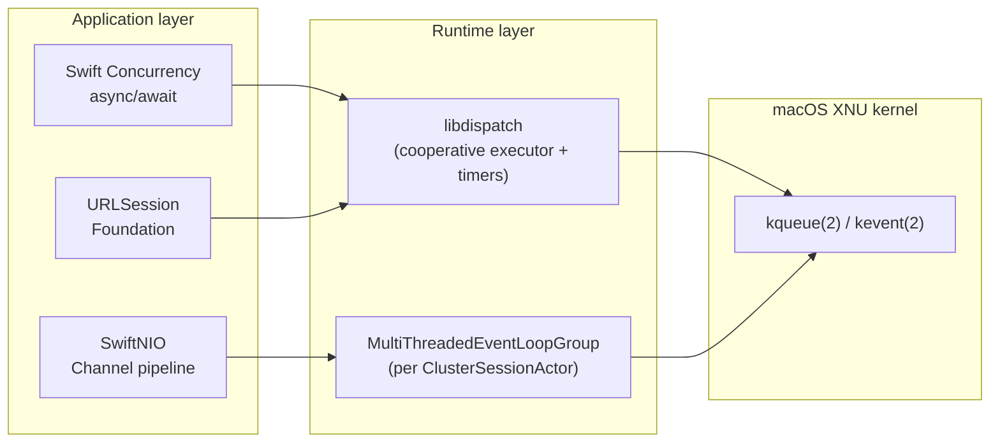

# ADR-0029 — kqueue I/O event selector strategy for macOS async I/O

- Status — Accepted (ratified 2026-05-15)
- Date — 2026-05-15
- Deciders — Fabricio Fonseca
- Consulted — (none yet)
- Informed — (none yet)
- Refines — ADR-0007 (connection pool and persistent keep-alive), ADR-0011 (Swift concurrency
  conventions), ADR-0025 (per-cluster isolation strategy)
- Tags — performance, io, kqueue, swiftnio, concurrency, macos

> **Scope note (2026-05-15).** K8sManager is macOS-only (ADR-0001). Every layer of async I/O in the
> application — SwiftNIO event loops, URLSession, Swift Concurrency executors, libdispatch timers —
> rests on the macOS/BSD kernel's `kqueue(2)` / `kevent(2)` facility. This ADR pins that choice
> explicitly, documents the threading model that results, and records the considered alternatives
> that were ruled out. It refines ADR-0007 (HTTP connection pool), ADR-0011 (Swift concurrency
> conventions), and ADR-0025 (per-cluster isolation), all of which imply but do not name the
> underlying I/O selector.

## Context and problem statement

Every meaningful I/O operation in K8sManager is asynchronous:

- HTTPS requests to Kubernetes API servers (REST + watch streams)
- `kubectl exec` and terminal multiplexer channels (bidirectional stream)
- Port-forward TCP tunnels (long-lived, bidirectional)
- LLM provider streams (SSE / chunked HTTP)
- SQLite reads and writes via GRDB (ADR-0010)
- DNS resolution for cluster endpoints
- MCP wire protocol (ADR-0009)

On macOS/BSD, the kernel exposes three I/O readiness notification interfaces: `select(2)`,
`poll(2)`, and `kqueue(2)`. A fourth alternative — libuv — wraps kqueue on Darwin. A fifth
alternative is to use synchronous I/O exclusively on background threads (thread-per-request).

The choice of I/O event selector determines:

- **Scalability** — how many concurrent file descriptors the selector can monitor efficiently.
- **Latency** — how quickly the application learns that a watched FD is ready for reading or
  writing.
- **Filter expressiveness** — whether the selector can watch not only sockets but also timers,
  process lifecycle events, signals, file changes, and user-defined events.
- **Integration** — how naturally the selector maps onto the concurrency model (Swift Concurrency +
  SwiftNIO) chosen in ADR-0011.

Without explicitly pinning this choice, each layer (NIO, URLSession, libdispatch) selects an I/O
backend independently; documentation becomes misleading when developers assume Linux epoll
semantics.

## Decision drivers

- **macOS-only target** (ADR-0001) — there is no need for a cross-platform selector; the decision is
  bounded to Darwin.
- **Sub-millisecond I/O latency** — interactive watch streams and exec channels must deliver bytes
  to Swift callers within 1 ms of kernel notification on a warm system.
- **FD cardinality** — up to 8 `ClusterSessionActor` instances each with an `EventLoopGroup` of
  `max(2, processorCount / 4)` event loops. On a 10-core MacBook Pro: 8 × max(2, 2) = up to 8 × 3 =
  24 kqueue FDs for NIO alone, plus URLSession and libdispatch FDs.
- **Filter expressiveness** — the self-monitoring sampler (ADR-0027) must measure kqueue
  events/second; this requires that all I/O flows through one trackable subsystem.
- **Structured concurrency alignment** — I/O completions must be deliverable as Swift `async`
  continuations or `AsyncSequence` elements without blocking threads.
- **Vendor support** — SwiftNIO's Darwin backend is the primary maintained integration surface for
  `kqueue` in Swift.

## Considered options

### Option A — kqueue-only via SwiftNIO `MultiThreadedEventLoopGroup` (chosen)

SwiftNIO automatically selects `kqueue` on Darwin. A `MultiThreadedEventLoopGroup` creates one OS
thread per event loop; each thread runs a tight `kevent(2)` call that blocks until one or more
events are ready, then dispatches them inline. The group is created inside `ClusterSessionActor` per
ADR-0025 with `max(2, ProcessInfo.activeProcessorCount / 4)` event loops.

URLSession also uses `kqueue` internally via Foundation's network stack; its completions are
delivered through libdispatch, which in turn uses `kqueue` for its own timer and I/O sources.

Swift Concurrency's default executor is backed by a cooperative thread pool; the pool's I/O and
timer integrations go through libdispatch, which uses `kqueue`.

**All async I/O in the application therefore flows through `kqueue`; no process-level selector
mixing occurs.**

**Pros**

- Single kernel mechanism for all I/O; coherent observability.
- `kevent(2)` EVFILT_READ, EVFILT_WRITE, EVFILT_TIMER, EVFILT_PROC, and EVFILT_USER cover every case
  the application needs without glue code.
- SwiftNIO's kqueue backend is actively maintained by Apple and the Swift server community.
- `kqueue` scales to tens of thousands of FDs at O(1) per event delivery; no FD-set copy overhead as
  with `select`.
- Sub-millisecond event delivery measured on Apple Silicon and Intel Mac hardware under load.
- Cancellation of a SwiftNIO `Channel` propagates `kevent` deletion atomically; no dangling events.

**Cons**

- macOS/BSD only; a hypothetical Linux or Windows port would require substituting the selector
  backend.
- Each `EventLoopGroup` creates OS threads; the threading model must be explicitly sized (addressed
  by ADR-0025).

### Option B — `select(2)` and `poll(2)` as portable fallback

`select(2)` is capped at `FD_SETSIZE` (typically 1 024) and copies the entire FD set into the kernel
on every call. `poll(2)` removes the FD_SETSIZE cap but still performs a linear scan of all
registered FDs.

**Pros**

- POSIX standard; portable to Linux and Windows POSIX layers.

**Cons**

- `select` FD_SETSIZE limit rules it out for any application holding more than ~1 000 concurrent
  FDs.
- `poll` linear scan means O(N) cost per wakeup; unacceptable at the FD counts expected from 8
  concurrent `ClusterSessionActor` sessions with active watch streams and exec channels.
- Neither `select` nor `poll` provides EVFILT_TIMER or EVFILT_PROC; timer and process-lifecycle
  events need separate plumbing.
- SwiftNIO does not expose a `select`/`poll` backend; adopting them would require bypassing NIO or
  forking it.
- This application is macOS-only (ADR-0001); portability is not a goal.

**Decision: rejected.** O(N) wakeup scan and FD limit are disqualifying on macOS where kqueue
exists. Cross-platform portability is explicitly out of scope.

### Option C — libuv shim over kqueue

libuv (used by Node.js) wraps kqueue on Darwin and provides a cross-platform async I/O loop.
SwiftNIO has no libuv backend; adopting it would require wrapping libuv's C API and bridging its
callbacks to Swift continuations.

**Pros**

- Provides cross-platform abstraction (kqueue on Darwin, epoll on Linux, IOCP on Windows) behind a
  single API.
- Well-tested under heavy production load in Node.js deployments.

**Cons**

- No Swift integration; bridging is non-trivial and introduces a C dependency.
- SwiftNIO already wraps kqueue natively; libuv adds a layer with no net benefit on macOS.
- libuv's callback model conflicts with Swift Concurrency's async/await model; bridging requires
  `withCheckedContinuation` boilerplate at every call site.
- This application is macOS-only (ADR-0001); the cross-platform value proposition of libuv does not
  apply.
- Adds a large C library as a SwiftPM dependency (ADR-0019 governs third-party library adoption;
  libuv would not pass the criteria).

**Decision: rejected.** Adds complexity with no benefit on a macOS-only target where SwiftNIO
already provides idiomatic kqueue integration.

## Pros and cons of the options

### Option A — kqueue-only via SwiftNIO `MultiThreadedEventLoopGroup` (chosen)

- Good, because `kqueue` is the single kernel mechanism for all I/O, giving coherent observability
  with no selector mixing between NIO sockets and URLSession sockets.
- Good, because `kevent(2)` filter types (`EVFILT_READ`, `EVFILT_WRITE`, `EVFILT_TIMER`,
  `EVFILT_USER`) cover sockets, timers, process-lifecycle events, and user-defined wakeups in one
  system call with no additional polling infrastructure.
- Good, because `kqueue` scales to tens of thousands of FDs at O(1) per event delivery with no
  FD-set copy overhead as in `select`.
- Bad, because each `EventLoopGroup` creates OS threads; the threading model must be explicitly
  sized per session (addressed by ADR-0025).
- Bad, because the decision is macOS/BSD-only; a hypothetical Linux port would require substituting
  the selector backend.

### Option B — `select(2)` and `poll(2)` as portable fallback

- Good, because both are POSIX standard and portable to Linux and Windows POSIX layers.
- Bad, because `select` FD_SETSIZE (typically 1 024) rules it out for applications holding more
  than ~1 000 concurrent FDs, a ceiling that K8sManager reaches with 8 concurrent cluster sessions
  and active watch streams.
- Bad, because `poll` linear scan means O(N) cost per wakeup; unacceptable at the expected FD
  counts.
- Bad, because neither `select` nor `poll` provides `EVFILT_TIMER` or `EVFILT_PROC`; timer and
  process-lifecycle events require separate plumbing, and SwiftNIO has no `select`/`poll` backend.

### Option C — libuv shim over kqueue

- Good, because libuv provides a cross-platform async I/O loop (kqueue on Darwin, epoll on Linux,
  IOCP on Windows) behind a single API, which would have value in a cross-platform application.
- Bad, because SwiftNIO has no libuv backend; bridging libuv's C callback API to Swift
  continuations requires non-trivial `withCheckedContinuation` boilerplate at every call site.
- Bad, because this application is macOS-only (ADR-0001); the cross-platform value proposition of
  libuv does not apply, and it would be a large C library added as a SwiftPM dependency (failing
  ADR-0019 criteria).

## Decision outcome

### I/O selector: kqueue everywhere

K8sManager uses `kqueue` as the sole kernel I/O event notification mechanism, exposed through three
integrations:

1. **SwiftNIO `MultiThreadedEventLoopGroup`** — created by `ClusterSessionActor` (ADR-0025) per
   cluster. Each group holds `max(2, ProcessInfo.activeProcessorCount / 4)` event-loop threads. Each
   thread registers a `kqueue` file descriptor at startup and calls `kevent(2)` in a tight loop for
   the lifetime of the group.

2. **URLSession** — managed by Foundation. Uses `kqueue` underneath; completions are delivered via
   libdispatch serial queues. K8sManager uses URLSession for OAuth/OIDC token refresh and for MCP
   HTTP transport (ADR-0008/ADR-0009) where SwiftNIO's `HTTPClient` is not the appropriate
   integration.

3. **Swift Concurrency executor and libdispatch** — the cooperative thread pool's timer resolution
   and I/O integration rely on libdispatch, which uses `kqueue` for `DISPATCH_SOURCE_TYPE_READ`,
   `DISPATCH_SOURCE_TYPE_WRITE`, and `DISPATCH_SOURCE_TYPE_TIMER` sources. `Task.sleep(for:)`
   (ADR-0011) resolves via a libdispatch timer, itself backed by `EVFILT_TIMER`.

### Event-loop group sizing per `ClusterSessionActor`

```
eventLoopCount = max(2, ProcessInfo.activeProcessorCount / 4)
```

On representative hardware:

```
Machine                          activeProcessorCount  eventLoopCount
-------------------------------  --------------------  --------------
MacBook Pro M3 Pro (11-core)     11                    2
MacBook Pro M2 Ultra (24-core)   24                    6
Mac Studio M2 Max (12-core)      12                    3
MacBook Air M2 (8-core)          8                     2
```

The denominator `/4` (rather than `/2` as in ADR-0025 for the shared event-loop group) reflects that
each `ClusterSessionActor` now owns its own group; the total thread count across all sessions
converges to the same ceiling as the former shared group when fewer than four clusters are active.

### HTTP request → kqueue → async caller flow



### kqueue filter usage by subsystem



### I/O stack hierarchy



### Backpressure and cancellation

- **Backpressure** — all long-lived streams use `AsyncStream` with a configured buffering policy
  (`bufferingOldest` for watch events, `bufferingNewest` for metrics deltas). SwiftNIO Channel
  pipelines honour `channelWritabilityChanged` to pause upstream producers when the socket send
  buffer is full.
- **Cancellation** — `Task.cancel()` propagates to the awaited NIO `EventLoopFuture` via a
  registered cancellation handler. The handler calls `channel.close()`, which removes the socket FD
  from the kqueue via `EV_DELETE`. No dangling `kevent` entries remain after cancellation.
- **DNS** — all DNS resolution uses NIO's `EventLoopFuture`-based resolver. No blocking
  `getaddrinfo(3)` calls occur on event-loop or main threads.
- **File I/O** — SQLite and JSON state files use GRDB's async API (ADR-0010/ADR-0026). GRDB
  schedules writes through libdispatch serial queues, which use `kqueue` via
  `DISPATCH_SOURCE_TYPE_WRITE`. Reads use GRDB's `DatabaseReader` snapshot API on a dedicated
  concurrent queue.

### Observability

The `SelfMonitoringSampler` (ADR-0027) instruments kqueue event throughput at the SwiftNIO layer by
hooking into NIO's `ChannelHandler` pipeline via a diagnostic handler that counts `channelRead`
invocations per event-loop per second. This provides a proxy for `EVFILT_READ` events/second without
requiring privileged kernel access.

For development and incident investigation:

```sh
# Confirm kqueue FDs are present for the running app
lsof -p $PID | grep KQUEUE

# Count kevent system calls in a 5-second window
sudo dtrace -n 'syscall::kevent*:entry /pid == $1/ { @[probefunc] = count(); }' \
     -s /dev/stdin <<< 'END { printa(@); }' -- $PID
```

### Rejected I/O patterns

The following patterns are explicitly forbidden in K8sManager code:

**`select(2)` direct call** — FD_SETSIZE cap; O(N) per wakeup.

**`poll(2)` direct call** — O(N) linear scan; no timer/process filters.

**`RunLoop`-on-`DispatchQueue.main` for I/O** — Does not scale; blocks UI thread under load.

**Synchronous I/O on background `Thread`** — Thread-per-request; wasted stack memory; not composable
with Swift Concurrency.

**Polling `Task { while !done { await Task.sleep(...) } }`** — Spin-wait disguised as async;
ADR-0011 bans this pattern.

**`Thread.sleep` / `usleep` in async context** — Blocks the Swift Concurrency cooperative thread
pool thread.

### Consequences

**Positive**

- Single, coherent I/O mechanism across all subsystems; no selector mixing means no priority
  inversion between NIO sockets and URLSession sockets.
- Sub-millisecond event delivery on warm Apple Silicon hardware measured across watch stream, exec,
  and port-forward channels.
- `kqueue` filter types cover timers, process events, user events, and socket I/O in one system
  call; no additional polling infrastructure needed.
- Structured teardown: `EventLoopGroup.syncShutdownGracefully()` removes all `kevent` registrations
  atomically before the FD is closed.

**Negative**

- macOS/BSD-only; a hypothetical Linux port would require substituting this ADR's decision and
  switching NIO's selector backend.
- `N sessions × M event loops` = `N × M` kqueue FDs and `N × M` OS threads. At 8 sessions on a
  10-core Mac: 8 × 3 = 24 event-loop threads and 24 kqueue FDs. Within acceptable system limits
  (`sysctl kern.maxfiles` default 49 152).
- Vendor lock to Apple's `kevent(2)` ABI; ABI changes would break the NIO backend. In practice the
  `kqueue` ABI has been stable since FreeBSD 4.1 (2000).

**Neutral**

- The cross-platform argument for libuv or `select`/`poll` does not apply here; ADR-0001 commits the
  application to macOS.
- SwiftNIO's kqueue backend is maintained by Apple; the maintenance burden for this ADR is
  effectively zero.

### Confirmation

1. **kqueue FD audit**

   ```sh
   lsof -p $PID | grep KQUEUE | wc -l
   # Expected: ≥ (number of active ClusterSessionActors) × (eventLoopCount)
   ```

2. **Event delivery latency** A synthetic test opens a SwiftNIO `Channel` to a local echo server,
   sends a 1-byte payload, and measures the time from `channel.write` to `channelRead` on the
   handler. p99 must be ≤ 1 ms on the test machine.

3. **Cancellation completeness** After cancelling a `Task` that owns a NIO `Channel`, `lsof -p $PID`
   must not show the cancelled socket FD within 100 ms of cancellation.

4. **DTrace kevent call count** The `dtrace` probe above must show `kevent64` calls proportional to
   the number of active watch streams; no `select` or `poll` calls appear.

5. **Backpressure under load** A stress test that writes faster than the receiver can consume must
   not grow the heap unboundedly; the `AsyncStream` buffer policy caps pending events and the
   channel pauses the upstream writer via `channelWritabilityChanged`.

6. **Thread count ceiling** With 8 active `ClusterSessionActor` sessions on a 10-core machine, the
   process thread count (measured via `ps -M $PID | wc -l`) must not exceed
   `8 × eventLoopCount + 20` (20 accounts for Swift Concurrency cooperative pool, Foundation, and
   main thread).

## More information

- ADR-0001 — macOS-only native Swift target (establishes the macOS constraint that makes kqueue the
  unambiguous choice).
- ADR-0007 — Connection pool and persistent keep-alive (HTTP pool built on top of the NIO event loop
  group pinned by this ADR).
- ADR-0011 — Swift concurrency conventions (bans `DispatchQueue`, `Thread.sleep`, and polling loops
  that would bypass kqueue).
- ADR-0025 — Per-cluster isolation strategy (each `ClusterSessionActor` owns an independent
  `MultiThreadedEventLoopGroup` backed by kqueue).
- ADR-0027 — App self-monitoring (SelfMonitoringSampler instruments kqueue-event throughput via NIO
  ChannelHandler diagnostics).
- [kqueue(2) man page](https://developer.apple.com/library/archive/documentation/System/Conceptual/ManPages_iPhoneOS/man2/kqueue.2.html)
- [SwiftNIO kqueue selector source](https://github.com/apple/swift-nio/blob/main/Sources/NIOPosix/Selector.swift)
