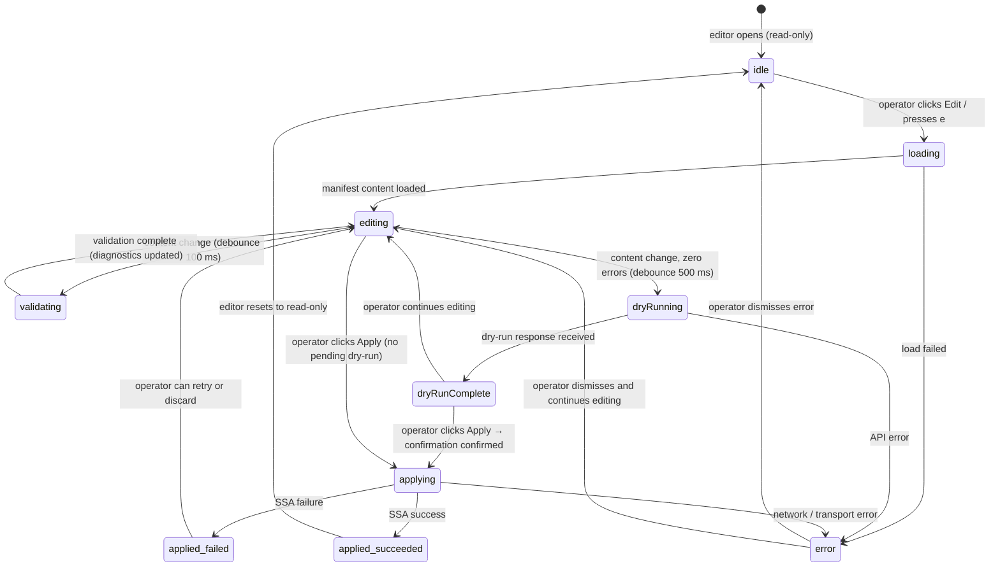
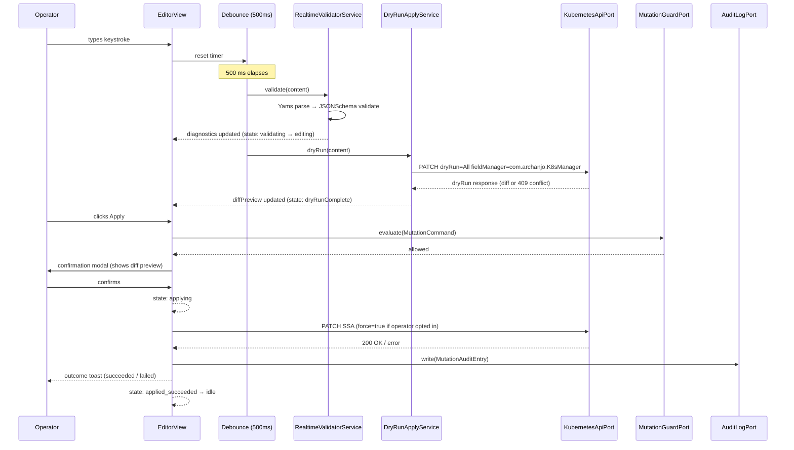

# ADR-0030 — Integrated multi-format editor (MD, YAML, JSON)

- Status — Accepted (ratified 2026-05-15)
- Date — 2026-05-15
- Deciders — Fabricio Fonseca
- Consulted — (none yet)
- Informed — (none yet)
- Refines — ADR-0012 (mutating operations policy), ADR-0013 (resource browser scope and kinds),
  ADR-0019 (adopted Swift libraries), ADR-0023 (UX patterns — command palette and shortcuts)
- Tags — editor, yaml, json, markdown, coeditorview, swiftui, realtime, dry-run, ssa,
  resource-browser

> **Scope note (2026-05-15).** This ADR defines the integrated multi-format editor component for
> K8sManager. The editor covers Markdown (preview side-by-side), YAML (Kubernetes schema
> validation + real-time dry-run server-side apply), and JSON (schema-aware validation). It is the
> Layer 3 editing surface referenced in ADR-0013 and is the primary mutation authoring tool for
> cluster resources. It wires directly into the ADR-0012 mutation guard chain: dry-run → diff
> preview → confirmation modal → SSA → audit log → outcome toast. The underlying `#EditorState`
> machine will be formalised in ADR-0034 (state-driven reactive UI conventions).

---

## Context and problem statement

K8sManager operators routinely need to inspect and edit Kubernetes resource manifests directly. The
resource browser (ADR-0013) surfaces live manifests at Layer 3 (YAML editor). Prior to this ADR no
integrated editor existed; the application relied on the system text editor or `kubectl edit` in an
external terminal, losing the in-app mutation guard, audit log, and diff-preview capabilities
mandated by ADR-0012.

Three distinct content formats are required:

1. **YAML** — the canonical encoding for almost every Kubernetes resource manifest. Requires syntax
   highlighting, real-time schema validation against the cluster's OpenAPI v3 spec, and a
   server-side dry-run apply flow.
2. **JSON** — used by some automation toolchains, ConfigMap `data` JSON blobs, and Kubernetes API
   raw responses. Requires JSON syntax highlighting and JSON Schema validation when a schema is
   resolvable.
3. **Markdown** — used for README files embedded in Helm chart configmaps, wiki content surfaced via
   ConfigMaps, and inline documentation notes. Requires side-by-side rendered preview.

The problem: which Swift library or combination of libraries provides syntax highlighting, gutter,
line numbers, and structural editing inside a SwiftUI- native component without requiring a full
WebKit embedding, while remaining actively maintained and compatible with Swift 6 strict
concurrency?

## Decision drivers

- Operators must edit Kubernetes resource manifests without leaving the application.
- The editor must integrate with the ADR-0012 mutation guard chain (dry-run, diff preview,
  confirmation, SSA, audit log) as the Layer 3 surface defined in ADR-0013.
- Swift 6 strict concurrency is mandatory; third-party libraries must compile cleanly under
  `-strict-concurrency=complete`.
- No WebKit embedding: the editor must be a native SwiftUI or AppKit-native component.
- Syntax highlighting for YAML, JSON, and Markdown via a structured grammar pipeline (not regex-only
  tokenisation); diagnostic gutter API for inline error markers.
- Active maintenance and an open-source licence compatible with the Developer ID distribution model
  (ADR-0004).

## Pros and cons of the options

### Option A — `CodeEditor` (mchakravarty/CodeEditorView, chosen)

- Good, because it is a SwiftUI-native component with a tree-sitter grammar pipeline, providing
  structured syntax highlighting for YAML, JSON, and Markdown without requiring AppKit wrapping.
- Good, because the line-gutter API accepts custom `#DiagnosticMarker` overlays mapping cleanly to
  the `#Diagnostic` value objects in the CUE schema.
- Good, because the library targets Swift 6 strict concurrency with gutter and content mutations on
  the main actor and background parse tasks using structured concurrency.
- Bad, because autocomplete support is limited; schema-aware field autocomplete requires a custom
  `CompletionProvider` implementation on top of the library's hook point.
- Bad, because multi-cursor edit requires `CodeEditor` 2.x+ (must be verified at integration time).

### Option B — Sourceful / Sourceful Lite

- Good, because it is simpler to integrate for basic syntax highlighting with a straightforward
  `CodeEditor` view API.
- Bad, because it does not expose a tree-sitter pipeline or a structured gutter API for diagnostic
  overlays, effectively requiring a significant custom overlay layer to satisfy this ADR's
  diagnostic marker requirement.
- Bad, because its highlight.js grammar pipeline is incompatible with the tree-sitter extension
  pattern; fewer than 200 stars on GitHub indicates lighter community activity.

### Option C — `TextEditor` (SwiftUI built-in) with custom syntax layer

- Good, because it has no third-party dependency and is fully Apple-supported as part of SwiftUI.
- Bad, because syntax highlighting, gutter, and multi-cursor support require either
  `NSLayoutManager` subclassing or a custom `NSTextStorage` pipeline — a substantial AppKit-level
  implementation estimated at 3–5× the cost of Option A for an equivalent feature surface.
- Bad, because the result would be bespoke code tightly coupled to AppKit internals, creating
  long-term maintenance debt with each macOS release.

## Decision outcome

**Adopt `CodeEditor` (mchakravarty/CodeEditorView) as the base SwiftUI code editing component.**
Combine it with `Yams` (YAML parsing, already adopted in ADR-0019), `Foundation.JSONDecoder` /
`JSONSerialization` (JSON parse and serialise), `Down` or `apple/swift-markdown` for Markdown
rendering, and a custom `K8sSchemaValidator` layer that loads OpenAPI v3 schemas from the connected
cluster's `/openapi/v3` endpoint and validates manifests against the target GVK schema.
`mattt/JSONSchema` (already adopted in ADR-0019) backs both YAML and JSON schema validation.

The integrated editor is the sole `#EditorSession` AggregateRoot in the `resource_browser` bounded
context.

---

## Considered options

### Option A — `CodeEditor` (mchakravarty/CodeEditorView) ✓ chosen

**CodeEditor** is a SwiftUI-native code editor built by Martin Chakravarty, the original author of
the Haskell for Mac IDE. It embeds `tree-sitter` grammars for syntax highlighting, provides a
configurable gutter (line numbers, fold markers, diagnostic indicators), supports current-line
highlight, and exposes a `Binding<String>` interface idiomatic to SwiftUI. It targets macOS 14+, is
written in Swift 6 with strict concurrency annotations, and has been active in production use as of
its ~600-star GitHub repository. The library ships with YAML and JSON grammars; Markdown support is
available via a community grammar.

Advantages:

- SwiftUI-native component; no AppKit wrapping required.
- Tree-sitter grammar pipeline: YAML, JSON, Markdown grammars available out-of-the-box or as drop-in
  bundle additions.
- Line-gutter API accepts custom `#DiagnosticMarker` overlays — maps cleanly to `#Diagnostic` value
  objects from the CUE schema.
- Swift 6 strict concurrency: gutter and content mutations run on the main actor; background parse
  tasks use structured concurrency.
- Active maintenance and clear open-source license (MIT).

Disadvantages:

- Autocomplete support is limited; schema-aware field autocomplete requires a custom
  `CompletionProvider` implementation on top of the library's hook point.
- Multi-cursor edit requires `CodeEditor` 2.x+ (verify at integration time).

### Option B — Sourceful / Sourceful Lite

**Sourceful** is a SwiftUI code editor library with highlight.js grammars and a straightforward
`CodeEditor` view. It is simpler to integrate for basic highlighting but does not expose a
tree-sitter pipeline, lacks a structured gutter API for diagnostic overlays, and has limited Swift 6
concurrency annotations. The diagnostic annotation requirement from this ADR effectively rules it
out unless a significant custom overlay layer is built.

Disadvantages:

- No structured diagnostic gutter; custom overlay needed.
- Highlight.js grammar pipeline incompatible with tree-sitter extension pattern.
- Lighter activity on the repo; fewer than 200 stars.

### Option C — `TextEditor` (SwiftUI built-in) with custom syntax layer

SwiftUI's built-in `TextEditor` wraps `NSTextView`. Syntax highlighting, gutter, and multi-cursor
support all require either `NSLayoutManager` subclassing or a custom `NSTextStorage` pipeline — a
substantial AppKit-level implementation. The `swift-syntax-highlight` library provides regex-based
tokenisation but lacks a tree-sitter backend. Diagnostic overlays require `NSTextAttachment` or a
custom `NSTextContainer` subclass.

The total implementation cost is estimated at 3–5× that of Option A for an equivalent feature
surface. The result would be bespoke code tightly coupled to AppKit internals, creating long-term
maintenance debt with every macOS release.

Disadvantages:

- No tree-sitter grammar pipeline; must implement or bundle tokeniser.
- Diagnostic gutter requires full custom AppKit layer.
- Multi-cursor not natively supported in `NSTextView` without complex custom input handling.
- High ongoing maintenance cost.

---

## Scope and features

### Formats and mode transitions

```
Format    Grammar               Validation                       Real-time side effect
--------  --------------------  -------------------------------  -----------------------------------
YAML      tree-sitter-yaml      K8s OpenAPI v3 + JSONSchema      Dry-run SSA every 500 ms debounce
JSON      tree-sitter-json      JSONSchema if schema resolvable  Dry-run SSA every 500 ms debounce
Markdown  tree-sitter-markdown  None (render-only)               Preview pane refresh every 200 ms debounce
```

The editor opens in **read-only mode** when the operator selects an existing manifest from the
resource browser. The `Edit` button (or pressing `e` per ADR-0023) transitions the `#EditorState`
from `#StateIdle` to `#StateEditing`.

### Editor component features

- **Syntax highlighting** — tree-sitter grammars for YAML, JSON, and Markdown. Grammar bundles
  loaded from the app bundle at startup; no network fetch.
- **Gutter** — line numbers always visible. Diagnostic markers in the gutter: red circle for
  `error`, amber triangle for `warning`, blue info badge for `info`. Clicking a gutter marker
  scrolls the diagnostics panel to the entry.
- **Bracket matching** — matching brackets highlighted on cursor placement. Auto-close bracket pairs
  on insert.
- **Auto-indent** — tree-sitter indent queries drive automatic indentation on Enter and on Tab when
  inside a block scope.
- **Multi-cursor edit** — Cmd+D selects the next occurrence of the current token and adds a cursor;
  Cmd+Option+D selects all occurrences. Edit actions apply to all active cursors simultaneously.
- **Find and replace** — Cmd+F opens a local find bar. Cmd+Option+F opens a global multi-file find
  (scoped to open editor sessions in the session list).
- **Diagnostics panel** — a collapsible inline panel below the editor lists all `#Diagnostic` items
  with severity icon, line reference, and message. Clicking an entry scrolls the editor to the
  relevant line.
- **Diff preview pane** — shown when `#StateDryRunComplete` or the confirmation modal is open. Split
  view: left pane = current server state; right pane = proposed state. Removed lines highlighted
  red; added lines highlighted green; unchanged lines collapsed with expand affordance.
- **Schema-aware autocomplete** — `CompletionProvider` backed by the `K8sSchemaValidator` loaded GVK
  schema. Surfaces valid child field names and enum values for the current cursor path. Invoked on
  trigger character `.` and on Ctrl+Space. Not available for Markdown format.
- **Format on save** — Cmd+S triggers format before persisting:
  - YAML: `yamlfmt` embedded binary sorts keys alphabetically and normalises indentation to 2
    spaces.
  - JSON: `JSONSerialization` pretty-prints with 2-space indent.
  - Markdown: no format transform; content saved as-is.
- **Unlimited undo/redo** within the edit session. Undo history resets on `#StateApplied`
  (successful apply).
- **Draft auto-save** — `DraftAutoSaver` DomainService persists `#Draft` to the `editor_drafts`
  SQLite table (5-second debounce) while `isDirty == true`. On next open of the same resource, the
  operator is offered to restore the draft via a dismissible banner.

### Read-only mode

When `#EditorState == #StateIdle`, the editor view renders the manifest content with full syntax
highlighting but all editing interactions are disabled. The `Edit` button in the toolbar is the sole
affordance to enter edit mode. This preserves the principle from ADR-0013 that Layer 3 defaults to
inspect-only.

### Real-time validation

`RealtimeValidatorService` runs on a background actor. On every content change, the service
debounces for 100 ms then:

1. Parses the content using `Yams` (YAML) or `JSONSerialization` (JSON).
2. Reports parse errors as `#Diagnostic` items with source `yaml-parser` or `json-parser`.
3. If parse succeeds and a GVK is resolvable from the manifest's `apiVersion` and `kind` fields,
   validates the parsed document against the cached OpenAPI v3 schema via `K8sSchemaValidator` +
   `mattt/JSONSchema`.
4. Schema violations are reported as `#Diagnostic` items with source `k8s-schema` or `json-schema`.
5. The `#EditorState` transitions to `#StateValidating`, then back to `#StateEditing` with updated
   diagnostics.

Unknown fields (not present in the GVK schema) are reported as `warning` severity, not `error`, to
accommodate custom annotations and non-schema fields that the server accepts.

### Dry-run server-side apply flow

While `isDirty == true` and the source format is YAML or JSON, the `DryRunApplyService` runs a
server-side dry-run apply on a 500 ms debounce:

1. Validates current content (must have zero `error` diagnostics to proceed).
2. Sends a PATCH request to the Kubernetes API with `dryRun=All` and
   `fieldManager=com.archanjo.K8sManager` via `swiftkubeAdapter`.
3. On success, transitions to `#StateDryRunComplete` with `diffPreview` string containing the
   structured diff.
4. On field ownership conflict (HTTP 409), transitions to `#StateDryRunComplete` with `conflicts`
   array populated.
5. On API error, transitions to `#StateError` with `errorDetail`.

### Apply pipeline (operator-initiated)

When the operator clicks `Apply`:

1. `EditorOrchestratorService` checks `#EditorState == #StateEditing` with `isDirty == true` and
   zero `error` diagnostics.
2. Constructs an `#ApplyYAML` `#MutationCommand` via `MutationCommandFactory`.
3. If `conflicts` is non-empty, shows the field conflict modal: "Force ownership? View conflicts"
   with a `View conflicts` detail disclosure. Operator must opt in to `force=true` explicitly.
4. Routes through ADR-0012 confirmation modal (single-confirm for non-delete operations,
   double-confirm with name entry for Delete).
5. On confirmation: `MutationDispatchService` issues SSA PATCH via `swiftkubeAdapter`. State
   transitions to `#StateApplying`.
6. On API success: state transitions to `#StateApplied(outcome: "succeeded")`. Audit entry written
   via `AuditLogPort`. Outcome toast shown.
7. On API failure: state transitions to `#StateApplied(outcome: "failed")` with detail. Audit entry
   written. Error toast shown.

### Markdown preview

While format is `markdown` and `#EditorState` is `#StateEditing`, the `Down` / `swift-markdown`
renderer updates the preview pane every 200 ms (debounce). The preview pane is a read-only
`WebView`-free SwiftUI view built from the parsed Markdown AST. Code fences within the rendered
preview apply syntax highlighting using the same tree-sitter pipeline (grammar selected from the
fence info string).

External links in the rendered preview open a confirmation dialog before launching in the default
browser (`NSWorkspace.open`). The dialog shows the target URL and offers Cancel / Open in Browser.

### K8sSchemaValidator

`K8sSchemaValidator` is a custom domain service layer:

- At startup (and on cluster reconnect) fetches `/openapi/v3/apis` and `/openapi/v3/api` from the
  active cluster's API server.
- Parses the response into a per-GVK schema map keyed by `group/version/kind`.
- Caches schemas in memory for the session lifetime; schema map is re-fetched on cluster context
  switch.
- Validates a parsed Swift dictionary (from `Yams` or `JSONSerialization`) against the resolved GVK
  schema using `mattt/JSONSchema` validators.
- Returns an array of `#Diagnostic` items with `lineNumber` and `columnNumber` where available (from
  the tree-sitter parse tree node positions).

---

## State machine



---

## Interaction sequence



---

## Integration with resource_browser (ADR-0013)

The integrated editor is the YAML editor surface referenced in ADR-0013 Layer 3. Keyboard shortcut
`e` (ConfigMap, Secret, CRD instance rows) opens the editor pre-loaded with the live server manifest
in read-only mode, then transitions to edit mode. The `Apply` pipeline follows the ADR-0012 mutation
guard chain.

The `#EditorSession` AggregateRoot is created when the operator opens any resource in the editor.
`kubernetesContextId` links the session to the active cluster. `resourceRef` carries the GVK +
namespace + name of the target resource. For Markdown-only content (e.g., README ConfigMap data
fields opened inline), `resourceRef` may be null.

Draft recovery: on editor open, `DraftAutoSaver` queries the `editor_drafts` table for a draft with
matching `resourceRef` and `editorSessionId`. If found and `savedAt` is within the last 24 hours, a
banner offers draft restoration: "Unsaved draft from \<timestamp\> — Restore / Discard".

### Consequences

Positive:

- Operators edit Kubernetes resources without leaving the application.
- Real-time dry-run prevents surprises: diff preview before every apply.
- Schema validation inline reduces invalid manifest submissions.
- Draft auto-save prevents accidental loss of partially-edited manifests.
- Unified `#EditorState` machine enables straightforward SwiftUI reactive bindings (`@Observable`)
  with clear state transitions and no hidden side effects.
- CodeEditor's tree-sitter pipeline is extensible to additional grammars (e.g., JSON5, HCL, TOML) in
  future milestones without architectural change.

Negative:

- `CodeEditor` schema-aware autocomplete requires a custom `CompletionProvider` implementation; it
  is not provided out-of-the-box. Estimated 3–5 days of additional implementation work.
- `K8sSchemaValidator` adds a startup network call (`/openapi/v3`) that must be handled gracefully
  when the cluster API server is offline (fallback: no schema validation, diagnostics degraded to
  parse-only).
- `yamlfmt` embedded binary adds ~2 MB to the app bundle. Alternative: a pure- Swift YAML formatter
  (not yet available); revisit in a future ADR.
- Dry-run PATCH at every 500 ms keystroke debounce generates Kubernetes API server load. On very
  large manifests or slow clusters this may feel sluggish. Mitigation: the debounce timer resets on
  each keystroke, so rapid typing does not multiply calls. A circuit-breaker in `DryRunApplyService`
  pauses dry-runs if the last 3 consecutive responses took > 2 seconds.

### Confirmation

- `RealtimeValidatorService` returns correct `#Diagnostic` items for parse errors and schema
  violations within 600 ms of the triggering keystroke.
- `DryRunApplyService` transitions `#EditorState` to `#StateDryRunComplete` on a successful dry-run
  response and to `#StateError` on a network error.
- `DraftAutoSaver` persists a `#Draft` row within 5 s of the first `isDirty == true` transition.
- The full apply pipeline (Apply click to outcome toast) completes within 3 s on a cluster with
  under 50 ms RTT.

## Compliance and test criteria

### Unit tests

- `RealtimeValidatorService` returns correct `#Diagnostic` items for:
  - A YAML document with an invalid indent (parse error, line number matches).
  - A Deployment manifest with an unknown field `spec.unknownField` (schema warning, source
    `k8s-schema`).
  - A valid Deployment manifest (empty diagnostics array).
- `DryRunApplyService` transitions state correctly:
  - Success response → `#StateDryRunComplete` with non-empty `diffPreview`.
  - HTTP 409 response with conflict body → `#StateDryRunComplete` with non-empty `conflicts` array.
  - Network error → `#StateError`.
- `K8sSchemaValidator` resolves GVK from `apiVersion: apps/v1` + `kind: Deployment` and returns the
  correct schema.
- `DraftAutoSaver` persists a `#Draft` to the `editor_drafts` table within 5 s of first
  `isDirty == true` transition.

### Integration tests

- Open a live `Pod` manifest from the resource browser in read-only mode; verify
  `#EditorState == #StateIdle`.
- Press `e` to enter edit mode; verify transition to `#StateEditing`.
- Change `spec.containers[0].image` to an invalid value; verify a `k8s-schema` diagnostic appears
  within 600 ms.
- Change value to valid; verify diagnostic clears; verify `#StateDryRunComplete` appears within 600
  ms with non-empty `diffPreview`.
- Click `Apply`; proceed through confirmation modal; verify `#StateApplied` and audit entry written.
- Close editor without applying; verify `#Draft` row written with `autoSaved=true`.

### Accessibility

- All gutter diagnostic markers have `accessibilityLabel` describing severity and message (e.g.,
  "Error on line 12: unknown field spec.unknownField").
- The diagnostics panel is navigable via VoiceOver; each row is a focusable element announcing
  severity, line, and message.
- The diff preview pane announces removed lines as "removed: \<content\>" and added lines as "added:
  \<content\>" to VoiceOver.
- Colour is never the sole indicator of diagnostic severity; gutter markers use distinct shapes
  (circle for error, triangle for warning, info badge for info).

---

## Dependencies

**`mchakravarty/CodeEditorView` (>= 2.0)** — Base SwiftUI code editor + tree-sitter pipeline.

**`Yams` (>= 5.1, ADR-0019)** — YAML parse + serialise.

**`Foundation.JSONDecoder` / `JSONSerialization` (System)** — JSON parse + serialise.

**`Down` or `apple/swift-markdown` (TBD at integration)** — Markdown AST + render.

**`mattt/JSONSchema` (>= 0.4, ADR-0019)** — JSON Schema validation for YAML + JSON.

**`yamlfmt` binary (Bundled)** — YAML format on save.

**Custom `K8sSchemaValidator` (This ADR)** — OpenAPI v3 schema loading + GVK validation.

---

## More information

- [ADR-0012 — Mutating operations policy](adr-0012-mutating-operations-policy.md)
- [ADR-0013 — Resource browser scope and kinds](adr-0013-resource-browser-scope-and-kinds.md)
- [ADR-0019 — Adopted Swift libraries](adr-0019-adopted-swift-libraries.md)
- [ADR-0023 — UX patterns — command palette and shortcuts](adr-0023-ux-patterns-command-palette-and-shortcuts.md)
- [CodeEditorView on GitHub](https://github.com/mchakravarty/CodeEditorView)
- `contexts/resource_browser/schemas/editor_session.cue`
- `contexts/resource_browser/schemas/draft.cue`
- `contexts/resource_browser/features/yaml-editor-realtime.feature`
- `contexts/resource_browser/features/json-editor.feature`
- `contexts/app_shell/features/markdown-viewer.feature`
