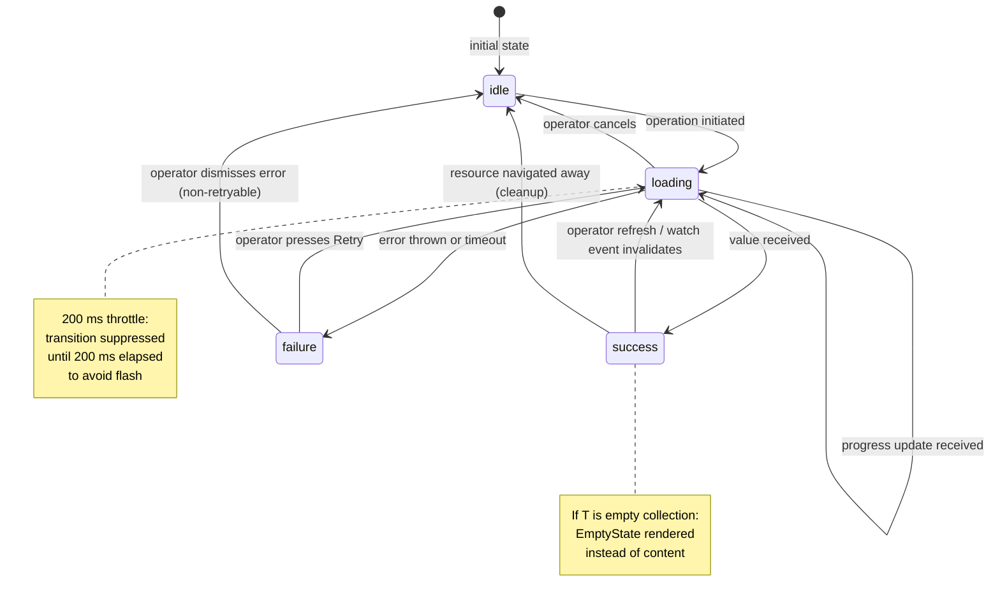

# ADR-0031 — Loading states and async resource UX

- Status — Accepted (ratified 2026-05-15)
- Date — 2026-05-15
- Deciders — Fabricio Fonseca
- Consulted — (none yet)
- Informed — (none yet)
- Tags — ux, loading, async, skeleton, shimmer, async-resource, accessibility

## Context and problem statement

K8sManager's UI is driven exclusively by Kubernetes API and local SQLite reads, every one of which
may take between a few milliseconds and several seconds depending on cluster latency, namespace
size, and kubeconfig health. Without a disciplined system for representing in-flight asynchronous
operations in the UI, the application will exhibit one or more of the following failure modes:

- **Flash of content** — data appears instantaneously with no transition, causing a jarring visual
  pop.
- **Blocking UI** — the operator cannot interact with other panels while a slow cluster responds.
- **Silent failure** — an error condition is not surfaced; the operator does not know whether to
  wait or retry.
- **Phantom spinner** — a spinner appears for a 20 ms SQLite read, causing unnecessary visual noise.
- **Unclear empty state** — an empty list is shown with no explanation of why it is empty and no
  call to action.

These failure modes erode trust. In a cluster-management tool where the operator needs confidence
that the state they see is accurate and current, every ambiguous loading moment reduces that
confidence.

This ADR defines the `#AsyncResource<T>` sum type and the four presentation modes (`skeleton`,
`shimmer`, `spinner`, `progressBar`) that together cover the full surface of async UX in the
application.

## Decision drivers

- **Operator trust** — the UI must make the current loading/loaded/error status unambiguous at every
  moment.
- **No UI blocking** — all async work runs in `Task`s on `@MainActor`; no operation may stall the
  render loop.
- **Consistent language** — all views that surface async data use the same vocabulary so operator
  mental models are stable across panels.
- **Accessibility** — loading states must be announced by VoiceOver and respect Reduce Motion.
- **200 ms throttle** — rapid completions (<200 ms) must not cause a flash of skeleton/shimmer. The
  throttle prevents idle → loading transitions for operations that resolve quickly.
- **Swift 6 compile-time safety** — the sum type must be defined as a Swift `enum` with associated
  values; pattern matching at every call site must be exhaustive.

## Pros and cons of the options

### Option A — No formal pattern (ad-hoc `isLoading: Bool + error: Error?`)

- Good, because it is the simplest approach to add field-by-field with no upfront design cost.
- Bad, because inconsistency across 30+ views makes it impossible to enforce the 200 ms throttle
  uniformly; loading and error states are easily forgotten in individual view models.
- Bad, because there is no single exhaustive switch to force coverage of all states; empty states
  must be handled separately in each view with no shared vocabulary.

### Option B — `Result<T, Error>` with separate `isLoading` flag

- Good, because `Result` is a standard Swift type familiar to all Swift developers, requiring no
  custom vocabulary.
- Bad, because the `isLoading` flag creates an invalid combined state (`isLoading == true` while
  `result == .success` is representable) and the `idle` state has no clean representation.
- Bad, because the `progress` field for the loading case has no natural home in this model; two-
  variable exhaustive matching is more error-prone than a single sum type.

### Option C — `#AsyncResource<T>` sum type (chosen)

- Good, because a single `enum` with four cases (`idle`, `loading`, `success`, `failure`) eliminates
  all invalid state combinations; Swift's exhaustive `switch` enforces handling at every call site.
- Good, because the uniform 200 ms throttle implementation applies once at the sum type level rather
  than being reimplemented in every view model.
- Good, because the single vocabulary across all 30+ views is encoded in the CUE schema for
  machine-checked spec validation and maps to a stable operator mental model.
- Bad, because it introduces a bespoke type that developers must learn; the four-case vocabulary is
  new and not inherited from the standard library.

## Decision outcome

### `#AsyncResource<T>` — the canonical sum type

Every async operation that affects UI state is represented as an `#AsyncResource<T>` value. The type
is defined in Swift as:

```swift
// DDD role: ValueObject
// CUE schema: contexts/app_shell/schemas/loading_state.cue #AsyncResource
enum AsyncResource<T: Sendable>: Sendable {
    case idle
    case loading(startedAt: Date, progress: Double?)
    case success(value: T, loadedAt: Date)
    case failure(error: Error, occurredAt: Date, retryable: Bool)
}
```

State is owned by a `@MainActor`-bound `@Observable` view model. The view model consumes an
`AsyncSequence` emitted by the domain layer and projects each element into an `AsyncResource`
update. The view body switches exhaustively over the current state.

### Lifecycle



### Presentation mode selection

**`loading`, estimated duration >100 ms, structural layout known** — `skeleton`.

**`loading`, estimated duration >100 ms, layout unknown or content-heavy** — `shimmer`.

**`loading`, estimated duration <500 ms (quick ops)** — `spinner` (secondary `ProgressView`).

**`loading`, known total unit count (file transfer, batch apply)** — `progressBar`.

**`success`, result collection is empty** — `EmptyState` view.

**`failure`** — `ErrorState` view with Retry and detail expand.

The 200 ms throttle applies uniformly to `skeleton`, `shimmer`, and `spinner`. If the operation
completes before the throttle fires, the view never transitions out of `idle` — there is no visible
flash.

The throttle is implemented as a `Task.sleep(for: .milliseconds(200))` guard inside the view model's
`loadResource()` method. If the underlying `async` operation resolves before the sleep expires, the
sleep task is cancelled and state stays `idle`.

### Skeleton loaders

Skeleton loaders are used for views that load data expected to take

> 100 ms and whose structural layout is known ahead of the data. Surfaces:

- **Sidebar** — cluster and context list. Skeleton shows 4 placeholder rows of varying label width
  at sidebar load.
- **Content list** — resource list (pods, deployments, services, etc.). Skeleton shows 8 placeholder
  rows matching the list row height.
- **Detail panel** — resource detail header. Skeleton shows placeholder for kind chip, name,
  namespace badge, and status chip.
- **Dashboard** — each widget card renders a skeleton card matching its final height.
- **Command palette search** — suggestion rows show skeleton while the search index warms on first
  open.

Skeleton implementation uses SwiftUI's `.redacted(reason: .placeholder)` on a template view that
mirrors the final layout. No real data is passed to the redacted view.

### Shimmer effect

Shimmer overlays a diagonal gradient animation over the `.redacted` placeholder. It is implemented
as a custom `ViewModifier`:

```swift
// Usage: anyView.shimmering()
struct ShimmerModifier: ViewModifier {
    @State private var phase: CGFloat = -1.0

    func body(content: Content) -> some View {
        content
            .redacted(reason: .placeholder)
            .overlay(
                LinearGradient(
                    gradient: Gradient(stops: [
                        .init(color: .clear, location: phase - 0.3),
                        .init(color: .white.opacity(0.4), location: phase),
                        .init(color: .clear, location: phase + 0.3),
                    ]),
                    startPoint: .topLeading,
                    endPoint: .bottomTrailing
                )
                .allowsHitTesting(false)
            )
            .onAppear {
                withAnimation(
                    .linear(duration: 1.4).repeatForever(autoreverses: false)
                ) { phase = 1.3 }
            }
    }
}
```

When `NSWorkspace.shared.accessibilityDisplayShouldReduceMotion` or the `reduceMotion` theme knob is
true, the animation is replaced with a static low-opacity overlay — no repeating gradient motion.

### Spinner (secondary `ProgressView`)

A centered `ProgressView()` (indeterminate) is shown only for operations expected to complete in
<500 ms: search index queries, kubeconfig parse, namespace switch. The spinner uses
`.controlSize(.regular)` and is wrapped in a `VStack` with a caption label for accessibility.

The spinner is never used on initial data load for the primary panels (sidebar, content list,
detail). Those panels always use skeleton loaders because the first-load duration is uncontrolled.

### Empty states

When `AsyncResource` reaches `success(value:)` but the value is an empty collection, the view
renders an `EmptyState` component.

`EmptyState` structure:

- **Icon** — SF Symbol appropriate to the resource kind.
- **Title** — concise, e.g. "No pods in this namespace".
- **Message** — context, e.g. "Deployments may not have scheduled pods here yet, or all pods have
  been removed."
- **Action button** (optional) — labelled for the available action: "Create pod", "Switch
  namespace", "Reload", or "Configure cluster".

`#EmptyState` value objects are defined in `loading_state.cue` and authored per resource kind and
context. They are never generated dynamically at the view layer.

### Error states

When `AsyncResource` reaches `failure(error:)`, the view renders an `ErrorState` component.

`ErrorState` structure:

- **Icon** — `exclamationmark.triangle.fill`, status error color token.
- **Title** — "Failed to load [resource kind]".
- **Detail** (collapsed by default, expandable) — the error's `localizedDescription`. Hidden behind
  "Show details" disclosure to avoid alarming casual operators.
- **Retry button** — visible when `retryable == true`. Pressing Retry calls the domain operation
  again, transitioning back to `loading`.
- **Dismiss button** — visible when `retryable == false`. Pressing Dismiss transitions to `idle`.

### Operations never block the UI

All async domain operations are initiated via `Task { @MainActor in … }` from the view model's
`onAppear` or in response to user actions. The view model is `@Observable` and owned by the view's
`@State`. State mutations happen on `@MainActor` and trigger automatic SwiftUI re-renders.

No `DispatchSemaphore`, `wait()`, or synchronous URL loading is used. The concurrency conventions
from ADR-0011 apply without exception.

### Watch streams and async sequences

For resources backed by Kubernetes watch streams (pod list, deployment list, events), the view model
subscribes to the domain layer's `AsyncThrowingStream` and updates the `AsyncResource` on each
received event. The `AsyncResource` begins in `loading`, transitions to `success(value:)` on the
first batch, and subsequently receives incremental updates that mutate only the `value` field — the
resource does not cycle back through `loading` for watch-driven updates unless the stream is
explicitly reconnected.

### 200 ms transition throttle

To prevent visible flashes for operations that resolve in less than 200 ms (common for cached SQLite
reads and warm in-memory state), the view model delays the `idle → loading` UI transition by 200 ms.

Implementation pattern:

```swift
@Observable
final class ResourceListViewModel {
    var clusters: AsyncResource<[ClusterReadModel]> = .idle

    func loadClusters() async {
        let loadTask = Task {
            return try await clusterPort.fetchAll()
        }
        // 200 ms throttle: only transition to loading if op is still running
        try? await Task.sleep(for: .milliseconds(200))
        if !loadTask.isCancelled {
            clusters = .loading(startedAt: .now, progress: nil)
        }
        do {
            let result = try await loadTask.value
            clusters = .success(value: result, loadedAt: .now)
        } catch {
            clusters = .failure(error: error, occurredAt: .now, retryable: true)
        }
    }
}
```

### Accessibility

- `skeleton` and `shimmer` states post `accessibilityLabel("Loading")` on their container.
- `ErrorState` posts `accessibilityLabel("Error: \(title)")` and announces via
  `UIAccessibility.post(notification: .announcement, ...)` when the state first transitions to
  `failure`.
- `EmptyState` posts an appropriate `accessibilityLabel` describing the absence of content.
- Reduce Motion: all shimmer animations replaced with static overlay; all skeleton pulse animations
  suppressed; spinner remains (it is not animated in the motion-sensitive sense).

### Confirmation

- A UI test suite asserts that the sidebar transitions from `idle` to `loading` (skeleton visible)
  and then to `success` on first cold start.
- A unit test verifies that the 200 ms throttle suppresses the skeleton for a 50 ms mock operation.
- A unit test verifies `failure → loading` transition when Retry is pressed.
- A VoiceOver test asserts that empty states and error states are announced with appropriate labels.

## Considered options

### Option A — No formal pattern (ad-hoc `isLoading: Bool + error: Error?`)

Every view model owns its own `isLoading: Bool`, `error: Error?`, and `data: T?` properties.

- **Pros** — simple to add one field at a time; no upfront design.
- **Cons** — inconsistent across 30+ views; impossible to enforce 200 ms throttle uniformly;
  loading/error states are easily forgotten; empty states must be handled separately in each view;
  no single exhaustive switch forces coverage of all states. Rejected.

### Option B — `Result<T, Error>` with separate `isLoading` flag

Represent the loaded/error cases as `Result<T, Error>` and track `isLoading` separately.

- **Pros** — `Result` is a standard Swift type; familiar to Swift developers; avoids a bespoke enum.
- **Cons** — still requires a separate `isLoading` flag, creating an invalid combined state
  (`isLoading == true` while `result == .success` is possible); `idle` state is not representable
  cleanly; `progress` field for `loading` has no natural home; forces two-variable exhaustive
  matching. Rejected in favour of the richer sum type.

### Option C — `#AsyncResource<T>` sum type (chosen)

A single `enum AsyncResource<T>` with four cases — `idle`, `loading`, `success`, `failure` —
captures all states without invalid combinations. Swift's exhaustive `switch` enforces that every
call site handles all cases. Associated values carry typed metadata (progress, loadedAt, retryable)
at the point they are relevant.

- **Pros** — no invalid state combinations; exhaustive pattern matching at compile time; uniform 200
  ms throttle implementation; single vocabulary across all 30+ views; maps naturally to CUE schema
  for spec validation; easily extended with a `refreshing(previous: T)` case in future milestones.
- **Cons** — requires a new bespoke type; developers must learn the four-case vocabulary. Accepted —
  the vocabulary is small and the compile-time guarantees outweigh the learning curve.

## More information

- ADR-0011 — Swift concurrency conventions; `@MainActor` ownership, `Task` lifecycle,
  `AsyncSequence` consumption.
- ADR-0034 — State-driven realtime UI architecture; Observation framework adoption; `AsyncResource`
  is a primary state type in `@Observable` view models.
- ADR-0030 — Integrated editor; `#EditorState` is a parallel sum type for editor-specific async
  states.
- `contexts/app_shell/schemas/loading_state.cue` — CUE schema for `#AsyncResource`,
  `#LoadingPresentation`, `#EmptyState`.
- `contexts/app_shell/features/loading-states.feature` — BDD coverage.

## Amendment 2026-05-16 — Skeleton mandate for all resource list views

### Context

The original ADR body (§"Presentation mode selection") permitted `spinner` for
operations estimated to complete in under 500 ms. In practice, all Kubernetes API
list calls are unbounded in latency — they depend on cluster reachability, namespace
size, and kubeconfig health. There is no safe way to estimate completion time before
the first byte arrives. Using `ProgressView` for initial data load of any resource
list surface therefore violates the operator-trust requirement and produces the
regression observed in frames 17–25 of the 2026-05-16 recording:

- `ApplicationsView` — "Loading applications..." centered spinner for 6+ seconds.
  No skeleton rows, no structural placeholder.
- `SecretsListView`, `ResourceQuotasListView`, `HPAListView`, and all other Config,
  Network, RBAC, Storage, and Cluster resource list views — same centred spinner
  pattern, ADR-0031 §"Skeleton loaders" violated.

### Invariant (binding)

> **No `ProgressView` for initial resource list load. Always `WorkloadListSkeleton`
> (or an equivalent skeleton component matching the view's layout) for `.idle` and
> `.loading` states on any resource list surface.**

Specifically:

- Any view that switches on `AsyncResource<T>` (or an equivalent `loadState` enum)
  and presents content from a Kubernetes API list call MUST render
  `WorkloadListSkeleton(rowCount: 8)` for the `.idle` and `.loading` cases.
- Centered `ProgressView()` ("Loading X...") is **prohibited** for these cases.
- The 200 ms transition throttle (§"200 ms transition throttle") remains in force —
  sub-200 ms loads skip the skeleton entirely. The skeleton is shown only when the
  operation exceeds the throttle threshold.
- The exception from the original ADR for "quick ops" (<500 ms spinner) applies only
  to non-list surfaces: namespace switch confirmation, kubeconfig parse, search index
  warm-up. It does NOT apply to any `KubernetesResourceListPort.list(...)` call.

### Affected surfaces

All resource list views in `Sources/AppShell/Views/Resources/**` plus
`ApplicationsView`. The `ApplicationsView` already used `WorkloadListSkeleton()` via
its `loadingView` private computed property, but the declaration was `private var
loadingView: some View { WorkloadListSkeleton() }`. This was already correct; the
amendment confirms it as the mandatory pattern for all siblings.

### Non-list exceptions

`ProgressView` remains permitted for:

- The `refreshButton` spinner inside `GlobalNamespacePill` (namespace list refresh).
- Inline row-level spinners for mutating operations (delete, apply, rollback) that
  target a single resource, not a list.
- The `ResourceListContainer` toolbar slot during list refresh (not initial load).

## Addendum — Onda 3 implementation (2026-05-16)

The presentation components that this ADR specified were authored in this onda:

- `Sources/AppShell/Views/LoadingStates/ShimmerModifier.swift` — `.shimmering()`
  ViewModifier. The first implementation also applied `.redacted(reason: .placeholder)`
  on top of skeleton rows that already drew their own `RoundedRectangle` placeholders;
  the double-redaction produced a jittery layered effect and was removed in a follow-up.
  The current implementation overlays a slow (2.5 s) horizontal gradient band with
  ≤ 8 % primary opacity and degrades to a static low-opacity tint when
  `accessibilityReduceMotion` is on (preserving the ADR-0031 §"Accessibility" contract).
- `Sources/AppShell/Views/LoadingStates/SkeletonRow.swift` — three skeleton variants:
  `WorkloadListSkeleton(rowCount: 8)`, `SidebarSkeleton(rowCount: 4)`,
  `DetailHeaderSkeleton()`. All wrap their template layout in `.shimmering()`.
- `Sources/AppShell/Views/LoadingStates/EmptyStateView.swift` — uniform empty state
  with icon / title / message / optional action button. Replaces the ad-hoc
  `ContentUnavailableView` calls that crept in before this ADR landed.
- `Sources/AppShell/Views/LoadingStates/ErrorStateView.swift` — uniform error state
  with `exclamationmark.triangle.fill` icon, `DisclosureGroup`-gated details, Retry
  (when `retryable`) and Dismiss buttons.

### `AsyncResource<T>` shape — current vs. ADR

The Swift type currently shipped in `Sources/AppShell/State/AsyncResource.swift`
is the simplified four-case form (`.idle | .loading | .success(T) | .failure(Error)`)
without the timestamp / `retryable` metadata the ADR body sketched. Adding the
richer metadata would require updating every call site across 30+ view models in a
single sweep, which is deferred to a future onda; the simpler form already covers
every UI requirement listed above. The richer shape is preserved in the ADR body
as the target end-state and tracked here as deferred work.

### 200 ms throttle — `AsyncLoader.run(…)`

The throttle pattern documented in §"200 ms transition throttle" is implemented
as a generic helper in `Sources/AppShell/State/AsyncLoader.swift` (`@MainActor
public static func run<T: Sendable>(setLoading:operation:onSuccess:onFailure:)`).
It races a 200 ms `Task.sleep` against the underlying operation via
`withTaskGroup`; if the operation completes first, the `setLoading` callback is
never invoked, so sub-200 ms loads never flash a skeleton. The helper is used by
the 8 workload list view models (Pods, Deployments, StatefulSets, DaemonSets,
ReplicaSets, ReplicationControllers, Jobs, CronJobs).

### Layout-stability fixes (2026-05-16)

Two layout regressions surfaced during the first end-to-end test of the canvas
header and the workload list views — both interacted with this ADR's component
boundaries and are documented here for future reference:

1. **Header bar height oscillation.** `SidebarCanvasView.headerBar` initially
   rendered an empty branch when `activeClusterId == nil` and a `HStack` containing
   `GlobalNamespacePicker` when set. The two branches had different intrinsic
   heights, so the tab bar (and everything below it) jumped vertically each
   time the strip transitioned. Fix: render the strip unconditionally with a
   fixed `minHeight: 40`, swapping only the inner picker/placeholder content.

2. **`ResourceListContainer` toolbar shrinking.** The trailing slot showed a
   `ProgressView` while loading and a `Button` (refresh icon) otherwise. The two
   controls reported different intrinsic widths, causing the title / count /
   search row to shift horizontally on every load transition — visible as
   "bar sumindo e aparecendo" when reloads happened in rapid succession. Fix:
   wrap both controls in a fixed 20 × 20 `ZStack` slot so the toolbar geometry
   never changes between `.loading` and `.success`.

### `ClusterStripActor.loadFromDisk` — broadcast required (2026-05-16)

`ClusterStripActor.loadFromDisk()` (ADR-0051) mutates `pins` and
`activeClusterId` from JSON. The first implementation did not call
`broadcast()` after the mutation, on the assumption that subscribers would
fetch the current state at subscribe time via `stateStream()`'s initial yield.
That assumption breaks under a race: when `AppShellView.task` subscribes
BEFORE `wireAsync` finishes restoring state, the initial yield carries the
empty pre-load state (`pins=[]`, `activeClusterId=nil`) and the subscriber
never observes the loaded snapshot — producing intermittent
"no cluster selected" flicker. Fix: `loadFromDisk()` now calls `broadcast()`
on the way out, matching every other mutating method on the actor.
