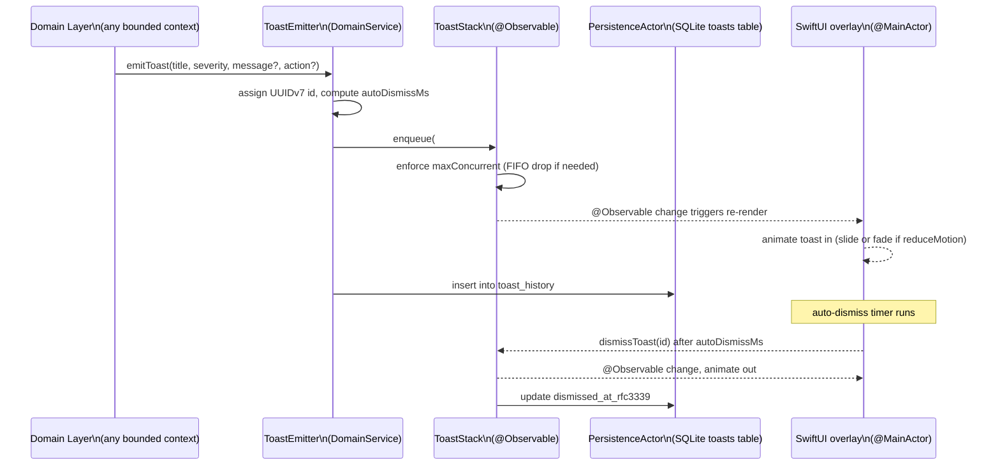

# ADR-0032 — Toast notification system

- Status — Accepted (ratified 2026-05-15)
- Date — 2026-05-15
- Deciders — Fabricio Fonseca
- Consulted — (none yet)
- Informed — (none yet)
- Tags — ux, notifications, toast, feedback, accessibility, persistence

## Context and problem statement

K8sManager performs mutations, connections, configuration reloads, and AI-assisted operations
continuously during an operator's session. Many of these operations complete silently — the view may
update in place, but the operator has no confirmation that the operation succeeded or failed. In a
cluster-management context, silent operations are dangerous: an operator who deletes a pod and
receives no feedback may delete it a second time believing the first attempt failed.

Equally problematic is intrusive feedback. A modal dialog for every `kubectl apply` destroys flow. A
banner that occupies a fixed strip of screen real estate competes with the content the operator is
trying to see and is visually dominant even when carrying low-priority information.

The system needs a feedback mechanism that:

- Confirms every meaningful operation without interrupting the operator.
- Differentiates severity so the operator can triage at a glance.
- Offers immediate remediation (Undo, Retry, View audit log) as an action button on the toast
  itself.
- Disappears automatically when information is acknowledged (success/info) but stays longer for
  warnings and errors.
- Is accessible to keyboard-only and VoiceOver users.
- Records history so the operator can review past notifications in Settings → Activity Log.

## Decision drivers

- **Non-intrusive** — toasts must never block primary content.
- **Actionable** — the most common remediation actions are surfaced without requiring navigation to
  another panel.
- **Severity differentiation** — the operator reads severity at a glance from position, icon color,
  and background tint.
- **Auto-dismiss** — success/info toasts vanish without operator action.
- **Accessibility** — toasts are announced by VoiceOver; reduce-motion uses fade instead of slide;
  pinned toasts remain until dismissed.
- **History** — the last 100 toast entries are persisted to SQLite for audit and debugging.

## Decision outcome

### Toast stack position and layout

The global `ToastStack` is a floating overlay anchored to the window frame. Default position is
`bottom_right`. The operator can change position in Settings → Notifications to `bottom_left`,
`top_right`, or `top_left`. The overlay is rendered above all other window content using a `ZStack`
with highest priority.

Toast cards are stacked vertically; newest toast appears at the bottom when position is `bottom_*`
and at the top when position is `top_*`. Cards are `280 pt` wide, `min-height 60 pt`, with 8 pt
corner radius (small token) and a 12 pt gap between cards.

### Severity palette

```
Severity  Background tint  Icon                           Auto-dismiss delay
--------  ---------------  -----------------------------  ------------------
success   statusHealthy    checkmark.circle.fill          3 000 ms
info      accentBrand      info.circle.fill               3 000 ms
warning   statusWarning    exclamationmark.triangle.fill  5 000 ms
error     statusError      xmark.octagon.fill             8 000 ms
neutral   textTertiary     bell.fill                      4 000 ms
```

Auto-dismiss timers are paused while the pointer hovers over the toast stack and resume on pointer
exit. Pinned toasts (`pinned == true`) never auto-dismiss regardless of severity.

### Toast anatomy

Each toast card contains:

- **Severity icon** — SF Symbol at 20 pt, colored by severity.
- **Title** — string ≤60 characters, `.subheadline.weight(.semibold)`.
- **Message** (optional) — string ≤200 characters, `.footnote`, `.textTertiary` color. Truncated to
  two lines; expandable by clicking the toast card.
- **Action button** (optional) — `.button` style, ≤24 character label, right-aligned. Triggers a
  domain action via the registered `actionId`.
- **Dismiss button** — `×` icon, top-right corner, always present. Clicking dismisses immediately
  and records `dismissed_at_rfc3339`.

### Action button patterns

Action buttons on toasts cover the three most common remediation cases:

1. **Undo mutation** — label "Undo". Available when the toast was emitted by a successful mutating
   operation and the undo window is still open (5 s per ADR-0012). The `actionId` is
   `"mutation.undo"` and the `payload` carries `{"commandId": "<UUIDv7>"}`.

2. **Retry operation** — label "Retry". Available on `error` severity toasts for retriable
   operations (kubeconfig reload, cluster connection, LLM key validation). The `actionId` is
   `"<domain>.retry"` and the `payload` carries enough context to restart the operation.

3. **View audit log entry** — label "View details". Available for mutation-related toasts. The
   `actionId` is `"audit.view"` and the `payload` carries `{"mutationId": "<UUIDv7>"}`. Navigates
   the main window to Settings → Activity Log, filtered to that entry.

Action buttons are never present on `neutral` toasts. They are optional on `info` and `warning`
toasts. They are expected but not required on `success` and `error` toasts.

### Stack capacity and FIFO drop

The `ToastStack` enforces `maxConcurrent == 5`. When a sixth toast arrives and the stack is full,
the oldest non-pinned toast is immediately dismissed (FIFO drop). If all five current toasts are
pinned, the incoming toast is queued in `#ToastStack.queue` and emitted as soon as one pinned toast
is manually dismissed.

Operations that batch-produce multiple toasts (e.g. applying 10 resources at once) collapse into a
single aggregate toast: "10 resources applied successfully" with a "View all" action rather than 10
individual toasts.

### Emit flow



### Toasts emitted per operation

The following operations always emit a toast:

```
Operation                              Severity  Action
-------------------------------------  --------  ----------------
Cluster connection success             success   —
Cluster connection failure             error     Retry
Kubeconfig reload success              info      —
Kubeconfig reload failure              error     Retry
kubectl apply success                  success   Undo (5 s window)
kubectl apply failure                  error     Retry
kubectl delete confirmed               success   Undo (5 s window)
Port-forward opened                    info      —
Terminal session opened                info      —
LLM API key updated                    success   —
LLM API key invalid                    error     View details
Dashboard layout saved                 success   —
Diagnostics export complete            success   View details
Background kubeconfig change detected  warning   Reload
```

### Accessibility

- Every time a toast is enqueued,
  `UIAccessibility.post(notification: .announcement, argument: "\(severity): \(title)")` is called
  on `@MainActor`.
- When `NSWorkspace.shared.accessibilityDisplayShouldReduceMotion` is true (or the `reduceMotion`
  theme knob is true), the enter/exit animation uses `.opacity` only — no `.offset` or `.scale`
  transition.
- Toast cards declare `accessibilityElement(children: .combine)` so VoiceOver reads title, message,
  and action as a single unit.
- Keyboard users can Tab to the toast stack; each card is focusable. Return activates the action
  button; Escape dismisses.

### History persistence

Toast history is persisted to the `toast_history` table in the `local_persistence` SQLite store (see
`storage.dbml`). The `PersistenceActor` writes each toast synchronously on emit and updates
`dismissed_at_rfc3339` on dismiss.

Retention policy: the 101st oldest entry is deleted on every insert (SQLite trigger or
application-level cleanup). The operator can browse the last 100 entries in Settings → Activity Log,
filtered by severity and date range.

### `ToastEmitter` domain service contract

`ToastEmitter` is a stateless `actor` with one public method:

```swift
// DDD role: DomainService
actor ToastEmitter {
    private let stack: ToastStack
    private let persistence: PersistenceActor

    func emit(
        title: String,
        severity: ToastSeverity,
        message: String? = nil,
        iconSymbolName: String? = nil,
        action: ToastAction? = nil,
        pinned: Bool = false
    ) async {
        let toast = Toast(
            id: UUID7(),
            title: title,
            severity: severity,
            message: message,
            iconSymbolName: iconSymbolName,
            emittedAt: .now,
            pinned: pinned,
            action: action
        )
        await stack.enqueue(toast)
        await persistence.insertToastHistoryEntry(toast)
    }
}
```

Any bounded context that needs to emit a toast obtains a reference to `ToastEmitter` through the
application's dependency container. The emitter is injected; it does not live in the global scope.
This ensures testability: a mock `ToastEmitter` can capture emitted toasts without requiring a
running SwiftUI hierarchy.

### `ToastDismissScheduler` domain service contract

`ToastDismissScheduler` is a `@MainActor`-bound `@Observable` class that fires auto-dismiss timers:

```swift
// DDD role: DomainService
@MainActor
final class ToastDismissScheduler {
    private var timers: [UUID: Task<Void, Never>] = [:]

    func schedule(toast: Toast, in stack: ToastStack) {
        guard !toast.pinned else { return }
        timers[toast.id] = Task {
            try? await Task.sleep(for: .milliseconds(toast.autoDismissMs))
            guard !Task.isCancelled else { return }
            stack.dismiss(id: toast.id)
            timers.removeValue(forKey: toast.id)
        }
    }

    func pause(id: UUID) { timers[id]?.cancel() }

    func cancel(id: UUID) {
        timers[id]?.cancel()
        timers.removeValue(forKey: id)
    }
}
```

When the pointer hovers over the toast stack, the `onHover` modifier calls `pause(id:)` on all
active timers. On pointer exit, `schedule` is re-invoked with the remaining duration calculated from
`toast.emittedAt`.

### Interaction with ADR-0012 mutation safety window

The "Undo" action on a mutation toast is constrained by the 5-second undo window defined in
ADR-0012. The `ToastEmitter` stamps the toast with `emittedAt`, and the action button handler checks
`Date.now.timeIntervalSince(toast.emittedAt) < 5.0` before calling
`MutationUndoService.undo(commandId:)`. If the window has expired when the operator clicks Undo, the
button triggers an `error` toast with title "Undo window expired" and no further action.

### Confirmation

- A unit test asserts that a sixth toast causes FIFO drop of the oldest non-pinned toast.
- A unit test asserts that a pinned toast is not dropped and is queued.
- A unit test asserts that `autoDismissMs` matches the severity table for all five severities.
- A UI test asserts that a success toast disappears within 3 500 ms of emission.
- A UI test asserts that the Undo button on a deletion toast triggers
  `MutationUndoService.undo(commandId:)`.
- A VoiceOver test asserts that every toast emission calls `accessibilityAnnouncement`.
- A unit test asserts that clicking Undo after 5 s emits "Undo window expired" error toast instead
  of calling `MutationUndoService`.

## Considered options

### Option A — Global banner (persistent top strip)

A single banner replaces the title bar area while active and collapses when dismissed.

- **Pros** — easy to implement; impossible to miss; works well for system-level status (offline,
  degraded cluster).
- **Cons** — occupies valuable vertical space for every notification, including ephemeral success
  states; cannot show multiple simultaneous notifications; visually dominates the content the
  operator is working with; no natural home for action buttons. Rejected for general-purpose
  feedback. The global banner pattern is reserved for system-level status in a future milestone.

### Option B — Per-view inline notification (inside each panel)

Notifications appear inline within the panel that generated them — e.g., a failed pod deletion shows
an error inline within the resource list.

- **Pros** — contextually located; no overlay management.
- **Cons** — requires every view to implement its own notification surface; cross-context operations
  (kubeconfig reload, LLM key update) have no natural host panel; operator may not be looking at the
  source panel when the notification fires; no history unless each panel independently persists
  state. Rejected in favour of a global surface with sufficient contextual information in the toast
  card.

### Option C — Global toast stack (chosen)

A floating overlay managed by a single `#ToastStack` aggregate with a centralised `ToastEmitter`
domain service.

- **Pros** — any bounded context can emit a toast without coupling to a view; single source of truth
  for history; uniform severity vocabulary; accessibility announcements in one place; operator
  familiarity with the macOS notification metaphor; position is operator-configurable; stack
  capacity is bounded; dismiss/pin is operator-controlled.
- **Cons** — position in `bottom_right` may overlap with other overlays (e.g., a future guided-tour
  overlay). Managed by reserving the bottom 80 pt above the status bar for the toast stack and
  documenting that other overlays must not anchor to that zone.

## More information

- ADR-0012 — Mutation safety; the 5-second Undo window referenced in toast action buttons.
- ADR-0031 — Loading states; complements toast for long-running async operations that also show
  progress in the content area.
- ADR-0034 — State-driven realtime UI; `#ToastStack` is an `@Observable` aggregate consumed directly
  by the SwiftUI overlay.
- `contexts/app_shell/schemas/toast_notification.cue` — CUE schema for `#ToastStack`, `#Toast`,
  `#ToastAction`, `#ToastHistoryEntry`.
- `contexts/local_persistence/schemas/storage.dbml` — `toast_history` table definition.
- `contexts/app_shell/features/toast-notifications.feature` — BDD coverage.
