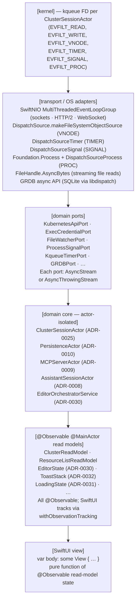

# ADR-0035 — Reactive stack integration (kqueue + AsyncSequence + Observable + SwiftUI)

- Status — Accepted (ratified 2026-05-15)
- Date — 2026-05-15
- Deciders — Fabricio Fonseca
- Consulted — (none yet)
- Informed — (none yet)
- Tags — reactive, concurrency, kqueue, asyncsequence, observation, swiftui, swift6

## Context and problem statement

K8sManager spans six categories of asynchronous I/O — TCP sockets (Kubernetes API, LLM streams),
file-system changes (kubeconfig reload, draft auto-save), signals (graceful shutdown), timers
(debounce, retry backoff, idle reaping), sub-processes (exec credential plugins), and in-process
actor messages — each with its own latency and backpressure profile.

In its current specification the project defines the individual building blocks: kqueue I/O event
selection (ADR-0029), per-cluster actor isolation (ADR-0025), Swift concurrency conventions
(ADR-0011), connection pooling (ADR-0007), and the state-driven UI layer (ADR-0034). What is missing
is the vertical contract that binds them — a single, explicit description of how an event that
originates in the kernel propagates through transport adapters, domain ports, actor-isolated
aggregates, and `@Observable` read models to produce a SwiftUI `body` re-render, with defined
backpressure behaviour, cancellation semantics, and performance acceptance criteria at every layer.

Without this cross-cutting specification, individual contributors can satisfy their bounded-context
contracts while inadvertently introducing polling loops, `Combine` pipelines, or `ObservableObject`
wiring that violates the agreed dependency direction. The risk is subtle because each departure is
locally defensible and only becomes visible when the full stack is assembled.

This ADR closes that gap. It defines the reactive stack as a single architectural artefact, maps
every kqueue filter to a concrete transport adapter and domain port, and codifies the invariants
that every layer must uphold.

## Decision drivers

- Zero polling at every layer — the UI must never wake the CPU to ask whether state has changed.
- A single reactivity primitive exposed to the domain core — `AsyncStream<Event>` and
  `AsyncThrowingStream<Event>` — so that domain actors are not coupled to transport-layer details
  (NIO, DispatchSource, GRDB).
- Backpressure must be explicit — no unbounded in-memory queues between kernel and view layer.
- Cancellation must propagate from `Task.cancel()` at the top all the way to the open kqueue file
  descriptor at the bottom.
- The Observation framework (`@Observable`, Swift 6.1) replaces `Combine` and `ObservableObject` as
  the UI binding primitive — it integrates natively with Swift strict-concurrency and produces
  finer-grained SwiftUI dependency tracking.
- Performance acceptance: 16 ms end-to-end at 60 fps; ~5–10 MB per idle cluster session; zero
  spinning CPU.

## Considered options

- **Option A** — kqueue + Observation framework (chosen)
- **Option B** — kqueue + Combine framework
- **Option C** — kqueue + RxSwift

## Decision outcome

Chosen option: **Option A — kqueue + Observation framework**.

Option B is rejected. Combine's `Publisher` / `Subscriber` type system predates Swift concurrency
and carries a structural impedance mismatch: every domain boundary requires a `Future` /
`eraseToAnyPublisher()` dance, subjects must be bridged through `@MainActor` with explicit
`receive(on: RunLoop.main)`, and Combine pipelines are difficult to cancel cleanly when the
corresponding `Task` is cancelled. Apple has stopped feature development on Combine as of WWDC 2025
and officially recommends AsyncSequence for new Swift 6 code.

Option C is rejected. RxSwift adds an external dependency with a large API surface to a codebase
that is otherwise dependency-lean at the domain core level. It provides no capabilities beyond what
AsyncSequence + Observation framework already offer natively, and it introduces a third concurrency
model (Rx scheduler) into a project that is already committing to Swift actors and structured
concurrency.

### Consequences

Positive consequences:

- Every I/O source in the project — sockets, file-system watches, timers, signals, processes, and
  SQLite async notifications — is represented by the same `AsyncStream<Event>` /
  `AsyncThrowingStream<Event>` type at the domain port boundary. Domain actors consume a uniform API
  regardless of the underlying transport.
- The Observation framework's `withObservationTracking` produces the minimum possible SwiftUI
  re-render surface: only the view nodes that actually read a changed property are re-evaluated, not
  the entire view hierarchy rooted at any `@StateObject`.
- Structured concurrency propagates cancellation hierarchically. When a `ClusterSessionActor` is
  torn down, every `Task` in its task tree is cancelled, and each `AsyncStream` continuation is
  invalidated, which in turn cancels the outstanding kqueue event wait.
- Adding a new I/O source to any bounded context requires implementing one domain port adapter that
  exposes an `AsyncStream`; nothing else in the stack changes.

Negative consequences:

- The Observation framework requires macOS 14 (Sonoma). This is already the minimum deployment
  target (ADR-0001), so it is not an additional constraint.
- Migrating any future Combine-based code (e.g., imported from a third-party library) requires
  wrapping it in an `AsyncStream { continuation in ... }` bridge at the adapter boundary. This is
  mechanical but not automatic.
- `AsyncStream` with `bufferingOldest` silently drops events that arrive faster than the consumer
  drains the buffer. This is an intentional back-pressure choice (drop oldest / newest), but it
  means lossy event delivery is possible under extreme load. The domain must tolerate dropped
  intermediate states and converge on the latest observed state.

### Backpressure invariants

The following rules apply to every `AsyncStream`-based watch stream in the reactive stack. They are
invariants — not preferred patterns — and must be upheld at every domain port boundary without
exception.

**Buffer policy.** Every `AsyncStream` MUST be created with `bufferingPolicy: .bufferingOldest(64)`.
The buffer capacity of 64 events is the maximum; it may be lowered for sources with lower event
rates but MUST NOT be raised without a new ADR justifying the increase. Producers are never
suspended — they drop incoming events when the buffer is full.

**Drop notification and relist.** Whenever an event is silently dropped due to buffer saturation,
the subscriber MUST immediately emit a `WatchStreamDropped` domain event to its read model. Within 2
seconds of emitting `WatchStreamDropped`, the subscriber MUST issue a relist request to the upstream
port (a full `list` call, not a continued `watch`) to resync its local state. Failing to relist
within the 2-second window is a spec violation and must be reported by the self-monitoring surface
(ADR-0027).

**Frame-budget processing on `@MainActor`.** Subscribers that are bound to `@MainActor` MUST process
incoming events within the 16 ms frame budget. When a burst of events arrives faster than one event
per 16 ms, the subscriber MUST batch them using `chunked(by: .timeInterval(.milliseconds(16)))` (or
an equivalent grouping operator) before applying mutations to the `@Observable` read model. This
prevents jank caused by multiple synchronous read-model mutations within a single frame boundary.

### Memory ceilings

The following resident-memory ceilings are invariants codified in
`docs/arch/contexts/_shared/schemas/performance_budgets.cue`. They are validated by XCTest `measure`
blocks in CI and must not be relaxed without a new ADR.

**Per-`ClusterSession`.** A `ClusterSessionActor` together with its event-loop group, kqueue file
descriptor, credential cache, watch buffers, `HTTPClient` connection pool state, and all associated
`AsyncStream` subscriptions must not exceed 10 MB of resident memory at steady state. This ceiling
is consistent with the value stated in the `### Performance acceptance criteria` section and is now
a hard invariant, not an estimate.

**Per-`EditorSession`.** An `EditorSession` (as defined in ADR-0030) including its content buffer
and unsaved draft MUST NOT exceed 1 MB of resident memory. Secret manifests (Kubernetes `Secret`
objects) MUST be redacted before any content is persisted to the draft storage layer; the redacted
placeholder counts toward the 1 MB ceiling, not the cleartext.

**Per-`AsyncStream` buffer.** No `AsyncStream` buffer in the reactive stack may hold more than 64
events at any time. This is a direct consequence of the `bufferingOldest(64)` policy mandated in
`### Backpressure invariants`.

**Global app baseline (idle, 1 cluster connected).** With a single cluster connected, no dashboards
open, and no active user interaction, the process RSS MUST remain at or below 200 MB. The
self-monitoring surface (ADR-0027) exposes this metric under the key `rssMB`.

**Global app under load.** With 3 clusters connected simultaneously, 5 active watch subscriptions
per cluster, and the analytics dashboard open, the process RSS MUST remain at or below 600 MB. This
ceiling is the validated upper bound for the initial release; load tests in CI enforce it.

### Confirmation

- Instruments — kqueue events/s counter (ADR-0027 self-monitoring) must confirm zero kqueue events
  generated during idle (no open clusters, no streams being consumed).
- Xcode time profiler — UI frame budget: a watch event arriving at the kqueue FD must produce a
  SwiftUI body re-evaluation within 16 ms on the reference machine (Apple M-series, macOS 14+).
- Memory — `ClusterSessionActor` allocation measured with the Allocations Instrument must not exceed
  10 MB per idle cluster session.
- Swift strict-concurrency — `swift build -Xswiftc -strict-concurrency=complete` must produce zero
  warnings across all targets. No `nonisolated(unsafe)` or `@unchecked Sendable` conformances may
  appear in domain core targets.
- Cancellation — an integration test that creates a `ClusterSessionActor`, consumes its
  `AsyncStream`, and then cancels the task must confirm via the self-monitoring kqueue events/s
  counter that the kqueue FD is closed and no more events are generated.
- No `ObservableObject` — a SwiftUI view target must produce a compile error if it imports `Combine`
  directly; this is enforced by a SwiftPM target-level dependency exclusion.
- Backpressure relist — an integration test that saturates an `AsyncStream` buffer (injects 65 rapid
  events) must confirm that `WatchStreamDropped` is emitted and a relist call is issued within 2
  seconds. The test fails if either signal is absent or delayed beyond the 2-second window.
- Memory assertions — XCTest `measure` blocks verify each ceiling defined in `### Memory ceilings`.
  The baseline test (1 cluster, idle) MUST record RSS at or below 200 MB; the load test (3 clusters,
  5 watches each, dashboard open) MUST record RSS at or below 600 MB. Ceiling violations fail CI.

## Pros and cons of the options

### Option A — kqueue + Observation framework (chosen)

Positive:

- Native to Swift 6.1 strict concurrency; zero impedance mismatch.
- Apple's active development direction post-WWDC 2024 and 2025.
- `@Observable` produces finer-grained dependency tracking than `@StateObject` / `@ObservedObject`.
- No external dependency — Observation framework and AsyncSequence are part of the Swift standard
  library.

Negative:

- Requires macOS 14+ (already the project minimum).
- `AsyncStream` continuations require explicit `onTermination` blocks to close underlying resources;
  forgetting them causes FD leaks.

### Option B — kqueue + Combine framework

Positive:

- Combine is already on macOS 10.15+ and familiar to many Swift developers.
- Third-party libraries (e.g., SwiftNIO) provide Combine bridges.

Negative:

- Combine does not participate in Swift structured concurrency — tasks cancelled via `Task.cancel()`
  do not automatically cancel Combine pipelines.
- `receive(on:)` and `subscribe(on:)` scheduling is separate from actor executors, requiring
  explicit coordination.
- Apple has indicated that AsyncSequence is the preferred path for Swift 6 projects; Combine is in
  maintenance mode.

### Option C — kqueue + RxSwift

Positive:

- Rich operator library for complex event transformations.
- Large existing community knowledge base.

Negative:

- External dependency for a capability already available in the stdlib.
- Introduces a third concurrency model (Rx scheduler) alongside Swift actors and structured
  concurrency.
- No native interop with `async`/`await` without boilerplate bridges.

## More information

### Reactive stack hierarchy

The stack is structured in five layers. Each layer communicates only with the layer immediately
above or below it.

### kqueue filter mapping

Each kqueue filter maps to one or more concrete transport adapters and one or more domain port
types.

**`EVFILT_READ`** — HTTP response bytes; WebSocket frames; exec stdout; port-forward TCP data.
Transport: SwiftNIO `MultiThreadedEventLoopGroup`. Ports: `KubernetesApiPort`, `WatchPort`,
`WebSocketExecPort`, `WebSocketPortForwardPort`.

**`EVFILT_WRITE`** — Back-pressure-aware socket writes; NIO handles transparently. Transport:
SwiftNIO write-completions. Ports: (transparent; no separate port needed).

**`EVFILT_VNODE`** — kubeconfig file mtime change; draft file atomic-write detection (ADR-0030).
Transport: `DispatchSource.makeFileSystemObjectSource`. Ports: `FileWatcherPort`.

**`EVFILT_TIMER`** — Debounce (editor 500 ms); throttle (loading 200 ms); retry backoff; idle
session reaping. Transport: `DispatchSourceTimer`. Ports: `KqueueTimerPort`.

**`EVFILT_SIGNAL`** — `SIGINT` / `SIGTERM` graceful shutdown. Transport: `DispatchSourceSignal`.
Ports: `ProcessSignalPort`.

**`EVFILT_PROC`** — Exec credential plugin child-process lifecycle (`aws`, `gcloud`, `kubelogin`).
Transport: `Foundation.Process` + `DispatchSourceProcess`. Ports: `ExecCredentialPort`.

### State-flow invariants

The following invariants apply across all layers and must be treated as architectural constraints,
not implementation preferences.

**Single source of truth.** State lives inside exactly one actor. An `@Observable` read model is a
projection of that actor's state, not an independent store. A read model may hold derived or cached
values but it must not accept direct external mutation.

**No polling in the UI.** SwiftUI views never call a refresh function, never start a `Timer`, and
never subscribe to periodic notifications to check whether state has changed. All state changes flow
inward from the reactive stack.

**Operator opt-in only.** The only acceptable reason for a human-triggered "refresh" action in the
UI is an explicit operator intent (for example a pull-to-refresh gesture or a "Force reload" menu
item). The action must dispatch a command through the actor layer and must result in a fresh stream
subscription, not a polling loop.

**Backpressure via `bufferingOldest`.** Every `AsyncStream` is created with
`AsyncStream<Event>(Event.self, bufferingPolicy: .bufferingOldest(N))` where `N` is documented per
port. The default is 64 events per stream unless a higher value is justified by the event rate of
the specific I/O source. This makes backpressure explicit and lossy rather than unbounded and
unbacked.

**Cancellation propagates to kqueue.** `Task.cancel()` on a task that consumes an `AsyncStream` must
trigger the stream's `onTermination` closure, which must close the underlying `DispatchSource` or
NIO channel, which must cause the associated kqueue filter to be removed. An abandoned `AsyncStream`
continuation with an open kqueue filter is a file-descriptor leak and a self-monitoring alert
condition (ADR-0027).

**State-driven notifications.** Toast notifications (ADR-0032), loading states (ADR-0031), and
editor diagnostics (ADR-0030) are all produced by actors that emit to `AsyncStream` endpoints
consumed by `@Observable` read models on `@MainActor`. There is no direct
`DispatchQueue.main.async { … }` notification call from any adapter or actor.

### Per-domain I/O budget

Each domain bounded context owns a defined set of `AsyncStream` subscriptions at steady state (one
or more open clusters):

- `cluster_connectivity` — one `AsyncStream` per cluster per active watch resource kind; one
  `FileWatcherPort` stream for kubeconfig; one `KqueueTimerPort` stream for credential refresh
  timing.
- `assistant_chat` — one `AsyncThrowingStream` per active LLM streaming turn; terminates when the
  turn completes.
- `resource_browser` — one `AsyncStream` per active resource watch; one `KqueueTimerPort` stream for
  debounce in the integrated editor (ADR-0030).
- `terminal_session` — one bidirectional `AsyncStream` per open exec channel; closed on tab close.
- `port_forwarding` — one `AsyncStream` per active forward; closed on explicit teardown.
- `local_persistence` — one `AsyncStream` from GRDB async observation per registered observation
  query; bounded by the number of distinct queries.

### Performance acceptance criteria

The following criteria are validated using the Instruments toolset and the in-app self-monitoring
surface (ADR-0027):

**UI frame latency.** A Kubernetes API watch event that modifies a pod status must cause a SwiftUI
view body re-evaluation within 16 ms on the reference Apple M-series machine running macOS 14
Sonoma. The 16 ms budget is consistent with a 60 fps frame rate.

**Idle CPU.** With one connected cluster and no active user interaction, the kqueue file descriptor
must block indefinitely in the kernel. The in-app self-monitoring kqueue events/s counter must read
zero (or below 1 event/s for keepalive timer ticks). CPU utilisation must be below 0.5% as measured
by Instruments Activity Monitor instrument.

**Memory per cluster session.** A `ClusterSessionActor` plus its associated event-loop group, kqueue
file descriptor, credential cache, and stream subscriptions must fit within 10 MB of allocated heap
at steady state. This is measured with the Instruments Allocations instrument filtered to the
`ClusterSession` allocation category.

**Cancellation latency.** From the moment `Task.cancel()` is called on the top-level task consuming
a cluster session to the moment the kqueue file descriptor is closed, no more than 100 ms must
elapse. The self-monitoring surface must show the sessions/s counter decrement within the same
interval.

**Watch event fanout.** A single Kubernetes API watch event that touches 50 pod entries must
complete all actor state updates and all read-model projections within 100 ms total wall-clock time,
including the SwiftUI body re-evaluations. This is validated with the Instruments SwiftUI Profiler
instrument.

### Relationship to refined ADRs

This ADR refines the following prior decisions:

- **ADR-0007** (connection pool) — the pool events that ADR-0007 describes as produced by SwiftNIO
  are now explicitly mapped to `EVFILT_READ` / `EVFILT_WRITE` and routed through `KubernetesApiPort`
  as `AsyncStream<Event>`. The pool itself remains unchanged; this ADR adds the downstream routing
  contract.

- **ADR-0011** (Swift concurrency) — ADR-0011 chose `AsyncStream` as the primary inter-actor
  boundary and ruled out `Combine`. This ADR confirms that choice and adds the Observation framework
  as the explicit UI binding layer, superseding the incomplete `@State` / actor bridging sketch in
  ADR-0011.

- **ADR-0025** (per-cluster isolation) — ADR-0025 specifies that each cluster has a dedicated
  `MultiThreadedEventLoopGroup`. This ADR adds the constraint that each group maps to a single
  kqueue file descriptor owned by `ClusterSessionActor`, and that the FD is closed when the actor is
  deallocated.

- **ADR-0029** (kqueue I/O selector) — ADR-0029 documented the rationale for using kqueue and the
  `EVFILT_READ` filter for socket I/O. This ADR extends the filter coverage to all six relevant
  kqueue filters (`EVFILT_READ`, `EVFILT_WRITE`, `EVFILT_VNODE`, `EVFILT_TIMER`, `EVFILT_SIGNAL`,
  `EVFILT_PROC`) and maps each to its adapter and port.

- **ADR-0034** (state-driven UI) — ADR-0034 mandated `@Observable` and banned `ObservableObject` /
  Combine in the UI layer. This ADR provides the complete upstream stack that feeds those
  `@Observable` read models, making ADR-0034 a special case of the full reactive stack specified
  here.
