# ADR-0036 — Watch stream lifecycle: LIST/WATCH, bookmarks, 410-Gone recovery, and fan-out budget

- Status — Accepted (ratified 2026-05-15)
- Refined by — ADR-0041, ADR-0050 (tab-owned watch lifecycle invariant)
- Date — 2026-05-15
- Deciders — Fabricio Fonseca
- Consulted — (none yet)
- Informed — (none yet)
- Tags — watch, informer, resourceversion, bookmark, backoff, fan-out, lru, lifecycle, concurrency

## Context and problem statement

K8sManager maintains live views of Kubernetes resources in the `resource_browser` bounded context.
ADR-0035 established that every live resource list is driven by a Kubernetes API watch stream
consumed as an `AsyncStream<Event>` through `WatchPort`. ADR-0025 scopes each stream to a
`ClusterSessionActor`.

What is missing is the precise lifecycle contract that governs how a watch stream is established,
kept alive, recovered from errors, and eventually closed. Without this contract, individual adapter
implementations will diverge on the following questions:

- At what point is the initial resource version (RV) captured, and how is it passed to the WATCH
  request?
- What is the correct handling of `BOOKMARK` events, which carry a new RV without modifying local
  cache state?
- What happens when the API server returns `410 Gone`, signalling that the client's RV is stale?
- What backoff schedule governs reconnection after a transient network error?
- How many concurrent watch streams may a `ClusterSessionActor` hold open, and what eviction policy
  applies when that budget is exceeded?
- What must happen when `bufferingOldest(64)` (ADR-0035) drops an event before the domain actor can
  drain it?

This ADR answers all six questions and defines the watch stream state machine that every adapter
implementing `WatchPort` must follow.

## Decision drivers

- **Eventual consistency** — dropped events (from backpressure) and network gaps must never leave
  the local cache in a permanently diverged state. The only safe recovery is a full relist.
- **Bookmark correctness** — BOOKMARK events advance the locally tracked RV without changing any
  object; mishandling them causes the client to present a stale RV to the next WATCH request,
  triggering unnecessary 410-Gone responses.
- **Bounded resource usage** — each open watch stream holds an HTTP/2 stream and a kqueue
  `EVFILT_READ` filter. The number of concurrent streams must be bounded per `ClusterSessionActor`
  to prevent FD exhaustion.
- **Deterministic backoff** — reconnect storms against the API server cause throttling. A
  deterministic, jittered exponential backoff schedule with a known cap is required.
- **No polling** — ADR-0035 mandates zero polling. Every wait must be a blocking kqueue event wait
  or a structured `Task.sleep`.

## Considered options

- **Option A** — Informer pattern with RV tracking, BOOKMARK consumption, 410-Gone relist,
  exponential backoff with jitter, and LRU-capped fan-out budget (chosen).
- **Option B** — Polling list with no WATCH. Issues a `GET` every N seconds with `resourceVersion=0`
  (always fetch from etcd). Simple but violates the zero-polling invariant in ADR-0035 and places
  unnecessary load on etcd.
- **Option C** — WATCH only with `resourceVersion=0` on every reconnect (no initial LIST). Skips the
  RV capture step. Triggers a full resync from etcd on each reconnect, making the watch stream
  equivalent to the polling approach under network instability.

## Decision outcome

Chosen option — **Option A**, because it is the canonical Kubernetes informer pattern, correctly
handles all edge cases documented in the Kubernetes API machinery, and is the model used by
client-go, the reference implementation.

### Phase 1 — Initial LIST with RV capture

Before opening a WATCH stream, the adapter issues a paginated LIST request against the target GVK:

```
GET /apis/<group>/<version>/namespaces/<ns>/<resource>
    ?limit=500&resourceVersion=0
```

`resourceVersion=0` instructs the API server to serve from the watch cache (not etcd), minimising
read pressure. The LIST response carries a `metadata.resourceVersion` field in its top-level
envelope. This RV is captured and stored in the `WatchStreamState` actor as `lastKnownRV`.

The LIST response is decoded and the full object list is handed to the domain actor as a `#Replaced`
event, which replaces the entire local cache. No incremental merging is performed for the initial
load.

If the LIST response spans multiple pages (presence of `metadata.continue` in the response), the
adapter follows the continuation token until no `continue` field is present. The final page carries
the authoritative `resourceVersion` for the WATCH phase.

### Phase 2 — WATCH request with bookmarks

After a successful LIST, the adapter opens a WATCH stream:

```
GET /apis/<group>/<version>/namespaces/<ns>/<resource>
    ?watch=1
    &resourceVersion=<lastKnownRV>
    &allowWatchBookmarks=true
    &timeoutSeconds=<n>
```

`timeoutSeconds` is set to 300 (5 minutes). The API server terminates the stream at or before this
deadline. The adapter treats the server-initiated close as a normal end-of-stream event and
transitions to the `Backoff` state with a zero-delay reconnect (first reconnect is treated as a
scheduled renewal, not an error). The backoff schedule described in the disconnection section
applies only to error-induced disconnects.

`allowWatchBookmarks=true` enables the server to send `BOOKMARK` events at its discretion (typically
after each batch of events and at periodic intervals). BOOKMARK events advance the RV without
modifying the local cache.

The WATCH response body is a chunked stream of JSON event objects, each with the shape:

```
{ "type": "<ADDED|MODIFIED|DELETED|BOOKMARK|ERROR>", "object": { ... } }
```

### Phase 3 — BOOKMARK consumption

When `event.type == "BOOKMARK"`, the adapter:

1. Extracts `event.object.metadata.resourceVersion`.
2. Atomically updates `WatchStreamState.lastKnownRV` to the new value.
3. Does NOT emit any event to the domain actor's `AsyncStream`.
4. Does NOT modify any object in the local cache.

BOOKMARK processing is strictly a book-keeping operation. The domain actor is never notified of a
BOOKMARK event.

### Phase 4 — 410-Gone handling and full relist

When the API server returns an `ERROR` event with HTTP status `410 Gone` (field `object.code == 410`
or the transport-level HTTP status is 410), it signals that `lastKnownRV` is so old the API server's
watch cache has compacted it away. The correct recovery is:

1. Close the current WATCH stream.
2. Emit a `#Invalidated` event to the domain actor, which clears the local cache and sets the
   resource list to a loading state in the read model.
3. Transition the state machine to `Relisting`.
4. Execute a fresh LIST with `resourceVersion=0` as in Phase 1.
5. After the LIST completes, open a new WATCH with the new `lastKnownRV`.

The 410-Gone path does NOT apply the exponential backoff schedule. The relist begins immediately,
because 410-Gone is a protocol-level signal, not a transient network error.

### Disconnection and exponential backoff

On any WATCH stream termination caused by a network error, TCP reset, connection timeout, or non-410
HTTP error response, the adapter transitions to `Backoff` and waits before relisting:

Backoff schedule (ms): 250, 500, 1000, 2000, 4000, 8000, 16000, capped at 30000. Each interval is
jittered by ±20% of the nominal value (uniform random in Swift using `SystemRandomNumberGenerator`
seeded at adapter construction time). After the backoff wait, the adapter performs a full relist
(Phase 1) and re-opens the WATCH (Phase 2). The consecutive error counter resets to zero on any
successful WATCH event delivery (including BOOKMARK).

If the adapter receives `Task.cancel()` while in `Backoff`, the `Task.sleep` for the backoff
interval is interrupted and the state machine transitions directly to `Closed`.

### Watch stream fan-out budget

Each `ClusterSessionActor` maintains a `WatchStreamRegistry` that enforces a concurrent watch
budget:

- Maximum concurrent watches: 16.
- When a 17th watch is requested, the least-recently-used (LRU) watch is evicted: its
  `WatchStreamState` is transitioned to `Closing`, the WATCH HTTP/2 stream is cancelled, the kqueue
  filter is removed, and a `#Invalidated` event is emitted to the corresponding domain consumer.
- LRU tracking uses the timestamp of the last event delivered to the domain actor as the recency
  key.
- Watches for resources currently visible in an active SwiftUI view are marked `pinned` and are
  exempt from LRU eviction. Pinning is set by the `ResourceListReadModel` on view appearance and
  cleared on view disappearance.
- The budget of 16 is informed by the typical per-cluster resource kind surface visible to an
  operator in a single session. It may be raised to a maximum of 32 via a per-cluster settings
  override, subject to the memory budget constraint in ADR-0035 (10 MB per idle session).

### Reconcile trigger on dropped events

`AsyncStream` with `bufferingOldest(64)` silently drops events that arrive faster than the domain
actor drains the buffer (ADR-0035). A dropped event means the local cache has diverged from cluster
state. The adapter detects drops via the `AsyncStream.Continuation.BufferingPolicy.bufferingOldest`
`onTermination` / `yield(with:)` result:

When `yield(with:)` returns `.dropped`, the adapter immediately:

1. Transitions the affected `WatchStreamState` to `Relisting`.
2. Emits a `#Invalidated` event (inserted ahead of the dropped event, via a separate high-priority
   channel).
3. Performs a full relist (Phase 1) before resuming the WATCH.

This ensures that a momentary burst of watch events never silently diverges the cache. The invariant
is: if any event is dropped, the next coherent state the domain actor observes is a full replacement
from a fresh LIST.

### State machine

The following diagram shows all states and their transitions for a single `WatchStreamState`
instance.

```mermaid
stateDiagram-v2
    [*] --> Idle : adapter created
    Idle --> Listing : start() called
    Listing --> Watching : LIST succeeded; RV captured
    Listing --> Backoff : LIST failed (network / non-410)
    Watching --> BookmarkRefresh : BOOKMARK event received
    BookmarkRefresh --> Watching : lastKnownRV updated
    Watching --> Relisting : 410-Gone received\nor event dropped (bufferOverflow)
    Relisting --> Watching : relist complete; new RV captured
    Relisting --> Backoff : relist failed (network / non-410)
    Watching --> Backoff : disconnect (non-410 error / TCP reset)
    Backoff --> Relisting : backoff elapsed
    Backoff --> Closed : Task.cancel() received
    Relisting --> Closed : Task.cancel() received
    Watching --> Closed : stop() called
    Listing --> Closed : Task.cancel() received
    Closed --> [*]
```



Transitions not shown for clarity: `BookmarkRefresh` transitions to `Closed` if `Task.cancel()`
arrives while the RV update is in progress. `Relisting` → `Watching` is the hot-path for 410-Gone
recovery (no `Backoff` intermediate state).

### Consequences

- **Positive** — the state machine is complete and deterministic; every error condition has a
  defined recovery path; dropped events are detected and trigger a full reconcile rather than silent
  divergence; the fan-out budget prevents FD exhaustion; the LRU eviction policy keeps the most
  recently accessed watches alive.
- **Negative** — a full relist on every dropped event may trigger additional LIST round-trips under
  sustained write bursts; the LRU eviction silently terminates watches that are not pinned, which
  may surprise operators who have multiple resource kinds open simultaneously; the 16-stream default
  is a pragmatic limit, not a hard Kubernetes constraint.
- **Neutral** — the informer pattern described here is directly analogous to the client-go
  `cache.NewInformer` implementation; deviations from this pattern should be documented as
  intentional.

### Confirmation

The following tests must pass before this ADR is considered implemented:

- **410-Gone recovery** — a test adapter that injects a synthetic 410 ERROR event into the WATCH
  stream verifies that the state machine transitions `Watching → Relisting → Watching`, that a
  `#Invalidated` event is emitted before the new `#Replaced` event, and that no `Backoff` state is
  entered.
- **Bookmark interval** — a test adapter that injects 10 ADDED events followed by one BOOKMARK event
  verifies that `lastKnownRV` advances to the BOOKMARK value, that no `#Replaced` or `#Modified`
  event is emitted to the domain actor, and that the subsequent WATCH request uses the BOOKMARK RV.
- **Backoff schedule determinism** — a unit test seeded with a fixed `SystemRandomNumberGenerator`
  mock verifies that the seven intervals produced are within ±20% of (250, 500, 1000, 2000, 4000,
  8000, 16000) ms, and that the eighth and subsequent intervals are within ±20% of 30000 ms.
- **Fan-out LRU eviction** — a test that opens 17 watches on the same `ClusterSessionActor` verifies
  that exactly one `WatchStreamState` transitions to `Closed` (the least recently used), that a
  `#Invalidated` event is emitted for that watch, and that all 16 remaining watches remain in
  `Watching` state.
- **Drop-triggered relist** — a test that floods the `AsyncStream` with 128 events (exceeding the
  `bufferingOldest(64)` buffer) and then drains it verifies that at least one `#Invalidated` event
  precedes the `#Replaced` event, and that no stale intermediate object state is observable by the
  domain actor.
- **Stale-RV WATCH request** — a test that presents a stale RV (one that has been compacted from the
  API server watch cache) via a mock HTTP handler verifies that the adapter correctly parses the 410
  ERROR event body and does not enter `Backoff`.

## Pros and cons of the options

### Option A — Informer pattern (chosen)

- **Pros** — canonical Kubernetes pattern; handles all documented edge cases; client-go reference
  implementation provides a proven test corpus; BOOKMARK support minimises stale-RV reconnects; LRU
  budget bounds resource usage.
- **Cons** — more states to implement and test than naive polling; the LIST + WATCH handoff must be
  atomic from the RV perspective (a race between LIST completion and the first WATCH event can be
  admitted by the protocol — events with RV <= lastKnownRV must be silently discarded by the
  adapter).

### Option B — Polling LIST

- **Pros** — trivial to implement; no state machine; no RV tracking.
- **Cons** — violates ADR-0035 zero-polling invariant; etcd read pressure scales with polling
  interval; no ordering guarantees; events may be missed between poll cycles; incompatible with the
  `AsyncStream<Event>` port contract.

### Option C — WATCH with resourceVersion=0 on every reconnect

- **Pros** — simpler than Option A (no LIST phase); RV tracking not needed.
- **Cons** — every reconnect triggers a full etcd read-through (no watch-cache benefit);
  semantically equivalent to polling under network instability; BOOKMARK events are useless without
  RV tracking; API server may rate-limit clients that repeatedly open watches from RV 0 under the
  Kubernetes API Priority and Fairness framework.

## More information

- ADR-0025 — per-cluster isolation; `ClusterSessionActor` is the owner of the `WatchStreamRegistry`.
- ADR-0029 — kqueue I/O selector; `EVFILT_READ` backs the HTTP/2 stream underlying each WATCH
  connection.
- ADR-0035 — reactive stack; `bufferingOldest(64)` backpressure policy and the `AsyncStream<Event>`
  port contract.
- ADR-0013 — resource browser scope; the set of GVKs that may be watched is the kind catalogue
  defined there.
- ADR-0012 — mutating operations policy; WATCH streams are read-only and not subject to confirmation
  requirements.
- Kubernetes API conventions for LIST/WATCH:
  <https://github.com/kubernetes/community/blob/master/contributors/devel/sig-architecture/api-conventions.md#concurrency-control-and-consistency>
- Kubernetes efficient watch resumption (bookmarks):
  <https://kubernetes.io/docs/reference/using-api/api-concepts/#watch-bookmarks>
- client-go informer reference implementation:
  <https://github.com/kubernetes/client-go/blob/main/tools/cache/listwatch.go>

---

## Addendum — Tab-owned watch lifecycle invariant (2026-05-16, ADR-0050 refinement)

ADR-0050 introduces the multi-document tab system and establishes that **tabs are the authoritative
owners of Kubernetes watch streams**. This addendum records the watch lifecycle implication:

**Tab open starts a watch.** When `OpenTabsActor` processes an `openTab` command for a
`resourceList` or `resourceDetail` tab, it calls `WatchPort.watch(gvr:namespace:resourceVersion:)`
(or the typed equivalent for standard kinds) on the cluster's `ClusterSessionActor`. The resulting
`Task` is stored in the tab's watcher registry keyed by `tabId`. The watch lifecycle follows all
rules in this ADR: LIST first, WATCH with bookmark tracking, 410-Gone recovery, and exponential
backoff.

**Tab close cancels the watch.** When `OpenTabsActor` processes a `closeTab` command, it retrieves
the watcher `Task` for the `tabId` and calls `task.cancel()`. Swift structured concurrency
propagates cancellation to the `WatchPort` adapter, which exits the `for try await` loop on the
`AsyncThrowingStream`, performs cleanup (no lingering HTTP/2 stream), and does NOT re-establish a
new watch. The tab is removed from the watcher registry.

**Sidebar tree selection MUST NOT start a watch.** A sidebar tree node click that brings an existing
tab to focus issues only a `focusTab` command to `OpenTabsActor`. No new watch is started. If no tab
exists for the selected (clusterId, tabKind, namespace, kindName), a new tab is opened and the watch
starts per the above rule.

**Fan-out budget interaction.** Tabs contribute directly to the concurrent watch stream count
tracked by `ClusterSessionActor`. Each open `resourceList` or `resourceDetail` tab consumes one
watch stream slot. The LRU eviction policy defined in this ADR applies to tabs: if opening a new
tab's watch would exceed the `watchBudget`, the LRU watch (tab) is evicted. The evicted tab receives
a `watchEvicted` state update; it transitions to a paused state and the tab chip shows a refresh
icon. The operator can manually resume the watch by clicking the refresh icon, which re-opens the
watch using the current resource version.
