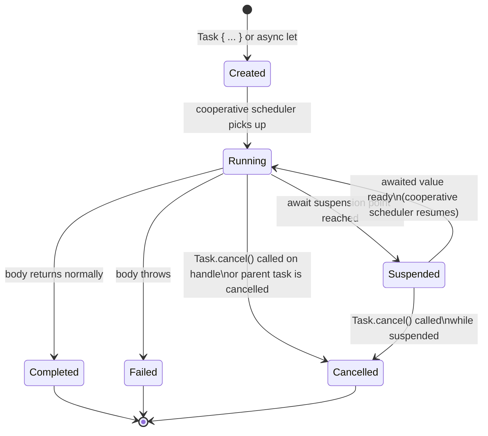

# ADR-0037 — Concurrency lifecycle invariants

- Status — Accepted (ratified 2026-05-15)
- Date — 2026-05-15
- Deciders — Fabricio Fonseca
- Consulted — (none yet)
- Informed — (none yet)
- Refines — ADR-0011 (Swift concurrency conventions), ADR-0025 (per-cluster isolation strategy),
  ADR-0034 (state-driven realtime UI architecture), ADR-0035 (reactive stack integration)
- Tags — architecture, concurrency, swift6, actor, task, cancellation, deadlock, race-condition,
  async-sequence

## Context and problem statement

ADR-0011 adopts Swift 6 strict concurrency as the execution model and names actors, `async let`,
`withTaskGroup`, and `AsyncSequence` as the primary concurrency primitives. ADR-0034 prescribes
`@Observable` view models fed by `AsyncSequence` streams. ADR-0025 creates per-cluster
`ClusterSessionActor` instances that own child task groups.

None of those ADRs document the invariants that must hold across the full lifecycle of a `Task`:
when cancellation propagates, how actor reentrancy interacts with mutable state, what lock ordering
rules prevent deadlock, how backpressure is handled in bounded `AsyncStream` buffers, or what
discipline is required for `@MainActor` view model update loops.

Without explicit invariants, contributors produce subtle bugs that are hard to detect at review
time: state mutations that become inconsistent across suspension points, circular `await` chains
that deadlock silently, hot update loops that miss the 16 ms frame budget, and task trees where
cancellation is observed too late or not at all.

This ADR states those invariants as binding conventions and provides confirmation tests that
mechanically verify each one.

## Decision drivers

- Swift 6 strict concurrency surfaces many concurrency bugs at compile time but not all; actor
  reentrancy bugs and deadlock cycles require explicit documentation and runtime tests.
- `ClusterSessionActor` is reentrant by default (all Swift actors are). The codebase must handle the
  reentrancy bug class explicitly.
- Multiple actors are accessed in sequence throughout the application; a canonical acquisition order
  prevents deadlock by construction.
- `AsyncStream` buffers are bounded; the chosen buffering policy determines whether producers or
  consumers bear the backpressure cost.
- `@MainActor` view model loops must not starve the render thread; batching discipline is required.

## Considered options

### Option A — Ad-hoc per-module conventions (current implicit state)

Each module author applies their own judgment about cancellation, reentrancy, and lock order. No
canonical document exists.

Pros:

- No upfront documentation cost.

Cons:

- Inconsistent conventions lead to subtle bugs that are expensive to debug.
- New contributors have no authoritative reference.
- Integration tests do not mechanically verify the invariants.

### Option B — Explicit invariants documented in this ADR with confirmation tests (chosen)

A single ADR records all concurrency lifecycle invariants. Confirmation tests verify cancellation
propagation, reentrancy safety, lock ordering, and frame budget compliance. The document is
referenced from ADR-0011 and ADR-0034.

Pros:

- Single authoritative source for contributors and reviewers.
- Mechanical tests catch regressions in CI.
- Invariants are stated as code contracts, not prose hopes.

Cons:

- Requires upfront documentation effort.
- Tests must be kept in sync with the codebase as actors are added.

## Decision outcome

Adopt Option B. The invariants below are binding for all Swift code in K8sManager. Violations are
bugs, not style preferences.

## Task lifecycle

The canonical lifecycle of every `Task` in the application is:



Every `Task` traverses `Created → Running`. From `Running` it may suspend any number of times before
reaching a terminal state. Cancellation is cooperative: the runtime sets the cancellation flag but
the task must observe it at a suspension point or via `Task.isCancelled` /
`try Task.checkCancellation()`.

## Invariant 1 — Task cancellation propagation

Every `Task` started by an actor that reaches a suspension point MUST observe `Task.isCancelled` at
that point or be cancelled via its parent task tree.

Structured concurrency primitives (`async let`, `withTaskGroup`, `withThrowingTaskGroup`) propagate
cancellation automatically: cancelling the group or the enclosing task cancels all children.
Unstructured tasks (`Task { ... }` and `Task.detached { ... }`) do not inherit the caller's
cancellation; they MUST store a `Task` handle and call `.cancel()` explicitly on teardown.

Rules:

1. Prefer `async let` or `withThrowingTaskGroup` over `Task { ... }` for work that must be cancelled
   when the parent scope exits.
2. Every unstructured `Task` handle MUST be stored in an actor-isolated property and cancelled in
   `deinit` or a dedicated `teardown()` method.
3. Long-running loops inside a task MUST check `Task.isCancelled` at each iteration or call a
   `try Task.checkCancellation()` at a natural suspension point (e.g., after an `await`). A loop
   that does not yield is a bug.
4. `ClusterSessionActor` orchestrates all per-cluster sub-tasks via `withThrowingTaskGroup`.
   Cancelling the actor's root task group cancels watch streams, exec sessions, port-forward
   listeners, and the interval refresh loop in one call.

## Invariant 2 — Actor reentrancy

All Swift actors are reentrant by default. A method that `await`s another actor or async function
may be interleaved with other callers between the `await` and the resume.

Consequence: state read before an `await` may be stale by the time execution resumes. Any invariant
that depends on multiple state fields MUST be re-validated after every `await`.

### The actor reentrancy bug (concrete example)

```swift
// BUG: balance check is stale after await
actor BankAccount {
    var balance: Int = 0

    func withdraw(_ amount: Int) async throws {
        guard balance >= amount else { throw InsufficientFunds() }
        // --- suspension point ---
        await recordTransaction(amount)   // another withdraw may run here
        balance -= amount                 // balance may now be negative
    }
}
```

Between the `guard` and `balance -= amount` another call to `withdraw` may have already decremented
the balance. The `guard` check is no longer valid after the `await`.

### The fix

```swift
// CORRECT: re-validate after await
actor BankAccount {
    var balance: Int = 0

    func withdraw(_ amount: Int) async throws {
        guard balance >= amount else { throw InsufficientFunds() }
        await recordTransaction(amount)
        // Re-validate after resuming
        guard balance >= amount else { throw InsufficientFunds() }
        balance -= amount
    }
}
```

Rule: any actor method that mutates state after an `await` MUST re-validate all preconditions that
were checked before the `await`. `ClusterSessionActor` applies this rule to every registry mutation
(adding or removing a watch stream, exec session, or port-forward listener).

## Invariant 3 — Lock ordering rules

When code must access two or more actors in sequence, the access MUST follow the canonical
acquisition order below. Acquiring in reverse order creates a potential deadlock cycle.

Canonical order (outermost first):

```
AppShellActor → ContextNavigationActor → ClusterSessionActor → PersistenceActor
```

A code path that does `await clusterSession.foo()` followed by `await appShell.bar()` is forbidden:
it acquires `ClusterSessionActor` first and `AppShellActor` second, which is the reverse of the
canonical order.

If a downstream actor needs to notify an upstream actor (e.g., `ClusterSessionActor` needs to inform
`AppShellActor` of a state change), it MUST do so by emitting an `AsyncStream` event that the
upstream actor consumes asynchronously — not by `await`ing the upstream actor directly.

Permitted notification pattern:

```swift
// ClusterSessionActor emits; AppShellActor consumes from its own task
actor ClusterSessionActor {
    private let eventContinuation: AsyncStream<ClusterSessionEvent>.Continuation

    func notifyShell(_ event: ClusterSessionEvent) {
        eventContinuation.yield(event)   // non-blocking, no await on AppShellActor
    }
}
```

## Invariant 4 — Deadlock prevention

Actors MUST NOT `await` themselves. Under Swift 6 strict concurrency, calling an `async` method on
`self` from within an actor method while already holding the actor's isolation is a compile error
(the actor would attempt to acquire its own lock while already holding it, deadlocking).

`await` chains across actors MUST NOT form cycles:

- A cycle exists when actor A awaits actor B, actor B awaits actor C, and actor C awaits actor A.
- All cross-actor call graphs must be directed acyclic graphs (DAGs) with the canonical acquisition
  order as the topological sort.

Detection: code review enforces the lock-ordering rule. Integration tests exercise the canonical
call paths with `parallelism: .fixed(8)` to surface ordering violations at runtime. A test that
deliberately acquires actors in reverse order MUST observe a timeout (not a hang) within a bounded
deadline, confirming the cycle is not silently blocking threads.

## Invariant 5 — Race detection patterns

All types that cross actor boundaries MUST conform to `Sendable`. The Swift 6 compiler enforces
this; any suppression of `@unchecked Sendable` MUST be accompanied by a code comment explaining the
manual guarantee.

Race detection in tests uses `swift-testing` suites with fixed parallelism:

```swift
@Suite(.serialized)           // use .serialized only for truly serial suites
struct ClusterSessionTests { }

// For race exposure, prefer fixed high parallelism:
@Suite struct RaceExposureTests {
    // Spawning Tasks inside each @Test with TaskGroup achieves parallelism
}
```

For deliberate race exposure, tests spawn a `TaskGroup` with 8 concurrent tasks all reading and
writing shared state. The `swift-concurrency-extras` `withMainSerialExecutor` helper forces all
tasks onto one executor for deterministic unit tests; the `parallelism: .fixed(8)` pattern exercises
actual concurrent access for integration-level race tests.

## Invariant 6 — AsyncSequence backpressure

All bounded `AsyncStream` buffers use the following semantics:

- `bufferingOldest(N)`: when the buffer holds N elements, new values yielded by the producer are
  dropped (newest is discarded). The producer never suspends. This is the default for high-frequency
  metric streams where dropping a sample is acceptable and producer stall is not.
- `bufferingNewest(N)`: when the buffer holds N elements, the oldest element is evicted to make room
  for the new one. Preferred for UI-facing streams where the latest value is most important.
- `unbounded`: permitted only for event streams where every event MUST be processed (e.g.,
  `#ClusterSessionEvent` lifecycle transitions). Memory growth is bounded by the rate at which
  consumers drain the stream.

Producer-side cancellation: cancelling the consumer `Task` that is iterating an `AsyncStream` causes
the stream's `AsyncStream.Continuation` to receive an `onTermination` callback. Producers MUST
register an `onTermination` handler that stops yielding values and releases upstream resources
(e.g., closes a SwiftNIO channel or cancels a Kubernetes watch request).

```swift
let (stream, continuation) = AsyncStream<MetricSample>.makeStream(
    bufferingPolicy: .bufferingOldest(120)
)
continuation.onTermination = { @Sendable _ in
    watchChannel.close()   // upstream resource released when consumer cancels
}
```

## Invariant 7 — MainActor hop discipline

`@MainActor` view models receive `AsyncSequence` values via `for await ...` loops started in `.task`
view modifiers or `onAppear` closures. The loop runs on the main actor; every iteration invokes a
main-actor method to update observable state.

High-frequency streams (metrics at >30 Hz, watch events during cluster storms) MUST be batched
before hitting the main actor to respect the 16 ms frame budget (ADR-0035):

```swift
// Preferred: batch by time interval before touching @MainActor state
for await batch in metricStream.chunked(by: .timeInterval(.milliseconds(16))) {
    viewModel.apply(batch)   // one @MainActor hop per frame
}
```

A stream that delivers individual elements at >60 Hz without batching MUST NOT be consumed directly
on the main actor; it must pass through a background actor that aggregates samples before forwarding
to the view model.

Rules:

1. Any `AsyncSequence` consumed directly on `@MainActor` MUST have a demonstrated delivery rate
   below 60 elements/second under normal load, OR MUST be batched via `chunked(by:)` or a manual
   aggregation step.
2. View models updated inside a `for await` loop MUST set only `@Observable` properties; they MUST
   NOT perform synchronous I/O, disk access, or blocking work inside the loop body.
3. Timeouts and retries on watch streams are the responsibility of the background actor that owns
   the stream; the view model `for await` loop sees a clean stream with no network errors (errors
   are translated to domain events upstream).

### Consequences

**Positive**

- Cancellation propagation is guaranteed by structured concurrency; no resource leaks from dangling
  tasks.
- Actor reentrancy bugs are caught by re-validation patterns mandated in Invariant 2.
- Lock-ordering rules eliminate deadlock cycles by construction.
- Backpressure semantics are explicit; stream consumers are protected from producer floods.
- Frame budget compliance is enforced by batching discipline.

**Negative**

- Re-validation after every `await` adds boilerplate to actor methods that mutate state.
- Canonical lock order constrains notification patterns between actors; downstream-to-upstream
  notifications must use stream emission rather than direct `await`.

**Neutral**

- `unbounded` buffers are permitted for lifecycle event streams; contributors must justify the
  choice in code comments.

### Confirmation

The following tests MUST pass in CI before any release:

**Cancellation propagation test.** Start 10 child tasks inside a `withThrowingTaskGroup`. Cancel the
root task group after all children have started but before any completes. Assert that every child
task observes `Task.isCancelled == true` within 100 ms of the root cancellation. Measured with
wall-clock assertions inside each child after its next suspension point.

**Deadlock prevention test.** Spawn two tasks: Task A acquires `ClusterSessionActor` then attempts
to acquire `AppShellActor` (reverse of canonical order). Task B acquires `AppShellActor` first. The
test provides a `withTimeout(seconds: 2)` wrapper; if the tasks do not complete within 2 s the test
FAILS with "potential deadlock detected", not a silent hang. This test documents the forbidden
pattern — it is expected to time out when the canonical order is violated and pass only when the
lock order is corrected.

**Reentrancy invariant test.** An actor holds a `count` integer. Two tasks concurrently call a
method that reads `count`, suspends via `await Task.yield()`, then increments `count` expecting the
pre-yield value. Without re-validation the final count will equal 1 (lost update). With
re-validation (re-read `count` after `await`) the actor serialises correctly and the final count
equals 2. The test asserts the re-validation pattern produces the correct result.

**Backpressure test.** A producer yields 1 000 elements into an
`AsyncStream(bufferingPolicy: .bufferingOldest(10))`. The consumer reads asynchronously with a
deliberate delay. Assert that the consumer receives exactly 10 elements (the oldest 10; all newer
elements are dropped) and that the producer completes without suspending.

**Frame budget test.** A `@MainActor` view model receives 120 elements per second from a mock metric
stream. Without batching, assert that main-thread hop latency exceeds 16 ms for at least one hop
under load. With `chunked(by: .timeInterval(.milliseconds(16)))` batching applied, assert that
main-thread hop latency stays below 16 ms for 99 % of hops over a 5-second run.

## More information

- ADR-0011 — Swift concurrency conventions (parent of this ADR).
- ADR-0025 — Per-cluster isolation strategy (`ClusterSessionActor` is the primary actor subject to
  the reentrancy and lock-order invariants).
- ADR-0034 — State-driven realtime UI architecture (defines the `@Observable` view model contract
  and `AsyncSequence` data flow).
- ADR-0035 — Reactive stack integration (defines the 16 ms frame budget referenced in Invariant 7).
- ADR-0038 — Testing strategy (conformance suite structure for the confirmation tests above).
- `apple/swift-async-algorithms` — provides `chunked(by:)` and `AsyncTimerSequence` referenced in
  Invariants 6 and 7.
- `pointfreeco/swift-concurrency-extras` — provides `withMainSerialExecutor` used in race detection
  test patterns.
