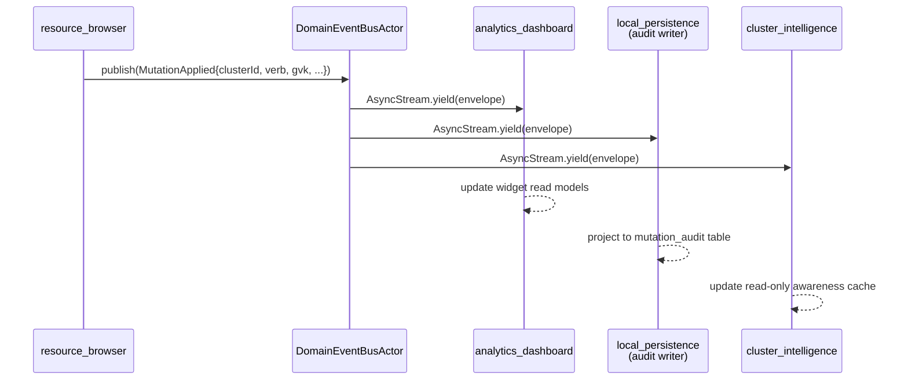

# ADR-0040 — Cross-context domain event taxonomy

- Status — Proposed
- Date — 2026-05-15
- Deciders — Fabricio Fonseca
- Consulted — (none yet)
- Informed — (none yet)
- Tags — ddd, events, async-stream, fan-out, observability, sendable, taxonomy

## Context and problem statement

K8sManager now has 13 bounded contexts. ADR-0005 deferred the cross-context event naming contract to
a future ADR; that future is now. Several contexts already emit signals that other contexts must
consume in order to maintain their read models:

- `resource_browser` emits `MutationApplied` — consumed by `analytics_dashboard`, `assistant_chat`,
  `cluster_intelligence`, and `local_persistence`.
- `cluster_connectivity` emits session lifecycle signals — consumed by `app_shell`,
  `analytics_dashboard`, `context_navigation`, and `cluster_intelligence`.
- `port_forwarding` and `terminal_session` emit session events — consumed by `analytics_dashboard`
  and `app_shell`.

Without a shared taxonomy, every bounded context invents its own ad-hoc envelope: some use
`Notification.Name` string keys, some use raw `AsyncStream<Any>`, and some attempt to share concrete
types across context boundaries, violating the hexagonal dependency invariant. The result is an
untyped, unobservable, non-Sendable event mesh that the compiler cannot verify.

This ADR closes the gap. It defines a typed, Sendable, observable domain event bus with a canonical
envelope, a Swift protocol contract, a Swift port type, and a CUE schema at
`contexts/_shared/schemas/domain_events.cue`.

## Decision drivers

- **Type-safe `Sendable` events** — the compiler must enforce that every event crossing an actor
  boundary is `Sendable`; string-keyed or `Any`-typed buses give up this guarantee.
- **Deterministic delivery order within a source** — consumers of `resource_browser` events must see
  `MutationApplied` events in emission order; cross-source ordering is explicitly not guaranteed.
- **Observability** — every envelope carries a `traceId` and a `correlationId` so that a single
  operator action (e.g., YAML apply) can be traced through
  `resource_browser → local_persistence → analytics_dashboard` without correlation by timestamp
  alone.
- **Zero-copy across actors when possible** — events are value types (`struct`) conforming to
  `Sendable`; no defensive copying at actor boundaries.
- **Bounded fan-out** — each subscriber holds its own `AsyncStream<EventEnvelope>` with
  `bufferingOldest(64)`. Overflow is observable via a `DomainEventDropped` meta-event; producers
  never suspend.
- **Combine is prohibited** — ADR-0034 bans `Combine`; the bus must be built entirely on
  `AsyncStream` and Swift structured concurrency.

## Considered options

- **Option A** — `NotificationCenter` with string-typed `Notification.Name` keys. Rejected:
  string-keyed, untyped, not `Sendable`-safe, not compatible with Swift strict concurrency
  (`-strict-concurrency=complete` produces warnings on `NotificationCenter` usage across actor
  boundaries).

- **Option B** — Combine `PassthroughSubject<EventEnvelope, Never>`. Rejected: ADR-0034 explicitly
  bans Combine for any new code. Combine subjects do not participate in Swift structured
  concurrency; cancellation via `Task.cancel()` does not propagate to Combine pipelines without an
  `AnyCancellable` bridge.

- **Option C** — `AsyncStream<EventEnvelope>` with typed envelope and a `DomainEventBusPort`
  protocol (chosen). Chosen because `AsyncStream` is the canonical inter-actor streaming primitive
  in this codebase (ADR-0034, ADR-0035); the typed envelope enforces `Sendable` at the compiler
  level; per-subscriber streams with `bufferingOldest` provide bounded backpressure without
  suspending producers; and Task cancellation propagates naturally through the Swift structured
  concurrency hierarchy.

- **Option D** — Distributed actors with `DistributedActorSystem`. Rejected: distributed actors are
  designed for cross-process and cross-host messaging. All 13 bounded contexts in K8sManager are
  in-process; the overhead of the distributed actor type system (serialization round-trips,
  `ActorSystem` conformances, distributed function isolation) is disproportionate for in-process
  fan-out. The simpler `AsyncStream`-based port achieves the same isolation guarantees without the
  distributed actor tax.

## Decision outcome

### Swift protocol contract

Every domain event type is a concrete `struct` conforming to `DomainEvent: Sendable`:

```swift
/// Canonical envelope for all cross-context domain events.
public struct EventEnvelope: Sendable, Hashable {
    /// UUIDv7 — time-ordered, globally unique per RFC 9562 §5.7.
    public let eventId: String
    /// Dot-qualified event type name, e.g. "resource_browser.MutationApplied".
    public let eventType: String
    /// Emitting bounded context name, e.g. "resource_browser".
    public let sourceContext: String
    /// RFC 3339 timestamp with millisecond precision.
    public let occurredAt: String
    /// Optional OpenTelemetry-compatible trace identifier.
    public let traceId: String?
    /// Optional correlation identifier for grouping related events.
    public let correlationId: String?
    /// Event schema version. Starts at 1; increments on breaking payload changes.
    public let version: Int
}

/// Protocol every domain event struct must conform to.
/// The associated `Payload` must itself be `Sendable`.
public protocol DomainEvent: Sendable {
    associatedtype Payload: Sendable
    var envelope: EventEnvelope { get }
    var payload: Payload { get }
}
```

### Domain event bus port

The bus is exposed as a hexagonal port — a protocol in the domain core that infrastructure adapters
implement:

```swift
/// Port exposed by the domain event bus.
/// Consumed by any bounded context that needs to publish or subscribe.
public protocol DomainEventBusPort: Sendable {
    /// Publish a domain event to all registered subscribers for this source context.
    /// Never suspends; slow subscribers drop oldest events silently.
    func publish(_ envelope: EventEnvelope) async

    /// Subscribe to all events from a specific source context.
    /// Returns an AsyncStream that terminates when the subscriber Task is cancelled.
    func subscribe(
        to sourceContext: String,
        subscriberId: String
    ) -> AsyncStream<EventEnvelope>
}
```

One concrete `DomainEventBusActor` implements `DomainEventBusPort`. It maintains a registry of
`[String: [String: AsyncStream<EventEnvelope>.Continuation]]` keyed by `sourceContext` and
`subscriberId`. All mutations to the registry are isolated to the actor.

### Envelope specification

- **`eventId`** — UUIDv7 string. RFC 9562 §5.7; time-ordered.
- **`eventType`** — string. `"<sourceContext>.<EventName>"`.
- **`sourceContext`** — string. Bounded context identifier.
- **`occurredAt`** — RFC 3339 string. Millisecond precision.
- **`traceId`** — string? OpenTelemetry trace ID; nil if no active trace.
- **`correlationId`** — string? Groups events from the same operator action.
- **`version`** — Int ≥ 1. Event schema version.

### Delivery semantics

- **At-most-once within process** — events are not persisted to disk by the bus itself. Specific
  events (`MutationApplied`, `AuditEntryAppended`) are projected to SQLite by `local_persistence`
  via dedicated read-model writers, but that projection is a subscriber's concern, not the bus's.
- **Backpressure** — each subscriber's `AsyncStream` is created with `bufferingOldest(64)`. When the
  buffer is full, the oldest unread envelope is discarded and the bus publishes a
  `DomainEventDropped` meta-event to a dedicated meta-stream so that the drop is observable in
  self-monitoring (ADR-0027).
- **Producer never suspends** — `publish` returns immediately after iterating registered
  continuations. If a continuation's buffer is full, `yield(with:)` returns `.dropped`; the
  meta-event is emitted on a separate, always-drained meta-stream.
- **Ordering** — per-source ordering is preserved because each source context calls `publish`
  sequentially from its own actor. Cross-source ordering is NOT guaranteed.
- **Cancellation** — when a subscriber's `Task` is cancelled, Swift structured concurrency delivers
  a `CancellationError` to the `for await envelope in stream` loop, which exits cleanly. The bus
  removes the subscriber's continuation from the registry via the stream's `onTermination` handler.

### Persistence of selected events

Events are NOT persisted by the bus. The `local_persistence` bounded context subscribes to specific
events and projects them to SQLite:

- `AuditEntryAppended` — projected to the `audit_log` table in the schema defined in
  `contexts/local_persistence/schemas/storage.dbml`.
- `MutationApplied` — projected to the `mutation_audit` table by the `MutationAuditProjector`
  adapter.

### Fan-out sequence diagram

The following diagram illustrates a representative fan-out for a single `MutationApplied` event
originating in `resource_browser`.



All three `yield` calls occur within a single `publish` invocation on the `DomainEventBusActor`.
Subscribers drain their streams independently in their own actor task trees. No subscriber can block
or delay another.

### Read model dependency map

The following section documents which bounded contexts subscribe to which domain events based on the
dependency graph in `docs/arch/README.md`.

**`analytics_dashboard`** subscribes to: `ClusterSessionOpened`, `ClusterSessionClosed`,
`ClusterSessionDegraded`, `MutationApplied`, `WatchStreamReconnected`, `WatchStreamDropped`,
`PortForwardEstablished`, `PortForwardClosed`, `HelmRollbackInitiated`, `HelmRollbackCompleted`.

**`app_shell`** (menu bar tray and notification surface) subscribes to: `ClusterSessionOpened`,
`ClusterSessionClosed`, `ClusterSessionDegraded`, `MutationApplied`, `DraftSaved`.

**`local_persistence`** subscribes to: `AuditEntryAppended` (projects to `audit_log` SQLite table),
`MutationApplied` (projects to `mutation_audit` table via `MutationAuditProjector`).

**`cluster_intelligence`** (in-process MCP server) subscribes to: `ClusterSessionOpened`,
`ClusterSessionClosed` (to scope available MCP tools per active cluster), `MutationApplied`
(read-only awareness; no write path).

**`context_navigation`** subscribes to: `ClusterSessionOpened`, `ClusterSessionClosed`,
`ContextSwitched`.

**`assistant_chat`** subscribes to: `ToolInvoked` (echoes tool call metadata into the chat UI for
operator transparency).

Source contexts and their emitted events:

- `cluster_connectivity` emits: `ClusterSessionOpened`, `ClusterSessionClosed`,
  `ClusterSessionDegraded`, `WatchStreamReconnected`, `WatchStreamDropped`.
- `resource_browser` emits: `MutationApplied`, `MutationFailed`, `DraftSaved`, `DraftPruned`.
- `port_forwarding` emits: `PortForwardEstablished`, `PortForwardClosed`.
- `terminal_session` emits: `TerminalSessionOpened`, `TerminalSessionClosed`.
- `helm_management` emits: `HelmRollbackInitiated`, `HelmRollbackCompleted`.
- `cluster_intelligence` emits: `ToolInvoked`.
- `local_persistence` emits: `AuditEntryAppended`.
- `app_shell` emits: `LocaleChanged`, `ThemeChanged`, `PreferencesUpdated`, `ContextSwitched`,
  `DiagnosticsCollected`.
- `DomainEventBusActor` (meta) emits: `DomainEventDropped`.

### Consequences

Positive:

- The compiler enforces `Sendable` conformance on every event payload; ad-hoc `Any`-typed buses are
  eliminated.
- A single `traceId` in the envelope enables end-to-end tracing of an operator action across all 13
  bounded contexts using the self-monitoring surface (ADR-0027) without timestamp correlation.
- Subscriber Tasks cancel cleanly; no `AnyCancellable` leak pattern.
- `DomainEventDropped` makes backpressure observable; silent data loss is eliminated.

Negative:

- Each subscriber holds an `AsyncStream` continuatation plus a buffer of up to 64 envelopes in
  memory. With 6 subscribers on a high-frequency source, peak buffer usage is 6 × 64 ×
  sizeof(EventEnvelope). At an estimated 256 bytes per envelope, that is approximately 98 KB —
  acceptable.
- At-most-once delivery means a subscriber that was not running when an event was published (e.g.,
  the analytics dashboard was not open) will miss that event permanently. Contexts that need
  historical state must query `local_persistence` rather than replay the bus.

Neutral:

- CUE schemas for all event types are defined in `contexts/_shared/schemas/domain_events.cue`; Swift
  structs are the normative implementation. CUE is the specification contract; Swift is the runtime
  implementation.

### Confirmation

- **Round-trip trace** — an integration test publishes a `MutationApplied` event with a non-nil
  `traceId` and asserts that all registered subscriber `AsyncStream`s yield an envelope with the
  same `traceId`, unmodified.
- **Drop observable** — a test floods a subscriber's buffer with 128 events (exceeding
  `bufferingOldest(64)`) and asserts that at least one `DomainEventDropped` meta-event is emitted to
  the meta-stream, and that the subscriber's stream yields exactly 64 envelopes (the oldest 64 from
  the first batch, then the remainder).
- **Per-source ordering** — a load test publishes 10 000 sequential `MutationApplied` events from
  `resource_browser` via a single actor and asserts that every subscriber receives them with
  monotonically increasing `occurredAt` timestamps and in the same order as emitted.
- **Cancellation unsubscribes** — a test subscribes, cancels the subscriber Task, and asserts that
  the `DomainEventBusActor`'s registry removes the continuation within one event loop iteration.

## Pros and cons of the options

### Option A — `NotificationCenter`

- Pros — no additional types; familiar to Cocoa developers.
- Cons — string-keyed; untyped; `Sendable` violations under `-strict-concurrency=complete`; no
  structured cancellation.

### Option B — Combine `PassthroughSubject`

- Pros — typed; familiar reactive pattern.
- Cons — prohibited by ADR-0034; no structured cancellation; `AnyCancellable` storage leak risk.

### Option C — `AsyncStream<EventEnvelope>` + `DomainEventBusPort` (chosen)

- Pros — first-class Swift concurrency; typed; `Sendable`-safe; structured cancellation; no external
  dependencies; consistent with ADR-0034 and ADR-0035.
- Cons — no built-in replay; at-most-once delivery only; requires `local_persistence` for historical
  queries.

### Option D — Distributed actors

- Pros — strong isolation; serialization enforced.
- Cons — in-process overhead is unnecessary; distributed actor type system is heavyweight for
  single-process fan-out.

## More information

- ADR-0005 — deferred this taxonomy; the "future ADR" referenced there is this document.
- ADR-0011 — Swift concurrency conventions; `AsyncStream` is the canonical inter-actor communication
  primitive.
- ADR-0034 — Observation framework + `AsyncStream` for domain ports; Combine is banned.
- ADR-0035 — Reactive stack integration; `bufferingOldest(64)` as the standard backpressure policy.
- ADR-0027 — Self-monitoring; the `DomainEventDropped` meta-event feeds the diagnostics surface.
- `contexts/_shared/schemas/domain_events.cue` — CUE schema defining `#EventEnvelope` and all 23
  event types.
