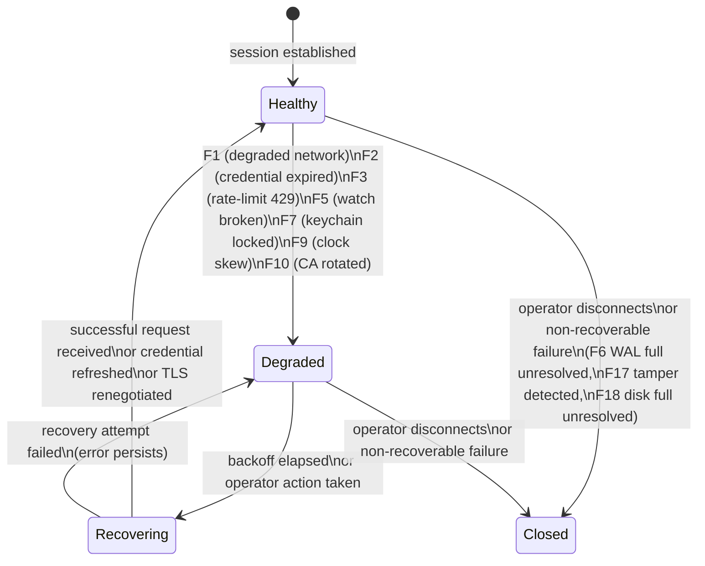

# ADR-0041 — Failure-mode catalogue

- Status — Proposed
- Date — 2026-05-15
- Deciders — Fabricio Fonseca
- Consulted — (none yet)
- Informed — (none yet)
- Refines — ADR-0036 (watch stream lifecycle), ADR-0037 (concurrency lifecycle invariants), ADR-0040
  (domain event taxonomy)
- Tags — failure-modes, resilience, ux, audit, recovery, error-handling, observability

## Context and problem statement

K8sManager has 13 bounded contexts that collectively handle network I/O, credential resolution,
cluster state streaming, local persistence, and UI rendering. ADR-0036 through ADR-0040 formalise
the happy-path lifecycle contracts. What remained implicit is the taxonomy of failure modes: which
conditions are named, how they are detected, what the operator observes in the UI, what the recovery
procedure is, and which audit entries are written.

Unnamed failures become silent failures. Without an explicit catalogue, each bounded context invents
ad-hoc error handling, resulting in inconsistent operator experience, untestable recovery paths, and
audit gaps.

This ADR closes that gap. It enumerates nineteen named failure modes (F1–F19), binding each to a
detecting bounded context, an observable UI state, a deterministic recovery procedure, and a
required audit entry. A session-overlay state machine documents how these failure modes interact
with the top-level session lifecycle.

## Decision drivers

- Every failure path is named; unnamed failures become silent failures.
- Operators see what happened; no modal dialog without a clear cause.
- Recovery is deterministic; every failure mode has exactly one defined recovery procedure and a
  clear condition under which recovery is considered complete.
- No silent failures; every failure mode produces at least one observable signal visible either in
  the UI or in the audit log.
- Failure modes are testable; each mode has at least one observable test assertion that can be
  verified in a CI matrix.

## Considered options

- **Option A** — implicit per-module error handling with no shared taxonomy. Rejected: produces
  inconsistent operator experience; recovery paths are untestable because they have no shared
  vocabulary.

- **Option B** — a global error enum with centralised dispatch. Rejected: a single enum across 13
  bounded contexts violates context isolation (ADR-0005); errors must be handled within the
  detecting context's own port/adapter boundary before being translated to a UI state or a domain
  event.

- **Option C** — named failure-mode catalogue with per-BC detection and recovery, unified UI state
  vocabulary, and a domain event for each observable failure (chosen). Each BC detects its own
  failures and maps them to the canonical UI state vocabulary. The UI layer reads states from
  `@Observable` view models; no central switch statement is required.

## Decision outcome

Chosen option is **Option C**.

The catalogue uses a consistent structure for each failure mode:

- **Detection** — the technical signal used to identify the condition.
- **Detecting BC** — the bounded context responsible for detection.
- **UI state** — the observable state change visible to the operator.
- **Recovery** — the procedure that transitions the session out of the failed state.
- **Recovery complete when** — the condition that marks the session as recovered.
- **Audit entry** — the entry written to the audit log.

---

### F1 — Degraded network

API server intermittent reachability. Three consecutive request failures occur within a 30-second
window, each terminating in a network-layer error (connection refused, connection reset, TLS
handshake timeout) rather than an HTTP error status.

**Detection** — `cluster_connectivity` counts consecutive transport-level failures within a sliding
30-second window. On the third failure the session transitions to `Degraded`.

**Detecting BC** — `cluster_connectivity`.

**UI state** — the cluster row in the sidebar shows a "Degraded" badge rendered in the warning
accent colour. All resource lists remain stale but visible. No blocking modal is shown.

**Recovery** — exponential backoff retry (schedule inherited from ADR-0036: 250 ms, 500 ms, 1 s, 2
s, 4 s, 8 s, 16 s, capped at 30 s, ±20% jitter). The retry is driven by the watch stream backoff
loop already specified in ADR-0036; no additional retry loop is required.

**Recovery complete when** — any successful request response (any HTTP 2xx). The `Degraded` badge is
cleared and the session transitions to `Recovering` then `Healthy`.

**Audit entry** — `cluster.degraded` with cluster ID and the timestamp of the third failure.

---

### F2 — Expired credentials mid-session

A bearer token expires while a watch stream is active. The API server returns HTTP 401 on the next
request.

**Detection** — `cluster_connectivity` receives a 401 response. It attempts silent re-resolution of
credentials using the same exec/cloud-credential port defined in ADR-0018.

**Detecting BC** — `cluster_connectivity`.

**UI state** — if re-resolution succeeds within 5 seconds, the operator sees no interruption. If
re-resolution fails, a non-blocking banner reads "Session expired — sign in again" with a "Retry"
action. The cluster row enters `Degraded` state.

**Recovery** — credential re-resolution via ADR-0018's exec/cloud-credential port. On success the
watch stream is reopened with the refreshed token. On failure the operator must intervene via the
"Retry" action or re-select the cluster.

**Recovery complete when** — a successful authenticated request is made with the refreshed
credential.

**Audit entry** — `credentials.refreshed` on successful re-resolution; `credentials.expired` if
re-resolution fails and the operator banner is shown.

---

### F3 — API server rate-limit (429)

Too many concurrent requests trigger HTTP 429 from the API server, which includes a `Retry-After`
header.

**Detection** — `cluster_connectivity` or `resource_browser` receives a 429 response and parses the
`Retry-After` header value (integer seconds).

**Detecting BC** — `cluster_connectivity` for connection-phase requests; `resource_browser` for
resource list and mutation requests.

**UI state** — a "Throttled" indicator appears in the cluster row status column. In-flight requests
are queued. No new requests are issued until the `Retry-After` interval elapses.

**Recovery** — honour the `Retry-After` value. After the interval, resume the request queue with
standard exponential backoff applied to any subsequent 429 responses (doubling the
Retry-After-indicated interval, capped at 60 s).

**Recovery complete when** — a request from the throttled session succeeds with a 2xx response.

**Audit entry** — `cluster.throttled` with cluster ID and the Retry-After value in seconds.

---

### F4 — Partial cluster outage

One node, one namespace, or one resource type is unhealthy while the cluster API server is
reachable. Specific endpoints return HTTP 503 or resource list responses with partial data.

**Detection** — `cluster_connectivity` or `resource_browser` receives a 503 on a specific endpoint
while other endpoints continue to respond normally.

**Detecting BC** — `resource_browser` for resource-specific 503; `cluster_connectivity` for
node-health probes.

**UI state** — per-resource error rows in the resource list show an "Unavailable" indicator. The
cluster row itself remains `Healthy`. No blocking modal is shown.

**Recovery** — continue serving available resources. The error row is periodically refreshed (using
the watch reconnect cycle). No operator action is required unless the outage is total.

**Recovery complete when** — the affected endpoint returns a successful response and the error row
is cleared.

**Audit entry** — `resource.unavailable` with GVK and namespace.

---

### F5 — Watch stream broken

A watch stream terminates due to connection reset, stream EOF, TLS error, or HTTP 410 Gone. This is
the primary failure mode addressed by ADR-0036.

**Detection** — the watch adapter receives a stream EOF or error after the WATCH phase is active.
HTTP 410 is distinguished from other errors: 410 triggers immediate relist with no backoff; other
errors trigger the exponential backoff schedule.

**Detecting BC** — `cluster_connectivity` (watch adapter layer).

**UI state** — the cluster row shows a "Reconnecting…" indicator during the backoff and relist
phase. Resource lists remain stale but visible. The indicator clears when the relist and new WATCH
are established.

**Recovery** — relist + new WATCH per ADR-0036 Phase 1–2. For 410 Gone: immediate relist. For all
other disconnects: exponential backoff then relist.

**Recovery complete when** — the new WATCH stream receives its first event (including BOOKMARK).

**Audit entry** — `watch.disconnected` with GVK, cluster ID, disconnect cause (410-Gone or transport
error), and backoff attempt count.

---

### F6 — SQLite WAL full

The SQLite WAL file grows beyond 100 MB. This indicates that a checkpoint has not run or that the
write rate exceeds the checkpoint rate.

**Detection** — `local_persistence` detects `SQLITE_NOMEM` from GRDB or observes WAL file size via
`stat(2)` during the periodic health-check (ADR-0027).

**Detecting BC** — `local_persistence`.

**UI state** — a blocking modal dialog reads "Persistence full — please contact support". All write
operations are suspended. Read operations continue.

**Recovery** — issue a `PRAGMA wal_checkpoint(TRUNCATE)` and retry the failed write. If the
checkpoint succeeds and the WAL drops below 10 MB, dismiss the modal and resume writes. If the
checkpoint fails, the modal persists and no further writes are attempted.

**Recovery complete when** — the WAL drops below 10 MB after a successful checkpoint.

**Audit entry** — `persistence.wal_full` with WAL size in bytes at the time of detection.

---

### F7 — Keychain locked

The device is locked while the app is in the foreground. A Keychain read returns
`errSecInteractionNotAllowed`.

**Detection** — `local_persistence` or `cluster_connectivity` receives `errSecInteractionNotAllowed`
from a Keychain query.

**Detecting BC** — `local_persistence` (for LLM API key reads); `cluster_connectivity` (for
credential resolution requiring a Keychain entry).

**UI state** — an "Unlock to continue" prompt appears. All operations requiring Keychain access are
suspended. Operations not requiring Keychain access continue normally.

**Recovery** — the operator unlocks the device. The app retries the Keychain query when the
application becomes active again (`NSApplicationDidBecomeActive` notification).

**Recovery complete when** — the Keychain query succeeds after the unlock.

**Audit entry** — `keychain.locked` with the Keychain service name and the time the lock was
detected.

---

### F8 — kqueue FD exhaustion

The process has opened too many file descriptors, causing `kevent(2)` to fail with `EMFILE` or
`ENFILE`.

**Detection** — `cluster_connectivity` receives `EMFILE` or `ENFILE` from the kqueue layer
(ADR-0029) when attempting to register a new watch stream FD.

**Detecting BC** — `cluster_connectivity`.

**UI state** — an alert reads "Too many sessions — close some clusters". No new watch streams or
port-forward tunnels can be opened. Existing sessions are unaffected.

**Recovery** — forced close of the least-recently-used cluster session using the LRU eviction policy
defined in ADR-0036 (watch stream fan-out budget). The closed session is removed from the sidebar.

**Recovery complete when** — after LRU eviction, a subsequent `kevent` call succeeds for the new
watch registration.

**Audit entry** — `system.fd_exhausted` with current open-FD count and the session ID evicted.

---

### F9 — Clock skew

The client system clock drifts more than 5 minutes from the cluster's clock. This causes TLS
certificate validation failures (certificate not yet valid or already expired) or suspicious audit
timestamps.

**Detection** — `cluster_connectivity` detects TLS handshake failures with `errSSLCertExpired` or
`errSSLCertNotYetValid`; or the watch adapter observes that the API server's `Date` response header
deviates more than 5 minutes from the local clock.

**Detecting BC** — `cluster_connectivity`.

**UI state** — an alert reads "System clock differs from cluster — please sync time". The cluster
row shows a "Clock skew" badge. All operations against the cluster are suspended.

**Recovery** — the operator syncs the system clock (typically via System Settings → Date & Time →
Set Automatically). The app retries the TLS handshake when the operator dismisses the alert.

**Recovery complete when** — a successful TLS handshake is established with the cluster.

**Audit entry** — `cluster.clock_skew` with the detected clock difference in seconds.

---

### F10 — Cluster CA rotation

The cluster's CA bundle changes mid-session. The first new TLS connection after the CA rotation
fails chain validation against the previously pinned CA.

**Detection** — `cluster_connectivity` receives a TLS chain validation failure (`errSSLBadCert`) on
a new connection after prior connections to the same cluster were healthy.

**Detecting BC** — `cluster_connectivity`.

**UI state** — an alert reads "Cluster CA changed — verify and reload". The cluster row shows a "CA
invalid" badge. All operations are suspended until the operator confirms the new CA.

**Recovery** — the operator confirms that the CA change is expected. The app re-reads the kubeconfig
CA bundle from disk (ADR-0003) and renegotiates the TLS session. If the new CA validates
successfully, the session resumes.

**Recovery complete when** — a TLS handshake succeeds using the re-read CA.

**Audit entry** — `cluster.ca_rotated` with the SHA-256 fingerprint of the new CA leaf certificate.

---

### F11 — Conflict on apply (409)

An apply or patch request returns HTTP 409 due to an optimistic concurrency mismatch (the
`resourceVersion` in the client's request does not match the server's current value).

**Detection** — `resource_browser` receives HTTP 409 on a PATCH or APPLY request.

**Detecting BC** — `resource_browser`.

**UI state** — the integrated editor (ADR-0030) shows a side-by-side diff between the client's draft
and the server's current version. A "Merge and retry" action is available.

**Recovery** — the operator reviews the diff, merges the changes, and retries the apply. The retry
uses the current `resourceVersion` obtained from the diff's server-side view.

**Recovery complete when** — the apply request succeeds with HTTP 200 or 201.

**Audit entry** — `resource.conflict_409` with GVK, namespace, name, and the conflicting
`resourceVersion` values (client vs. server).

---

### F12 — MCP server tool error

An MCP tool execution fails. The tool returns an error envelope rather than a successful result.

**Detection** — `cluster_intelligence` receives a tool-error envelope from the in-process MCP server
(ADR-0009).

**Detecting BC** — `cluster_intelligence`.

**UI state** — the assistant chat (ADR-0008) shows the error inline in the conversation, formatted
as a tool-error message. The conversation continues normally; the operator may retry the tool
invocation by sending another message.

**Recovery** — continue the conversation. No automatic retry. The operator determines whether to
retry.

**Recovery complete when** — the operator explicitly issues a new request or the conversation moves
to a different topic. This is a terminal failure for the individual tool call; the session itself is
unaffected.

**Audit entry** — `mcp.tool_error` with the tool name, error code, and correlation ID from the
assistant turn.

---

### F13 — LLM provider rate limit

The LLM provider returns HTTP 429 with a `Retry-After` header.

**Detection** — `llm_provider` receives HTTP 429 from the provider API.

**Detecting BC** — `llm_provider`.

**UI state** — the assistant chat shows "Throttled — retrying in N s" inline below the most recent
message. The assistant turn is paused; no new turns can be started until the retry succeeds.

**Recovery** — honour the `Retry-After` value. Retry the request after the indicated interval. Apply
exponential backoff (doubling, capped at 60 s) on repeated 429 responses.

**Recovery complete when** — the retry request succeeds with a 200 response.

**Audit entry** — `llm.throttled` with provider name, model, and Retry-After value in seconds.

---

### F14 — LLM provider auth fail

The LLM provider returns HTTP 401 for an invalid or revoked API key.

**Detection** — `llm_provider` receives HTTP 401 from the provider API.

**Detecting BC** — `llm_provider`.

**UI state** — the assistant chat shows "Provider key invalid — re-enter in Settings". All
LLM-dependent features are disabled until the key is updated.

**Recovery** — the operator navigates to Settings and updates the API key. On save, the
`llm_provider` bounded context retries the last failed request.

**Recovery complete when** — a request with the new API key succeeds.

**Audit entry** — `llm.auth_failed` with provider name. The key value is never written to the audit
log (ADR-0010 redaction policy).

---

### F15 — Port-forward target gone

The target Pod of an active port-forward tunnel restarts or is deleted. The WebSocket connection
underlying the tunnel receives a close frame or an `ECONNRESET`.

**Detection** — `port_forwarding` receives a WebSocket error or close frame on the tunnel
connection.

**Detecting BC** — `port_forwarding`.

**UI state** — the tunnel row in the port-forward list is marked "Disconnected" with a "Restart"
action.

**Recovery** — automatic restart is not attempted; the operator decides whether to restart the
tunnel (e.g., after waiting for the Pod to be recreated). Clicking "Restart" triggers a new tunnel
establishment against the same `podName` and `localPort`.

**Recovery complete when** — the new tunnel is established and the row shows "Active".

**Audit entry** — `portforward.disconnected` with local port, target Pod name, namespace, and
cluster ID.

---

### F16 — Helm release corrupted

A Helm release Secret payload fails to decode (gzip, base64, or JSON deserialization error).

**Detection** — `helm_management` receives a decode error when parsing a release Secret retrieved
from the API server.

**Detecting BC** — `helm_management`.

**UI state** — the release row in the Helm release list shows "Unreadable" with no expandable
detail.

**Recovery** — the failure is logged and the release row is rendered as "Unreadable". No automatic
recovery. The operator must investigate the release directly using `helm` CLI.

**Recovery complete when** — N/A (terminal for the individual release read; other releases are
unaffected).

**Audit entry** — `helm.release_corrupt` with release name, namespace, and the decode error type.

---

### F17 — Audit log tamper detected

The audit log hash chain is broken: the `previousHash` field of a log entry does not match the
SHA-256 hash of the previous entry.

**Detection** — `local_persistence` performs a verification pass over the `audit_log` table on
startup and after each batch of writes. Any hash mismatch triggers this failure mode.

**Detecting BC** — `local_persistence`.

**UI state** — a persistent red banner reads "Audit log integrity compromised". All new audit writes
are refused. The export action is offered so the operator can preserve evidence.

**Recovery** — the operator exports the audit log, then contacts support. The app does not attempt
to repair the hash chain automatically.

**Recovery complete when** — N/A (terminal; the audit log is considered evidence once tamper is
detected; no writes resume until a new, clean database is initialised).

**Audit entry** — `audit.tamper_detected` is not written to the compromised log but is written to a
separate tamper-notification file at `~/.config/k8smanager/audit_tamper.json` containing the
detection timestamp and the index of the first mismatching entry.

---

### F18 — Disk full

The filesystem containing `~/.config/k8smanager/` cannot accept writes because available space is
exhausted (`ENOSPC`).

**Detection** — `local_persistence` receives `ENOSPC` from a write syscall or from GRDB on a SQLite
write.

**Detecting BC** — `local_persistence`.

**UI state** — a blocking dialog reads "Disk full — free space to continue". All persistence writes
are suspended. Read operations continue.

**Recovery** — the operator frees disk space (empties Trash, removes large files). The app retries
the failed write when the operator dismisses the dialog.

**Recovery complete when** — the retry write succeeds.

**Audit entry** — `persistence.disk_full` with the path and the available bytes at the time of
detection.

---

### F19 — Notification delivery dropped

A domain event subscriber's `AsyncStream` buffer overflows (per ADR-0040 `bufferingOldest(64)`
policy) and one or more events are silently dropped. The `DomainEventBusActor` emits a
`DomainEventDropped` meta-event.

**Detection** — the `DomainEventBusActor` observes a `.dropped` result from
`AsyncStream.Continuation.yield(with:)` and emits a `DomainEventDropped` envelope to the meta-stream
(ADR-0040).

**Detecting BC** — `DomainEventBusActor` (shared kernel infrastructure).

**UI state** — optional diagnostic log entry visible in the self-monitoring diagnostics panel
(ADR-0027). No user-facing alert in normal operation; the subscriber is expected to reconcile its
read model from `local_persistence` on the next opportunity.

**Recovery** — the subscriber observes `DomainEventDropped` on its subscription and triggers a
read-model reconciliation by querying `local_persistence` for the current authoritative state.

**Recovery complete when** — the subscriber's read model is reconciled from the persistence layer.
This is invisible to the operator.

**Audit entry** — `events.dropped` with subscriber ID, source context, drop count, and timestamp.
Written to the diagnostics log (not the mutation audit log).

---

### Session state overlay

The following diagram shows a generic "session state" that the UI projects across all active failure
modes. Individual failure modes cause transitions from `Healthy` to `Degraded`; recovery procedures
cause transitions through `Recovering` back to `Healthy`. `Closed` is the terminal state when the
operator removes a cluster or a non-recoverable failure is not resolved.



Terminal states (F6 unresolved, F17, F18 unresolved) transition to `Closed` because the application
cannot guarantee data integrity without persistence. All other failure modes are recoverable without
closing the session.

### Cross-references

```
Failure                  Primary BC(s)                                  Related ADR(s)
F1  Degraded network     cluster_connectivity                           ADR-0036, ADR-0037
F2  Expired credentials  cluster_connectivity                           ADR-0018
F3  Rate-limit 429       cluster_connectivity, resource_browser         ADR-0007
F4  Partial outage       resource_browser, cluster_connectivity         ADR-0013
F5  Watch broken         cluster_connectivity                           ADR-0036
F6  WAL full             local_persistence                              ADR-0010, ADR-0026
F7  Keychain locked      local_persistence, cluster_connectivity        ADR-0010
F8  FD exhaustion        cluster_connectivity                           ADR-0029, ADR-0036
F9  Clock skew           cluster_connectivity                           ADR-0001
F10 CA rotation          cluster_connectivity                           ADR-0003
F11 Conflict 409         resource_browser                               ADR-0012, ADR-0030
F12 MCP tool error       cluster_intelligence                           ADR-0009
F13 LLM rate-limit       llm_provider                                   ADR-0008
F14 LLM auth fail        llm_provider                                   ADR-0008, ADR-0010
F15 Port-forward gone    port_forwarding                                ADR-0014
F16 Helm corrupted       helm_management                                ADR-0015
F17 Audit tamper         local_persistence                              ADR-0010
F18 Disk full            local_persistence                              ADR-0026
F19 Events dropped       DomainEventBusActor                            ADR-0040
```

The qa-expert agent is creating Gherkin lifecycle scenarios that exercise each failure mode. The
scenario identifiers follow the pattern `lifecycle/failure-fNN.feature` under each relevant bounded
context's `features/` directory.

## Consequences

Positive:

- Every failure path has a name; cross-team communication about incidents uses F-number identifiers
  unambiguously.
- UI states are enumerable; the `@Observable` view model for each bounded context maps exactly one
  failure mode to exactly one UI state.
- The CI matrix can mechanically verify that each failure mode produces the expected observable
  signal.

Negative:

- Nineteen named failure modes requires nineteen sets of mock infrastructure in tests; the test
  surface is large but the complexity is bounded.
- Some failure modes (F17 audit tamper, F6 WAL full) are terminal: they move the session to `Closed`
  without automatic recovery. Operators must be trained to recognise these conditions.

Neutral:

- The Gherkin scenarios for these failure modes are authored by the qa-expert agent working in
  parallel with this ADR.

### Confirmation

The following confirmation tests form the CI matrix for this ADR. Each test must inject the
detection signal, assert the correct UI state transition, and verify the audit entry is written.

- **F1** — inject 3 transport-level errors within 30 s; assert cluster row shows "Degraded" badge;
  assert `cluster.degraded` audit entry is written.
- **F2** — inject a 401 response mid-session; assert silent re-resolution is attempted; if
  re-resolution fails, assert the "Session expired" banner is shown and `credentials.expired` audit
  entry is written.
- **F3** — inject a 429 response with `Retry-After: 5`; assert no new requests are issued for 5 s;
  assert "Throttled" indicator is shown; assert `cluster.throttled` audit entry is written.
- **F4** — inject a 503 on a specific GVK endpoint while others succeed; assert per-resource error
  row shows "Unavailable"; assert cluster row remains "Healthy".
- **F5** — inject a stream EOF; assert "Reconnecting…" indicator; assert relist + new WATCH cycle
  per ADR-0036; assert `watch.disconnected` audit entry.
- **F6** — mock SQLITE_NOMEM from GRDB; assert blocking dialog appears; assert
  `persistence.wal_full` audit entry; assert no further write attempts.
- **F7** — mock `errSecInteractionNotAllowed`; assert "Unlock to continue" prompt; assert
  `keychain.locked` audit entry; assert retry on app-active.
- **F8** — mock EMFILE from kqueue registration; assert alert reads "Too many sessions"; assert LRU
  eviction of oldest session; assert `system.fd_exhausted` audit entry.
- **F9** — mock TLS `errSSLCertExpired`; assert "System clock differs" alert; assert cluster row
  shows "Clock skew" badge; assert `cluster.clock_skew` audit entry.
- **F10** — present a new CA bundle on reconnect; assert TLS failure; assert "Cluster CA changed"
  alert; assert `cluster.ca_rotated` audit entry after operator confirmation.
- **F11** — inject a 409 response on PATCH; assert diff editor appears in the integrated editor;
  assert `resource.conflict_409` audit entry.
- **F12** — mock a tool-error envelope from the MCP server; assert inline error message in the chat;
  assert `mcp.tool_error` audit entry.
- **F13** — inject a 429 from the LLM provider; assert "Throttled" inline message; assert retry
  after Retry-After interval; assert `llm.throttled` audit entry.
- **F14** — inject a 401 from the LLM provider; assert "Provider key invalid" message; assert
  `llm.auth_failed` audit entry; assert key value absent from the audit entry.
- **F15** — inject a WebSocket close frame on the tunnel; assert tunnel row shows "Disconnected";
  assert `portforward.disconnected` audit entry.
- **F16** — inject a malformed gzip payload in a release Secret; assert release row shows
  "Unreadable"; assert `helm.release_corrupt` audit entry.
- **F17** — corrupt a hash chain entry in the audit table; assert red "Audit log integrity
  compromised" banner; assert new writes are refused; assert `audit_tamper.json` is written.
- **F18** — mock ENOSPC from a write syscall; assert blocking dialog; assert `persistence.disk_full`
  audit entry; assert retry on operator dismissal.
- **F19** — flood a subscriber stream with 128 events exceeding the 64-event buffer; assert
  `DomainEventDropped` on the meta-stream; assert `events.dropped` diagnostic log entry; assert
  subscriber reconciles from persistence.

## Pros and cons of the options

### Option A — implicit per-module error handling

- Pros — no upfront documentation cost.
- Cons — inconsistent operator experience; untestable recovery paths; no shared vocabulary for
  incidents.

### Option B — global error enum

- Pros — centralised switch statement is easy to search.
- Cons — violates bounded context isolation (ADR-0005); a change to one context's error types forces
  recompilation of the entire error enum.

### Option C — named failure-mode catalogue (chosen)

- Pros — each BC owns its detection and recovery; UI states are independently testable; F-number
  identifiers enable unambiguous incident communication; the CI matrix is derivable directly from
  the catalogue.
- Cons — large test surface (19 mock scenarios); some terminal failure modes require operator
  training.

## More information

- ADR-0003 — kubeconfig read-only; CA bundle re-read on F10.
- ADR-0005 — bounded context isolation; detection is per-BC.
- ADR-0007 — connection pool keep-alive; relevant to F1 backoff.
- ADR-0008 — LLM provider abstraction; F13 and F14.
- ADR-0009 — MCP host and in-process server; F12.
- ADR-0010 — local persistence; F6, F7, F17, F18 redaction policy.
- ADR-0012 — mutating operations policy; F11 conflict handling.
- ADR-0014 — port-forwarding lifecycle; F15.
- ADR-0015 — Helm native phased; F16.
- ADR-0018 — native cloud credential resolution; F2 credential refresh.
- ADR-0026 — filesystem layout; `~/.config/k8smanager/` root for F6, F18.
- ADR-0027 — self-monitoring; F19 diagnostic log surface.
- ADR-0029 — kqueue I/O selector; F8 FD exhaustion.
- ADR-0036 — watch stream lifecycle; F5 relist + new WATCH recovery.
- ADR-0040 — domain event taxonomy; F19 `DomainEventDropped` meta-event.
