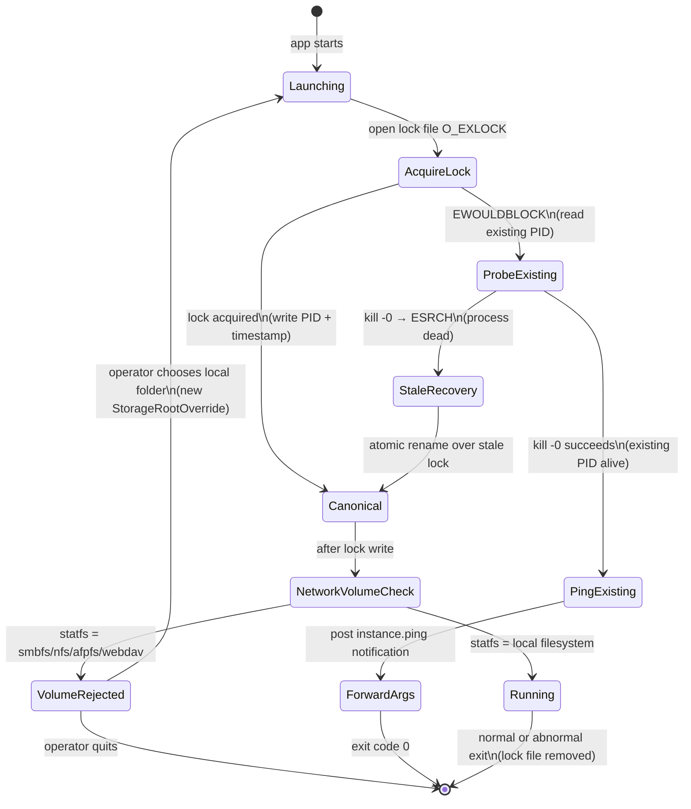

# ADR-0042 — Single-instance enforcement

- Status — Accepted (ratified 2026-05-15)
- Date — 2026-05-15
- Deciders — Fabricio Fonseca
- Consulted — (none yet)
- Informed — (none yet)
- Refines — ADR-0010 (local persistence; PersistenceActor sole-writer model), ADR-0026 (filesystem
  layout)
- Tags — single-instance, lock-file, sqlite, keychain, fast-user-switching, network-volume, launch

## Context and problem statement

ADR-0010 establishes a `PersistenceActor` sole-writer model for SQLite: a single actor serialises
all writes to `~/.config/k8smanager/storage.sqlite3`. This invariant is correct within a single
process but is not enforced at the OS level: nothing prevents a second K8sManager process from
launching and acquiring its own `PersistenceActor`, resulting in concurrent writers to the same WAL
file.

Two realistic paths lead to concurrent launches:

- **Accidental double-click** — the user double-clicks the app icon while the launch animation is
  still running; macOS may launch a second process before the first process's
  `NSApplicationWillFinishLaunching` fires.

- **Fast-user-switching** — if two macOS users share the same home directory (a configuration that
  is technically possible on non-sandboxed apps), each user's K8sManager process writes to the same
  `storage.sqlite3`.

Concurrent writers to a SQLite WAL database produce `SQLITE_BUSY` errors, data loss under
write-write conflicts, and, in the worst case, WAL corruption that is undetectable without a hash
chain (F6 in ADR-0041). Concurrent Keychain writes under fast-user-switching can result in a race
that overwrites a valid credential entry with a stale one.

In addition, users who store the K8sManager configuration directory on a network volume (NFS, SMB,
AFP, WebDAV) expose SQLite WAL locking to filesystem semantics that do not honour POSIX advisory
locks, causing `SQLITE_IOERR_LOCK` and silent data corruption.

This ADR defines a deterministic single-instance protocol and a network-volume rejection policy that
prevent all three failure paths.

## Decision drivers

- Prevent concurrent writes to `storage.sqlite3`; the sole-writer invariant from ADR-0010 must hold
  across processes, not just across tasks.
- Safe, predictable behaviour under accidental double-click: the second instance must exit
  gracefully without a disruptive dialog, and the first instance must come to the foreground.
- Explicit rejection of network-volume storage: rather than silently operating in a degraded state,
  the app must refuse to open the storage path on any non-local filesystem and prompt the operator
  to choose a local location.
- Correct behaviour under macOS fast-user-switching: per-user home directories provide natural
  isolation when users have separate home directories (the common case); the ADR must document the
  shared-home edge case explicitly.

## Considered options

### Option A — NSDistributedNotificationCenter handshake only

On launch, broadcast a `com.archanjo.K8sManager.instance.ping` notification. If any existing
instance responds within 500 ms, the second instance defers to it and exits.

Pros:

- No filesystem state.
- Simple implementation.

Cons:

- Race condition: two instances launching simultaneously both broadcast and both fail to receive a
  response before the other has registered its listener. Result: two canonical instances running
  concurrently.
- `NSDistributedNotificationCenter` uses `mach_port_t` IPC, which has no guaranteed delivery order
  on simultaneous sends. The race is not theoretical; it occurs under the "double-click during
  launch animation" scenario.

### Option B — lock file at `~/.config/k8smanager/.instance.lock` (chosen)

Open the lock file with `O_EXLOCK | O_CREAT` (POSIX advisory exclusive lock). The lock is atomic on
local filesystems: exactly one process acquires it. The process that acquires the lock is the
canonical instance. The process that fails to acquire the lock reads the existing PID, verifies
liveness, and either activates the existing instance or recovers a stale lock.

Pros:

- No race condition under simultaneous launch: `O_EXLOCK` on a local filesystem is guaranteed by
  POSIX to be mutually exclusive.
- Stale-lock recovery is deterministic (`kill -0 <pid>` liveness probe).
- No additional dependency.

Cons:

- Lock acquisition fails silently on network volumes (`ENOLCK`); this is a feature, not a bug — it
  triggers the network-volume rejection path.

### Option C — macOS App Sandbox single-instance flag

Activate the App Sandbox entitlement `com.apple.security.app-sandbox` with
`NSApplicationSupportsSecureRestorableState`. The sandbox prevents multiple instances from sharing
state.

Cons:

- Rejected. The App Sandbox restricts file-system access to the app container and a set of
  security-scoped bookmarks. K8sManager requires arbitrary kubeconfig reads at paths specified by
  the operator (ADR-0003), credential exec helper subprocess launches (ADR-0018), and kubeconfig
  file watching via kqueue (ADR-0029). These operations are incompatible with the sandbox's access
  model without a prohibitively complex entitlement and bookmark management layer.

## Decision outcome

Chosen option is **Option B**: lock file `~/.config/k8smanager/.instance.lock` containing PID and
RFC 3339 start timestamp.

`NSDistributedNotificationCenter` is used as a secondary signal for the window-focus handshake only,
after the lock-file protocol has already resolved which instance is canonical.

### Launch sequence

The following steps execute during `NSApplicationWillFinishLaunching`, before any UI is shown.

**Step 1 — Open the lock file.**

```
fd = open("~/.config/k8smanager/.instance.lock",
          O_RDWR | O_CREAT | O_EXLOCK | O_NONBLOCK, 0600)
```

`O_NONBLOCK` ensures that the `open` call does not block; it returns `EWOULDBLOCK` immediately if
the file is locked by another process.

**Step 2a — Lock acquired (canonical instance).**

Write the current PID and RFC 3339 start timestamp to the file:

```
<pid>\n<rfc3339-timestamp>\n
```

Register an `atexit` handler that removes the lock file when the process exits normally. Register a
signal handler for `SIGTERM` that removes the lock file before forwarding the signal to the default
handler.

Continue launch normally.

**Step 2b — Lock not acquired (`EWOULDBLOCK`).**

Read the existing lock file to extract `<existing-pid>` and `<start-timestamp>`.

**Step 3 — Liveness probe.**

```
kill -0 <existing-pid>
```

If the process is alive (exit code 0), proceed to Step 4 (ping existing instance). If the process is
dead (errno `ESRCH`), proceed to Step 5 (stale lock recovery).

**Step 4 — Ping existing instance and exit.**

Send an `NSDistributedNotificationCenter` notification with name
`com.archanjo.K8sManager.instance.ping`. The payload includes any command-line arguments or URL
arguments that were passed to the new instance, so the canonical instance can handle them (e.g.,
open a specific cluster).

The new instance logs a one-line message to `stderr`: "K8sManager is already running (PID
<existing-pid>, started <start-timestamp>). Deferring."

The new instance exits with code 0.

**Step 5 — Stale lock recovery.**

The existing PID is dead (stale lock). Overwrite the lock file atomically using the sequence: open a
new temp file, write the current PID and timestamp, `rename(2)` the temp file over the stale lock
file. Because `rename(2)` on local POSIX filesystems is atomic, no race window exists between
overwrite and subsequent open calls.

Continue launch normally.

### Existing instance window-focus handler

The canonical instance registers an `NSDistributedNotificationCenter` observer for
`com.archanjo.K8sManager.instance.ping` immediately after the lock is acquired. On receipt:

1. Call `NSApplication.shared.activate(ignoringOtherApps: true)`.
2. If the notification payload contains URL arguments, open the corresponding cluster or resource.
3. Acknowledge the notification by posting `com.archanjo.K8sManager.instance.pong` (informational
   only; the new instance has already exited before the pong arrives).

### Fast-user-switching behaviour

macOS fast-user-switching creates a separate login session for each user. Each user's home directory
is distinct (`/Users/<username>`). The lock file path `~/.config/k8smanager/.instance.lock` expands
to a per-user path by construction. No cross-user contention is possible in the standard macOS
multi-user configuration.

If two users share a home directory (a non-standard configuration requiring deliberate admin
action), the lock-file protocol applies normally: the second user's instance detects the lock, pings
the first instance, and exits. The first instance focuses its window. This behaviour is intentional:
shared-home multi-user access to a single K8sManager instance is not a supported configuration.

### Network-volume rejection

On any launch path (Step 2a or Step 5), after the lock is acquired, the app probes the filesystem
type of the configuration directory:

```c
struct statfs st;
statfs("~/.config/k8smanager/", &st);
```

If `st.f_fstypename` matches any of `"smbfs"`, `"nfs"`, `"afpfs"`, `"webdav"`, `"ftp"`, or
`"msdos"`, the app displays a blocking dialog:

> "K8sManager cannot use a network volume for its configuration. Please choose a local folder in
> Settings → Storage Location."

The dialog offers two actions: "Quit" and "Choose Local Folder". If the operator chooses a local
folder, the new path is saved in `~/Library/Preferences/com.archanjo.K8sManager.plist` under the key
`StorageRootOverride`, and the app relaunches from Step 1 using the new path.

Network-volume `ENOLCK` during `O_EXLOCK` is treated as a network-volume detection signal in
addition to the `statfs` probe, because some network filesystems do not return `ENOLCK` until an
explicit lock operation is attempted.

### Lock file format

```
<pid>
<rfc3339-timestamp>
```

The file is plain UTF-8 text, two lines, newline-terminated. No binary encoding. The `pid` field is
a decimal integer. The `rfc3339-timestamp` is a UTC timestamp with second precision, for example
`2026-05-15T10:32:00Z`.

### Launch state machine



### Consequences

Positive:

- No race condition under simultaneous launch on local filesystems.
- Stale lock recovery is deterministic and does not require user action.
- Network-volume rejection is explicit and surfaced to the operator before any database operation
  occurs; no silent corruption.
- The `NSDistributedNotificationCenter` ping enables the second instance to forward its arguments to
  the canonical instance, enabling URL-scheme and CLI argument pass-through.

Negative:

- The lock file is not automatically removed on SIGKILL (which cannot be caught). The stale-lock
  recovery path in Step 5 handles this case deterministically on the next launch.
- The `statfs` network-volume probe must be kept current as new filesystem types are introduced
  (e.g., future `cloudfs` types on macOS). The list of rejected `f_fstypename` values is a
  maintenance surface.

Neutral:

- The App Sandbox option was considered and explicitly rejected; this decision should be revisited
  if Apple introduces a future entitlement that permits both arbitrary kubeconfig paths and sandbox
  single-instance enforcement.

### Confirmation

- **Second-instance exits cleanly** — launch two app processes simultaneously from a test harness;
  assert that exactly one process exits with code 0 within 2 s; assert the surviving process has the
  lower PID (or the one that acquired the lock first); assert the survivor's window receives
  `activate`.

- **Stale-lock recovery** — write a lock file with a PID that does not exist (`kill -0` returns
  `ESRCH`); launch the app; assert the app overwrites the stale lock and proceeds to `Running`.

- **Network-volume rejection** — mock `statfs` to return `f_fstypename = "nfs"`; assert the blocking
  "network volume" dialog appears; assert no SQLite connection is opened.

- **Argument forwarding** — launch a second instance with a URL argument
  `k8smanager://open/cluster/my-cluster`; assert the canonical instance receives the argument via
  the `instance.ping` notification payload; assert the canonical instance opens the specified
  cluster.

- **Lock file content** — after launch, read the lock file; assert it contains a valid decimal PID
  matching the running process and a valid RFC 3339 timestamp.

## Pros and cons of the options

### Option A — NSDistributedNotificationCenter handshake only

- Pros — no filesystem state; simple.
- Cons — race condition under simultaneous launch; not safe as primary protocol.

### Option B — lock file O_EXLOCK (chosen)

- Pros — atomic, race-free on local filesystems; stale-lock recovery is deterministic;
  network-volume ENOLCK doubles as detection signal.
- Cons — not immune to SIGKILL (handled by stale-lock recovery); requires maintenance of the
  `f_fstypename` rejection list.

### Option C — App Sandbox single-instance flag

- Pros — OS-enforced; no lock file management.
- Cons — incompatible with arbitrary kubeconfig path access; rejected.

## More information

- ADR-0010 — local persistence; `PersistenceActor` sole-writer model that this ADR enforces at the
  process level.
- ADR-0026 — filesystem layout; defines `~/.config/k8smanager/` as the configuration root that the
  lock file resides in.
- ADR-0029 — kqueue I/O selector; kqueue is also used to watch the kubeconfig file, which requires
  arbitrary path access incompatible with App Sandbox.
- ADR-0003 — kubeconfig read-only; arbitrary path access requirement.
- ADR-0018 — native cloud credential resolution; exec helper subprocess requirement incompatible
  with App Sandbox.
- ADR-0041 — failure-mode catalogue; F6 (WAL full) and F18 (disk full) are the failure modes that
  concurrent writers or network-volume writes would trigger.
- POSIX `open(2)` with `O_EXLOCK`:
  <https://pubs.opengroup.org/onlinepubs/9699919799/functions/open.html>
- macOS `statfs(2)`:
  <https://developer.apple.com/library/archive/documentation/System/Conceptual/ManPages_iPhoneOS/man2/statfs.2.html>
